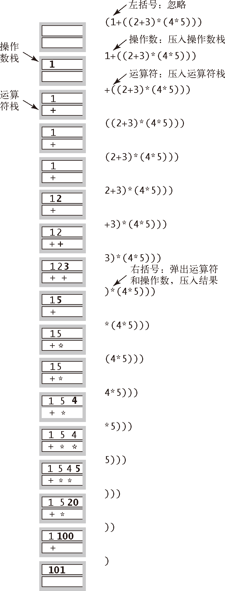

# Dijkstra 的双栈算术表达式求值算法


<!-- TOC -->

- [Dijkstra 的双栈算术表达式求值算法](#dijkstra-的双栈算术表达式求值算法)
    - [设计思想](#设计思想)
    - [本质](#本质)
        - [计算即合并](#计算即合并)
        - [栈的数据结构保证了正确的合并](#栈的数据结构保证了正确的合并)
    - [算法](#算法)
    - [单栈实现](#单栈实现)
    - [双栈实现](#双栈实现)

<!-- /TOC -->


## 设计思想


## 本质
### 计算即合并
1. 一个数学表达式计算的过程，实际上就是不断合并的过程。或者说是若干个函数自变量和函数计算规则合起来映射到函数值的过程。
2. 可以是两个数和一个操作符的合并，也可以是一个数和一个操作符的合并。
3. 而在具有完全括号的表达式中，每一个反括号，就代表要进行一次合并。
4. 因为是完全括号的表达式，所以每一个运算都有一个对应的反括号，看见反括号就合并就行了，最后肯定会完成所有的运算。

### 栈的数据结构保证了正确的合并
1. 当一个反括号被发现，要进行一次合并的时候，显然是要对反括号左边的一个或两个最近的元素进行合并。
2. 而栈的规则正好会优先执行最近发现的元素，栈顶肯定是反括号左边的操作数，再下一层肯定是要对该操作数进行操作的操作符。根据操作符的类型，可能还有再下面一层是另一个参与运算的操作数。


## 算法
1. 计算具有完全括号的算数表达式字符串的值，如 `"( 1 + ( ( 2 + 3 ) * ( 4 * 5 ) ) )"` 或者 `"( ( 1 + sqrt ( 5.0 ) ) / 2.0 )"`。
2. E.W.Dijkstra 在 20 世纪 60 年代发明了一个非常简单的算法，用两个栈（一个用于保存运算符，一个用于保存操作数）完成了这个任务，其实现过程见下图
    


## 单栈实现
双栈把数字和操作符分开，看起来更好理解一些，不过和单栈并没有什么区别
```js
const calcFns_single = {
    "sqrt": (a) => Math.sqrt(Number.parseFloat(a)),
};

const calcFns_double = {
    "*": (a, b) => Number.parseFloat(a) * Number.parseFloat(b),
    "/": (a, b) => Number.parseFloat(a) / Number.parseFloat(b),
    "+": (a, b) => Number.parseFloat(a) + Number.parseFloat(b),
    "-": (a, b) => Number.parseFloat(a) - Number.parseFloat(b),
};
const calcFns = {...calcFns_single, ...calcFns_double};


function foo (str) {
    let tokens = str.split(" ");
    let stack = [];

    for (let i=0; i<tokens.length; i++) {
        let token = tokens[i];
        if (token === ")") {
            let num;
            let rightNum = stack.pop();
            let operator = stack.pop();
            if ( operator in calcFns_single ) {
                num = calcFns[operator](rightNum); 
            }
            else if ( operator in calcFns_double ) {
                let leftNum = stack.pop();
                num = calcFns[operator](leftNum, rightNum);
            }
            else {
                throw new TypeError("Wrong operator.")
            }
            stack.push(num);
        }
        else if (token !== "(") {
            stack.push(token);
        }
    }

    return Number.parseFloat(stack.pop());
}
```


## 双栈实现
```js
function isNumberString (str) {
    let n = Number.parseFloat(str);
    return !Number.isNaN(n) && (typeof n === 'number');
}

function Evaluate (str) {
    // 要求数字和操作符之间有一个空格
    let charList = str.split(' ');

    // 保存数字和操作符的两个栈
    let numberCharList = [];
    let operatorList = [];

    // 支持 5 种操作符
    // 分为操作两个数字的和操作一个数字的
    const operators_double = ['+', '-', '*', '/'];
    const operators_single = ['sqrt'];
    const operators = [...operators_double, ...operators_single]

    // 每种操作符对应的计算函数
    const calcFnMap = {
        '+': (m, n) => m + n,
        '-': (m, n) => m - n,
        '*': (m, n) => m * n,
        '/': (m, n) => m / n,
        'sqrt': (n) => Math.sqrt(n),
    }


    charList.forEach((char) => {
        if (char === '(') {
            return;
        }
        else if (char === ')') {
            let n = numberCharList.pop();
            let operator = operatorList.pop();

            let result;

            if ( operators_double.includes(operator) ) {
                let m = numberCharList.pop();
                result = calcFnMap[operator](m, n);
            }
            else {
                result = calcFnMap[operator](n);
            }

            numberCharList.push(result);
        }
        else if (operators.includes(char)) {
            operatorList.push(char);
        }
        else if ( isNumberString(char) ) {
            numberCharList.push( Number.parseFloat(char) );
        }
    });

    return numberCharList[0];
}

console.log( Evaluate('( 1 + ( ( 2 + 3 ) * ( 4 * 5 ) ) )') ); // 101
console.log( Evaluate('( ( 1 + sqrt ( 5.0 ) ) / 2.0 )') ); // 1.618033988749895
```


