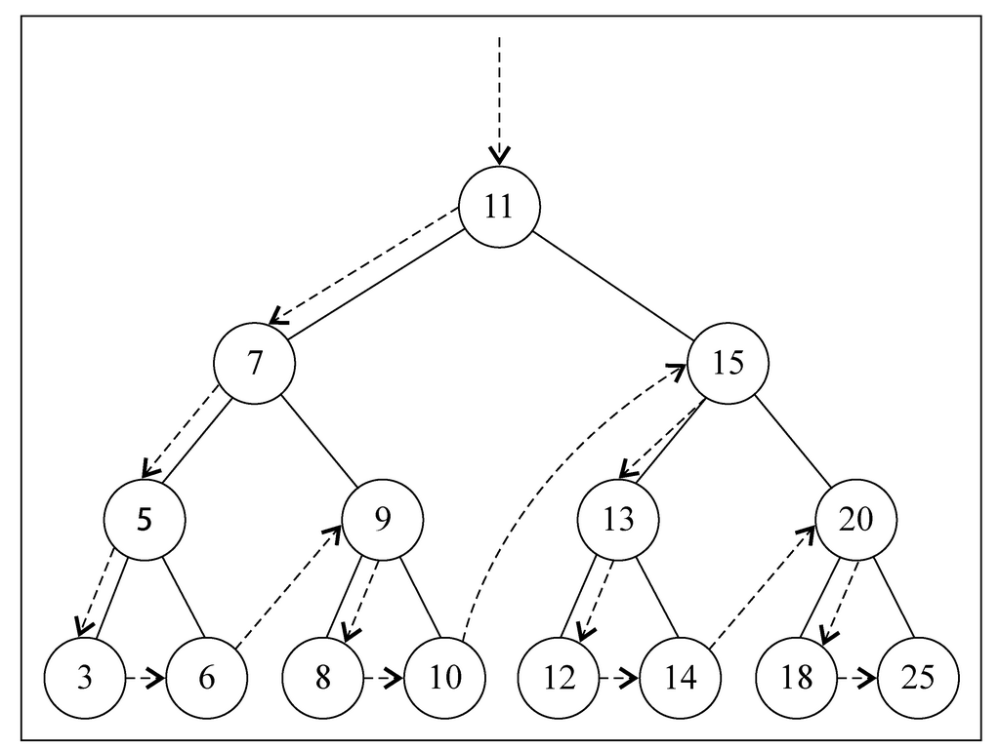
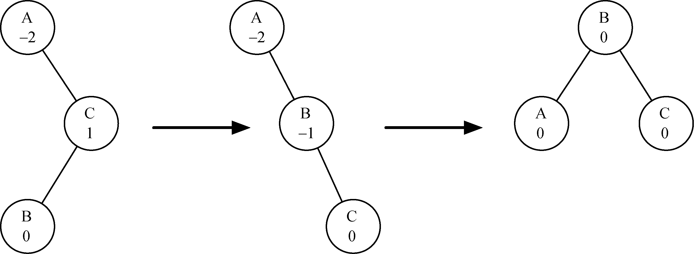

# Binary Search Tree


<!-- TOC -->

- [Binary Search Tree](#binary-search-tree)
    - [TODO](#todo)
    - [设计思想](#设计思想)
        - [二叉搜索树和二叉堆](#二叉搜索树和二叉堆)
        - [三种遍历](#三种遍历)
            - [中序遍历](#中序遍历)
            - [先序遍历](#先序遍历)
            - [后序遍历](#后序遍历)
        - [用栈实现非递归的中序遍历](#用栈实现非递归的中序遍历)
        - [内层 `while` 改为 `if` 减少循环嵌套](#内层-while-改为-if-减少循环嵌套)
    - [本质](#本质)
    - [用途](#用途)
        - [二叉搜索树和二叉堆](#二叉搜索树和二叉堆-1)
    - [概述](#概述)
        - [为什么要用二叉树做搜索](#为什么要用二叉树做搜索)
        - [与二叉堆的区别（以最大堆为例）](#与二叉堆的区别以最大堆为例)
    - [节点关系](#节点关系)
        - [大小关系的相对性](#大小关系的相对性)
        - [大小关系的相邻性](#大小关系的相邻性)
        - [两种父节点](#两种父节点)
    - [定义二叉树和节点](#定义二叉树和节点)
    - [插入节点](#插入节点)
    - [搜索最小值和最大值](#搜索最小值和最大值)
        - [复杂度](#复杂度)
    - [搜索后继和前驱](#搜索后继和前驱)
        - [复杂度](#复杂度-1)
        - [相关性质](#相关性质)
            - [《算法导论》12.2-5](#算法导论122-5)
            - [《算法导论》12.2-6](#算法导论122-6)
            - [《算法导论》12.2-8](#算法导论122-8)
    - [搜索一个特定的值](#搜索一个特定的值)
    - [移除一个节点](#移除一个节点)
        - [复杂度](#复杂度-2)
        - [删除操作不可交换（12.3-4）](#删除操作不可交换123-4)
    - [树的遍历](#树的遍历)
        - [先序遍历（Pre Order）](#先序遍历pre-order)
        - [后序遍历（Post Order）](#后序遍历post-order)
        - [中序遍历（In Order）](#中序遍历in-order)
        - [复杂度](#复杂度-3)
        - [非递归实现中序遍历（使用栈）](#非递归实现中序遍历使用栈)
            - [使用后继实现中序遍历](#使用后继实现中序遍历)
                - [复杂度为 $Θ(n)$](#复杂度为-θn)
    - [平衡二叉搜索树](#平衡二叉搜索树)
        - [AVL 树的性能](#avl-树的性能)
        - [插入操作](#插入操作)
            - [再平衡](#再平衡)
            - [新平衡因子的计算](#新平衡因子的计算)
            - [完善再平衡](#完善再平衡)
    - [映射实现复杂度比较](#映射实现复杂度比较)
    - [References](#references)

<!-- /TOC -->

## TODO
* 12.1-5
* 12.3-3
* 12.3-5
* 12.3-6


## 设计思想
### 二叉搜索树和二叉堆

### 三种遍历
#### 中序遍历
1. 不考虑深入递归的情况的话，中序遍历就是先处理比当前节点小的，再处理当前节点，然后处理比当前节点大的。
2. 然后再考虑递归，其实也就是对左右两个子节点分别进行上面的操作。这里和快速排序的逻辑有些像：选定一个父节点，左边都是比它小的，右边都是比它大的，然后再递归的处理两边。最终所有的节点都是按照升序处理的。
3. 从因果关系上来说，中序遍历的场景是：要按照线性的顺序来操作一系列节点。

#### 先序遍历
1. 从因果关系上来说，先序遍历的场景是：一个节点要先完成某些操作，它的子节点才能进行对应的操作。

#### 后序遍历
1. 从因果关系上来说，后序遍历的场景是：一个节点的结果需要依赖它后代节点（后代很可能是子树）的结果，所以要先遍历访问它的后代再操作当前节点。

### 用栈实现非递归的中序遍历
1. 开始调用函数对应着入栈，调用结束对应着出栈。

### 内层 `while` 改为 `if` 减少循环嵌套


## 本质


## 用途
### 二叉搜索树和二叉堆


## 概述
1. 二叉树中的节点最多只能有两个子节点：一个是左侧子节点，另一个是右侧子节点。这些定义有助于我们写出更高效的向/从树中插入、查找和删除节点的算法。
2. **二叉搜索树**（BST）是二叉树的一种，但是它只允许你在左侧节点存储小于等于父节点的值，在右侧节点存储大于等于父节点的值
    

### 为什么要用二叉树做搜索
1. 链表查找复杂度是 $O(N)$，插入复杂度是 $O(1)$。数组的查找复杂度是 $O(1)$，但插入的复杂度是 $O(N)$。
2. 所以，我们折中使用排序二叉树，它的查找和插入的复杂度都是 $O(\lg N)$。
3. 在完全平衡的二叉树中，最坏情况的时间复杂度是 $O(\lg N)$

### 与二叉堆的区别（以最大堆为例）
1. 二叉堆的父子节点更像是父子关系，也就是说父节点要大于等于子节点，而子节点之间谁大谁小无所谓；而二叉搜索树的父子节点则是一种从左到右的递增关系。
2. 因此二叉搜索树可以保证一个节点的左子树的任意节点都小于右子树的任意节点；但二叉堆因为两个子节点大小关系不明确，所以没有这种性质。
3. 二叉搜索树结构本身的有序性是很强的，所以按照中序遍历就可以以 $O(n)$ 复杂度实现按顺序输出；但是二叉堆的有序性比较弱，所以排序时只能不断的寻找合适并交换的堆顶节点，复杂度达到 $O(n \lg n)$。
4. TODO，构建成本都是一样的？都是 $\lg 1 + \lg 2 +...+ \lg n$ ？


## 节点关系
### 大小关系的相对性
1. 对于任意节点 $k$，小于等于节点 $k$ 的节点不一定全部位于 $k$ 的左子树，因为节点 $k$ 可能位于一棵规模更大的右子树之上；同理，大于等于节点 $k$ 的节点不一定全部位于 $k$ 的右子树，因为节点 $k$ 可能位于一棵规模更大的左子树之上。
2. 也就是说，一个节点在自己的子树里大小是明确的，但有可能你这个整个子树都比其他的子树整体更小或更大。

### 大小关系的相邻性
1. 对于任意节点 $k$，如果其他子树里有比 $k$ 更小的节点，这些节点也肯定小于以 $k$ 为根的子树里的所有节点。因为其他子树里比 $k$ 更小的节点是在 “更早的时候就比 $k$ 小了”，它们根本没有走到和 $k$ 比较的这一步就已经被归类的更小的子树里面了。同理，如果其他子树里有比 $k$ 更大的节点，这些节点也肯定大于以 $k$ 为根的子树里的所有节点。
2. 也就是说，如果 $k$ 有左子树，左子树里的节点是所有小于 $k$ 的节点里相对较大的；同理，如果 $k$ 有右子树，右子树里的节点是所有大于 $k$ 的节点里相对较小的。
3. 简单来说就是，$k$ 的左右子树里的节点在大小上都是和 $k$ 比较相邻的。

### 两种父节点
1. 对于任意节点 $k$，它可能有两种类型的父节点关系：第一种父节点是 $k$ 作为该父节点的左子节点，第二种父节点是 $k$ 作为该父节点的右子节点。
2. 这里我自己把第一种父节点命名为 “右父节点”，把第二种父节点命名为 “左父节点”。
3. 显然，右父节点大于等于 $k$，左父节点小于等于 $k$。
4. 那么，右父节点和右子树谁大呢？左父节点和左子树谁小呢？
5. 根据上面的相邻性规则，右父节点要大于右子树的所有节点，左父节点要小于左子树的所有节点。


## 定义二叉树和节点
1. 定义二叉树的类。`root` 属性引用根节点，如果为 `null` 表示当前为空树
    ```js
    class BinarySearchTree {
        constructor () {
            this.root = null;
        }
    }
    ```
2. 树的具体的路径（节点和边）用链表实现。树中的任意一个节点都会保存当前节点的值，除此以外还会有两个指针，指向它的左侧子节点和右侧子节点。
    ```js
    class Node {
        constructor (key, parent=null) {
            this.key = key;
            this.left = null;
            this.right = null;
            this.parent = parent;
        }
    }
    ```
3. BST 本身并不需要 `parent` 作为父节点的引用，也就是说并不需要从子节点找父节点，因为遍历的时候都是从父节点找两个子树。但之后实现子类 AVL 树的时候需要引用父节点，所以直接在这里加上这个属性。


## 插入节点
1. 要验证这个插入操作是否为一种特殊情况，也就是要插入的节点是树的第一个节点。如果是，就将根节点指向新节点；如果不是，就要把它插入到合适的位置
2. `Node` 构造函数调用时要设置父节点的引用：如果当前是空树，那么父节点就是 `null`；如果当前树非空，则要在递归比较的到目标位置时才能确定父节点是谁，才能调用 `Node` 创建新的节点
    ```js
    insert (key) {
        if ( this.root === null ) {
            this.root = new Node(key);
        } 
        else {
            insertNode(this.root, key);
        }
    }
    ```
3. 使用辅助函数 `insertNode` 将寻找合适的位置
    ```js
    function insertNode(node, key) {
        if ( key < node.key ) { // 如果新节点的键小于当前节点的键，
            // 那么需要检查当前节点的左侧子节点
            if ( node.left === null ) { // 如果它没有左侧子节点，就在那里插入新的节点
                node.left = new Node(key, node);
            } 
            else {
                // 如果有左侧子节点，需要通过递归调用 insertNode 方法继续找到树的下一层
                insertNode( node.left, key );
            }
        } 
        else {// 如果新节点的键大于等于当前节点的键
            if ( node.right === null ) { // 当前节点没有右侧子节点则直接作为右侧子节点
                node.right = new Node(key, node);
            } 
            else { // 有的话继续递归查找合适位置
                insertNode( node.right, key );
            }
        }
    }
    ```
4. 迭代实现
    ```js
    insert (key) {
        let curr = this.root;

        if (curr === null) {
            this.root = new Node(key);
            return;
        }

        let p;
        do {
            p = curr;
            if (key < curr.key) {
                curr = curr.left;
            }
            else {
                curr = curr.right;
            }
        } 
        while (curr);

        if (key < p.key) {
            p.left = new Node(key, p);
        }
        else {
            p.right = new Node(key, p);
        }
    }
    ```
5. C 迭代实现
    ```cpp
    void insert(int key) {
        Node* node = createNode(key);

        // 从根开始比较，找到新节点合适的位置
        Node* curr = root;
        Node* parent = NULL; // 用来追踪新节点要作为谁的子节点
        while (curr) { // 新节点最终会被添加为一个叶节点
            parent = curr;
            if (key < curr->key) {
                curr = curr->left;
            }
            else {
                curr = curr->right;
            }
        }

        // 设置新节点和父节点的关系
        node->parent = parent;
        if (parent == NULL) {
            root = node;
        }
        else if (key < parent->key) {
            parent->left = node;
        }
        else {
            parent->right = node;
        }
    }
    ```
6. C 递归实现
    ```cpp
    static void insert_recursive(Node* node, Node* compared, Node* parent) {
        if (compared == NULL) {
            if (node->key < parent->key) {
                parent->left = node;
            }
            else {
                parent->right = node;
            }
            node->parent = parent;
            return;
        }
        if (node->key < compared->key) {
            insert_recursive(node, compared->left, compared);
        }
        else {
            insert_recursive(node, compared->right, compared);
        }
    }
    void recursive_insert(int key) {
        Node* node = createNode(key);
        if (root == NULL) {
            root = node;
        }
        else {
            insert_recursive(node, root, NULL);
        }
    }
    ```


## 搜索最小值和最大值
1. 根据二叉搜索树的规则，递归的查找到最后一个左侧子节点就是最小值，递归的查找到最后一个右侧子节点就是最大值。
2. 下面的 `min` 作为对象方法暴露，传递根节点作为起始搜素节点。内部通过实际的搜索函数 `minNode` 的进行搜索
    ```js
    min () {
        return minNode(this.root);
    }

    function minNode (node) {
        if (node) {
            while ( node.left ) {
                node = node.left;               
            }
            return node;
        }
        return null;
    }
    ```
3. 最大值搜索也是类似的实现
    ```js
    max () {
        return maxNode(this.root);
    }

    function maxNode (node) {
        if (node) {
            while ( node.right ) {
                node = node.right;
            }
            return node;
        }
        return null;
    }
    ```
4. C 实现
    ```cpp
    Node* tree_minimun(Node* root) {
        if (root == NULL) {
            return NULL;
        }
        while (root->left != NULL) {
            root = root->left;
        }
        return root;
    }
    Node* tree_maximun(Node* root) {
        if (root == NULL) {
            return NULL;
        }
        while (root->right != NULL) {
            root = root->right;
        }
        return root;
    }
    ```

### 复杂度
可以直观的看出来是 $O(h)$。


## 搜索后继和前驱
1. 这里的后继和前驱并不是值父子节点的关系，而是所有节点按照从小到大排序后（也就是中序遍历的顺序），后继节点就是当前节点的右侧节点，前驱节点就是当前节点的左侧节点。
2. 根据上面节点关系的分析：
    1. 如果当前节点有右子树，则后继节点就是右子树的最小节点；
    2. else 如果有右父节点，后继节点就是该父节点；
    3. else 就要找到更早就比当前节点大的节点，也就是不断找父节点，直到找到一个右父节点或者根节点。其实和第 2 种情况可以合并到一起。
3. JS 实现
    ```cpp
    predecessor (node) {
        if (node === null) {
            return null;
        }
        if (node.left) {
            return maxNode(node.left);
        }
        else {
            let p = node.parent;
            while (p && p.left === node) {
                p = p.parent;
            }
            return p;
        }
    }

    successor (node) {
        if (node === null) {
            return null;
        }
        if (node.right) {
            return minNode(node.right);
        }
        else {
            let p = node.parent;
            while (p && p.right === node) {
                p = p.parent;
            }
            return p;
        }
    }
    ```
4. C 实现
    ```cpp
    Node* tree_successor(Node* node) {
        if (node == NULL) {
            return NULL;
        }
        if (node->right) {
            return tree_minimun(node->right);
        }
        else {
            Node* parent = node->parent;
            while (parent && parent->right == node ) {
                node = parent;
                parent = parent->parent;
            }
            return parent;
        }
    }
    ```

### 复杂度
`if` 里面的复杂度是 $O(h)$，`else` 里面的也是 $O(h)$。

### 相关性质
#### 《算法导论》12.2-5
1. 如果一个节点 x 有两个子节点，那么它的后继没有左子节点，它的前驱没有右子节点
2. 因为有右侧子节点，所以它的后继就是右子树的最小节点，再小的节点就是 x 了。
3. 同理，前驱也没有右侧子节点。
4. 如果 x 没有右侧子节点，那它要么是最大的而没有后继，如果它有后继的话，根据上面搜索后继的说明，后继肯定有左子节点。
5. 同理，如果 x 没有左侧子节点，那它要么是是最小的，要么它的前驱一定有右子节点。

#### 《算法导论》12.2-6
1. 中文翻译的有问题，另外英文中的 lowest 是指最靠下，也就是最原理根节点。
2. 如果 x 没有右子树，则它的后继 y 肯定是 x 的祖先节点。当然 x 很可能不止一个祖先节点，而且这些祖先节点中，有一些满足以下性质：这个祖先节点有左子节点且这个左子节点也是 x 的祖先节点。一点说明是，这里要认为一个节点本身也是它自己的祖先节点。
3. 要证明：在满足上述性质的 x 的祖先节点中，y 是最靠下的那个。
4. y 当然是最靠下的，如果不是，那就说明还有一个节点比 y 小但是比 x 大，那这个节点才是 x 的后继。

#### 《算法导论》12.2-8
TODO


## 搜索一个特定的值
1. 类似于二分搜索的逻辑。
    ```js
    search (key) {
        let curr = this.root;
        while (curr && curr.key !== key) {
            if (key < curr.key) {
                curr = curr.left;
            }
            else if (key > curr.key) {
                curr = curr.right;
            }
            else {
                return curr;
            }
        }
        return curr;
    }
    ```
2. C 递归实现
    ```cpp
    Node* tree_search(Node* root, int key) {
        if (root == NULL || key == root->key) {
            return root;
        }

        if (key < root->key) {
            return tree_search(root->left, key);
        }
        else {
            return tree_search(root->right, key);
        }
    }
    ```
3. 对于大多数计算机，迭代版本的效率要高得多
    ```cpp
    Node* interative_tree_search(Node* root, int key) {
        while (root != NULL && key != root->key) {
            if (key < root->key) {
                root = root->left;
            }
            else {
                root = root->right;
            }
        }
        return root;
    }
    ```


## 移除一个节点
1. 因为一个节点有着它的父子关系连接，所以删除后连接断裂，要考虑怎么重建关系。
2. 从删除后的处理工作来看，待删除的节点 y 分为三种类型：
    * y 是叶节点：因为没有子节点，所以删除很方便，就相当于删除数组末尾的元素一样，只需要清空它的父节点对它的引用。
    * y 有单侧子树：也比较简单，相当于删除链表的中间节点，移动子树让子节点替换 y 即可。
    * y 有双侧子树：这个比较麻烦，因为删除后导致一棵树断裂为两棵子树。
3. 第三种情况中，由谁来连接两棵子树？肯定要由两棵子树的中间值，而中间值有两个：左子树的最大值和右子树的最小值，也就是 y 的前驱和后继。看到的实现都是使用后继来连接，但好像使用前驱也没什么不行。
4. 初步实现如下
    ```js   
    delete (node) {
        let left = node.left;
        let right = node.right;
        let p = node.parent;

        if ( !left && !right ) { // node 是叶节点，没有子节点
            if (p === null) { // node 是根节点，整个树就这一个节点
                this.root = null;
            }
            else if (p.left === node) { // node 是左叶节点
                p.left = null;
            }
            else { // node 是右叶节点
                p.right = null;
            }
        }
        else if (left === null) { // node 只有右子节点
            // 右子节点直接跳过 node 和 node 的父级连接
            if (p === null) {
                this.root = right;
            }
            else if (p.left === node) {
                p.left = right;
            }
            else {
                p.right = right;
            }
            right.parent = p;
        }
        else if (right === null) { // node 只有左子节点
            // 左子节点直接跳过 node 和 node 的父级连接
            if (p === null) {
                this.root = left;
            }
            else if (p.left === node) {
                p.left = left;
            }
            else {
                p.right = left;
            }
            left.parent = p;
        }
        else { // node 有两侧子节点
            let s = this.successor(node);
            if (s === node.right) { // 后继节点是 node 的右子节点
                // 右子节点直接跳过 node 和 node 的父节点和左子节点建立关系
                // 和 node 父节点建立关系
                if (p === null) {
                    this.root = s;
                }
                else if (p.left === node) {
                    p.left = s;
                }
                else {
                    p.right = s;
                }
                s.parent = p;
                // 和 node 的左子节点建立关系
                s.left = node.left;
                node.left.parent = s;
            }
            else { // 后继节点不是 node 的右子节点
                // 后继节点如果有右子节点，覆盖后继节点，也就是和后继节点的父节点建立关系
                s.parent.left = s.right;
                if (s.right) {
                    s.right.parent = s.parent;
                }
                // 后继节点覆盖被删除节点，也就是分别和被删除节点的父节点、两个子节点建立关系
                // 后继节点和被删除节点的父节点建立关系
                if (p === null) {
                    this.root = s;
                }
                else if (p.left === node) {
                    p.left = s;
                }
                else {
                    p.right = s;
                }
                s.parent = p;
                // 后继节点和被删除节点的左子节点建立关系
                s.left = node.left;
                node.left.parent = s;
                // 后继节点和被删除节点的右子节点建立关系
                s.right = node.right;
                node.right.parent = s;
            }
        }
    }
    ```
5. 因为三种情况下都有移动子树的操作，所以单独实现这个方法 `transplant (root, oldNode, newNode)`，用以 `newNode` 为根的子树替换以 `oldNode` 为根的子树。
    ```js
    // 写代码之前先理清楚要改哪些地方，以及哪些边界条件。
    // 旧节点不需要修改；新节点的子指针不需要修改，父指针要修改；旧节点父节点的子指针需要修改。
    // 旧节点不能为 null；旧节点可能是根节点；新节点可能为 null。
    function transplant (root, oldNode, newNode) {
        if (oldNode === null) {
            throw new TypeError("oldNode is null.");
        }

        let p = oldNode.parent;

        if (p === null) {
            root = newNode;
            // 这里不能直接返回，因为 newNode 的父节点指针很可能还指着其他节点
            // return;
        }

        if (oldNode === p.left) {
            p.left = newNode;
        }
        else {
            p.right = newNode;
        }

        if (newNode) {
            newNode.parent = p;
        }
    }
    ```
6. `transplant` 方法内部会判断 `oldNode` 是左侧还是右侧子节点，以及它是否是根节点，不用再像上面初步实现中每个分支里都各自判断。使用 `transplant` 后初步改写如下，前三个分支都是很简单的
    ```js
    delete (node) {
        let left = node.left;
        let right = node.right;
        let p = node.parent;
        let r = this.root;

        if ( !left && !right ) {
            transplant(r, node, null);
        }
        else if (left === null) {
            transplant(r, node, right);
        }
        else if (right === null) {
            transplant(r, node, left);
        }
        else {
            let s = this.successor(node);
            if (s === node.right) {
                transplant(r, node, s);
                node.left.parent = s;
                s.left = node.left;
            }
            else {
                transplant(r, s, s.right);
                if (p === null) {
                    root = s;
                    s.parent = null;
                }
                else if (p.left === node) {
                    p.left = s;
                }
                else {
                    p.right = s;
                }
                s.left = node.left;
                s.right = node.right;
            }
        }
    }
    ```
7. 可以看到，第二层 `else` 里面还是手动移动了节点，因为这只是移动节点而不是子树，所以不能用 `transplant` 方法。但其实只要多移动一次，是可以只通过移动子树来完成的。
4. 另外，前两种其实可以算是一种情况，因为都是通过移动子树把 y 的子节点连接到 y 的父节点上，只不过第一种情况中 y 的子节点是 null。
5. 而且，第三种情况中，如果后继正好是 y 的右侧子节点，那么同样只需要简单的移动右子树就可以实现。
6. 最复杂的就是第三种情况中后继不是 y 的右侧子节点。这时要用后继替换 y。而且该后继可能还有右子树，所以替换之前还要先把右子树移到 y 的位置。
7. 因为三种情况下都有移动子树的操作，所以单独实现这个方法。用 `z` 节点替换 `y` 节点，替换的过程其实就是重新处理父子关系的过程
    ```cpp
    void transplant(Node* y, Node* z) {
        if (y->parent == NULL) { // y 是根节点
            root = z;
        }
        else if (y->parent->left == y) { // y 是左侧子节点
            y->parent->left = z;
        }
        else {
            y->parent->right = z; // y 是左侧子节点
        }
        // 如果 z 等于 NULL，则是第一种情况，用 NULL 来替换 y
        if (z != NULL) {
            z->parent = y->parent;
        }
    }
    ```
8. 注意 `transplant` 并不负责更新 `z` 和它新的子节点的关系。
9. 按照上面的思路实现移除
    ```cpp
    void tree_delete(Node* node) {
        if (node->left == NULL) { // 这条分支包括两第一种情况以及第二种情况中只有右侧子节点的部分
            transplant(node, node->right);
        }
        else if (node->right == NULL) { // 这条分支处理第二种情况中有左侧子节点的部分
            transplant(node, node->left);
        }
        else { // 这条分支处理第三种情况
            // 《算法导论》这里直接用的 tree_minimum，其实两者是一样的，不过我觉得写成后继的形式更好理解
            Node* successor = tree_successor(node);
            if (node->right == successor) {
                transplant(node, successor);
                // 这里在 transplant 之后，successor 的子节点发生了变化
                successor->left = node->left;
                node->left->parent = successor;
            }
            else {
                // successor 要去替换 node，那这里要让 successor 的后继接任它的位置
                // 因为 successor 不可能有左侧子节点，所以 successor->right 接任后不需要更新子节点
                transplant(successor, successor->right);

                // successor 替换 node，并和 node 的子节点建立关系
                transplant(node, successor);
                successor->left = node->left;
                node->left->parent = successor;
                successor->right = node->right;
                node->right->parent = successor;
            }
        }
        free(node);
    }
    ```
10. 整理合并一下
    ```cpp
    void tree_delete(Node* node) {
        if (node->left == NULL) {
            transplant(node, node->right);
        }
        else if (node->right == NULL) {
            transplant(node, node->left);
        }
        else {
            Node* successor = tree_successor(node);
            if (node->right != successor) {
                transplant(successor, successor->right);
                successor->right = node->right;
                node->right->parent = successor;
            }
            transplant(node, successor);
            successor->left = node->left;
            node->left->parent = successor;
        }
        free(node);
    }
    ```

### 复杂度
1. `transplant` 是 $O(1)$，`tree_successor` 是 $O(h)$，剩下其他几行都是简单的 $O(1)$。
2. 所以删除操作的时间复杂度是 $O(h)$。

### 删除操作不可交换（12.3-4）
1. 注意到删除操作最后一种情况中有右子树节点顺序变化的情况，比如说《算法导论》图 12-2 如果删除 15，那么 17 就会变到 18 上面。
2. 但如果如果删除 7，它的右子树节点顺序并不会发生变化，因为 7 没有左子树，所以直接让它的右侧子节点接上来就行了。
3. 但其实删除 7 的时候，也是可以让 9 来替代它而发生顺序变化的，只不过没有这种必要。
4. 也就是说，一个具有右子树的待删除节点，它是否有左子树这件事，可能会影响到它删除后右子树是否有节点会发生变化。
5. 换一种说法就是，如果先删除一个节点的左子树再删除该节点，或者是先删除该节点再删除它之前的左子树，这两种情况下被删除节点原来的右子树可能会发生变化，也就是说这种情况下删除操作是不可交换的
    


## 树的遍历
### 先序遍历（Pre Order）
1. 先处理当前节点，再处理左子树，再处理右子树。
2. 下图描绘了 `preOrderTraverseNode` 方法的访问路径：
     
    `callback` 所调用的节点依次为：11 7 5 3 6 9 8 10 15 13 12 14 20 18 25
3. 实现
    ```js
    preOrderTraverseNode(node, callback) {
        if (node !== null) {
            callback(node);
            this.preOrderTraverseNode(node.left, callback);
            this.preOrderTraverseNode(node.right, callback);
        }
    }
    ```

### 后序遍历（Post Order）
1. 先处理左子树，再处理右子树，再处理当前节点。解析树就应用了后序遍历。
3. 下图描绘了 `postOrderTraverse` 方法的访问路径：
      
    `callback` 所调用的节点依次为：3 6 5 8 10 9 7 12 14 13 18 25 20 15 11
4. 实现
    ```js
    postOrderTraverseNode(node, callback) {
        if (node !== null) {
            this.postOrderTraverseNode(node.left, callback);
            this.postOrderTraverseNode(node.right, callback);
            callback(node);
        }
    }
    ```

### 中序遍历（In Order）
1. 先递归处理左子树，再处理当前节点，再递归处理右子树。
2. 可以想到，这只是一种形式的中序遍历。也可能是先右侧子节点的，这样就是从大到小遍历节点了。或者在两个以上子节点时还有其他的方式。
3. 下图描绘了 `inOrderTraverseNode` 方法的访问路径：
    
    `callback` 所调用的节点依次为：3 5 6 7 8 9 10 11 12 13 14 15 18 20 25
4. 实现
    ```js
    function inOrderTraverseNode(node, callback) {
        if (node !== null) {
            inOrderTraverseNode(node.left, callback); // 遍历左子树，先一路递归到左子树最小的一个节点
            callback(node);
            inOrderTraverseNode(node.right, callback); // 遍历右子树，先一路递归到右子树最小的一个节点
        }
    }
    ```

### 复杂度
$Θ(n)$，因为每个节点都要访问一次。

### 非递归实现中序遍历（使用栈）
1. 递归本身在它内部就是通过栈来实现的。那么现在不使用递归，并且结合使用栈，本质上就是自己实现本来在内部的调用栈。
2. 一次调用开始对应着入栈，一次调用结束对应着出栈。
3. 那么对应着上面递归版本的逻辑来分析：
    1. 从根节点开始，不断的对左侧子节点进行入栈，一直到没有左侧子节点；
    2. 开始依次出栈并处理节点；
    3. 每次出栈的节点如果有右侧子节点，从这个右侧子节点开始，重复第一步的操作。
4. 按照这个思路，在纸上试一下发现没什么问题。编写代码的时候，像下面这么写时遇到了问题
    ```cpp
    void inorder_by_stack(Node* node) {
        Stack* s = malloc(sizeof(Stack));
        initStack(s);


        // 一直入栈到没有左侧子节点
        while (node != NULL) {
            push(s, node);
            node = node->left;
        }

        
        while (!isEmpty(s)) { // 开始依次出栈
            Node* popped = pop(s);
            printf("%d\n", popped->key);
            if (popped->right != NULL) {
                node = popped->right;
                while (node != NULL) { // 重复第一步的操作
                    push(s, node);
                    node = node->left;
                }
                // 到了这里会发现，似乎还是需要递归。
                // 因为这里是写死的实现了一轮，但是缺少一个机制让它持续运行下去。
            }
        }
    }
    ```
5. 不能使用递归，那就只有使用循环才能让它持续运行下去。
6. 既然上面已经实现了一轮，那就可以通过循环让它一轮一轮的运行。大概是这么个逻辑
    ```cpp
    void inorder_by_stack(Node* node) {
        Stack* s = malloc(sizeof(Stack));
        initStack(s);


        while (继续循环) {
            while (node != NULL) {
                push(s, node);
                node = node->left;
            }
                
            while (!isEmpty(s)) { // 开始依次出栈
                Node* popped = pop(s);
                printf("%d\n", popped->key);
                if (popped->right != NULL) {
                    node = popped->right;
                    break; // 继续下一轮的最外层循环
                }
            }
        }
    }
    ```
7. 现在看看外层循环的停止条件。首先栈肯定要为空，然后还要保证此时最后一个出栈的节点没有右侧子节点
    ```cpp
    while (1) {
        while (node != NULL) {
            push(s, node);
            node = node->left;
        }
            
        Node* popped;
        while (!isEmpty(s)) { // 开始依次出栈
            popped = pop(s);
            printf("%d\n", popped->key);
            if (popped->right != NULL) {
                node = popped->right;
                break; // 继续下一轮的最外层循环
            }
        }

        // 能走到这里有两种可能：栈为空，栈不为空但是 popped 有右侧子节点
        // 也就是说如果此时 popped 没有右侧子节点，那么栈肯定也为空
        if (popped->right == NULL) {
            break;
        }
    }
    ```
8. 循环比较多，可以简化一下，考虑内层的循环逻辑可以使用外层的循环。也就是，内层 `while` 改为 `if`。
9. 注意到，内层的第一个 `while` 判断为真时，循环后面的代码是不会进行的。所以可以改成下面的形式
    ```cpp
    while (1) {
        if (node != NULL) {
            push(s, node);
            node = node->left;
        }
        else {
            Node* popped;
            while (!isEmpty(s)) { // 开始依次出栈
                popped = pop(s);
                printf("%d\n", popped->key);
                if (popped->right != NULL) {
                    node = popped->right;
                    break; // 继续下一轮的最外层循环
                }
            }

            if (popped->right == NULL) {
                break;
            }
        }
    }
    ```
10. 现在，看看能不能简化掉内层第二个循环。继续使用内层 `while` 改为 `if` 的方法，改写为
    ```cpp
    while (1) {
        if (node != NULL) {
            push(s, node);
            node = node->left;
        }
        else {
            Node* popped;
            if (!isEmpty(s)) { // 开始依次出栈
                popped = pop(s);
                printf("%d\n", popped->key);
                if (popped->right != NULL) {
                    node = popped->right;
                }
            }
            else if (popped->right == NULL) {
                break;
            }
        }
    }
    ```
11. 下面那一堆 `if` 还比较乱。注意在 `else` 里面的两个分支里面分别判断了 `popped->right` 是否 `NULL` 而且是相反判断，很有可能再被简化。
12. 在回想出栈元素的后序处理：
    * 如果有右侧节点：那么进入下一轮的入栈操作；
    * 如果没有右侧节点：如果栈里还有就继续出栈，否则遍历结束
    ```cpp
    while (1) {
        if (node != NULL) {
            push(s, node);
            node = node->left;
        }
        else {
            Node* popped = pop(s);
            printf("%d\n", popped->key);
            if (popped->right != NULL) { // 开始依次出栈
                node = popped->right;
            }
            else if (isEmpty(s)) {
                break;
            }
        }
    }
    ```

#### 使用后继实现中序遍历
```cpp
void inorder_by_successor(Node* root) {
    Node* node = tree_minimum(root);
    while (node) {
        printf("%d\n", node->key);
        node = tree_successor(node);
    }
}
```

##### 复杂度为 $Θ(n)$
1. 可以从节点和边的角度来分别分析。
2. 从节点的角度：
    1. 对于叶节点，遍历操作只会经过一次；
    2. 对于有单侧子树的节点，遍历操作会经过它两次；
    3. 对于有双侧子树的节点，遍历操作会经过它三次。例如《算法导论》图 12-2 的节点 3，寻找最小节点 2 的时候会经过它一次，寻找 2 后继的时候会经过（到达）它一次，寻找 4 后继的时候会第三次经过它。
    4. 所以对于任意节点最多经过它三次，那遍历复杂度上界就是 $O(n)$ 级别。
3. 从边的角度，和上面的思路差不多，不过每条边最多会经过两次，而二叉树边的数量比节点的数量少一个，因为一个节点有且只有和另一个节点相连。所以上界也是 $O(n)$ 级别。
4. 下界因为要遍历 $n$ 个节点，所以是 $Ω(n)$。


## 平衡二叉搜索树
1. 我们已经知道，当二叉搜索树不平衡时，查询和插入等操作的性能可能降到 $O(n)$。本节将介绍一种特殊的二叉搜索树，它能自动维持平衡。这种树叫作 **AVL树**。
2. AVL 树实现映射抽象数据类型的方式与普通的二叉搜索树一样，唯一的差别就是性能。实现 AVL 树时，要记录每个节点的 **平衡因子**。
3. 我们通过查看每个节点左右子树的高度来实现这一点。更正式地说，我们将平衡因子定义为左右子树的高度之差

$$
balance~Factor=height(left~Sub~Tree)-height(rightSubTree)
$$

4. 根据上述定义，如果平衡因子大于零，我们称之为左倾；如果平衡因子小于零，就是右倾；如果平衡因子等于零，那么树就是完全平衡的。
5. 为了实现 AVL 树并利用平衡树的优势，我们将平衡因子为 –1、0 和 1 的树都定义为平衡树。一旦某个节点的平衡因子超出这个范围，我们就需要通过一个过程让树恢复平衡。
6. 下图展示了一棵右倾树及其中每个节点的平衡因子
    

### AVL 树的性能

TODO

1. 通过维持树的平衡，可以保证搜索节点方法的时间复杂度为 $O(\log_2n)$。
2. 因为新节点作为叶子节点插入，所以更新所有父节点的平衡因子最多需要 $\log_2n$ 次操作——每一层一次。如果树失衡了，恢复平衡最多需要旋转两次。每次旋转的时间复杂度是 $O(1)$，所以插入节点操作的时间复杂度仍然是 $O(\log_2n)$。


### 插入操作
1. 所有新键都是以叶子节点插入的，因为新叶子节点的平衡因子是零，所以新插节点没有什么限制条件。
2. 但插入新节点后，必须更新父节点的平衡因子。新的叶子节点对其父节点平衡因子的影响取决于它是左子节点还是右子节点。
3. 如果是右子节点，父节点的平衡因子减一。如果是左子节点，则父节点的平衡因子加一。这个关系可以递归地应用到每个祖先，直到根节点。
4. 既然更新平衡因子是递归过程，就来检查以下两种基本情况：
    * 递归调用抵达根节点；
    * 父节点的平衡因子调整为零。如果子树的平衡因子为零，那么祖先节点的平衡因子将不会有变化。也就是说本来只有单侧节点，但是现在有双侧节点了，例如上图中的 B 有了右侧子节点，那么对于 B 的父节点 C 来说，左子树高度并没有发生变化，因为只是把之前单侧的补全为双侧了而已。
5. 我们将 AVL 树实现为 `BinarySearchTree` 的子类，需要修改辅助方法 `insert`。现在插入一个节点时，需要递归更新它的祖先节点的平衡因子，可能还要移动节点让不平衡的树变的平衡
    ```js
    function insertNodeForAVL(node, key) {
        if ( key < node.key ) {
            if ( node.left === null ) {
                node.left = new Node(key, node);
                // 从新插入的节点开始往上更新平衡因子
                // updateBalance 方法内部会判断新插入节点是左还是右
                updateBalance(node.left);
            } 
            else {
                insertNode( node.left, key );
            }
        } 
        else {
            if ( node.right === null ) {
                node.right = new Node(key, node);
                updateBalance(node.right);
            } 
            else {
                insertNode( node.right, key );
            }
        }
    }
    ```
6. `updateBalance` 负责更新平衡因子，如果发现树中有不平衡的情况出现，还需要调用 `rebalance` 进行平衡
    ```js
    function updateBalance (node) {
        if ( node.balanceFactor > 1 || node.balanceFactor < -1 ) {
            rebalance(node);
        }
        else {
            if ( isLeftChild(node) ) {
                parent.balanceFactor += 1;
            }
            else if ( isRightChild (node) ) {
                parent.balanceFactor -= 1;
            }
            // 递归更新上层节点的平衡因子
            if ( parent.balanceFactor !== 0 ) {
                updateBalance(parent);
            }
        }
    }

    function isLeftChild (node) {
        return node.parent && node.parent.left === node;
    }

    function isRightChild (node) {
        return node.parent && node.parent.left === node;
    }
    ```

#### 再平衡
1. 为了让 AVL 树恢复平衡，需要在树上进行一次或多次 **旋转**。下图是一个左旋的过程
    
2. 左旋包括以下步骤。
    1. 将右子节点（B）提升为子树的根节点。
    2. 将旧根节点（A）作为新根节点的左子节点。
    3. 如果新根节点（B）之前有左子节点，将其作为新左子节点（A）的右子节点。
3. 再看一个右旋的过程
    
4. 右旋步骤如下。
    1. 将左子节点（C）提升为子树的根节点。
    2. 将旧根节点（E）作为新根节点的右子节点。
    3. 如果新根节点（C）之前有右子节点（D），将其作为新右子节点（E）的左子节点。
5. 以左旋为例，涉及 5 对指向关系的修改
    * 第一对：旧根节点和新根节点
    * 第二对：新根节点和它的左侧子节点
    * 第三对：新根节点的左侧子节点和旧根节点
    * 第四对：旧根节点和它的父节点
    * 第五对：新根节点和旧根节点的父节点
5. 下面是左旋的实现
    ```js
    rotateLeft (rotRoot) {
        let newRoot = rotRoot.right; // 临时变量保存新的根节点

        // 第二对和第三对
        // 新的根节点如果之前有左子节点，那么让它成为旧根节点的右子节点
        // 如果没有，那也正确的置为了 null
        rotRoot.right = newRoot.left;
        // 新的根节点如果之前有左子节点，那就要修改它父节点的指向
        if ( newRoot.left ) {
            newRoot.left.parent = rotRoot;
        }

        // 第五对和第四对
        // 新的根节点修改父节点的引用
        // 如果旧的根节点是整棵树的根节点，那这里也正确的置为了 null
        newRoot.parent = rotRoot.parent;
        // 旧的根节点同样把自己的父节点引用指向新的根节点，但在此之前，
        // 还要再用一下这个引用，因为这引用要把自己的子节点指向新的根节点
        // 如果旧的根节点之前是整棵树的根节点，那情况比较简单
        if ( rotRoot.parent === null ) {
            this.root = newRoot;
        }
        // 否则的话，还要看旧的根节点之前是作为那一侧的子节点
        else {
            if ( isLeftChild(rotRoot) ) {
                rotRoot.parent.left = newRoot;
            } 
            else {
                rotRoot.parent.right = newRoot;
            }
        }

        // 第一对
        // 现在可以让旧的根节点把自己的父节点指向新的根节点了
        rotRoot.parent = newRoot;
        // 新的根节点节点也要反向指向旧的根节点
        newRoot.left = rotRoot;

        // 新平衡因子
        rotBoot.balanceFactor = rotBoot.balanceFactor + 1 - Math.min(newRoot.balanceFactor, 0);
        newRoot.balanceFactor = newRoot.balanceFactor + 1 + Math.max(rotBoot.balanceFactor, 0);
    }
    ```

#### 新平衡因子的计算
[推导过程](https://www.ituring.com.cn/book/tupubarticle/27758)

#### 完善再平衡
1. 上面再平衡的分析还有缺陷。考虑下面这个失衡的树
    
2. 按照上面的规则，应该进行左旋。不过，左旋之后变成了
    
3. 现在又需要右旋了。不过如果右旋，则又变回去了。
4. 要解决这种问题，必须遵循以下规则：
    * 如果子树需要左旋，首先检查右子树的平衡因子。如果右子树左倾，就对右子树做一次右旋，再围绕原节点做一次左旋。
    * 如果子树需要右旋，首先检查左子树的平衡因子。如果左子树右倾，就对左子树做一次左旋，再围绕原节点做一次右旋。
5. 下面是一个示例
    
6. `rebalance` 实现
    ```js
    rebalance (node) {
        if ( node.balanceFactor < 0 ) {
            if ( node.right.balanceFactor > 0 ) {
                rotateRight(node.right);
            }
            rotateLeft(node);
        }
        else if ( node.balanceFactor > 0 ) {
            if ( node.left.balanceFactor < 0 ) {
                rotateLeft(node.left);
            }
            rotateRight(node);
        }
    }
    ```


## 映射实现复杂度比较
操作\类型 | 有序列表 | 散列表 | 二叉搜索树 | AVL树
--|--|--|--|--
插入 | $O(n)$       | $O(1)$ | $O(n)$ | $O(\log_2n)$
读取 | $O(\log_2n)$ | $O(1)$ | $O(n)$ | $O(\log_2n)$
查询 | $O(\log_2n)$ | $O(1)$ | $O(n)$ | $O(\log_2n)$
删除 | $O(n)$       | $O(1)$ | $O(n)$ | $O(\log_2n)$


## References
* [《Python数据结构与算法分析（第2版）》](https://book.douban.com/subject/34785178/)
* [算法导论](https://book.douban.com/subject/20432061/)