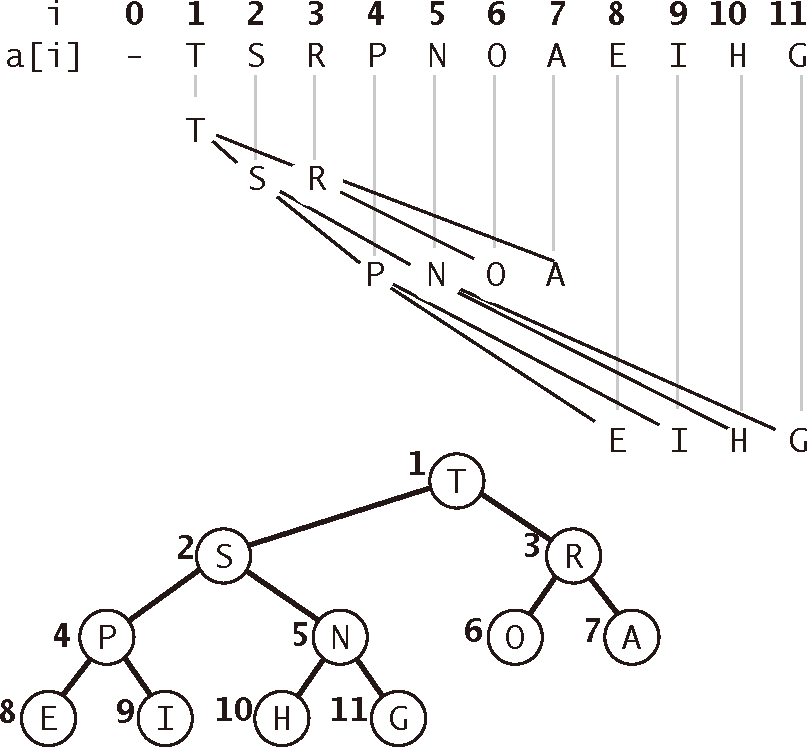

# Binary Search Tree


<!-- TOC -->

- [Binary Search Tree](#binary-search-tree)
    - [思想](#思想)
    - [概述](#概述)
        - [为什么要用二叉树做搜索](#为什么要用二叉树做搜索)
        - [与二叉堆的区别（以最大堆为例）](#与二叉堆的区别以最大堆为例)
        - [定义二叉树类和初始状态](#定义二叉树类和初始状态)
            - [定义节点类](#定义节点类)
    - [插入节点](#插入节点)
    - [搜索最小值和最大值](#搜索最小值和最大值)
    - [搜索一个特定的值](#搜索一个特定的值)
    - [移除一个节点](#移除一个节点)
        - [注意 `removeNode` 返回值赋值的必要](#注意-removenode-返回值赋值的必要)
        - [`removeNode` 实现](#removenode-实现)
    - [完整实现（包括了下面讲到的遍历）](#完整实现包括了下面讲到的遍历)
    - [树的遍历](#树的遍历)
        - [先序遍历（Pre Order）](#先序遍历pre-order)
        - [后序遍历（Post Order）](#后序遍历post-order)
        - [中序遍历（In Order）](#中序遍历in-order)
    - [平衡二叉搜索树](#平衡二叉搜索树)
        - [AVL 树的性能](#avl-树的性能)
        - [插入操作](#插入操作)
            - [再平衡](#再平衡)
            - [新平衡因子的计算](#新平衡因子的计算)
            - [完善再平衡](#完善再平衡)
    - [映射实现复杂度比较](#映射实现复杂度比较)
    - [关系](#关系)
        - [二叉树](#二叉树)
    - [References](#references)

<!-- /TOC -->


## 思想


## 概述
1. 二叉树中的节点最多只能有两个子节点：一个是左侧子节点，另一个是右侧子节点。这些定义有助于我们写出更高效的向/从树中插入、查找和删除节点的算法。
2. **二叉搜索树**（BST）是二叉树的一种，但是它只允许你在左侧节点存储（比父节点）小的值，在右侧节点存储（比父节点）大（或者等于）的值
    

### 为什么要用二叉树做搜索
1. 链表查找复杂度是 $O(N)$，插入复杂度是 $O(1)$。数组的查找复杂度是 $O(1)$，但插入的复杂度是 $O(N)$。
2. 所以，我们折中使用排序二叉树，它的查找和插入的复杂度都是 $O(logN)$。
3. 在完全平衡的二叉树中，最坏情况的时间复杂度是 $\log_2n$

### 与二叉堆的区别（以最大堆为例）
1. 二叉堆的父子节点更像是父子关系，也就是说父节点要大于等于子节点，而子节点之间谁大谁小无所谓；而二叉搜索树的父子节点则是一种从左到右的递增关系。
2. 因此二叉搜索树可以保证一个节点的左子树的任意节点都小于右子树的任意节点；但二叉堆因为两个子节点大小关系不明确，所以没有这种性质。
3. 二叉搜索树机构本身的有序性是很强的，所以按照中序遍历就可以以 $O(n)$ 复杂度实现按顺序输出；但是二叉堆的有序性比较弱，所以排序时只能不断的寻找合适并交换的堆顶节点，复杂度达到 $O(n \lg n)$。

### 定义二叉树类和初始状态
`root` 属性引用根节点，如果为 `null` 表示当前为空树
```js
class BinarySearchTree {

    constructor(){
        this.root = null;
    }

}
```

#### 定义节点类
1. 树中的任意一个节点都会保存当前节点的值，除此以外还会有两个指针，指向它的左侧子节点和右侧子节点。
    ```js
    class Node(key) {
        constructor (key, parent=null) {
            this.key = key;
            this.left = null;
            this.right = null;
            this.parent = parent;
        }
    }
    ```
2. BST 本身并不需要 `parent` 作为父节点的引用，但之后实现子类 AVL 树的时候需要，所以直接在这里加上这个属性。


## 插入节点
1. 要验证这个插入操作是否为一种特殊情况，也就是要插入的节点是树的第一个节点。如果是，就将根节点指向新节点；如果不是，就要把它插入到合适的位置
2. `Node` 构造函数调用时要设置父节点的引用：如果当前是空树，那么父节点就是 `null`；如果当前树非空，则要在递归比较的到目标位置时才能确定父节点是谁，才能调用 `Node` 创建新的节点
    ```js
    insert (key) {
        if ( this.root === null ) {
            this.root = new Node(key);
        } 
        else {
            insertNode(this.root, key);
        }
    }
    ```
3. 使用辅助函数 `insertNode` 将寻找合适的位置
    ```js
    function insertNode(node, key) {
        if ( key < node.key ) { // 如果新节点的键小于当前节点的键，
            // 那么需要检查当前节点的左侧子节点
            if ( node.left === null ) { // 如果它没有左侧子节点，就在那里插入新的节点
                node.left = new Node(key, node);
            } 
            else {
                // 如果有左侧子节点，需要通过递归调用 insertNode 方法继续找到树的下一层
                insertNode( node.left, key );
            }
        } 
        else {// 如果新节点的键大于等于当前节点的键
            if ( node.right === null ) { // 当前节点没有右侧子节点则直接作为右侧子节点
                node.right = new Node(key, node);
            } 
            else { // 有的话继续递归查找合适位置
                insertNode( node.right, key );
            }
        }
    }
    ```


## 搜索最小值和最大值
1. 根据二叉搜索树的规则，递归的查找到最后一个左侧子节点就是最小值，递归的查找到最后一个右侧子节点就是最大值。
2. 下面的 `min` 作为对象方法暴露，传递根节点作为起始搜素节点。内部通过实际的搜索函数 `minNode` 的进行搜索
    ```js
    min () {
        return minNode(this.root);
    }

    function minNode (node) {
        if (node) {
            while ( node && node.left !== null ) {
                node = node.left;               
            }
            return node.key;
        }
        return null;
    }
    ```
3. 最大值搜索也是类似的实现
    ```js
    max () {
        return maxNode(this.root);
    }

    function maxNode (node) {
        if (node) {
            while ( node && node.right !== null ) {
                node = node.right;
            }
            return node.key;
        }
        return null;
    }
    ```


## 搜索一个特定的值
1. 类似于二分搜索的逻辑。
2. 下面的 `search` 作为对象方法暴露，传递根节点作为起始搜索节点。内部通过实际的搜索函数 `searchNode` 的进行搜索
    ```js
    search (key) {
        return searchNode(this.root, key);
    }

    function searchNode(node, key, parent = null) {
        if (node === null) {
            return null;
        }

        if (node.key > key) {
            return searchNode(node.left, key, node);
        } 
        else if (node.key < key) {
            return searchNode(node.right, key, node);
        } 
        else {
            return node;
        }
    }
    ```


## 移除一个节点
1. 仍然是实例方法调用一个实际负责删除的函数
    ```js
    remove (key) {
        // 其实大多数情况下，这个赋值都是没用的。但如果移除的正好是根节点：
        //     如果整棵树只有根节点，那么 root 就要被重新赋值为 null；
        //     如果整棵树不止根节点，则 root 就要改为引用其他节点。
        this.root = removeNode(this.root, key);
    }
    ```
2. `removeNode` 函数的逻辑仍然要从搜索待删除的节点开始，指定一个起始搜索节点，通过值的比较，找到待删除的节点
    ```js
    function removeNode(node, key) {
        if (node === null) {
            return null;
        }

        if (key < node.key) { // 比 node 的 key 小
            node.left = removeNode(node.left, key); // 递归左子树 【1】
            return node;
        } 
        else if (key > node.key) { // 比 node 的 key 大
            node.right = removeNode(node.right, key); // 递归右子树 【2】
            return node;
        } 
        else { // 找到了待删除的节点
            
        }
    }
    ```
3. 找到了待删除的节点后，要分为三种情况：
    * 最简单的情况是该节点是一个叶节点，直接删除即可。
    * 稍复杂一点点的是该节点只有单侧子节点（子树），那么只要让该节点直接引用这个子节点就行，“儿子篡了父亲的位”。
    * 最复杂的情况是，该节点有双侧子节点（子树）。
4. 如果该有双侧子节点（子树），那么该节点现在的值，大于其左子树所有节点的值，小于其右子树所有节点的值。也就是说，其左子树所有的节点都要小于等于其右子树中最小的节点。
5. 那么，有一个看起来合理但不好的方法是，就是将该节点的整个左子树设为该节点右子树中最小值节点的 `left`，然后让该节点的父节点的 `right` 引用该节点的右子树。也就是把整棵左子树移到右边，然后再删除待删除的节点。
6. 但这种移动整棵树的方法会让某个分支明显长于其他的，在遍历时就可能带来性能损失。
7. 既然待删除节点的值是处于左右子树的中间值，那么在个节点被删除后，也可以在左右子树中找一个这样的节点来代替它的位置，也就是左子树的最大值或右子树的最小值。这里选择的是右子树的最小值。
8. 只需要找到右子树的最小节点，然后把待删除的节点的值设置为该最小节点的值，再删除掉这个最小节点，效果就相当于删除了待删除的节点
    ```js
    let aux = findMinNode(node.right); // 找到右子树的最小值
    node.key = aux.key; // 其实并没有删除该节点，真正删除的是右子树的最小值节点
    ```
9. 找到右子树最小节点使用了如下函数，因为是从右子树里寻找，所以参数要传右子树的根节点
    ```js
    function findMinNode (node) {
        while ( node && node.left !== null ) {
            node = node.left;
        }

        return node;
    }
    ```
9. 删除最小节点的方法，这里是嵌套的使用 `removeNode` 方法，从右子树里查找并删除
    ```js
    node.right = removeNode(node.right, aux.key);
    ```

### 注意 `removeNode` 返回值赋值的必要 
1. 可以看到所有的 `removeNode` 调用的返回值都被赋给了 `removeNode` 第一个参数的节点。也就是说，`removeNode` 从哪个节点开始遍历删除，返回值就要赋值给那个节点。
2. 首先要明确的一点是，参数是按值传递的，`removeNode` 的第一个参数是对节点的引用，也就是指针，也是按值传递的。
3. 也就是说，函数调用时，函数外部的实参指针和函数内部的实参指针是指向同一个节点但相互两个独立的指针。
4. 如果你在 `removeNode` 里面修改了指针所指对象的属性，那外面的实参指针指向的节点可以同步改变；但如果你直接改了指针的指向，那外面的实参指针还是维持不变的。
5. 现在分 A、B 两种情况讨论：情况 A 是 `removeNode` 调用传参的节点就是要被删除的节点，情况 B 是被删除的节点是传参节点的后代节点。
6. 情况 A 时，就是直接到了下面【3】的分支，其中又分为三种情况：
    * 情况一，形参指针指向 `null`，所以需要返回 `null` 让实参指针也指向 `null`，从而让待删除节点失去这两个指针的引用。
    * 情况二，形参指针指向待删除节点的子节点，然后返回这个子节点，让实参指针也指向这个子节点，从而让待删除节点失去这两个指针的引用。
    * 情况三，形参指针并没有发生改变，只是节点的属性（`key` 和 `right`）发生了改变。所以这种情况下外部实参指针实际上不需要被赋值，但是前面两个情况都要赋值，完全没有必要函数返回的时候判断是不是第三种情况然后要不要赋值，所以也原样返回。
7. 情况 B 时，走【1】或【2】，继续对子节点递归调用 `removeNode`。根据情况 A 的分析，这两个递归调用的返回也应该分别进行赋值。

### `removeNode` 实现
```js
function removeNode(node, key) {
    if (node === null) return null;

    if (key < node.key) { // 比 node 的 key 小
        node.left = removeNode(node.left, key); // 递归左侧子节点 【1】
        return node;
    } 
    else if (key > node.key) { // 比 node 的 key 大
        node.right = removeNode(node.right, key); // 递归右侧子节点 【2】
        return node;
    } 
    else { // 【3】
        // 第一种情况，key 所在的节点是叶节点
        if (node.left === null && node.right === null) {
            node = null;
            return node;
        }

        // 第二种情况，key 所在的节点是只有一个子节点
        if (node.left === null) {
            node = node.right;
            return node;
        } 
        else if (node.right === null) {
            node = node.left;
            return node;
        }

        // 第三种情况，key 所在的节点有两个子节点
        let aux = findMinNode(node.right); // 找到右子树的最小值
        node.key = aux.key; // 其实并没有删除该节点，真正删除的是右子树的最小值节点
        node.right = removeNode(node.right, aux.key);
        return node;
    }
}
```


## 完整实现（包括了下面讲到的遍历）
```js
class Node {
    constructor (key, parent=null) {
        this.key = key;
        this.left = null;
        this.right = null;
        this.parent = parent;
    }
}

function insertNode(node, key) {
    if ( key < node.key ) {
        if ( node.left === null ) {
            node.left = new Node(key, node);
        } 
        else {
            insertNode( node.left, key );
        }
    } 
    else {
        if ( node.right === null ) {
            node.right = new Node(key, node);
        } 
        else {
            insertNode( node.right, key );
        }
    }
}

function inOrderTraverseNode(node, callback) {
    if ( node !== null ) {
        inOrderTraverseNode(node.left, callback);
        callback(node.key);
        inOrderTraverseNode(node.right, callback);
    }
}

function preOrderTraverseNode(node, callback) {
    if ( node !== null ) {
        callback(node.key);
        preOrderTraverseNode(node.left, callback);
        preOrderTraverseNode(node.right, callback);
    }
}

function postOrderTraverseNode(node, callback) {
    if ( node !== null ) {
        postOrderTraverseNode(node.left, callback);
        postOrderTraverseNode(node.right, callback);
        callback(node.key);
    }
}

function minNode (node) {
    if (node) {
        while ( node && node.left !== null ) {
            node = node.left;               
        }
        return node.key;
    }
    return null;
}

function maxNode (node) {
    if (node) {
        while ( node && node.right !== null ) {
            node = node.right;
        }
        return node.key;
    }
    return null;
}

function searchNode(node, key, parent = null) {
    if (node === null) return null;

    if ( node.key > key ) {
        return searchNode(node.left, key, node);
    } 
    else if ( node.key < key ) {
        return searchNode(node.right, key, node);
    } 
    else {
        return node;
    }
}

function findMinNode (node) {
    while ( node && node.left !== null ) {
        node = node.left;
    }

    return node;
}

function removeNode(node, key) {
    if (node === null) {
        return null;
    }

    if (key < node.key) {
        node.left = removeNode(node.left, key);
        return node;
    } 
    else if (key > node.key) {
        node.right = removeNode(node.right, key);
        return node;
    } 
    else {
        if (node.left === null && node.right === null) {
            node = null;
            return node;
        }
        if (node.left === null) {
            node = node.right;
            return node;

        } 
        else if (node.right === null) {
            node = node.left;
            return node;
        }
        let aux = findMinNode(node.right);
        node.key = aux.key;
        node.right = removeNode(node.right, aux.key);
        return node;
    }
}


class BinarySearchTree {

    constructor(){
        this.root = null;
    }

    insert (key) {
        if ( this.root === null ) {
            this.root = new Node(key);
        } 
        else {
            insertNode(this.root, key);
        }
    }

    inOrderTraverse (callback) {
        inOrderTraverseNode(this.root, callback);
    }

    preOrderTraverse (callback) {
        preOrderTraverseNode(this.root, callback);
    }

    postOrderTraverse (callback) {
        postOrderTraverseNode(this.root, callback);
    }

    min () {
        return minNode(this.root);
    }

    max () {
        return maxNode(this.root);
    }

    search (key) {
        return searchNode(this.root, key);
    }

    check (key, node = this.root) {
        if (node === null) {
            return false;
        }

        if ( node.key > key ) {
            return this.check(key, node.left);
        } 
        else if ( node.key < key ) {
            return this.check(key, node.right);
        } 
        else {
            return true;
        }
    }

    remove (key) {
        this.root = removeNode(this.root, key);
    }

    getRoot () {
        return this.root;
    }
}
```


## 树的遍历
### 先序遍历（Pre Order）
1. 先访问根节点，然后递归地前序遍历左子树，最后递归地前序遍历右子树。
2. 从因果关系上来说，先序遍历的场景是，一个节点要先完成某些操作，它的子节点才能进行对应的操作。
3. 下图描绘了 `preOrderTraverseNode` 方法的访问路径：
     
    `callback` 所调用的节点依次为：11 7 5 3 6 9 8 10 15 13 12 14 20 18 25
4. 实现
    ```js
    function preOrderTraverseNode(node, callback) {
        if (node !== null) {
            callback(node.key);
            preOrderTraverseNode(node.left, callback);
            preOrderTraverseNode(node.right, callback);
        }
    }
    ```

### 后序遍历（Post Order）
1. 后序遍历则是先访问节点的后代节点，再访问节点本身。上面讲到的解析树就应用了后序遍历。
2. 从因果关系上来说，后序遍历的场景是，一个节点的结果需要依赖它后代节点（后代很可能是子树）的结果，所以要先遍历访问它的后代再操作当前节点。
层层追溯原因
3. 下图描绘了 `postOrderTraverse` 方法的访问路径：
      
    `callback` 所调用的节点依次为：3 6 5 8 10 9 7 12 14 13 18 25 20 15 11
4. 实现
    ```js
    function postOrderTraverseNode(node, callback) {
        if (node !== null) {
            postOrderTraverseNode(node.left, callback);
            postOrderTraverseNode(node.right, callback);
            callback(node.key);
        }
    }
    ```

### 中序遍历（In Order）
1. 先递归地中序遍历左子树，然后访问根节点，最后递归地中序遍历右子树。
2. 前两种遍历的因果关系，要么是先完成父节点才能完成子节点，要么是先完成所有的子节点才能完成父节点。而中序遍历是先完成左侧子节点，然后再完成父节点，最后完成右侧子节点。
3. 可以想到，这只是一种形式的中序遍历。也可能是先右侧子节点的，或者在两个以上子节点时还有其他的方式。
4. 下图描绘了 `inOrderTraverseNode` 方法的访问路径：
    
    `callback` 所调用的节点依次为：3 5 6 7 8 9 10 11 12 13 14 15 18 20 25
5. 实现
    ```js
    function inOrderTraverseNode(node, callback) {
        if (node !== null) {
            inOrderTraverseNode(node.left, callback); // 遍历左子树，先一路递归到左子树最小的一个节点
            callback(node.key);
            inOrderTraverseNode(node.right, callback); // 遍历右子树，先一路递归到右子树最小的一个节点
        }
    }
    ```


## 平衡二叉搜索树
1. 我们已经知道，当二叉搜索树不平衡时，查询和插入等操作的性能可能降到 $O(n)$。本节将介绍一种特殊的二叉搜索树，它能自动维持平衡。这种树叫作 **AVL树**。
2. AVL 树实现映射抽象数据类型的方式与普通的二叉搜索树一样，唯一的差别就是性能。实现 AVL 树时，要记录每个节点的 **平衡因子**。
3. 我们通过查看每个节点左右子树的高度来实现这一点。更正式地说，我们将平衡因子定义为左右子树的高度之差

$$
balance~Factor=height(left~Sub~Tree)-height(rightSubTree)
$$

4. 根据上述定义，如果平衡因子大于零，我们称之为左倾；如果平衡因子小于零，就是右倾；如果平衡因子等于零，那么树就是完全平衡的。
5. 为了实现 AVL 树并利用平衡树的优势，我们将平衡因子为 –1、0 和 1 的树都定义为平衡树。一旦某个节点的平衡因子超出这个范围，我们就需要通过一个过程让树恢复平衡。
6. 下图展示了一棵右倾树及其中每个节点的平衡因子
    

### AVL 树的性能

TODO

1. 通过维持树的平衡，可以保证搜索节点方法的时间复杂度为 $O(\log_2n)$。
2. 因为新节点作为叶子节点插入，所以更新所有父节点的平衡因子最多需要 $\log_2n$ 次操作——每一层一次。如果树失衡了，恢复平衡最多需要旋转两次。每次旋转的时间复杂度是 $O(1)$，所以插入节点操作的时间复杂度仍然是 $O(\log_2n)$。


### 插入操作
1. 所有新键都是以叶子节点插入的，因为新叶子节点的平衡因子是零，所以新插节点没有什么限制条件。
2. 但插入新节点后，必须更新父节点的平衡因子。新的叶子节点对其父节点平衡因子的影响取决于它是左子节点还是右子节点。
3. 如果是右子节点，父节点的平衡因子减一。如果是左子节点，则父节点的平衡因子加一。这个关系可以递归地应用到每个祖先，直到根节点。
4. 既然更新平衡因子是递归过程，就来检查以下两种基本情况：
    * 递归调用抵达根节点；
    * 父节点的平衡因子调整为零。如果子树的平衡因子为零，那么祖先节点的平衡因子将不会有变化。也就是说本来只有单侧节点，但是现在有双侧节点了，例如上图中的 B 有了右侧子节点，那么对于 B 的父节点 C 来说，左子树高度并没有发生变化，因为只是把之前单侧的补全为双侧了而已。
5. 我们将 AVL 树实现为 `BinarySearchTree` 的子类，需要修改辅助方法 `insert`。现在插入一个节点时，需要递归更新它的祖先节点的平衡因子，可能还要移动节点让不平衡的树变的平衡
    ```js
    function insertNodeForAVL(node, key) {
        if ( key < node.key ) {
            if ( node.left === null ) {
                node.left = new Node(key, node);
                // 从新插入的节点开始往上更新平衡因子
                // updateBalance 方法内部会判断新插入节点是左还是右
                updateBalance(node.left);
            } 
            else {
                insertNode( node.left, key );
            }
        } 
        else {
            if ( node.right === null ) {
                node.right = new Node(key, node);
                updateBalance(node.right);
            } 
            else {
                insertNode( node.right, key );
            }
        }
    }
    ```
6. `updateBalance` 负责更新平衡因子，如果发现树中有不平衡的情况出现，还需要调用 `rebalance` 进行平衡
    ```js
    function updateBalance (node) {
        if ( node.balanceFactor > 1 || node.balanceFactor < -1 ) {
            rebalance(node);
        }
        else {
            if ( isLeftChild(node) ) {
                parent.balanceFactor += 1;
            }
            else if ( isRightChild (node) ) {
                parent.balanceFactor -= 1;
            }
            // 递归更新上层节点的平衡因子
            if ( parent.balanceFactor !== 0 ) {
                updateBalance(parent);
            }
        }
    }

    function isLeftChild (node) {
        return node.parent && node.parent.left === node;
    }

    function isRightChild (node) {
        return node.parent && node.parent.left === node;
    }
    ```

#### 再平衡
1. 为了让 AVL 树恢复平衡，需要在树上进行一次或多次 **旋转**。下图是一个左旋的过程
    
2. 左旋包括以下步骤。
    1. 将右子节点（B）提升为子树的根节点。
    2. 将旧根节点（A）作为新根节点的左子节点。
    3. 如果新根节点（B）之前有左子节点，将其作为新左子节点（A）的右子节点。
3. 再看一个右旋的过程
    
4. 右旋步骤如下。
    1. 将左子节点（C）提升为子树的根节点。
    2. 将旧根节点（E）作为新根节点的右子节点。
    3. 如果新根节点（C）之前有右子节点（D），将其作为新右子节点（E）的左子节点。
5. 以左旋为例，涉及 5 对指向关系的修改
    * 第一对：旧根节点和新根节点
    * 第二对：新根节点和它的左侧子节点
    * 第三对：新根节点的左侧子节点和旧根节点
    * 第四对：旧根节点和它的父节点
    * 第五对：新根节点和旧根节点的父节点
5. 下面是左旋的实现
    ```js
    rotateLeft (rotRoot) {
        let newRoot = rotRoot.right; // 临时变量保存新的根节点

        // 第二对和第三对
        // 新的根节点如果之前有左子节点，那么让它成为旧根节点的右子节点
        // 如果没有，那也正确的置为了 null
        rotRoot.right = newRoot.left;
        // 新的根节点如果之前有左子节点，那就要修改它父节点的指向
        if ( newRoot.left ) {
            newRoot.left.parent = rotRoot;
        }

        // 第五对和第四对
        // 新的根节点修改父节点的引用
        // 如果旧的根节点是整棵树的根节点，那这里也正确的置为了 null
        newRoot.parent = rotRoot.parent;
        // 旧的根节点同样把自己的父节点引用指向新的根节点，但在此之前，
        // 还要再用一下这个引用，因为这引用要把自己的子节点指向新的根节点
        // 如果旧的根节点之前是整棵树的根节点，那情况比较简单
        if ( rotRoot.parent === null ) {
            this.root = newRoot;
        }
        // 否则的话，还要看旧的根节点之前是作为那一侧的子节点
        else {
            if ( isLeftChild(rotRoot) ) {
                rotRoot.parent.left = newRoot;
            } 
            else {
                rotRoot.parent.right = newRoot;
            }
        }

        // 第一对
        // 现在可以让旧的根节点把自己的父节点指向新的根节点了
        rotRoot.parent = newRoot;
        // 新的根节点节点也要反向指向旧的根节点
        newRoot.left = rotRoot;

        // 新平衡因子
        rotBoot.balanceFactor = rotBoot.balanceFactor + 1 - Math.min(newRoot.balanceFactor, 0);
        newRoot.balanceFactor = newRoot.balanceFactor + 1 + Math.max(rotBoot.balanceFactor, 0);
    }
    ```

#### 新平衡因子的计算
[推导过程](https://www.ituring.com.cn/book/tupubarticle/27758)

#### 完善再平衡
1. 上面再平衡的分析还有缺陷。考虑下面这个失衡的树
    
2. 按照上面的规则，应该进行左旋。不过，左旋之后变成了
    
3. 现在又需要右旋了。不过如果右旋，则又变回去了。
4. 要解决这种问题，必须遵循以下规则：
    * 如果子树需要左旋，首先检查右子树的平衡因子。如果右子树左倾，就对右子树做一次右旋，再围绕原节点做一次左旋。
    * 如果子树需要右旋，首先检查左子树的平衡因子。如果左子树右倾，就对左子树做一次左旋，再围绕原节点做一次右旋。
5. 下面是一个示例
    
6. `rebalance` 实现
    ```js
    rebalance (node) {
        if ( node.balanceFactor < 0 ) {
            if ( node.right.balanceFactor > 0 ) {
                rotateRight(node.right);
            }
            rotateLeft(node);
        }
        else if ( node.balanceFactor > 0 ) {
            if ( node.left.balanceFactor < 0 ) {
                rotateLeft(node.left);
            }
            rotateRight(node);
        }
    }
    ```


## 映射实现复杂度比较
操作\类型 | 有序列表 | 散列表 | 二叉搜索树 | AVL树
--|--|--|--|--
插入 | $O(n)$       | $O(1)$ | $O(n)$ | $O(\log_2n)$
读取 | $O(\log_2n)$ | $O(1)$ | $O(n)$ | $O(\log_2n)$
查询 | $O(\log_2n)$ | $O(1)$ | $O(n)$ | $O(\log_2n)$
删除 | $O(n)$       | $O(1)$ | $O(n)$ | $O(\log_2n)$


  


## 关系
### 二叉树
1. 对于一个二叉树，每一层的最大节点数都是 $2^n$，其中 $n$ 等于 0, 1, 2...
2. 第 $n$ 层的最大节点数是 $2^n$，又根据等比数列求和公式，第 $0$ 层到第 $n-1$ 层所有的节点数是 $2^n - 1$。因此，一个完全层的节点正好比它上面所有层的节点多一个。神奇！
3. 由下图可以看出来，如果按照图中的编号，那么每一层的最左边节点的序号正是 $2^n$。因为一个完全层的节点数是 $2^n$，而它上面所有的节点的数量是 $2^n - 1$，所以该完全层的第一个节点的序号就是 $2^n$。
    
4. 既然上层的第一个节点序号是下层第一个节点的一半，也就是说上层第一个节点的序号是其左侧子节点的一半，那么上层第二个节点的需要也是它的左侧子节点的一半。因为一个节点对应两个子节点，所以上层序号加一，下层对应的就要序号就要加二。进一步的可以说，对于一个完全二叉树，序号 $k$ 的节点的两个子节点的序号分别是 $2k$ 和 $2k+1$。
5. 第 $2^n$ 个元素是第 $n$ 层的第一个，第 $2^{n+1} - 1$ 个元素是第 $n$ 层的最后一个。所以，对于节点数量在 $[2^n, 2^{n+1})$ 区间内的完全二叉树来说，它的高度（不包括根节点所在层）是 $n$。
6. 基于上一条变换一下，对于一个 $N$ 个节点的完全二叉树，它的高度（不包括根节点所在层）是 $\left\lfloor\log N\right\rfloor$。理解起来有点绕。假设 $N$ 正好是某行的第一个节点，那显然这棵树的高度是 $log N$；而如果 $N$ 是在该行的其他位置，此时的 $N$ 就比行首的序号要大，但还达不到行首序号的两倍，因为两倍的话就是下一行的行首了，所以此时的 $log N$ 不是一个整数，向下取整就是当前的行高，向上取整就是下一行的行高。


## References
* [《Python数据结构与算法分析（第2版）》](https://book.douban.com/subject/34785178/)
* [算法导论](https://book.douban.com/subject/20432061/)