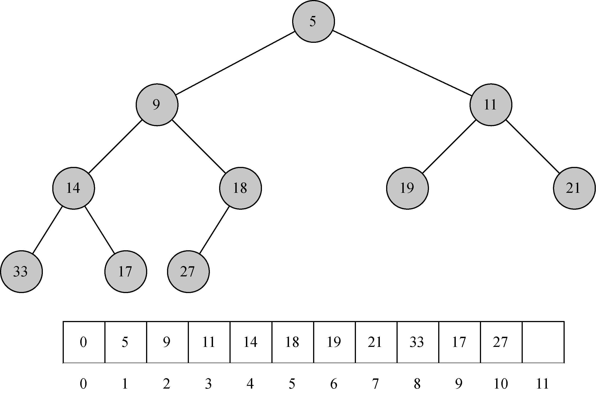
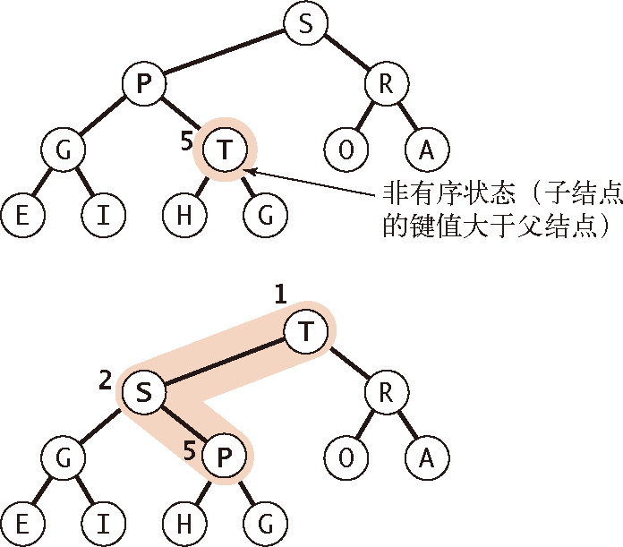
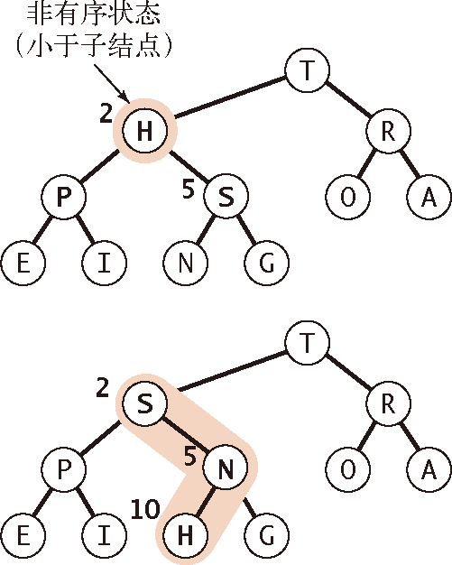
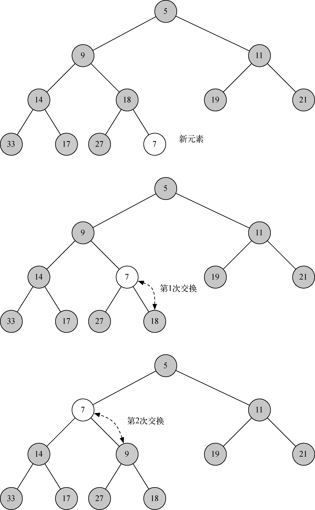
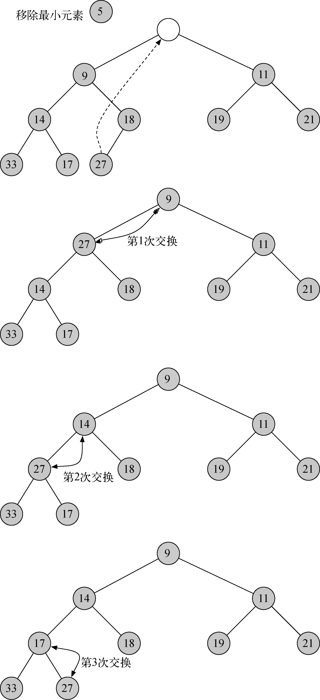

# 堆


<!-- TOC -->

- [堆](#堆)
    - [本质](#本质)
        - [维护同一子树中根节点与后代节点的大小关系](#维护同一子树中根节点与后代节点的大小关系)
    - [设计思想](#设计思想)
        - [`sink` 和 `swim`](#sink-和-swim)
        - [排序](#排序)
        - [优先队列](#优先队列)
    - [用途](#用途)
    - [概述](#概述)
    - [结构属性](#结构属性)
    - [堆的有序化（reheapifying）](#堆的有序化reheapifying)
        - [大元素上浮](#大元素上浮)
        - [小元素下沉](#小元素下沉)
        - [复杂度](#复杂度)
    - [Building a heap](#building-a-heap)
        - [顺序问题](#顺序问题)
        - [复杂度](#复杂度-1)
    - [其他堆操作的实现](#其他堆操作的实现)
        - [添加新节点](#添加新节点)
        - [移除最大的顶节点](#移除最大的顶节点)
    - [Heapsort](#heapsort)
        - [时间复杂度](#时间复杂度)

<!-- /TOC -->


## 本质
### 维护同一子树中根节点与后代节点的大小关系
1. 对于堆中的任意子树，根节点永远不小于它的后代节点；但如果两个节点并不是某个子树的根节点和后代节点的关系，那么它们的高度并不能保证大小关系。
2. 也就是说它维护的有序性并不是系统内任意两个节点的，而是系统中任意子系统的根节点和后代节点的。


## 设计思想

### `sink` 和 `swim`

### 排序
1. 上面本质中说到堆只能维护任意子树的根节点和后代节点的大小关系，所以排序的具体比较步骤只能发生在根节点和后代节点之间，而不能是任意两个节点。
2. 所以堆排序每次都是通过移除最大节点，因为你只能保证这种大小与关系是确定的。

### 优先队列
1. 同样根据上面的本质，优先队列只能保证子树的根节点相对于后代节点的优先，而不能保证整个队列是按照优先度排序的。
2. 所以，当我们希望 **一整组** 对象都要按照某个顺序时，就符合优先队列的特性。
3. 注意必须是一整组，这样才能通过不断的移除堆顶来维持顺序；而如果只是组内的一部分，是不能保证顺序的，因为顺序的维持必须要通过不断设置堆顶元素来实现。


## 用途


## 概述
1. 二叉堆的入队操作和出队操作均可达到 $O(\log n)$。
2. 二叉堆画出来很像一棵树，但实现时只用一个列表作为内部表示。
3. 二叉堆有两个常见的形式：**最小堆**（最小的元素一直在队首）与 **最大堆**（最大的元素一直在队首）。


## 结构属性
1. 为了使二叉堆能高效地工作，我们利用树的对数性质来表示它。为了保证对数性能，必须维持树的平衡。
2. 平衡的二叉树是指，其根节点的左右子树含有数量大致相等的节点。
3. 在完全平衡的二叉树中，左右子树的节点数相同。最坏情况下，插入节点操作的时间复杂度是 $O(\log_2n)$，其中 $n$ 是树的节点数。
4. 在实现二叉堆时，我们通过创建一棵 **完全二叉树** 来维持树的平衡。在完全二叉树中，除了最底层，其他每一层的节点都是满的。在最底层，我们从左往右填充节点。
5. 完全二叉树的另一个有趣之处在于，可以用一个列表来表示它。由于树是完全的，任何一行完整的节点数都是前一行节点的 2 倍（$2^n$ 关系）。因为第 $i$ 行的节点数是 $2^i$（$i$ 从 0 开始计）。
6. 另外，根据等比数列求和公式 $\frac{a_1(1-q^n)}{1-q}$ 可得：
    * 前 $n$ 行（$n$ 从 1 开始计）的节点总数为 $\frac{1*(1-2^n)}{1-2} = 2^n - 1$；
    * 第 $n+1$ 行（$i=n$）的节点数是 $2^n$
7. 也就是说：$某一行完整的节点数=它上面所有节点数+1$。
8. 因此，对于在列表中处于位置 $p$ 的节点来说，它的左子节点正好处于位置 $2p$；同理，右子节点处于位置 $2p+1$
    
9. 对第 8 点的证明：
    1. 已知第 $n$ 行的第 $k$ 个元素的总序号是 $p$
    2. 根据上面第 6 条，可以得出来 $p = 2^{n-1} - 1 + k$
    2. 同样根据第 6 条，可以得出第 $n$ 行最后一个节点的总序号是 $2^n - 1$
    4. 因此第 $n+1$ 行的第 1 组两个节点的总序号是 $2^n$ 和 $2^n + 1$
    5. 第 $n+1$ 的第 2 组两个节点的总序号是 $2^n + 2$ 和 $2^n + 3$
    6. 因此第 $n+1$ 的第 $k$ 组两个节点的总序号是 $2^n + 2k-2$ 和 $2^n + 2k-1$，变形为 $2(2^{n-1} + k - 1)$ 和 $2(2^{n-1} + k - 1) + 1$
    7. 根据第 2 步，可以得出 $2p$ 和 $2p+1$
10. 证明含有 $n$ 个元素的堆的高度是 $\lfloor \lg n \rfloor$:
    1. 先用行数来计算。根据上面第 6 点，第 x 行的元素数量范围是 $[2^{x-1}, 2^x)$。
    2. 现在就假设 $n$ 个元素的堆有 $x$ 行，所以 $2^{x-1} \leq n < 2^x$。
    3. 取对数，有 $x-1 \leq \lg n < x$。所以 $x-1 = \lfloor \lg n \rfloor$。
    4. 因为 $x$ 是对的行数，所以 $x - 1$ 就是堆的高度。
11. 证明当用数组表示存储 $n$ 个元素的堆时，叶节点下标分别是 $\lfloor n/2 \rfloor + 1, \lfloor n/2 \rfloor + 2, ..., n$
    1. 因为最后一个节点的序号是 $n$，所以它的父节点是 $\lfloor n/2 \rfloor$。
    2. 而该父节点之后所有的节点都是叶节点。
12. 证明对于有 $n$ 个元素的堆中，至少有 $\lceil n/2^{h+1} \rceil$ 个高度为 $h$ 的节点
    1. 根据上面第 7 点，如果最后一行（$h=0$）最多有 $\lceil n/2 \rceil$ 个节点。
    2. 所以倒数第二行（$h=1$）最多有 $\lceil n/4 \rceil$ 个节点。
    3. 以此类推。


## 堆的有序化（reheapifying）
1. 这里以大顶堆为例，**堆的有序性** 是指：对于堆中任意元素 $x$ 及其父元素 $p$，$p$ 都不小于 $x$。
2. 通过有两种方法来进行大顶堆的有序化：大元素上浮（`swim`）和小元素下沉（`sink`）。

### 大元素上浮 
1. 如果堆的有序状态因为某个节点变得比它的父节点更大而被打破，那么我们就需要通过交换它和它的父节点来修复堆。
2. 交换后，这个上浮的节点比它的两个子节点都大（现在的两个子节点，一个是刚被换下来的曾经的父节点，另一个比曾经的父节点更小，因为它是曾经父节点的子节点）。
3. 但这个上浮的节点仍然可能比它现在新的父节点更大。因此我们可以一遍遍地用同样的办法恢复秩序，将这个节点不断向上移动直到我们遇到了一个更大的父节点
    
4. 只要记住位置 $k$ 的节点的父节点的位置是 $\lfloor k/2\rfloor$，这个过程实现起来很简单
    ```js
    swim (k) {
        while ( k > 1 && this.less(Math.floor(k/2), k) ) {
            let parentIndex = Math.floor(k/2);
            this.swap(parentIndex, k);
            k = parentIndex;
        }
        return k;
    }
    ```

### 小元素下沉
1. 如果堆的有序状态因为某个节点变得比它的两个子节点或是其中之一更小了而被打破了，那么我们可以通过将它和它的两个子节点中的较大者交换来恢复堆。
2. 交换可能会在子节点处继续打破堆的有序状态，因此我们需要不断地用相同的方式将其修复，将节点向下移动直到它的子节点都比它更小或是到达了堆的底部
    
3. 由位置为 $k$ 的节点的子节点位于 $2k$ 和 $2k+1$ 可以直接得到对应的代码
    ```js
    sink (i) {
        // 这个判断条件只能保证有左侧子节点，但只要有左侧的，就应该进行比较
        while (2*i <= this.size) {
            let left = 2*i; 
            let right = 2*i + 1; 
            let largest = left; // 假设左侧子节点是最大的，作为比较的基准

            // 如果有右侧的，就和左侧的比较，确定子节点中更大的那个，然后再去和父节点比较
            if ( right <= this.size && this.less(left, right)) {
                largest = right;
            }

            if (!this.less(i, largest)) {
                break;
            }

            this.swap(i, largest);

            i = largest;
        }
    }
    ```
4. 《算法导论》中的递归实现
    ```js
    sink_recursive (i) {
        let left = 2*i;
        let right = 2*i + 1;
        let largest;

        if (left <= this.size && this.less(i, left)) {
            largest = left;
        }
        else {
            largest = i;
        }
        if (right <= this.size && this.less(largest, right)) {
            largest = right;
        }

        if (largest !== i) {
            this.swap(i, largest);
            this.sink_recursive(largest);
        }
    }
    ```

### 复杂度
TODO  
运行时间是 $O(\lg n)$，堆的高度 $h$ 是 $\lfloor \lg n \rfloor$。所以时间复杂度是 $O(h)$。


## Building a heap
1. 既然 `sink` 方法会让一个节点有序，那么我们就可以自底向上的让所有的节点都有序。
2. 当然不需要对每个节点都执行 `sink`，因为叶节点 `sink` 了也没效果，它们只需要等待上面节点的 `sink`。
3. 所以我们就自底向上的对所有的非叶节点进行 `sink`
    ```js
    build () {
        for (let i=Math.floor(this.size/2); i>0; i--) {
            this.sink(i);
        }
    }
    ```

### 顺序问题
1. 为什么是自底向上而不是自顶向下？
2. 以《算法导论》88页为例，考虑自顶向下的情况。当节点 1 和节点 16 交换后，16 上浮；之后再也不会访问到节点 16 了，但其实它还没有上浮到位。
3. 因为 `sink` 只会循环的让小节点一直下沉的合适的位置，但是对于最大的节点，就只会上浮一行，不能保证上浮到位。
4. 而自底向上就保证了那些没有上浮到位的节点还会被访问到。
5. 那么，现在就可以想到，如果要自顶向下，就不能用 `sink` 而要用 `swim`，`swim` 会让之后不再访问的大节点上浮到位，而只会让小节点下沉一层，但因为是自顶向下，所以它们还会被访问到。
6. 但是因为 `swim` 是从子节点出发向父节点比较，所以不能省略对叶节点的遍历
    ```js
    build () {
        for (let i=1; i<=this.size; i++) {
            this.swim(i);
        }
    }
    ```


### 复杂度
TODO   $O(n)$


## 其他堆操作的实现
```js
class BinaryHeap {
    constructor (arr=[]) {
        this.arr = [null];
        this.size = arr.length; 
        if (arr.length) {
            this.arr = [null, ...arr];
            this.build();
        }
    }

    // 对元素的列表，和 arr 不同。
    // 这里不包括起始的 null；以及 delMax 时，只是不计入 list 中，而并不会真的从 arr 中移除
    get list () {
        return this.arr.slice(1, this.size+1);
    }

    swap( index1, index2 ) {
        let aux = this.arr[index1];
        this.arr[index1] = this.arr[index2];
        this.arr[index2] = aux;
    }

    less ( index1, index2 ) {
        return this.arr[index1] < this.arr[index2];
    }

    swim (k) {
        while ( k > 1 && this.less(Math.floor(k/2), k) ) {
            let parentIndex = Math.floor(k/2);
            this.swap(parentIndex, k);
            k = parentIndex;
        }
        return k;
    }

    sink (i) {
        // 这个判断条件只能保证有左侧子节点，但只要有左侧的，就应该进行比较
        while (2*i <= this.size) {
            let left = 2*i; 
            let right = 2*i + 1; 
            let largest = left; // 假设左侧子节点是最大的，作为比较的基准

            // 如果有右侧的，就和左侧的比较，确定子节点中更大的那个，然后再去和父节点比较
            if ( right <= this.size && this.less(left, right)) {
                largest = right;
            }

            if (!this.less(i, largest)) {
                break;
            }

            this.swap(i, largest);

            i = largest;
        }
    }

    sink_recursive (i) {
        let left = 2*i;
        let right = 2*i + 1;
        let largest;

        if (left <= this.size && this.less(i, left)) {
            largest = left;
        }
        else {
            largest = i;
        }
        if (right <= this.size && this.less(largest, right)) {
            largest = right;
        }

        if (largest !== i) {
            this.swap(i, largest);
            this.sink_recursive(largest);
        }
    }

    build () {
        for (let i=Math.floor(this.size/2); i>0; i--) {
            this.sink(i);
        }
    }

    insert (v) {
        this.arr.push(v);
        this.size++;
        return this.swim(this.size);
    }

    delMax () {
        let maxNode = this.arr[1];
        this.swap(1, this.size); 
        this.size--;
        this.sink(1);
        return maxNode;
    }
}
```

### 添加新节点
1. 先将元素追加到列表的末尾，然后再通过大小比较把它移动到合适的位置
    
2. `insert` 方法先把新的节点添加到尾部，然后再使用 `swim` 方法把它移动到合适的位置
    ```js    
    insert (v) {
        this.arr.push(v);
        this.size++;
        return this.swim(this.size);
    }
    ```

### 移除最大的顶节点
1. 要移除根节点，肯定不能直接移除，否则就变成两棵树了。那么找谁来填补空位呢？
2. 因为根节点是最大的，那么看起来应该找第二大的节点来填补，也就是根节点的某个子节点。
3. 但是这样并不行，因为这个第二大的节点几乎都有两个子节点了，不能再接收和它同父的节点了。就算让这个第二大的节点舍弃调一个本身的子树，那这个子树的重新安放就会很麻烦。
4. 不过，因为有了 `sink` 方法，所以就可以换上了一个节点，然后再让它 sink 到合适的位置。
5. 被换上的节点只能是叶节点，因为如果不是的话，那就要拆树。
6. 理论上可以换上去任何一个叶节点，但考虑到后续操作的方便性，还是应该换上去最后一个叶节点
    
7. 把最后一个节点移到顶节点，然后再通过大小比较把它移动到合适的位置
    ```js
    delMax () {
        let maxNode = this.arr[1];
        this.swap(1, this.size); 
        // 删除交换下来的最大节点。但并不是真的删除，只是不再计入堆的 list 中，排序的时候还会用到
        this.size--; 
        this.sink(1);
        return maxNode;
    }
    ```


## Heapsort
1. 上面实现的 `delMax` 可以把最大节点移到 `list` 尾部，然后再从 `list` 中移除。
2. 那么反复调用 `delMax` 就可以从大到小的移除堆中的节点，被移除的节点按从小到大顺序保存在 `arr` 中
    ```js
    function heapSort(arr) {
        let heap = new BinaryHeap(arr);

        let size = heap.size;
        for (let i=size; i>1; i--) {
            heap.delMax();
        }
        return heap.arr.slice(1);
    }
    ```
3. 为什么不是反向交换，也就是说从堆顶开始？好像也可以，试了一下没发现问题
    ```js
    for (let i=1; i<size; i++) {
        heap.delMax();
    }
    ```

### 时间复杂度
1. `build` 的时间复杂度是 $O(n)$；每次 `sink` 的时间复杂度是 $O(\lg n)$，一共 $n-1$ 次。所以排序的复杂度是 $O(n \lg n)$。
2. 如果输入数组是升序的，复杂度如何？因为是升序，所以 build 过程移动的会比较多，因为整体要让小节点下来大节点上去，但时间复杂度仍然是 $O(n)$。在经过 build 后，其实也就打乱顺序了，而且升序的数组并不会让 build 更快。所以复杂度还是一样的。
3. 降序呢？降序的数组在 build 时每个 sink 都会在第一次 `while` 循环 break，但 build 的复杂度仍然是 $O(n)$ 级别。build 完之后顺序并没有改变，还是降序的，正好和期望的排顺序相反，排序会不会更慢呢？因为是降序，所以每次 `delMax` 中的 `sink` 都会从根节点下降到叶节点，但仍然是 $O(\lg n)$ 界别的。所以整体的时间复杂度还是不变的。