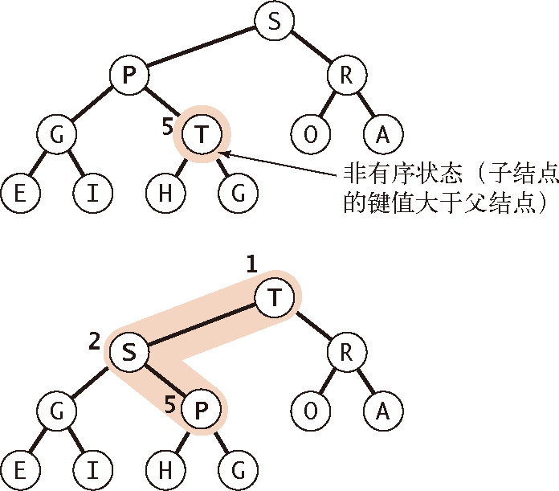

# Priority Queues


<!-- TOC -->

- [Priority Queues](#priority-queues)
    - [设计思想](#设计思想)
    - [本质](#本质)
    - [Summary](#summary)
    - [API](#api)
    - [初级实现](#初级实现)
        - [无序数组](#无序数组)
        - [有序数组](#有序数组)
        - [链表表示法](#链表表示法)
        - [分析](#分析)
    - [堆的定义](#堆的定义)
    - [堆的算法](#堆的算法)
        - [堆的有序化（reheapifying）](#堆的有序化reheapifying)
            - [大元素上浮](#大元素上浮)
            - [小元素下沉](#小元素下沉)
        - [插入元素和删除最大元素](#插入元素和删除最大元素)
        - [完整实现](#完整实现)
        - [分析](#分析-1)
    - [References](#references)

<!-- /TOC -->


## 设计思想


## 本质


## Summary
1. 许多应用程序都需要处理有序的元素，但不一定要求它们全部有序，或是不一定要一次就将它们排序。很多情况下我们会收集一些元素，处理当前键值最大的元素，然后再收集更多的元素，再处理当前键值最大的元素，如此这般。
2. 在这种情况下，一个合适的数据结构应该支持两种操作：**删除最大元素**（或最小元素） 和 **插入元素**。这种数据类型叫做 **优先队列**。
3. 优先队列的一些重要的应用场景包括模拟系统，其中事件的键即为发生的时间，而系统需要按照时间顺序处理所有事件；任务调度，其中键值对应的优先级决定了应该首先执行哪些任务；数值计算，键值代表计算错误，而我们需要按照键值指定的顺序来修正它们。
4. 通过插入一列元素然后一个个地删掉其中最小的元素，我们可以用优先队列实现排序算法。一种名为 **堆排序** 的重要排序算法也来自于基于堆的优先队列的实现。


## API
1. 优先队列最重要的操作就是 **删除最大元素** 和 **插入元素**，删除最大元素的方法名为 `delMax`，插入元素的方法名为 `insert`。
2. 完整的 API：
    方法 | 描述
    --|--
    MaxPQ()	            | 创建一个优先队列
    MaxPQ(int max)	    | 创建一个初始容量为 max 的优先队列
    MaxPQ(Key[] a)	    | 用 a[] 中的元素创建一个优先队列
    void Insert(Key v)	| 向优先队列中插入一个元素
    Key max()	        | 返回最大元素
    Key delMax()	    | 删除并返回最大元素
    boolean isEmpty()	| 返回队列是否为空
    int size()	        | 返回优先队列中的元素个数


## 初级实现
1. 初级实现指的是使用有序或无序的数组，或者链表来实现优先序列。
2. 如果队列较小时，或者大部分时间都只是使用删除最大元素或者插入元素这两种主要操作中的一种时，或是所操作元素的顺序已知时，很适合使用这三种简单的数据结构来实现。

### 无序数组
1. 因为是无序数组，所以 `insert` 方法很简单，只需要直接 push 元素进去就行了。
2. 但是要要实现 `delMax`，就要在无序的数组里找到最大元素。我们可以添加一段类似于选择排序的内循环的代码，将最大元素和边界元素交换然后删除它。

### 有序数组
1. 因为要保证数组有序，所以 `insert` 方法就会麻烦一些，需要将所有较大的元素向右边移动一格以使数组保持有序（和插入排序一样）。这样，最大的元素总会在数组的一边。
2. 不过 `delMax` 就很简单了。

### 链表表示法

### 分析
1. 使用无序序列是解决这个问题的惰性方法，我们仅在必要的时候才会采取行动找出最大元素；使用有序序列则是解决问题的积极方法，因为我们会尽可能未雨绸缪，在插入元素时就保持列表有序，使后续操作更高效。
2. 实现栈或是队列与实现优先队列的最大不同在于对性能的要求。对于栈和队列，我们的实现能够在常数时间内完成所有操作；而对于优先队列，我们刚刚讨论过的所有初级实现中，插入元素和删除最大元素这两个操作之一在最坏情况下需要线性时间来完成。我们接下来要讨论的基于数据结构 **堆** 的实现能够保证这两种操作都能更快地执行。
3. 时间复杂度如下
    数据结构 | 插入元素 | 删除最大元素
    --|--|--
    有序数组 | N | 1
    无序数组 | 1 | N
    堆 | $log N$ | $log N$
    理想情况 | 1 | 1


## 堆的定义
1. **二叉堆** 画出来很像一棵树，但实现时可以只用一个数组作为内部表示。在二叉堆的数组中，每个元素都要保证大于等于另两个特定位置的元素。如果我们将所有元素画成一棵二叉树，将每个较大元素和两个较小的元素用边连接就可以很容易看出这种结构。
2. 当一棵二叉树的每个节点都大于等于它的两个子节点时，它被称为 **堆有序**。
3. 如果我们用指针来表示堆有序的二叉树，那么每个元素都需要三个指针来找到它的上下节点（父节点和两个子节点各需要一个）。但如下图所示，如果我们使用完全二叉树（在完全二叉树中，除了最底层，其他每一层的节点都是满的。在最底层，我们从左往右填充节点），表达就会变得特别方便
    
4. 要画出这样一棵完全二叉树，可以先定下根节点，然后一层一层地由上向下、从左至右，在每个节点的下方连接两个更小的节点，直至将 N 个节点全部连接完毕。
5. 完全二叉树只用数组而不需要指针就可以表示。具体方法就是将二叉树的节点按照层级顺序放入数组中，根节点在位置 1，它的子节点在位置 2 和 3，而子节点的子节点则分别在位置 4、5、6 和 7，以此类推
    
6. 在一个堆中，位置 $k$ 的节点的父节点的位置为 $\lfloor k/2\rfloor$，而它的两个子节点的位置则分别为 $2k$ 和 $2k+1$。这样在不使用指针的情况下我们也可以通过计算数组的索引在树中上下移动。
7. 用数组（堆）实现的完全二叉树的结构是很严格的，但它的灵活性已经足以让我们高效地实现优先队列。用它们我们将能实现对数级别的插入元素和删除最大元素的操作。利用在数组中无需指针即可沿树上下移动的便利和以下性质，算法保证了对数复杂度的性能。
8. 一棵大小为 $N$ 的完全二叉树的高度为 $\left\lfloor\lg N\right\rfloor$。通过归纳很容易可以证明这一点，且当 $N$ 达到 2 的幂时树的高度会加 1。


## 堆的算法
### 堆的有序化（reheapifying）
1. 这里以大顶堆为例，**堆的有序性** 是指：对于堆中任意元素 $x$ 及其父元素 $p$，$p$ 都不小于 $x$。
2. 通过有两种方法来进行大顶堆的有序化：大元素上浮（`swim`）和小元素下沉（`sink`）。

#### 大元素上浮 
1. 如果堆的有序状态因为某个节点变得比它的父节点更大而被打破，那么我们就需要通过交换它和它的父节点来修复堆。
2. 交换后，这个上浮的节点比它的两个子节点都大（现在的两个子节点，一个是刚被换下来的曾经的父节点，另一个比曾经的父节点更小，因为它是曾经父节点的子节点）。
3. 但这个上浮的节点仍然可能比它现在新的父节点更大。因此我们可以一遍遍地用同样的办法恢复秩序，将这个节点不断向上移动直到我们遇到了一个更大的父节点
    
4. 只要记住位置 $k$ 的节点的父节点的位置是 $\lfloor k/2\rfloor$，这个过程实现起来很简单
    ```js
    swim ( k ) {
        while ( k > 1 && this.less(Math.floor(k/2), k) ) {
            let parentIndex = Math.floor(k/2);
            this.swap( parentIndex , k );
            k = parentIndex;
        }
    }
    ```

#### 小元素下沉
1. 如果堆的有序状态因为某个节点变得比它的两个子节点或是其中之一更小了而被打破了，那么我们可以通过将它和它的两个子节点中的较大者交换来恢复堆。
2. 交换可能会在子节点处继续打破堆的有序状态，因此我们需要不断地用相同的方式将其修复，将节点向下移动直到它的子节点都比它更小或是到达了堆的底部
    
3. 由位置为 $k$ 的节点的子节点位于 $2k$ 和 $2k+1$ 可以直接得到对应的代码
    ```js
    sink ( k ) {
        let size = this.size();
        while ( 2*k <= size ) {
            let left = 2*k; 
            let right = 2*k + 1; 
            let bigger = left; 

            if ( right <= size && this.less( left, right) ) {
                bigger = right;
            }

            if ( !this.less(k, bigger) ) {
                break;
            }

            this.swap( k, bigger );

            k = bigger;
        }
    }
    ```

### 插入元素和删除最大元素


1. 插入元素时，我们将新元素加到数组末尾，并让这个新元素上浮到合适的位置
    ```js
    insert ( v ) {
        this.arr.push( v );
        this.swim( this.size() );
    }
    ```
2. 删除最大元素，我们从数组顶端删去最大的元素并将数组的最后一个元素放到顶端，并让这个元素下沉到合适的位置
    ```js
    delMax () {
        let maxNode = this.arr[1];
        let size = this.size();
        this.swap( 1, size ); 
        this.arr.length = size; // 删除交换下来的最大节点
        this.sink(1);
        return maxNode;
    }
    ```

### 完整实现
```js
class PriorityQueues {
    constructor () {
        this.arr = [null];
    }

    swap( index1, index2 ) {
        let aux = this.arr[index1];
        this.arr[index1] = this.arr[index2];
        this.arr[index2] = aux;
    }

    less ( index1, index2 ) {
        return this.arr[index1] < this.arr[index2];
    }

    size () {
        return this.arr.length - 1; 
    }

    swim ( k ) {
        while ( k > 1 && this.less(Math.floor(k/2), k) ) {
            let parentIndex = Math.floor(k/2);
            this.swap( parentIndex , k );
            k = parentIndex;
        }
    }

    sink ( k ) {
        let size = this.size();
        while ( 2*k <= size ) {
            let left = 2*k; 
            let right = 2*k + 1; 
            let bigger = left; 

            if ( right <= size && this.less( left, right) ) {
                bigger = right;
            }

            if ( !this.less(k, bigger) ) {
                break;
            }

            this.swap( k, bigger );

            k = bigger;
        }
    }

    insert ( v ) {
        this.arr.push( v );
        this.swim( this.size() );
    }

    delMax () {
        let maxNode = this.arr[1];
        let size = this.size();
        this.swap( 1, size ); 
        this.arr.length = size; // 删除交换下来的最大节点
        this.sink(1);
        return maxNode;
    }
}
```

### 分析
1. 于一个含有 $N$ 个元素的基于堆的优先队列，插入元素操作只需不超过 $logN + 1$ 次比较，删除最大元素的操作需要不超过 $2logN$ 次比较。
2. 插入时，如果 $log N$ 行没有插满，那么就插入这一行，然后如果一路比较交换到顶节点，需要 $log N$；如果插入时 $log N$ 行是满的，那就插入到新的一行，比较交换到顶点就要再多一次。
3. 删除最大元素时，移上去的元素如果再次一路交换到底部，需要往下移动 $log N$ 行，而每次移动都要比较两次：第一次是比较出两个子节点中更大的那个，第二次是用这个较大的子节点和要下移的父节点比较。
4. 对于需要大量混杂的插入和删除最大元素操作的典型应用来说，这意味着一个重要的性能突破。使用有序或是无序数组的优先队列的初级实现总是需要线性时间来完成其中一种操作，但基于堆的实现则能够保证在对数时间内完成它们。这种差别使得我们能够解决以前无法解决的问题。
5. 不懂，整个数组并不是有序的，只是保证了父子之间的有序而已。


## References
* [算法（第4版）](https://book.douban.com/subject/19952400/)
* [《Python数据结构与算法分析（第2版）》](https://book.douban.com/subject/34785178/)


