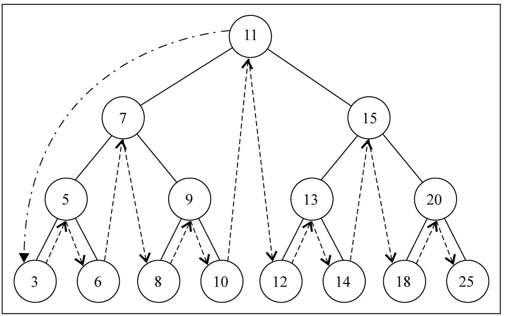
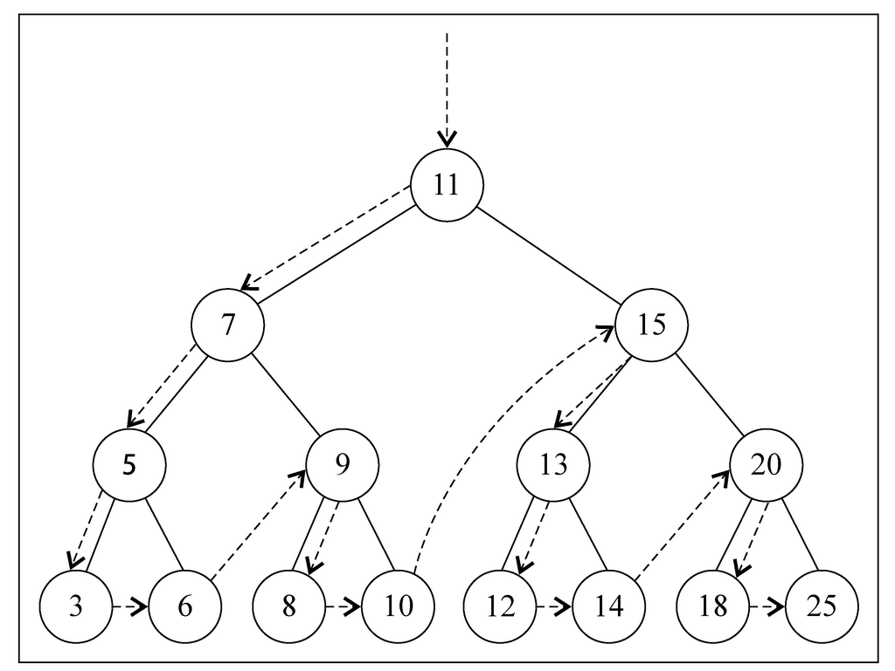
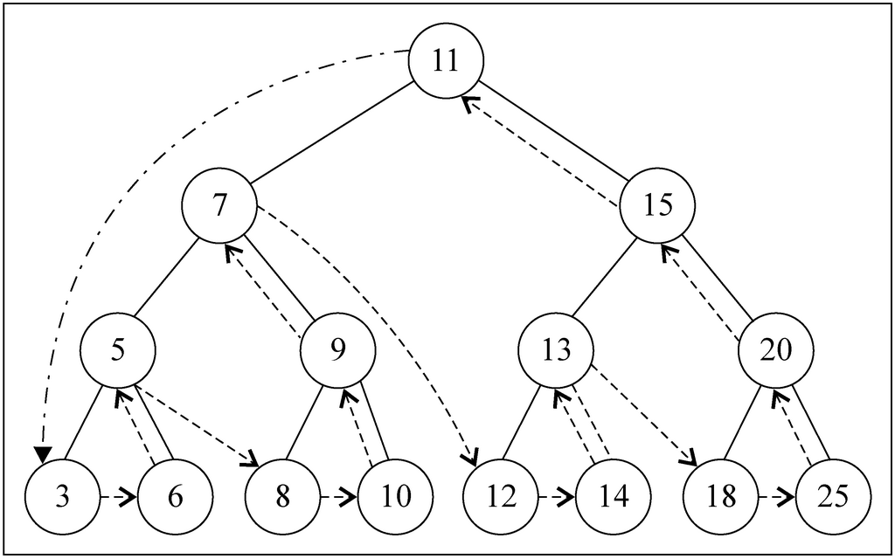

# Tree


## BST 遍历思路

### 中序遍历（In Order）
```js
function inOrderTraverseNode(node, callback) {
    if (node !== null) {
        inOrderTraverseNode(node.left, callback); // 遍历左子树，先一路递归到左子树最小的一个节点
        callback(node.key);
        inOrderTraverseNode(node.right, callback); // 遍历右子树，先一路递归到右子树最小的一个节点
    }
}
```



### 先序遍历（Pre Order）
```js
function preOrderTraverseNode(node, callback) {
    if (node !== null) {
        callback(node.key);
        preOrderTraverseNode(node.left, callback);
        preOrderTraverseNode(node.right, callback);
    }
}
```
 


### 后序遍历（Post Order）
1. 后序遍历的一种应用是计算一个目录和它的子目录中所有文件所占空间的大小。
```js
function postOrderTraverseNode(node, callback) {
    if (node !== null) {
        postOrderTraverseNode(node.left, callback);
        postOrderTraverseNode(node.right, callback);
        callback(node.key);
    }
}
```
    


## 关系

1. 对于一个二叉树，每一层的最大节点数都是 $2^n$，其中 $n$ 等于 0, 1, 2...
2. 第 $n$ 层的最大节点数是 $2^n$，又根据等比数列求和公式，第 $0$ 层到第 $n-1$ 层所有的节点数是 $2^n - 1$。因此，一个完全层的节点正好比它上面所有层的节点多一个。神奇！
3. 由下图可以看出来，如果按照图中的编号，那么每一层的最左边节点的序号正是 $2^n$。因为一个完全层的节点数是 $2^n$，而它上面所有的节点的数量是 $2^n - 1$，所以该完全层的第一个节点的序号就是 $2^n$。
    
4. 既然上层的第一个节点序号是下层第一个节点的一半，也就是说上层第一个节点的序号是其左侧子节点的一半，那么上层第二个节点的需要也是它的左侧子节点的一半。因为一个节点对应两个子节点，所以上层序号加一，下层对应的就要序号就要加二。进一步的可以说，对于一个完全二叉树，序号 $k$ 的节点的两个子节点的序号分别是 $2k$ 和 $2k+1$。
5. 第 $2^n$ 个元素是第 $n$ 层的第一个，第 $2^{n+1} - 1$ 个元素是第 $n$ 层的最后一个。所以，对于节点数量在 $[2^n, 2^{n+1})$ 区间内的完全二叉树来说，它的高度（不包括根节点所在层）是 $n$。
6. 基于上一条变换一下，对于一个 $N$ 个节点的完全二叉树，它的高度（不包括根节点所在层）是 $\left\lfloor\log N\right\rfloor$。理解起来有点绕。假设 $N$ 正好是某行的第一个节点，那显然这棵树的高度是 $log N$；而如果 $N$ 是在该行的其他位置，此时的 $N$ 就比行首的序号要大，但还达不到行首序号的两倍，因为两倍的话就是下一行的行首了，所以此时的 $log N$ 不是一个整数，向下取整就是当前的行高，向上取整就是下一行的行高。