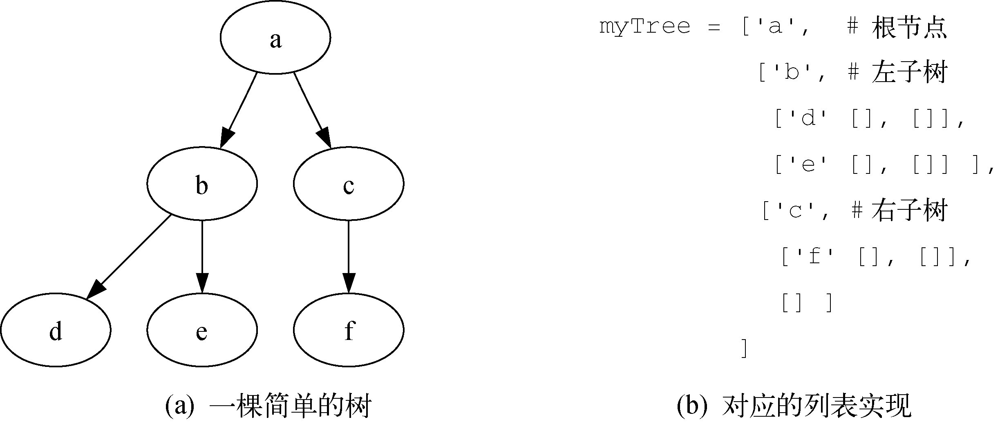
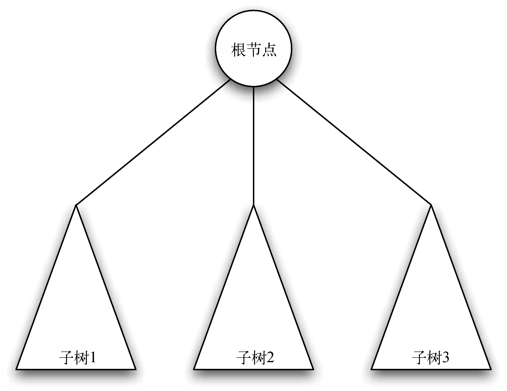
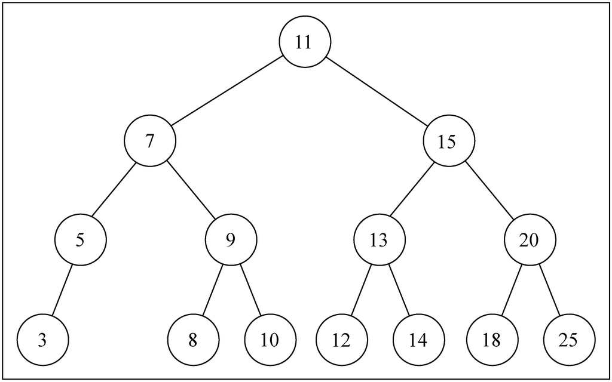

# Tree


<!-- TOC -->

- [Tree](#tree)
    - [思想](#思想)
    - [1. 示例](#1-示例)
    - [2. 树元素的定义](#2-树元素的定义)
    - [3. 树的定义](#3-树的定义)
        - [定义一：基于点和边的定义](#定义一基于点和边的定义)
        - [定义二：递归定义](#定义二递归定义)
    - [4. 根据递归定义实现二叉树](#4-根据递归定义实现二叉树)
    - [5. 解析树](#5-解析树)
        - [解析规则](#解析规则)
            - [如果当前标记是 `(`](#如果当前标记是-)
            - [如果当前标记在列表 `['+', '-', '/', '*']` 中](#如果当前标记在列表------中)
            - [如果当前标记是数字](#如果当前标记是数字)
            - [如果当前标记是 `)`](#如果当前标记是-)
        - [实现树解析器](#实现树解析器)
        - [对解析树求值](#对解析树求值)
    - [6. 二叉堆](#6-二叉堆)
        - [6.1 结构属性](#61-结构属性)
        - [6.2 有序性](#62-有序性)
        - [6.3 堆操作的实现](#63-堆操作的实现)
            - [6.3.1 添加新节点](#631-添加新节点)
            - [6.3.2 移除最小的顶节点](#632-移除最小的顶节点)
            - [6.3.3 根据元素列表构建整个堆](#633-根据元素列表构建整个堆)
    - [7. 二叉搜索树](#7-二叉搜索树)
        - [7.1 为什么要用二叉树做搜索](#71-为什么要用二叉树做搜索)
        - [实现](#实现)
            - [定义二叉树类和初始状态](#定义二叉树类和初始状态)
            - [定义节点类](#定义节点类)
            - [插入节点](#插入节点)
            - [搜索最小值和最大值](#搜索最小值和最大值)
            - [搜索一个特定的值](#搜索一个特定的值)
    - [树的遍历](#树的遍历)
        - [先序遍历（Pre Order）](#先序遍历pre-order)
        - [后序遍历（Post Order）](#后序遍历post-order)
        - [中序遍历（In Order）](#中序遍历in-order)
    - [关系](#关系)
        - [二叉树](#二叉树)
    - [References](#references)

<!-- /TOC -->


## 思想


## 1. 示例
1. 树是一种 **存储数据** 的结构，它存储 **树状结构** 的数据
2. 下面的这个树状结构里存储了动物类别的数据，数据的结构是树状的
    
3. 下面的这个树状结构里存储了网页节点的数据，数据的结构也是树状的
    


## 2. 树元素的定义
*  **节点**：也称为 “键”（key）
*  **边**：
    * 两个节点通过一条边相连，表示它们之间存在关系。
    * 除了根节点以外，其他每个节点都仅有一条入边，出边则可能有多条。 
    * 一种非树结构的边的情况
        
* **根节点**：树中唯一没有入边的节点。
* **子节点**：一个节点通过出边与子节点相连。
* **叶子节点**：叶子节点没有子节点。
* **父节点**：一个节点是其所有子节点的父节点。
* **兄弟节点**：具有同一父节点的节点互称为兄弟节点。
* **路径**：路径是由边连接的有序节点列表。比如，哺乳纲→食肉目→猫科→猫属→家猫 就是一条路径。
* **子树**：一个父节点及其所有后代的节点和边构成一棵子树。
* **层数**：节点 n 的层数是从根节点到 n 的唯一路径长度。根节点的层数是 0。
* **高度**：树的高度是其中节点层数的最大值。


## 3. 树的定义
### 定义一：基于点和边的定义
1. 树由节点及连接节点的边构成。
2. 树有以下属性：
    * 有一个根节点；
    * 除根节点外，其他每个节点都与其唯一的父节点相连；
    * 从根节点到其他每个节点都有且仅有一条路径；
    * 如果每个节点最多有两个子节点，我们就称这样的树为 **二叉树**。

### 定义二：递归定义
1. 一棵树要么为空，要么由一个根节点和零棵或多棵子树构成，子树本身也是一棵树。
    
    * 每个单独的节点都可以是一棵树
    * abc 可以是一棵树
    * abcdef 可以是一棵树
    * bde 可以是一棵树
    * cf 可以是一棵树
2. 每棵子树的根节点通过一条边连到父树的根节点。
3. 图示 
    
    从树的递归定义可知，图中的树至少有4个节点，因为三角形代表的子树必定有一个根节点。这棵树或许有更多的节点，但必须更深入地查看子树后才能确定。
    

## 4. 根据递归定义实现二叉树
```js
class BinaryTree {
    constructor ( rootKey ) {
        this.key = rootKey;
        this.leftChild = null;
        this.rightChild = null;
    }

    insertLeft ( newKey ) {
        if ( this.leftChild ) {
            let newTree = new BinaryTree( newKey );
            newTree.leftChild = this.leftChild;
            this.leftChild = newTree;
        }
        else {
            this.leftChild = new BinaryTree( newKey );
        }
    }

    insertRight ( newKey ) {
        if ( this.rightChild ) {
            let newTree = new BinaryTree( newKey );
            newTree.rightChild = this.rightChild;
            this.rightChild = newTree;
        }
        else {
            this.rightChild = new BinaryTree( newKey );
        }
    }

    getLeftChild () {
        return this.leftChild;
    }

    getRightChild () {
        return this.rightChild;
    }

    getRootKey () {
        return this.key;
    }

    setRootKey ( val ) {
        this.key = val;
    }
}


let root = new BinaryTree('a')
console.log( root.getRootKey() );                  // a
console.log( root.getLeftChild() );                // null

root.insertLeft('b')
console.log( root.getLeftChild().getRootKey() );   // b

root.insertRight('c')
console.log( root.getRightChild().getRootKey() );  // c

root.getRightChild().setRootKey('hello')
console.log( root.getRightChild().getRootKey() );  // hello

console.log( JSON.stringify(root, null, 4) );
// {
//     "key": "a",
//     "leftChild": {
//         "key": "b",
//         "leftChild": null,
//         "rightChild": null
//     },
//     "rightChild": {
//         "key": "hello",
//         "leftChild": null,
//         "rightChild": null
//     }
// }
```


## 5. 解析树
1. 将 $((7 + 3) * (5 - 2))$ 这样的数学表达式表示成解析树，如下图所示
    
2. 构建解析树的第一步是将表达式字符串拆分成标记列表。需要考虑 4 种标记：左括号、右括号、运算符和操作数。
3. 我们知道，左括号代表新表达式的起点，所以应该创建一棵对应该表达式的新树。反之，遇到右括号则意味着到达该表达式的终点。我们也知道，操作数既是叶子节点，也是其运算符的子节点。此外，每个运算符都有左右子节点。

### 解析规则
#### 如果当前标记是 `(`
1. 说明需要新建一个表达式，就为当前节点添加一个左子节点。
2. 并下沉至该子节点，该子节点可能是表达式的左操作数，也可能是一个表达式。

#### 如果当前标记在列表 `['+', '-', '/', '*']` 中
1. 说明刚才解析了当前表达式的左操作数，现在解析到了表达式的运算符，将当前节点的值设为当前标记对应的运算符。
2. 为当前节点添加一个右子节点，并下沉至该子节点。该子节点可能是表达式的右操作数，也可能是另一个表达式。

#### 如果当前标记是数字
1. 可能是左操作数也可能是右操作数。
2. 将当前节点的值设为这个数并返回至父节点的运算符。
3. 如果是左操作，返回父节点后等待解析之后的运算符；如果是右操作数，返回父节点后等待之后的 `)`。

#### 如果当前标记是 `)`
1. 说明当前表达式已经计算完成，需要返回到上一层的表达式；或者整个表达式都计算完成了。
2. 跳到当前节点的父节点。如果没有父节点，则说明解析完成。

### 实现树解析器
```js
function buildParseTree ( exp ) {
    const operatorList = ['+', '-', '*', '/'];
    
    let tokenList = exp.split('');
    let parentNodeStack = [];

    let parseTree = new BinaryTree('');
    parentNodeStack.push( parseTree );

    let currTree = parseTree;

    tokenList.forEach( (token) => {
        if ( token === '(' ) {
            currTree.insertLeft('');
            parentNodeStack.push( currTree );
            currTree = currTree.getLeftChild();
        }
        else if ( isNumStr(token) ) {
            currTree.setRootKey( Number.parseFloat(token) );
            currTree = parentNodeStack.pop();
        }
        else if ( operatorList.includes(token) ) {
            currTree.setRootKey(token);
            currTree.insertRight('');
            parentNodeStack.push(currTree);
            currTree = currTree.getRightChild();
        }
        else if ( token === ')' ) {
            currTree = parentNodeStack.pop();
        }
        else {
            throw new SyntaxError("Unknown Operator: " + token);
        }
    });

    return parseTree;
}

function isNumStr ( str ) {
    let f = Number.parseFloat(str);
    return !Number.isNaN(f);
}


let exp = '((7+3)*(5-2))';
let parseTree = buildParseTree(exp);
console.log( JSON.stringify(parseTree, null, 4) );
// {
//     "key": "*",
//     "leftChild": {
//         "key": "+",
//         "leftChild": {
//             "key": 7,
//             "leftChild": null,
//             "rightChild": null
//         },
//         "rightChild": {
//             "key": 3,
//             "leftChild": null,
//             "rightChild": null
//         }
//     },
//     "rightChild": {
//         "key": "-",
//         "leftChild": {
//             "key": 5,
//             "leftChild": null,
//             "rightChild": null
//         },
//         "rightChild": {
//             "key": 2,
//             "leftChild": null,
//             "rightChild": null
//         }
//     }
// }
```

### 对解析树求值
1. 整棵树就是一个表达式，可以说是根表达式。
2. 它有一个操作符和两个操作数，这两个操作数可能是真的数字，也有可能是子表达式。
3. 我们要对这个根表达式求值，就要对它的两个操作数求值。如果操作数是数字就直接返回，如果是表达式就要按照同样的规则求值。
4. 基于同样规则得出的前提，使用这些前提再应用相同的规则，这就是递归的思路。
5. 所以，如果一个节点不是叶节点，那肯定就是操作符所在的节点。这时就要用操作符和它的两个子节点进行计算。
6. 计算的时候，需要先递归的对它的两个子节点求值
    ```js
    function evaluate (parseTree) {
        let leftChild = parseTree.getLeftChild();
        let rightChild = parseTree.getRightChild();

        if ( leftChild && rightChild ) {
            let operator = parseTree.getRootKey();
            return genCalcFn(operator)( evaluate(leftChild), evaluate(rightChild) );
        }
        else {
            return parseTree.getRootKey();
        }
    }

    function genCalcFn (operator) {
        switch (operator) {
            case '+': return (m, n) => m + n;
            case '-': return (m, n) => m - n;
            case '*': return (m, n) => m * n;
            case '/': return (m, n) => m / n;
        }
    }


    console.log( evaluate (parseTree) ); // 30
    ```


## 6. 二叉堆
1. 二叉堆的入队操作和出队操作均可达到 $O(\log n)$。
2. 二叉堆画出来很像一棵树，但实现时只用一个列表作为内部表示。
3. 二叉堆有两个常见的形式：**最小堆**（最小的元素一直在队首）与 **最大堆**（最大的元素一直在队首）。

### 6.1 结构属性
1. 为了使二叉堆能高效地工作，我们利用树的对数性质来表示它。为了保证对数性能，必须维持树的平衡。
2. 平衡的二叉树是指，其根节点的左右子树含有数量大致相等的节点。
3. 在完全平衡的二叉树中，左右子树的节点数相同。最坏情况下，插入节点操作的时间复杂度是 $O(\log_2n)$，其中 $n$ 是树的节点数。
4. 在实现二叉堆时，我们通过创建一棵 **完全二叉树** 来维持树的平衡。在完全二叉树中，除了最底层，其他每一层的节点都是满的。在最底层，我们从左往右填充节点。
5. 完全二叉树的另一个有趣之处在于，可以用一个列表来表示它。由于树是完全的，任何一行完整的节点数都是前一行节点的 2 倍（$2^n$ 关系）。因为第 $n$ 行的节点数是 $2^{n-1}$。
6. 另外，根据等比数列求和公式 $\frac{a_1(1-q^n)}{1-q}$ 可得：
    * 前 n 行的节点总数为 $\frac{1*(1-2^n)}{1-2} = 2^n - 1$；
    * 第 n+1 行的节点数是 $2^n$
7. 也就是说：$某一行完整的节点数=它上面所有节点数+1$。
8. 因此，对于在列表中处于位置 $p$ 的节点来说，它的左子节点正好处于位置 $2p$；同理，右子节点处于位置 $2p+1$
    
9. 对第 8 点的证明：
    1. 已知第 $n$ 行的第 $k$ 个元素的总序号是 $p$
    2. 根据上面第 6 条，可以得出来 $p = 2^{n-1} - 1 + k$
    2. 同样根据第 6 条，可以得出第 $n$ 行最后一个节点的总序号是 $2^n - 1$
    4. 因此第 $n+1$ 行的第 1 组两个节点的总序号是 $2^n$ 和 $2^n + 1$
    5. 第 $n+1$ 的第 2 组两个节点的总序号是 $2^n + 2$ 和 $2^n + 3$
    6. 因此第 $n+1$ 的第 $k$ 组两个节点的总序号是 $2^n + 2k-2$ 和 $2^n + 2k-1$，变形为 $2(2^{n-1} + k - 1)$ 和 $2(2^{n-1} + k - 1) + 1$
    7. 根据第 2 步，可以得出 $2p$ 和 $2p+1$

### 6.2 有序性
对于堆中任意元素 $x$ 及其父元素 $p$，$p$ 都不大于 $x$。

### 6.3 堆操作的实现
```js
class BinaryHeap {
    constructor () {
        this.arr = [null];
    }

    swap( index1, index2 ) {
        let aux = this.arr[index1];
        this.arr[index1] = this.arr[index2];
        this.arr[index2] = aux;
    }

    less ( index1, index2 ) {
        return this.arr[index1] < this.arr[index2];
    }

    get size () {
        return this.arr.length - 1; 
    }

    swim ( k ) {
        while ( k > 1 && this.less(k, Math.floor(k/2)) ) {
            let parentIndex = Math.floor(k/2);
            this.swap( parentIndex , k );
            k = parentIndex;
        }
    }

    sink ( k ) {
        let size = this.size;
        while ( 2*k <= size ) { // 有左侧子节点
            let left = 2*k;  // 左侧子节点
            let right = 2*k + 1;  // 右侧子节点

            // 确定哪个子节点更小
            let less = left; 
            // 右侧子节点存在且更小
            if ( right <= size && this.less( right, left ) ) {
                less = right;
            }

            // 如果更小的子节点不小于当前节点则不用交换，说明当前节点是三者中至少并列最小的
            if ( !this.less(less, k) ) {
                break;
            }

            this.swap( k, less );

            k = less;
        }
    }

    insert ( v ) {
        this.arr.push( v );
        this.swim( this.size );
    }

    delMin () {
        let minNode = this.arr[1];
        let size = this.size;
        this.swap( 1, size ); 
        this.arr.length = size; // 删除交换下来的最小节点
        this.sink(1);
        return minNode;
    }
}
```

#### 6.3.1 添加新节点
1. 先将元素追加到列表的末尾，然后再通过大小比较把它移动到合适的位置
    
2. `insert` 方法先把新的节点添加到尾部，然后再使用 `swim` 方法把它移动到合适的位置
    ```js    
    insert ( v ) {
        this.arr.push( v );
        this.swim( this.size );
    }

    swim ( k ) {
        // 当前节点只要还有父节点且父节点大于当前节点，就进行交换
        while ( k > 1 && this.less(k, Math.floor(k/2)) ) {
            let parentIndex = Math.floor(k/2);
            this.swap( parentIndex , k );
            k = parentIndex;
        }
    }
    ```

#### 6.3.2 移除最小的顶节点
1. 把最后一个节点移到顶节点，然后再通过大小比较把它移动到合适的位置
    
2. `delMin` 先把最后一个节点移动到顶部，然后再使用 `sink` 方法把它移动到合适的位置。`sink` 中会进行父节点和其最小子节点的交换
    ```js
    delMin () {
        let minNode = this.arr[1];
        let size = this.size;
        this.swap( 1, size ); 
        this.arr.length = size; // 删除交换下来的最小节点
        this.sink(1);
        return minNode;
    }

    sink ( k ) {
        let size = this.size;
        while ( 2*k <= size ) { // 有左侧子节点
            let left = 2*k;  // 左侧子节点
            let right = 2*k + 1;  // 右侧子节点

            // 确定哪个子节点更小
            let less = left; 
            // 右侧子节点存在且更小
            if ( right <= size && this.less( right, left ) ) {
                less = right;
            }

            // 如果更小的子节点不小于当前节点则不用交换，说明当前节点是三者中至少并列最小的
            if ( !this.less(less, k) ) {
                break;
            }

            this.swap( k, less );

            k = less;
        }
    }
    ```

#### 6.3.3 根据元素列表构建整个堆
TODO
1. 先按照列表顺序构建堆，然后再进行排序
    
2. 注意到，排序是从中间元素开始向根的方向依次 sink。
    ```py
    def buildHeap(self, alist):
        idx = len(alist) // 2
        self.size = len(alist)
        self.list = [0] + alist[:]
        while (idx > 0):
            self.sink(idx)
            idx = idx - 1
    ```
3. 之所以是从中间元素开始，是因为在完全二叉树中，超过中点的节点都是叶子节点，不存在父节点。而 sink 都是对父节点的操作，所以就不需要对中间元素之后的节点进行。
4. 为什么 `idx` 是从中间值到根节点，而不是从根节点到中间值？


## 7. 二叉搜索树
1. 二叉树中的节点最多只能有两个子节点：一个是左侧子节点，另一个是右侧子节点。这些定义有助于我们写出更高效的向/从树中插入、查找和删除节点的算法。
2. **二叉搜索树**（BST）是二叉树的一种，但是它只允许你在左侧节点存储（比父节点）小的值，在右侧节点存储（比父节点）大（或者等于）的值
    

### 7.1 为什么要用二叉树做搜索
1. 链表查找复杂度是 $O(N)$，插入复杂度是 $O(1)$。数组的查找复杂度是 $O(1)$，但插入的复杂度是 $O(N)$。
2. 所以，我们折中使用排序二叉树，它的查找和插入的复杂度都是 $O(logN)$。
3. 在完全平衡的二叉树中，最坏情况的时间复杂度是 $\log_2n$

### 实现
#### 定义二叉树类和初始状态
`root` 属性引用根节点，如果为 `null` 表示当前为空树
```js
class BinarySearchTree {

    constructor(){
        this.root = null;
    }

}
```

#### 定义节点类
树中的任意一个节点都会保存当前节点的值，除此以外还会有两个指针，指向它的左侧子节点和右侧子节点。
```js
class Node(key) {
    constructor (key) {
        this.key = key;
        this.left = null;
        this.right = null;
    }
}
```

#### 插入节点
1. 第一步是创建用来表示新节点的 `Node` 类实例。
2. 第二步要验证这个插入操作是否为一种特殊情况，也就是要插入的节点是树的第一个节点。如果是，就将根节点指向新节点；如果不是，就要把它插入到合适的位置
    ```js
    insert (key) {
        let newNode = new Node(key);

        if ( this.root === null ) {
            this.root = newNode;
        } 
        else {
            insertNode(this.root, newNode);
        }
    }
    ```
3. 使用辅助函数 `insertNode` 将它插入到合适的位置
    ```js
    function insertNode(node, newNode) {
        if ( newNode.key < node.key ) { // 如果新节点的键小于当前节点的键，
            // 那么需要检查当前节点的左侧子节点
            if ( node.left === null ) { // 如果它没有左侧子节点，就在那里插入新的节点
                node.left = newNode;
            } 
            else {
                // 如果有左侧子节点，需要通过递归调用 insertNode 方法继续找到树的下一层
                insertNode( node.left, newNode );
            }
        } 
        else { // 如果新节点的键大于等于当前节点的键
            if ( node.right === null ) { // 当前节点没有右侧子节点则直接作为右侧子节点
                node.right = newNode;
            } 
            else { // 有的话继续递归查找合适位置
                insertNode( node.right, newNode );
            }
        }
    }
    ```

#### 搜索最小值和最大值
1. 根据二叉搜索树的规则，递归的查找到最后一个左侧子节点就是最小值，递归的查找到最后一个右侧子节点就是最大值。
2. 下面的 `min` 作为对象方法暴露，传递根节点作为起始搜素节点。内部通过实际的搜索函数 `minNode` 的进行搜索
    ```js
    min () {
        return minNode(this.root);
    }

    function minNode (node) {
        if (node) {
            while (node && node.left !== null) {
                node = node.left;               
            }
            return node.key;
        }
        return null;
    }
    ```
3. 最大值搜索也是类似的实现
    ```js
    max () {
        return maxNode(this.root);
    }

    function maxNode (node) {
        if (node) {
            while (node && node.right !== null) {
                node = node.right;
            }
            return node.key;
        }
        return null;
    }
    ```

#### 搜索一个特定的值
1. 类似于二分搜索的逻辑。
2. 下面的 `search` 作为对象方法暴露，传递根节点作为起始搜素节点。内部通过实际的搜索函数 `searchNode` 的进行搜索
    ```js
    search (key) {
        return searchNode(this.root, key);
    }

    function searchNode(node, key, parent = null) {
        if (node === null) {
            return null;
        }

        if (node.key > key) {
            return searchNode(node.left, key, node);
        } 
        else if (node.key < key) {
            return searchNode(node.right, key, node);
        } 
        else {
            return {node, parent};
        }
    }
    ```
3. `parent` 参数可以用来标记节点在树中的位置。通过递归查询，可以找出从根节点到目标节点的路径。


## 树的遍历
### 先序遍历（Pre Order）
1. 先访问根节点，然后递归地前序遍历左子树，最后递归地前序遍历右子树。
2. 从因果关系上来说，先序遍历的场景是，一个节点要先完成某些操作，它的子节点才能进行对应的操作。
3. 下图描绘了 `preOrderTraverseNode` 方法的访问路径：
     
    `callback` 所调用的节点依次为：11 7 5 3 6 9 8 10 15 13 12 14 20 18 25
4. 实现
    ```js
    function preOrderTraverseNode(node, callback) {
        if (node !== null) {
            callback(node.key);
            preOrderTraverseNode(node.left, callback);
            preOrderTraverseNode(node.right, callback);
        }
    }
    ```

### 后序遍历（Post Order）
1. 后序遍历则是先访问节点的后代节点，再访问节点本身。上面讲到的解析树就应用了后序遍历。
2. 从因果关系上来说，后序遍历的场景是，一个节点的结果需要依赖它后代节点（后代很可能是子树）的结果，所以要先遍历访问它的后代再操作当前节点。
层层追溯原因
3. 下图描绘了 `postOrderTraverse` 方法的访问路径：
      
    `callback` 所调用的节点依次为：3 6 5 8 10 9 7 12 14 13 18 25 20 15 11
4. 实现
    ```js
    function postOrderTraverseNode(node, callback) {
        if (node !== null) {
            postOrderTraverseNode(node.left, callback);
            postOrderTraverseNode(node.right, callback);
            callback(node.key);
        }
    }
    ```

### 中序遍历（In Order）
1. 先递归地中序遍历左子树，然后访问根节点，最后递归地中序遍历右子树。
2. 前两种遍历的因果关系，要么是先完成父节点才能完成子节点，要么是先完成所有的子节点才能完成父节点。而中序遍历是先完成左侧子节点，然后再完成父节点，最后完成右侧子节点。
3. 可以想到，这种是一种形式的中序遍历。也可能是先右侧子节点的，或者在两个以上子节点是还有其他的方式。
4. 下图描绘了 `inOrderTraverseNode` 方法的访问路径：
    
    `callback` 所调用的节点依次为：3 5 6 7 8 9 10 11 12 13 14 15 18 20 25
5. 实现
    ```js
    function inOrderTraverseNode(node, callback) {
        if (node !== null) {
            inOrderTraverseNode(node.left, callback); // 遍历左子树，先一路递归到左子树最小的一个节点
            callback(node.key);
            inOrderTraverseNode(node.right, callback); // 遍历右子树，先一路递归到右子树最小的一个节点
        }
    }
    ```


  


## 关系
### 二叉树
1. 对于一个二叉树，每一层的最大节点数都是 $2^n$，其中 $n$ 等于 0, 1, 2...
2. 第 $n$ 层的最大节点数是 $2^n$，又根据等比数列求和公式，第 $0$ 层到第 $n-1$ 层所有的节点数是 $2^n - 1$。因此，一个完全层的节点正好比它上面所有层的节点多一个。神奇！
3. 由下图可以看出来，如果按照图中的编号，那么每一层的最左边节点的序号正是 $2^n$。因为一个完全层的节点数是 $2^n$，而它上面所有的节点的数量是 $2^n - 1$，所以该完全层的第一个节点的序号就是 $2^n$。
    
4. 既然上层的第一个节点序号是下层第一个节点的一半，也就是说上层第一个节点的序号是其左侧子节点的一半，那么上层第二个节点的需要也是它的左侧子节点的一半。因为一个节点对应两个子节点，所以上层序号加一，下层对应的就要序号就要加二。进一步的可以说，对于一个完全二叉树，序号 $k$ 的节点的两个子节点的序号分别是 $2k$ 和 $2k+1$。
5. 第 $2^n$ 个元素是第 $n$ 层的第一个，第 $2^{n+1} - 1$ 个元素是第 $n$ 层的最后一个。所以，对于节点数量在 $[2^n, 2^{n+1})$ 区间内的完全二叉树来说，它的高度（不包括根节点所在层）是 $n$。
6. 基于上一条变换一下，对于一个 $N$ 个节点的完全二叉树，它的高度（不包括根节点所在层）是 $\left\lfloor\log N\right\rfloor$。理解起来有点绕。假设 $N$ 正好是某行的第一个节点，那显然这棵树的高度是 $log N$；而如果 $N$ 是在该行的其他位置，此时的 $N$ 就比行首的序号要大，但还达不到行首序号的两倍，因为两倍的话就是下一行的行首了，所以此时的 $log N$ 不是一个整数，向下取整就是当前的行高，向上取整就是下一行的行高。


## References
* [《Python数据结构与算法分析（第2版）》](https://book.douban.com/subject/34785178/)
