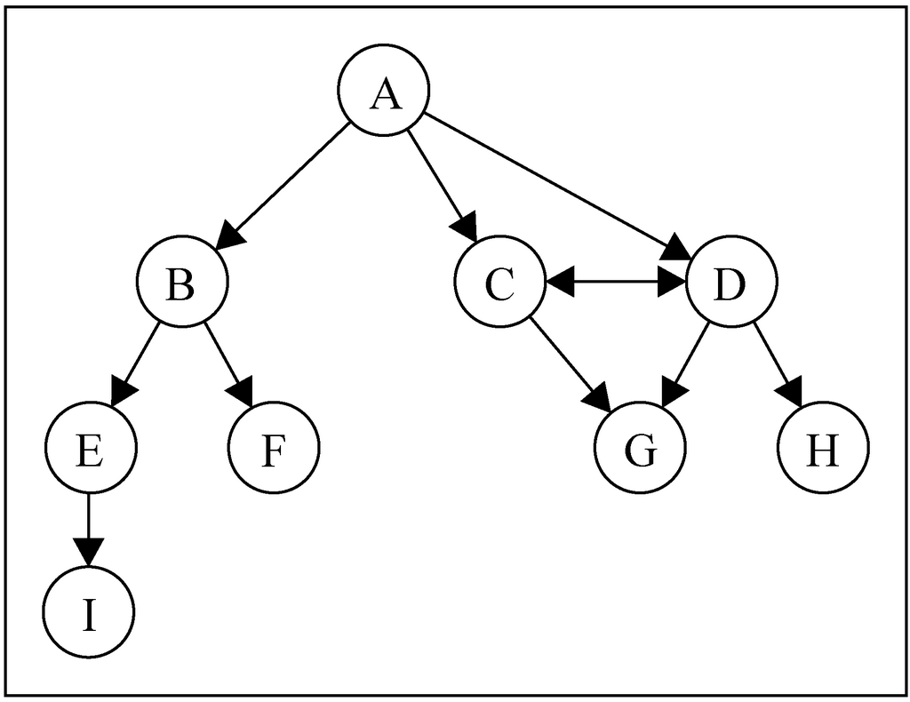
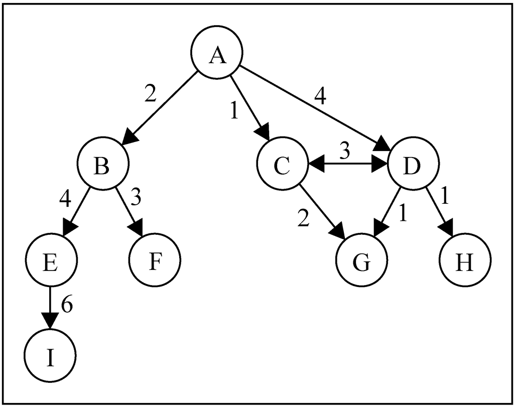
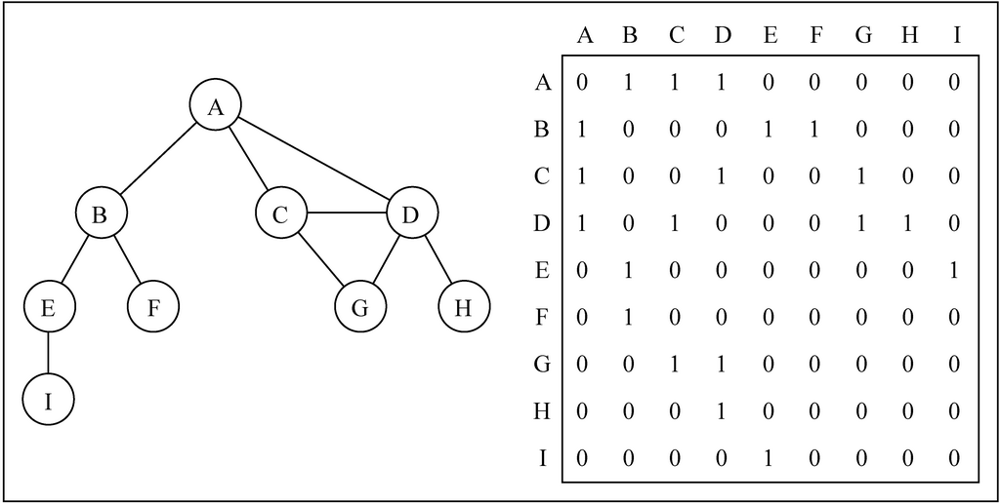
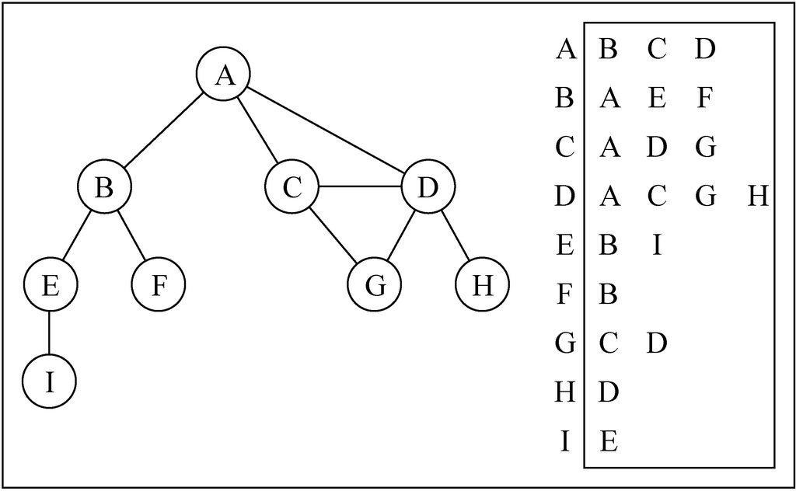
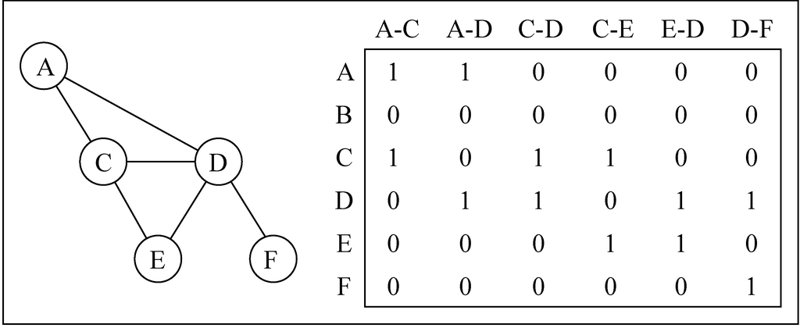
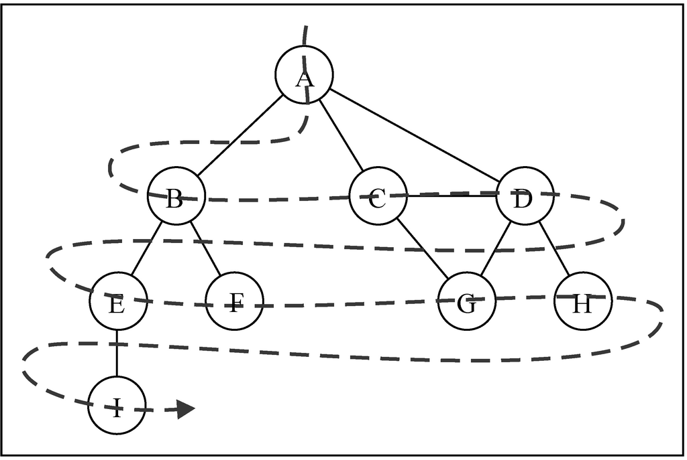
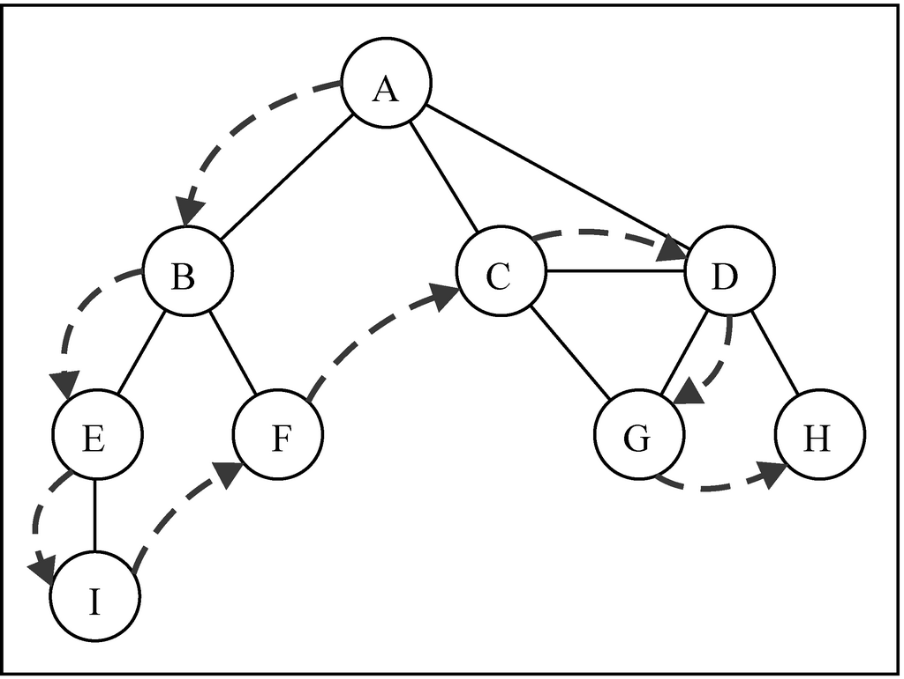
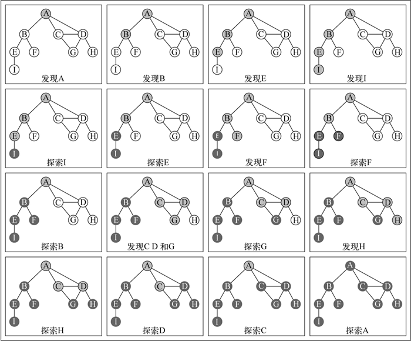
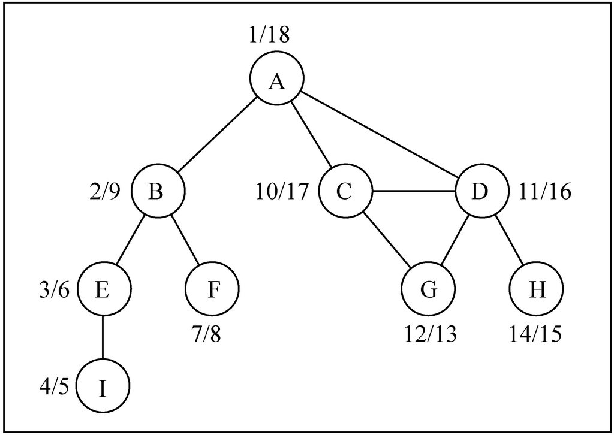
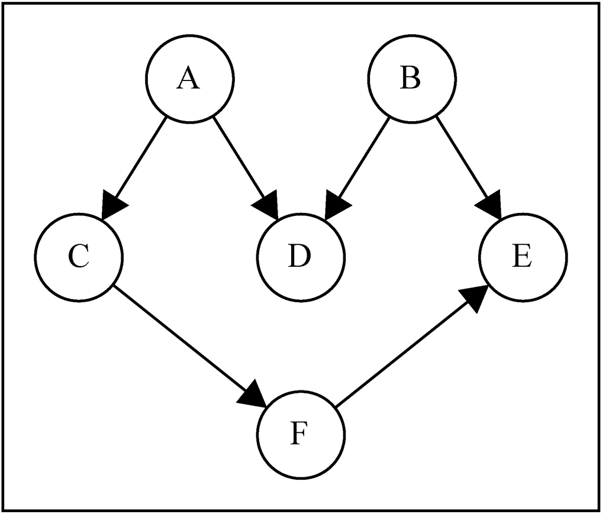

# Graph


<!-- TOC -->

- [Graph](#graph)
    - [思想](#思想)
        - [本质——基于现实关系的抽象](#本质基于现实关系的抽象)
        - [图的用途](#图的用途)
            - [广度优先遍历](#广度优先遍历)
    - [概念](#概念)
        - [路径和环](#路径和环)
        - [连通性](#连通性)
        - [有向图和无向图](#有向图和无向图)
        - [加权性](#加权性)
    - [图的表示](#图的表示)
        - [邻接矩阵](#邻接矩阵)
        - [邻接表](#邻接表)
        - [关联矩阵](#关联矩阵)
    - [使用邻接表创建图](#使用邻接表创建图)
    - [图的遍历综述](#图的遍历综述)
        - [遍历的关键逻辑](#遍历的关键逻辑)
        - [不规则的遍历](#不规则的遍历)
    - [广度优先搜索](#广度优先搜索)
        - [原理和本质](#原理和本质)
            - [广度优先——强调先完成一层再处理下一层](#广度优先强调先完成一层再处理下一层)
            - [层次次序感——按层顺序向外扩散，强调距离起点的远近亲疏](#层次次序感按层顺序向外扩散强调距离起点的远近亲疏)
        - [设计思想和用途](#设计思想和用途)
            - [逐层探索](#逐层探索)
            - [获得层级距离关系](#获得层级距离关系)
        - [逻辑顺序](#逻辑顺序)
            - [关键点](#关键点)
        - [实现](#实现)
    - [使用 BFS 寻找最短路径](#使用-bfs-寻找最短路径)
    - [深度优先遍历](#深度优先遍历)
        - [原理和本质](#原理和本质-1)
            - [先后顺序](#先后顺序)
            - [不撞南墙不回头](#不撞南墙不回头)
        - [设计思想和用途](#设计思想和用途-1)
            - [逐层探索](#逐层探索-1)
            - [获得层级距离关系](#获得层级距离关系-1)
        - [遍历思想](#遍历思想)
        - [关键词](#关键词)
            - [先递归到底](#先递归到底)
            - [子节点优先完成](#子节点优先完成)
        - [实现](#实现-1)
        - [记录更多信息的深度遍历](#记录更多信息的深度遍历)
        - [拓扑排序](#拓扑排序)

<!-- /TOC -->


## 思想
### 本质——基于现实关系的抽象
1. 多个对象之间的关系。
2. 任何表示若干对象关系的逻辑都可以抽象成图的数据结构。
3. 或者说，任何现实事物都可以抽象成任何数据结构模型，就看合适程度。


### 图的用途
1. 首先，图就是对现实世界抽象的一种数据结构，它本身只是现实世界的模型。
2. 可以说图本身是并没有什么用的，就看你要用这个数据结构来做什么。甚至更进一步说，对图的遍历操作，也仅仅是一种没有实际意义的操作，但它却是对实际的用途提供了一种重要的方法。

#### 广度优先遍历


## 概念


### 路径和环
1. **简单路径** 要求不包含重复的节点。A D G 是一条简单路径。
2. A D C A 是一个 **环**。如果图中不存在环，则称该图是 **无环** 的。

### 连通性
如果图中每两个节点间都存在路径，则该图是 **连通的**。

### 有向图和无向图
1. 图可以是 **无向的**（边没有方向）或是 **有向的**（有向图）。如上图所示，有向图的边有一个方向。
2. 如果图中每两个节点间在双向上都存在路径，则该图是 **强连通的**。例如，C 和 D 是强连通的，而 A 和 B 不是强连通的。

### 加权性
图还可以是 **未加权的** 或是 **加权的**。如下图所示，加权图的边被赋予了权值：



## 图的表示
### 邻接矩阵
1. 我们用一个二维数组来表示节点之间的连接。如果索引为 `i` 的节点和索引为 `j` 的节点相邻，则 `array[i][j] === 1`，否则 `array[i][j] === 0`
    
2. 不是强连通的图（稀疏图）如果用邻接矩阵来表示，则矩阵中将会有很多 0，这意味着我们浪费了计算机存储空间来表示根本不存在的边。例如，找给定节点的相邻节点，即使该节点只有一个相邻节点，我们也不得不迭代一整行。
3. 邻接矩阵表示法不够好的另一个理由是，图中节点的数量可能会改变，而 2 维数组不太灵活。

### 邻接表
1. 我们也可以使用一种叫作邻接表的动态数据结构来表示图。邻接表由图中每个节点的相邻节点列表所组成。
2. 存在好几种方式来表示这种数据结构。我们可以用列表（数组）、链表，甚至是散列表或是字典来表示相邻节点列表。
    
3. 尽管邻接表可能对大多数问题来说都是更好的选择，但以上两种表示法都很有用，且它们有着不同的性质（例如，要找出节点 v 和 w 是否相邻，使用邻接矩阵会比较快）。

### 关联矩阵
1. 我们还可以用关联矩阵来表示图。在关联矩阵中，矩阵的行表示节点，列表示边。如下图所示，我们使用二维数组来表示两者之间的连通性
    
2. 关联矩阵通常用于边的数量比节点多的情况下，以节省空间和内存。不懂为什么


## 使用邻接表创建图
1. 整体分两步：
    1. 创建节点
    2. 创建连接节点之间的边
2. 先初始化
    ```js
    constructor(isDirected=false) {
        this.vertices = []; // 所有的节点
        this.adjacencyList = new Dictionary(); // 使用字典来表示邻接表
        this.isDirected = isDirected; // 是否为有向图
    }
    ```
3. 添加节点
    ```js
    addVertex (v) {
        this.vertices.push(v);
        // 在邻接表中为新添加的节点建一个列表，用来保存与它相连接的节点
        this.adjacencyList.set(v, []);
    }
    ```
4. 添加边
    ```js
    addEdge (v, w) {
        this.adjacencyList.get(v).push(w); // 给节点 v 添加一个与它相邻的节点 w
        // 如果是有向图，那只是从 v 到 w 单方向的边；如果不是，就要双向添加
        if (!this.isDirected) {
            this.adjacencyList.get(w).push(v);
        }
    }
    ```
5. 创建一个打印的函数来查看邻接表
    ```js
    toString () {
        let str = '';
        this.vertices.forEach(vertex=>{
            str += vertex + ': ';
            let neighbors = this.adjacencyList.get(vertex);
            neighbors.forEach(neighbor=>{
                str += neighbor + ' ';
            });
            str += '\n';
        });
        return str;
    }
    ```
6. 测试
    ```js
    let graph = new Graph();
    let vertices = ['A','B','C','D','E','F','G','H','I'];

    vertices.forEach(vertex=>{
        graph.addVertex(vertex);
    });

    graph.addEdge('A', 'B');
    graph.addEdge('A', 'C');
    graph.addEdge('A', 'D');
    graph.addEdge('B', 'E');
    graph.addEdge('B', 'F');
    graph.addEdge('C', 'D');
    graph.addEdge('C', 'G');
    graph.addEdge('D', 'G');
    graph.addEdge('D', 'H');
    graph.addEdge('E', 'I');


    console.log(graph.toString());
    // A: B C D
    // B: A E F
    // C: A D G
    // D: A C G H
    // E: B I
    // F: B
    // G: C D
    // H: D
    // I: E
    ```


## 图的遍历综述
1. 和树数据结构类似，我们可以访问图的所有节点。
2. 有两种算法可以对图进行遍历：广度优先搜索（Breadth-First Search，BFS）和深度优先搜索（Depth-First Search，DFS）。
3. 图遍历可以用来寻找特定的节点或寻找两个节点之间的路径，检查图是否连通，检查图是否含有环等。

### 遍历的关键逻辑
TODO 为什么要三种颜色，两种行不行？

### 不规则的遍历
考虑传染病，如果把人作为节点，第一个患者作为起点，把传播过程作为遍历，显然这个遍历过程既不是广度优先也不是深度优先。


## 广度优先搜索


### 原理和本质
#### 广度优先——强调先完成一层再处理下一层
1. 每次探索一个节点，都要先找到它的所有相邻节点，才会再探索其中每一个相邻节点。
2. 先优先探索完一个节点，再探索它的相邻节点。探索完它的所有相邻节点后，再探索这些相邻节点的相邻节点。

#### 层次次序感——按层顺序向外扩散，强调距离起点的远近亲疏
1. 在一个关系网中，是可以用层次关系来表示的。例如：我的朋友——我的朋友的朋友——我的朋友的朋友的朋友，广度优先就是按照这种层次关系来遍历的，因此可以很好的反应出整个关系网中的每个节点和起始节点的层次关系。
2. 又因为这种从起点逐层向外扩展的遍历方式，所以也很方便确定起始点距离任何节点的层级距离。

### 设计思想和用途
#### 逐层探索
希望完全探索完一层再进入下一层

#### 获得层级距离关系
1. 根据层次的多少来获得两个对象的层级距离。
2. 正是这种逐层且具有层级距离关系的特点，所以广度优先可以计算关系网中两个点的最短距离。

### 逻辑顺序
1. 选中图中的一个节点作为遍历的起点，记为 V。
2. 访问并记录 V 的所有相邻点。完成了从起点开始向外辐射的第一层节点遍历。
3. 之所以在访问的同时还要记录，是因为下一步还要访问与这些节点相邻的新的节点。
4. 再从第一层的节点开始，访问并记录每一个节点的相邻节点。注意这一次寻找相邻节点时，要排除 V。虽然第一层的节点都和 V 相连，但 V 已经访问过了。
5. 经过上一步的遍历记录，我们获得了第二层的节点。下一步就是访问并记录第二层中每一个节点的相邻节点。同样，这一波在访问相邻节点时，要排除已经访问过的第一层节点。
6. 以此类推，直到我们记录的节点都已经访问过了。

#### 关键点
1. 先访问完一层的所有节点，才能访问靠外的一层。在你没访问完第一层的所有节点时，不能访问第二层的节点。
2. 但是，访问第一层的时候，却需要记录与它相邻的第二层节点。把它们加入到队列中，等待第一层节点访问完之后再被访问。

### 实现
```js
bfs (v, callback) {
    let colors = initializeColor(this.vertices);
    let queue = new Queue();
    queue.enqueue(v); // 遍历起始节点
    
    // 遍历每一个节点
    while (!queue.isEmpty()) {
        let u = queue.dequeue();
        let neighbors = this.adjacencyList.get(u);
        colors[u] = 'grey'; // 该节点现在已经访问
        // 访问该节点的相邻节点
        for (let i = 0; i < neighbors.length; i++) {
            let n = neighbors[i];
            // 过滤掉已经访问过的相邻节点
            if (colors[n] === 'white') {
                colors[n] = 'grey';
                // 被访问的节点加入队列，之后会被探索
                queue.enqueue(n);
            }
        }
        colors[u] = 'black'; // 该节点的所有相邻节点都已经被访问，现在该节点就是被完全探索的状态
        if (callback) {
            callback(u);
        }
    }
}
```

## 使用 BFS 寻找最短路径
因为 BFS 是一层一层往外搜索，所以就可以确定任意一个节点相对于顶点来说是关系有几层，或者说要几步才能把顶点和某个节点连接起来。


## 深度优先遍历



### 原理和本质
#### 先后顺序
广度优先也是有顺序的，第一层不完成则不可能进到第二层，和深度优先的区别
1. 每次探索一个节点，都要先找到它的所有相邻节点，才会再探索其中每一个相邻节点。
2. 先优先探索完一个节点，再探索它的相邻节点。探索完它的所有相邻节点后，再探索这些相邻节点的相邻节点。

#### 不撞南墙不回头
1. 在一个关系网中，是可以用层次关系来表示的。例如：我的朋友——我的朋友的朋友——我的朋友的朋友的朋友，广度优先就是按照这种层次关系来遍历的，因此可以很好的反应出整个关系网中的每个节点和起始节点的层次关系。
2. 又因为这种从起点逐层向外扩展的遍历方式，所以也很方便确定起始点距离任何节点的层级距离。

### 设计思想和用途
#### 逐层探索
希望完全探索完一层再进入下一层

#### 获得层级距离关系
根据层次的多少来获得两个对象的层级距离

### 遍历思想
1. 相比于广度优先是从内到外的一层一层完成探索，深度优先是访问到一个节点时先不完成探索，而是先访问它的 “子节点”。
2. 只要有子节点，就优先递归访问子节点。最后再反向递归完成探索。
3. 广度优先保证了层状结构，而深度优先保证了子节点先于它的所有父节点完成探索。因为遍历到它的任何父节点时，父节点都会优先访问子节点，而不会自己先完成探索。


### 关键词
#### 先递归到底
先根据路线追查到底，再进行实际的工作

#### 子节点优先完成
1. 一个子节点完成探索前，它的父节点都不可能完成探索。
2. 反过来也可以说，如果一个节点的父节点完成了探索，则它的所有子节点也肯定已经完成了。


### 实现


1. 类的实例方法，遍历的入口
    ```js
    normalDFS (callback) {
        let colorMapping = initializeColorMapping(this.vertices);
        // 遍历每一个节点，如果某个节点还未被探索，则对它进行深度探索。
        // 但因为是递归遍历，所以从一个节点开始的第一轮 forEach 里面，就可能遍历了很多后代节点，
        // 所以其实之后轮的 forEach 很可能很多 vertex 都已经不是 white 了。
        // 如果从一个节点开始可以递归遍历完成所有的节点，那么 `if (colorMapping[vertex] === 'white')` 里面其实只会被执行一次。
        this.vertices.forEach((vertex)=>{
            if (colorMapping[vertex] === 'white') {
                exploreForNormalDFS(vertex, this.adjacencyList, colorMapping, callback);
            }
        });
    }
    ```
2. 用来递归的私有方法。里面的两个 `console.log` 可以直观的显示递归关系
    ```js
    let normalDFS_indent = 0;
    function exploreForNormalDFS (vertex, adjacencyList, colorMapping, callback) {
        colorMapping[vertex] = 'grey';
        
        callback && callback(vertex);

        console.log(' '.repeat(normalDFS_indent) + 'Discovered ' + vertex);
        normalDFS_indent += 4;

        let neighborList = adjacencyList.get(vertex);
        neighborList.forEach((neighbor) => {
            if (colorMapping[neighbor] === 'white') {
                exploreForNormalDFS(neighbor, adjacencyList, colorMapping, callback);
            }
        });
        colorMapping[vertex] = 'black';

        normalDFS_indent -= 4;
        console.log(' '.repeat(normalDFS_indent) + 'explored ' + vertex);
    }
    ```

### 记录更多信息的深度遍历
1. 通过 `discoveredTime` 记录每个节点的发现时间，通过 `exploredTime` 记录每个节点的探索完成时间；通过 `predecessors` 记录每个节点的前溯节点，从而可以构建出递归的顺序图
    
2. 类的实例方法，遍历的入口
    ```js
    DFSWidthMoreInfo () {
        let colorMapping = initializeColorMapping(this.vertices);
        const info = {
            discoveredTime: {},
            exploredTime: {},
            predecessors: {},
        }
        DFSWidthMoreInfo_time = 0;

        // 初始化每个顶点的发现时间、探索完成时间和前溯节点
        this.vertices.forEach((vertex) => {
            info.exploredTime[vertex] = 0;
            info.discoveredTime[vertex] = 0;
            info.predecessors[vertex] = null;
        });

        this.vertices.forEach((vertex) => {
            if (colorMapping[vertex] === 'white') {
                exploreForDFSWidthMoreInfo(vertex, this.adjacencyList, colorMapping, info);
            }
        });
        return info;
    }
    ```
3. 用来递归的私有方法
    ```js
    let DFSWidthMoreInfo_indent = 0;
    let DFSWidthMoreInfo_time = 0;
    function exploreForDFSWidthMoreInfo (vertex, adjacencyList, colorMapping, info) {
        colorMapping[vertex] = 'grey';

        info.discoveredTime[vertex] = ++DFSWidthMoreInfo_time;

        console.log(' '.repeat(DFSWidthMoreInfo_indent) + 'Discovered ' + vertex);
        DFSWidthMoreInfo_indent += 4;

        let neighborList = adjacencyList.get(vertex);
        neighborList.forEach((neighbor) => {
            if (colorMapping[neighbor] === 'white') {
                // 记录 vertex 为其相邻节点的前溯节点
                info.predecessors[neighbor] = vertex; 
                // 递归
                exploreForDFSWidthMoreInfo(neighbor, adjacencyList, colorMapping, info);
            }
        });

        // vertex 节点的所有子节点都遍历完成
        colorMapping[vertex] = 'black';
        info.exploredTime[vertex] = ++DFSWidthMoreInfo_time;
        
        DFSWidthMoreInfo_indent -= 4;
        console.log(' '.repeat(DFSWidthMoreInfo_indent) + 'explored ' + vertex);
    };
    ```


### 拓扑排序
1. 给定下图，假定每个顶点都是一个我们需要去执行的任务：
    
2. 这是一个有向图，意味着任务的执行是有顺序的。例如，任务 F 不能在任务 A 之前执行；只有 A 和 B 都完成之后才能执行 D。
3. 注意这个图没有环，意味着这是一个无环图。所以，我们可以说该图是一个有向无环图（DAG）。
4. 当我们需要以一定的顺序编排一些任务或步骤时，这称为 **拓扑排序**（topological sorting、topsort 或 toposort）。拓扑排序只能应用于 DAG。
5. 根据深度优先搜索的算法，E 一定会在 B 和 F 之前完成，因为当探索到 B 或 F 时，就要再深度优先的探索和完成 E。
6. 假如从 A 开始遍历，则肯定是 E 完成了 A 才能完成；而 B 则会在 A 的所有后代节点及 A 本身完成之后才完成，因为 B 是在 A 深度遍历万之后重新开了一次遍历，而不是来自某个节点。
7. 即 DFS 的完成顺序是：一个节点完成之后，它的所有父节点才会完成。
8. 而拓扑排序的要求是：一个节点的所有父节点都完成了，这个节点才能完成。这正好和 DFS 的完成顺序相反，所以只要把 DFS 的完成顺序颠倒过来，就是拓扑排序要求的顺序。
    ```js
    topoSort () {
        let {exploredTime} = this.DFSWidthMoreInfo();
        console.log(exploredTime)
        let entries = Object.entries(exploredTime).sort((a, b) => {
            return b[1] - a[1];
        })
        console.log(entries)
        return entries.map(item=>item[0]);
    }
    ```
9. 注意因为是有向图，所以实例化的时候需要实例化为有向的
    ```js
    let graph = new Graph(true);
    ```