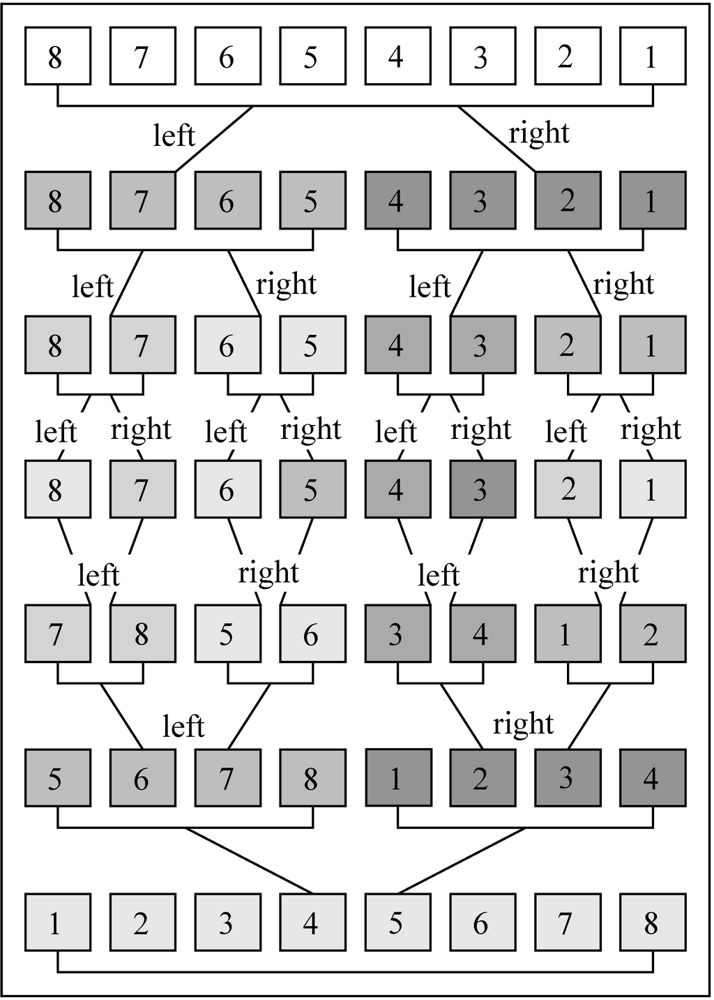

# Sorting


## 具体排序方法思想
### Bubble sort
1. [动画](https://www.programming-algorithms.net/article/39344/Bubble-sort)
2. 想象很多种不同密度的液体分层在一起，密度小的肯定要往上升，相对的密度大的就会下沉。最终，这些液体就会按照密度大小排好顺序。
3. 当然，在现实中上面的例子肯定是很多层液体一起运动的。但冒泡排序的算法是简化且变形的，体现在以下两点：
    * 即每次只有最底层的液体上升，而不是所有液体一起运动排序
    * 当该上升的液体遇到比它密度大的液体时，自然会发生位置交换，然后继续上升；但如果遇到一个比它密度还小的液体时，本轮运动并不会停下来，而是改为由那个密度更小的液体继续上升。这样就保证了，第一轮的运动会把密度最小的送到最顶层；第二轮运动会把剩下的密度最小的送到最顶层；以此类推，最终排好顺序。
4. 时间复杂度是`O(n^2)`级别的，具体为
    ```js
    function cost(len) {
        len--;
        return (1 + len) * len / 2 + len;
    }
    ```
5. 看起来相比于真实的液体排序，这种简化版本的要慢。但是慢多少呢？以及，真实液体的排序要如何实现？

### Selection Sort
1. [动画](https://www.programming-algorithms.net/article/39430/Selection-sort)
2. 比冒泡排序还要直观，每次从未排序的项里面选出最小的排到已排序队列里就行了。
3. 已排序队列可以是一个单独的数组，也可以使用原数组。即把每次找到的最小的值和未排序数组项的最左边一项交换位置。
4. 每次选择最小的过程，从思维映射到算法的建模过程比较有趣。如果直接让一个人从一堆数字里面选一个最小的，当数字的数量很少是，我觉得对普通人来说极限就是5个了，这时只要看一眼就能得出结果，快到都没法分析整个的思维过程。但如果数字的数量更大时，就可以看到明显的思维过程了：先看几个，找出一个最小的记住；然后再看其他的几个，找出最小的，和前一批中最小的相比，确定这两批里面最小的；记住这个最小的，然后再看下一批。
5. 在算法中，也需要一个位置来保存当前最小的值。可以使用一个独立的变量来保存，但也可以直接保存在数组里，也就是使用未排序数组项的最左边一项作为该位置，最终比较完成后这个位置就是本轮最小的。注意这里的思路：初步的想法是在一轮中，先从头选到尾，选好了那个最小的，放到合适的位置上；但改进后的是选择过程中每次选到一个临时最小的，就直接放到合适的位置上，最终本轮结束后，停留在合适位置上的就是本轮最小的。
6. 时间复杂度是`O(n^2)`级别的，具体为
    ```js
    function cost(len) {
        len--;
        return (1 + len) * len / 2 + len;
    }
    ```

### Insertion Sort
1. [动画](https://www.programming-algorithms.net/article/39459/Insertion-sort)
2. 开始可能会想到这种算法：
    ```js
    function insertionSort(arr) {
        let len = arr.length;
        for (let i=1; i<len; i++) {
            let currIndex = i;
            while (currIndex > 0 && arr[currIndex] < arr[currIndex-1]) {
                swap(arr, currIndex, currIndex - 1);
                currIndex--;
            }
        }
        return arr;
    }
    ```
    这里也是和选择排序一样，一边比较一遍交换位置，最终停在合适的位置。
3. 但下面的算法其实更符合插入排序的概念，而且会更节省一些计算
    ```js
    function insertionSort(arr) {
        let len = arr.length;
        for (let i=1; i<len; i++) {
            let currItem = arr[i]; // 本轮比较要插入到合适位置的项
            let j = i;
            // 依次和前面已排序的项比较
            // 如果比前一项小，则把前一项向后移动一位，前一项会空出来（为一个重复值）
            while (j > 0 && currItem < arr[j-1]) {
                arr[j] = arr[j-1];
                j--; // j 减一后，位置为空出来的项
            }
            arr[j] = currItem;
        }
        return arr;
    }
    ```
    这种方法，会实际的空出来一项等待插入；而且`while`里面每次只是进行一次数组项的读和写，比调用`swap`函数的操作要简单。
4. 相比于选择排序每次都要遍历剩下的所有项来选择最小的方式，插入排序在每次和左边已经排好的项比较时，并不需要和每一项比较，只需要找到一个比自己大的就可以停下来插入了。

### Merge Sort 


时间复杂度是`O(n log^n)`

#### 分治思想
不懂，分治的设计思想是什么。以及它为什么比前面的方法快

