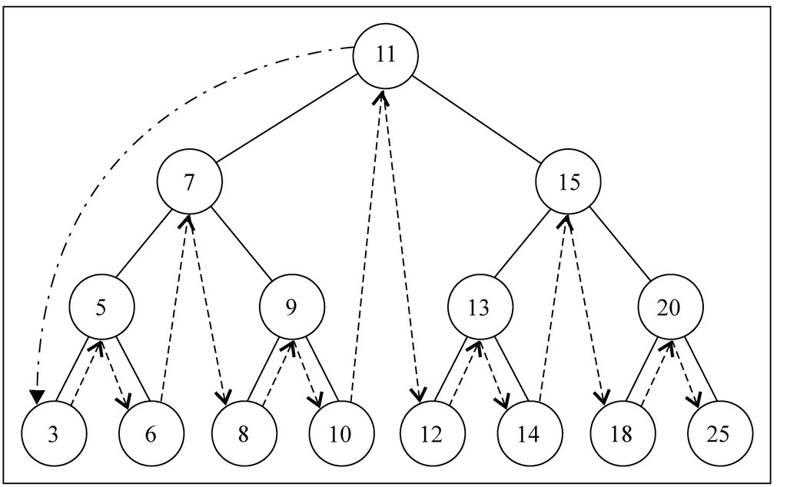
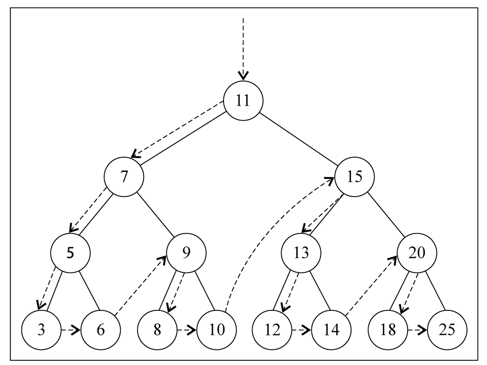
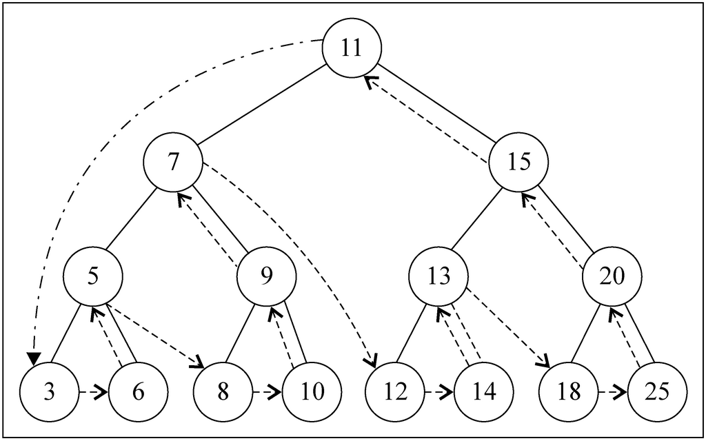

# Tree


## BST 遍历思路

### 中序遍历（In Order）
```js
function inOrderTraverseNode(node, callback) {
    if (node !== null) {
        inOrderTraverseNode(node.left, callback); // 遍历左子树，先一路递归到左子树最小的一个节点
        callback(node.key);
        inOrderTraverseNode(node.right, callback); // 遍历右子树，先一路递归到右子树最小的一个节点
    }
}
```



### 先序遍历（Pre Order）
```js
function preOrderTraverseNode(node, callback) {
    if (node !== null) {
        callback(node.key);
        preOrderTraverseNode(node.left, callback);
        preOrderTraverseNode(node.right, callback);
    }
}
```
 


### 后序遍历（Post Order）
1. 后序遍历的一种应用是计算一个目录和它的子目录中所有文件所占空间的大小。
```js
function postOrderTraverseNode(node, callback) {
    if (node !== null) {
        postOrderTraverseNode(node.left, callback);
        postOrderTraverseNode(node.right, callback);
        callback(node.key);
    }
}
```
    

