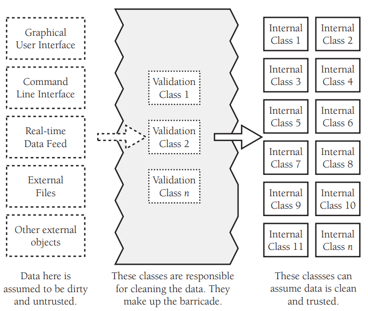

# Barricade Program

## 检查和清理外部数据
1. 以防御式编程为目的而进行隔离（barricade）的方法，是把某些接口选定为 “安全” 区域的边界，对穿过边界进入安全区域的数据进行校验
    
2. 例如在设计类时，可以认为公共方法接收到的数据是不安全的，需要进行检查和清理。而一旦公共方法接受了数据，私有方法就可以假定数据都是安全的了。
3. 在实践中可能要进行不止一次的检查和清理，可以会根据不同维度进行多层的检查和清理，就像进入高等级生化实验室的流程一样。
4. 除了处理外部数据的错误，也常常需要对某些外部数据进行类型转换。例如输入数据是 `1` 和 `0`，而程序内部使用的是 `true` 和 `false`。如果不转换为内部通用的类型，那么就会增加程序的复杂程度和混乱程度。

## 断言用于安全区内
安全区外部的数据都是假定不安全的，因此应该使用错误处理技术处理可预期的错误数据。而进入安全区后就认为没有错误数据了，这时如果再出错那就是程序本身的问题了，所以使用断言来排除程序错误。

## References
* [《代码大全（第2版）》](https://book.douban.com/subject/1477390/)