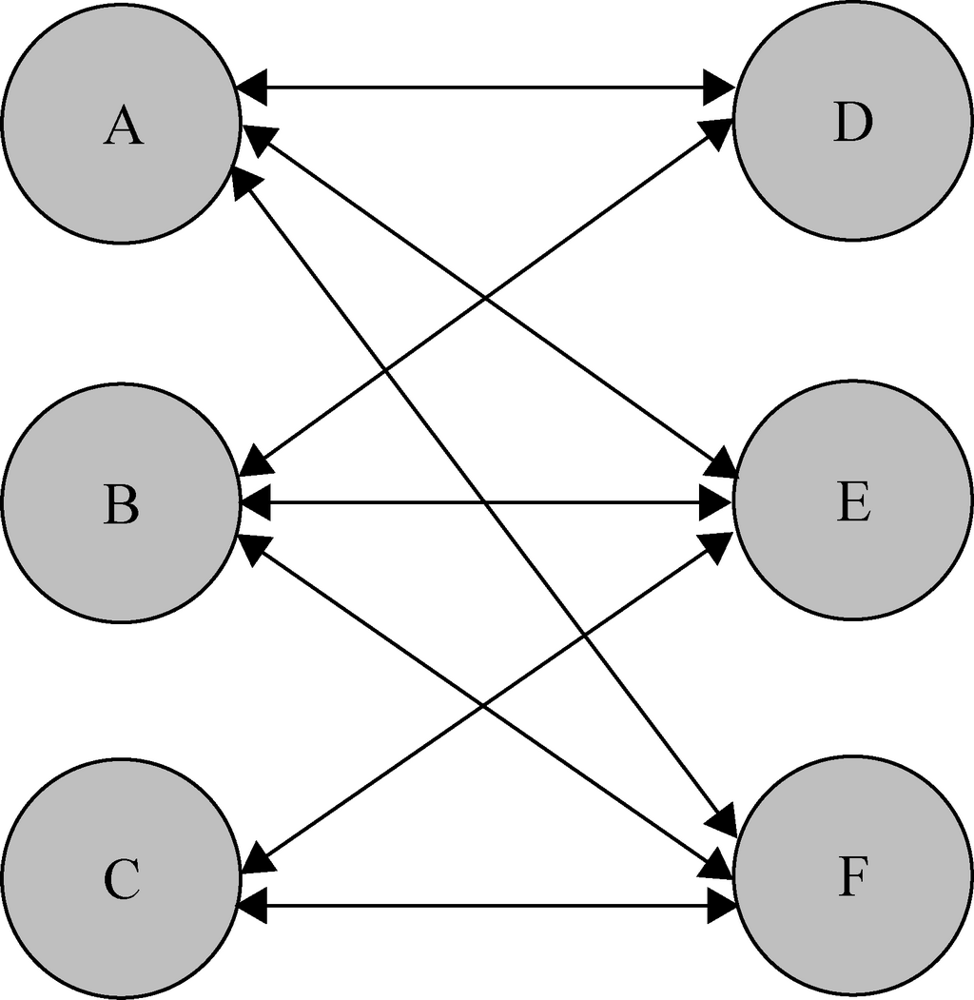
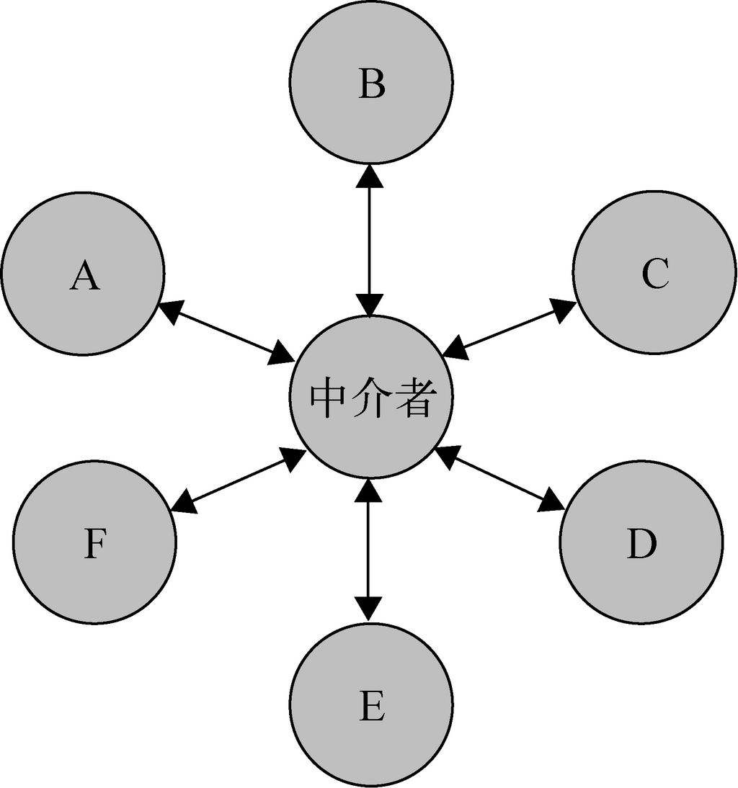

# Mediator

Mediator is a behavioral design pattern that lets you reduce chaotic dependencies between objects. The pattern restricts direct communications between the objects and forces them to collaborate only via a mediator object.


<!-- TOC -->

- [Mediator](#mediator)
    - [0. 设计思想](#0-设计思想)
        - [0.1 多个对象的统一调度](#01-多个对象的统一调度)
            - [掌控全局信息](#掌控全局信息)
            - [搭建沟通平台](#搭建沟通平台)
            - [协调最终决策](#协调最终决策)
        - [0.2 LoD](#02-lod)
        - [0.3 SRP](#03-srp)
        - [0.4 OCP](#04-ocp)
    - [1. 抽象本质](#1-抽象本质)
        - [1.1 统一的信息交流平台](#11-统一的信息交流平台)
        - [1.2 存在共享状态情况下的统一决策者](#12-存在共享状态情况下的统一决策者)
        - [1.3 唯一数据源](#13-唯一数据源)
    - [2. 实现原理](#2-实现原理)
    - [3. 适用场景](#3-适用场景)
        - [多对象相互交流](#多对象相互交流)
        - [一个对象的决策会影响到其他若干个对象](#一个对象的决策会影响到其他若干个对象)
        - [对象的内部逻辑耦合了其他对象](#对象的内部逻辑耦合了其他对象)
    - [4. 缺点](#4-缺点)
    - [飞机和空管通讯的例子](#飞机和空管通讯的例子)
        - [JavaScript 实现](#javascript-实现)
    - [References](#references)

<!-- /TOC -->


## 0. 设计思想
### 0.1 多个对象的统一调度
在一个多对象的系统里，某些决策的做出是需要协调多个对象的。这种协调很难让对象自己去进行，一个中介者可以实现以下功能：

#### 掌控全局信息
1. 一个对象不一定知道自己的某个决策有哪些相关对象。特别是在对象经常增减的情况下，想让一个对象维护自己某个决策的相关对象成本很高。
2. 而一个中介者会掌握所有对象的状态，在做出某个决策时，就可以根据整体情况做出最优决策。

#### 搭建沟通平台
1. 即使一个对象知道自己的某个决策相关的对象，它们之间是否方便沟通呢？
2. 很多时候，这种沟通都没那么方便。想想如果没有基站手机各自直接沟通的情况。

#### 协调最终决策
1. 一个对象的某个状态的修改很有可能会影响其他若干对象，也就是说，若干对象会共享某些状态，这很常常就会和其他对象造成冲突。
2. 这种冲突可能仅仅是状态非预期的同步，也有可能是利益的冲突。
3. 如果没有一个第三方决策者，协调即使不是不可能，也是成本很大的。

### 0.2 LoD
1. 不用维护和其他对象的关系及沟通方式，就解除了和其他对象的耦合。
2. 这样，不管其他对象怎么变化，我自己的对象都不收到影响。

### 0.3 SRP
1. 一个对象只需要专注实现自己功能，而不需要关注沟通的方面。
2. 在中介者模式里，一个对象甚至不需要知道另一个对象是否存在。
3. 就好像一群很有技术但不善沟通的人，就需要一个擅长沟通的人来管理。
4. SRP 也增加对象的复用性。

### 0.4 OCP
1. 现在对象之间解除了耦合关系，所以在系统中增删对象都不会对系统的运作模式造成影响。
2. 实际上，在很多系统中，对象的增删都是很频繁的。比如一个机场负责调度的飞机，就是不断变化的。要是让各个飞机自己去沟通协调几乎是不可能的。


## 1. 抽象本质
### 1.1 统一的信息交流平台
1. 理论上，我们可以点对点的交流信息。
2. 但实际上，我们常常根本你都找不到交流的对象。比如交易双方，如果没有一个平台，要找到若干个合适的交易方是比较困难的。
3. 所以我们建立一个第三方平台，并把所有对象都注册到这个平台上。
4. 当一个对象发出一个信息时，平台就找到相关的对象，通知他们。

### 1.2 存在共享状态情况下的统一决策者
1. 在一个多对象相互作用的系统里，一个对象的改变会涉及其他若干对象的改变，也就是说，若干对象会共享某些状态。而且这种对象关系还常常是动态变化的。
2. 所以如果让对象之间各自为政进行交互的话，不仅很麻烦，而且很危险。
3. 一个对象只是出于自己的需求做出变化，而无法考虑到全局的影响。这就常常会出现非预期变化，变化也不能很好的同步到所有相关对象上。

### 1.3 唯一数据源
1. 如果多个象共享相同的数据，那就涉及到各个对象数据同步的问题。一个对象修改了一个共享数据后，就要保证其他共享该数据的对象之后访问到的也是更新后的数据。
2. 对于共享数据，理论上各个对象都可以自己维护一份，某个对象修改后通知其他相关对象修改。
3. 但这样其实是很危险的，而且是很麻烦的。因为它毕竟不是同一个源，你能不能都通知到，能不能都同步到，都要仔细维护。
4. 这时中介者就要将这些共享数据维护为一个唯一的数据源，各个对象读写这些数据都通过这唯一的数据源，保证了共享数据的同步。


## 2. 实现原理
从各个对象直接各自直接通信

到使用一个中介者统一调度



## 3. 适用场景
### 多对象相互交流
特别是每个对象的交流对象会发生变化的情况

### 一个对象的决策会影响到其他若干个对象
出现多个对象共享某些状态的情况，一个对象修改某个共享状态时，需要一个统一的决策平台管理共享状态的修改，而不能各个对象各自为政的修改。

### 对象的内部逻辑耦合了其他对象


## 4. 缺点
Over time a mediator can evolve into a God Object.


## 飞机和空管通讯的例子
1. 一个很明显的例子是，机场的调度显然不能一个飞机自己和其他相关的飞机联系。它不知道和自己相关的有哪些飞机，就算知道了，它不可能和这些飞机一一沟通协调。
2. 而且还有一个权限问题，如果大家都是这么独立协调，那有冲突的时候听谁的？
3. 所以还是需要一个空管，它知道所有飞机的状态，而且具有权限进行统一的调度。

### JavaScript 实现
```js
class ATC {
    constructor (name) {
        this.name = name;
        this.aircraftList = {};
    }

    // 将一个飞机和该空管建立连接，之后可以发送或接收消息。
    // 飞机调用这个方法和空管建立连接
    link ( aircraft ) {
        this.aircraftList[aircraft.name] = aircraft;
    }

    // 飞机调用这个方法向空管发送消息
    notify ( sender, message ) {
        console.log( `【${sender.name}】：${message}, ${sender.name}` );

        if ( message === '请求返航' ) {
            this.handleAvoidance();
        }
    }

    // 作为例子，空管处理有飞机返航其他飞机避让的一个方法
    handleAvoidance () {
        this.aircraftList[aircraft2.name].listen('避让');
        this.aircraftList[aircraft3.name].listen('避让');
    }
}

class Aircraft {
    constructor ( name ) {
        this.atc = null;
        this.name = name;
        
    }

    // 和空管建立连接
    linkAtc (atc) {
        atc.link(this);
        this.atc = atc;
    }

    // 向空管发送消息
    speak ( message ) {
        this.atc.notify( this, message );
    }

    // 空管调用这个方法想该飞机发送消息
    listen ( message ) {
        console.log( `【${this.atc.name}】：${this.name}, ${message}` );
        this.handleMessage(message);
    }

    // 处理消息的方法
    handleMessage (message) {
        this.speak( message );
    }
}


let atc1 = new ATC ('airport1');

let aircraft1 = new Aircraft('aircraft1');
aircraft1.linkAtc( atc1 );

let aircraft2 = new Aircraft('aircraft2');
aircraft2.linkAtc( atc1 );

let aircraft3 = new Aircraft('aircraft3');
aircraft3.linkAtc( atc1 );


aircraft1.speak('请求返航');
```


## References
* [《JavaScript设计模式与开发实践》](https://book.douban.com/subject/26382780/)
* [Refactoring.Guru](https://refactoring.guru/design-patterns/mediator)
