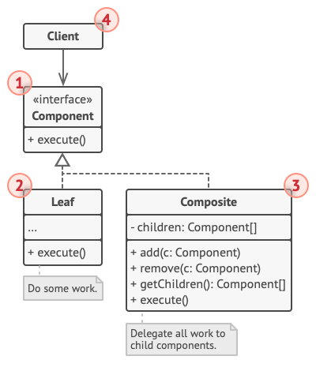

# Composite

组合模式是一种结构型设计模式，你可以使用它将对象组合成树状结构，并且能像使用独立对象一样使用它们。


<!-- TOC -->

- [Composite](#composite)
    - [设计思想](#设计思想)
        - [黑箱封装——功能的具体实现和接口规则分离，实现功能和环境的解耦](#黑箱封装功能的具体实现和接口规则分离实现功能和环境的解耦)
        - [OCP](#ocp)
    - [本质](#本质)
        - [单体行为对象和组合行为对象](#单体行为对象和组合行为对象)
        - [可遍历的树状结构](#可遍历的树状结构)
        - [随意组装和高效遍历的前提——单体行为对象和组合行为对象拥有同样的接口](#随意组装和高效遍历的前提单体行为对象和组合行为对象拥有同样的接口)
    - [实现原理](#实现原理)
        - [组合为树形结构](#组合为树形结构)
        - [组合对象和单体对象实现相同的接口](#组合对象和单体对象实现相同的接口)
    - [适用场景](#适用场景)
        - [表示由若干对象组成的 “组合-单体” 树状结构](#表示由若干对象组成的-组合-单体-树状结构)
        - [客户希望统一对待树中的所有对象](#客户希望统一对待树中的所有对象)
    - [缺点](#缺点)
    - [实现更强大的宏命令](#实现更强大的宏命令)
    - [抽象类在组合模式中的作用](#抽象类在组合模式中的作用)
    - [透明性带来的安全问题](#透明性带来的安全问题)
    - [扫描文件夹的例子](#扫描文件夹的例子)
    - [引用父对象](#引用父对象)
    - [Relations with Other Patterns](#relations-with-other-patterns)
    - [References](#references)

<!-- /TOC -->


## 设计思想
### 黑箱封装——功能的具体实现和接口规则分离，实现功能和环境的解耦
1. 要模拟 “组合-单体” 树状结构，其实组合对象和单体对象不实现相同的接口，也是可以完成的。但这样就需要遍历的逻辑判断一个对象是哪种对象从来知道它是哪种接口，这样就造成了基础的遍历逻辑和遍历对象之间更深的耦合。
2. 而组合模式的要点就是组合对象和单体对象实现相同的接口，从而实现了遍历逻辑和具体遍历对象之间的解耦。
3. 这样不管遍历对象是什么功能，只要提供了标准的接口，就能放在这个遍历逻辑之中。

### OCP
1. 对于这种组合结构，我们的期望是：随意的添加、组合、删除或者修改对象，只要这些对象遵循相同的结构和接口（比如在下面遍历文件夹的例子中，都有 `add` 和 `scan` 接口），那么对组合结构遍历的逻辑都不需要改变。
2. 但严格来说，如果这些对象不遵循统一的规则，只要遍历逻辑能兼容这些规则，其实也是可以做到 OCP 的。
3. 那这里就是谁做出让步的问题。如果我们就是要有几种不同规则的对象，那看起来只能遍历规则做出让步；但一般这种时候，遍历规则作为更基础的通用逻辑，并不应该让步。
4. 如果我们期望应对不同的业务规则，更合理的方法还是指定不同的遍历逻辑，而不是在同一种逻辑里面做兼容。这也是符合 SRP 原则的。
5. 越是容易变动的地方就越要 SRP，只有 SRP 了才能更好的应对变化，每次修改时只对紧密相关的独立的一小部分做修改，而不需要对整体进行修改。SRP 是 OCP 的前提，通过 SRP 原则把经常变动的和不经常变动的分离，才能更好的实现 OCP。


## 本质
### 单体行为对象和组合行为对象
1. 一个单体行为对象负责一个具体的行为，单体行为对象的调用会执行某个具体行为。
2. 一个组合行为对象组合了若干个子级别的单体行为对象和（或）组合行为对象，组合行为对象的调用会调用内部的每个子级别的单体行为对象和组合行为对象。

### 可遍历的树状结构
1. 因为上述的组合关系，所以组合和单体行为对象可以组合成树状结构。
2. 因为一个组合对象中可以添加新的单体行为对象和组合行为对象，所以若干组合和单体行为对象就可以组合成树状结构。
3. 一个可爱的配图
    

### 随意组装和高效遍历的前提——单体行为对象和组合行为对象拥有同样的接口
1. 只要两者实现了同样的接口，客户在遍历树结构时，就可以使用同样的方法调用对象。
2. 例如，单体行为对象和组合行为对象都定义 `execute` 方法。单体行为对象的该方法是执行具体的行为，而组合行为对象的该方法是调用其每个子级别对象的 `execute` 方法


## 实现原理
组合模式将对象组合成树形结构，通过对象的多态性表现，使得用户对单个对象和组合对象的使用具有一致性，下面分别说明。

### 组合为树形结构
1. 单体对象只有负责执行的接口，而组合对象还要有一个添加子对象的接口。
2. 通过组合对象的添加子对象的接口，添加子级别的单体对象或其他的组合对象。

### 组合对象和单体对象实现相同的接口
1. 利用对象多态性统一对待组合对象和单体对象，不管是组合对象还是单体对象，只要都拥有一个相同的执行接口，客户端就可以忽略两者的不同，直接执行即可。
2. 组合对象的执行接口是遍历执行每个子对象的执行方法，单体对象的执行接口是执行具体的行为。
    


## 适用场景
### 表示由若干对象组成的 “组合-单体” 树状结构
1. 组合模式可以方便地构造一棵树来表示若干对象组成的 “组合-单体” 结构。
2. 特别是我们在开发期间不确定这棵树到底存在多少层次的时候，可以很方便的在树的任何位置添加和移除对象。

### 客户希望统一对待树中的所有对象
因为组合对象和单体对象实现了同样的接口，所以客户可以忽略组合对象和叶对象的区别，客户在面对这棵树的时候，不用关心当前正在处理的对象是组合对象还是单体对象。


## 缺点
It might be difficult to provide a common interface for classes whose functionality differs too much. In certain scenarios, you’d need to overgeneralize the component interface, making it harder to comprehend.
对于功能差异较大的类， 提供公共接口或许会有困难。 在特定情况下， 你需要过度一般化组件接口， 使其变得令人难以理解。


## 实现更强大的宏命令
1. 基本对象可以被组合成更复杂的组合对象，组合对象又可以被组合，这样不断递归下去，这棵树的结构可以支持任意多的复杂度。
2. 在树最终被构造完成之后，让整颗树最终运转起来只需要调用最上层对象的方法。每当对最上层的对象进行一次请求时，实际上是在对整个树进行深度优先的搜索。 
3. 而创建组合对象的程序员并不关心这些内在的细节，往这棵树里面添加一些新的节点对象是非常容易的事情，只要保证对象也拥有 `execute` 方法即可
    ```js
    const MacroCommand = () => {
        return {
            commandList: [],
            add (command) {
                this.commandList.push(command);
                return this;
            },
            execute () {
                this.commandList.forEach((command) => {
                    command.execute();
                });
            }
        }
    };


    const openAcCommand = {
        execute () {
            console.log('打开空调');
        }
    };


    // 家里的电视和音响是连接在一起的，所以可以用一个宏命令来组合打开电视和打开音响的命令
    const openTvCommand = {
        execute () {
            console.log('打开电视');
        },
    };
    const openSoundCommand = {
        execute () {
            console.log('打开音响');
        },
    };
    let subMacroCommand1 = MacroCommand()
                            .add(openTvCommand)
                            .add(openSoundCommand);


    // 关门、打开电脑和打登录QQ的命令
    const closeDoorCommand = {
        execute () {
            console.log('关门');
        },
    };
    const openPcCommand = {
        execute () {
            console.log('开电脑');
        },
    };
    const openQQCommand = {
        execute () {
            console.log('登录QQ');
        },
    };
    let subMacroCommand2 = MacroCommand()
                            .add(closeDoorCommand)
                            .add(openPcCommand)
                            .add(openQQCommand);


    // 把所有的命令组合成一个宏命令
    let macroCommand = MacroCommand();
    macroCommand
    .add(openAcCommand)
    .add(subMacroCommand1)
    .add(subMacroCommand2);


    document.getElementById('button2').addEventListener('click', () => {
        macroCommand.execute();
    });
    ```


## 抽象类在组合模式中的作用
1. 前面说到，组合模式最大的优点在于可以一致地对待组合对象和基本对象。客户不需要知道当前处理的是宏命令还是普通命令，只要它是一个命令，并且有 `execute` 方法，这个命令就可以被添加到树中。
2. 这种 透明性带来的便利，在静态类型语言中体现得尤为明显。比如在 Java 中，实现组合模式的关键是 `Composite` 类和 `Leaf` 类都必须继承自一个`Compenent` 抽象类。这个 `Compenent` 抽象类既代表组合对象，又代表叶对象，它也能够保证组合对象和叶对象拥有同样名字的方法，从而可以对同一消息都做出反馈。组合对象和叶对象的具体类型被隐藏在 `Compenent` 抽象类身后。
3. 针对 `Compenent` 抽象类来编写程序，客户操作的始终是 `Compenent` 对象，而不用去区分到底是组合对象还是叶对象。所以我们往同一个对象里的 `add` 方法里，既可以添加组合对象，也可以添加叶对象。
    ```java
    public abstract class Component{
        // add方法，参数为Component类型
        public void add( Component child ){}
        // remove方法，参数为Component类型
        public void remove( Component child ){}
    }

    public class Composite extends Component{
        // add方法，参数为Component类型
        public void add( Component child ){}
        // remove方法，参数为Component类型
        public void remove( Component child ){}
    }

    public class Leaf extends Component{
        // add方法，参数为Component类型
        public void add( Component child ){
            throw new UnsupportedOperationException()    // 叶对象不能再添加子节点
        }
        // remove方法，参数为Component类型
        public void remove( Component child ){
        }
    }

    public class client(){

        public static void main( String args[] ){
            Component root = new Composite();

            Component c1 = new Composite();
            Component c2 = new Composite();

            Component leaf1 = new Leaf();
            Component leaf2 = new Leaf();

            root.add(c1);
            root.add(c2);

            c1.add(leaf1);
            c1.add(leaf2);

            root.remove();
        }
    }
    ```
4. 然而在 JavaScript 这种动态类型语言中，对象的多态性是与生俱来的，也没有编译器去检查变量的类型，所以我们通常不会去模拟一个怪异的抽象类，JavaScript 中实现组合模式的难点在于要保证组合对象和叶对象对象拥有同样的方法，这通常需要用鸭子类型的思想对它们进行接口检查。


## 透明性带来的安全问题
1. 组合模式的透明性使得发起请求的客户不用去顾忌树中组合对象和叶对象的区别，但它们在本质上有是区别的。
2. 组合对象可以拥有子节点，叶对象下面就没有子节点，所以我们也许会发生一些误操作，比如试图往叶对象中添加子节点。
2. 解决方案通常是给叶对象也增加 `add` 方法，并且在调用这个方法时，抛出一个异常来及时提醒客户
    ```js
    const openTvCommand = {
        execute () {
            console.log( '打开电视' );
        },
        add () {
            throw new Error( '叶对象不能添加子节点' );
        },
    };
    ```


## 扫描文件夹的例子
1. 文件夹对应一个宏对象，文件对应一个普通对象。创建这两个类
    ```js
    class Folder {
        constructor (name) {
            this.name = name;
            this.files = [];
        }

        add (file) {
            this.files.push(file);
            return this;
        }

        scan () {
            console.log( '开始扫描文件夹: ' + this.name );
            this.files.forEach((file) => {
                file.scan();
            });
        }
    }

    class File {
        constructor (name) {
            this.name = name;
        }

        add (file) {
            throw new Error( '文件下面不能再添加文件' );
        }

        scan () {
            console.log( '开始扫描文件: ' + this.name );
        }
    }
    ```
2. 尝试添加并扫描
    ```js
    let folder = new Folder( '学习资料' );
    let folder1 = new Folder( 'JavaScript' );
    let folder2 = new Folder( 'jQuery' );

    let file11 = new File( 'JavaScript设计模式与开发实践' );
    let file21 = new File( '精通jQuery' );
    let file3 = new File( '重构与模式' )

    folder1.add( file11 );
    folder2.add( file21 );

    folder.add( folder1 ).add( folder2 ).add( file3 );

    folder.scan();
    // 开始扫描文件夹: 学习资料
    // 开始扫描文件夹: JavaScript
    // 开始扫描文件: JavaScript设计模式与开发实践
    // 开始扫描文件夹: jQuery
    // 开始扫描文件: 精通jQuery
    // 开始扫描文件: 重构与模式
    ```
3. 创建一个新的文件夹和一个新的文件，并放进 `folder`
    ```js
    let folder3 = new Folder( 'Nodejs' );
    let file31 = new File( '深入浅出Node.js' );
    folder3.add( file31 );

    let file5 = new File( '算法（第4版）' );

    folder.add( folder3 ).add( file5 );
    
    folder.scan();
    // 开始扫描文件夹: 学习资料
    // 开始扫描文件夹: JavaScript
    // 开始扫描文件: JavaScript设计模式与开发实践
    // 开始扫描文件夹: jQuery
    // 开始扫描文件: 精通jQuery
    // 开始扫描文件: 重构与模式
    // 开始扫描文件夹: Nodejs
    // 开始扫描文件: 深入浅出Node.js
    // 开始扫描文件: 算法（第4版）
    ```


## 引用父对象
1. 有时候我们需要在子节点上保持对父节点的引用，比如在组合模式中使用职责链时，有可能需要让请求从子节点往父节点上冒泡传递；还有当我们删除某个文件的时候，实际上是从这个文件所在的上层文件夹中删除该文件的。
2. 下面改写 `Folder` 类和 `File` 类，增加移除自身的功能
    ```js
    class Folder {
        constructor (name) {
            this.name = name;
            this.parent = null; // 增加 parent 属性
            this.files = [];
        }

        add (file) {
            file.parent = this; // 设置父对象
            this.files.push(file);
            return this;
        }

        scan () {
            console.log( '开始扫描文件夹: ' + this.name );
            this.files.forEach((file) => {
                file.scan();
            });
        }

        // 增加移除方法，移除当前文件夹自身。
        removeSelf () {
            if ( !this.parent ) { // 根节点或者树外的游离节点
                return;
            }

            let files = this.parent.files;
            for (let index = files.length - 1; index >=0; index--) {
                let file = files[index];
                if ( file === this ){
                    files.splice(index, 1);
                }
            }
        }
    }

    class File {
        constructor (name) {
            this.name = name;
            this.parent = null;
        }

        add (file) {
            throw new Error( '文件下面不能再添加文件' );
        }

        scan () {
            console.log( '开始扫描文件: ' + this.name );
        }

        removeSelf () {
            if ( !this.parent ) {
                return;
            }
            
            let files = this.parent.files;
            for (let index = files.length - 1; index >=0; index--) {
                let file = files[index];
                if ( file === this ){
                    files.splice(index, 1);
                }
            }
        }
    }
    ```
3. 测试
    ```js
    let folder = new Folder( '学习资料' );
    let file1 = new File ( '算法（第4版）' );
    let file2 = new File ( '流畅的Python' );
    let folder1 = new Folder( 'JavaScript' );
    let file11 =  new File( 'JavaScript设计模式与开发实践' );
    let file12 =  new File( 'JavaScript高级程序设计' );

    folder1.add( file11 ).add( file12 );
    folder.add( file1 ).add( file2 ).add( folder1 );

    folder.scan();
    // 开始扫描文件夹: 学习资料
    // 开始扫描文件: 算法（第4版）
    // 开始扫描文件: 流畅的Python
    // 开始扫描文件夹: JavaScript
    // 开始扫描文件: JavaScript设计模式与开发实践
    // 开始扫描文件: JavaScript高级程序设计

    file2.removeSelf();
    folder1.removeSelf();

    folder.scan();
    // 开始扫描文件夹: 学习资料
    // 开始扫描文件: 算法（第4版）
    ```


## Relations with Other Patterns


## References
* [《JavaScript设计模式与开发实践》](https://book.douban.com/subject/26382780/)
* [Refactoring.Guru](https://refactoring.guru/design-patterns/composite)
* [Refactoring.Guru 中文](https://refactoringguru.cn/design-patterns/composite)
* [《设计模式》](https://book.douban.com/subject/1052241/)