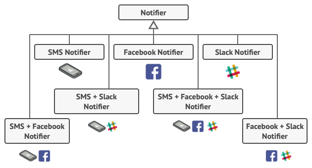

# Decorator

Decorator is a structural design pattern that lets you attach new behaviors to objects by placing these objects inside special wrapper objects that contain the behaviors.


<!-- TOC -->

- [Decorator](#decorator)
    - [设计思想](#设计思想)
        - [SRP](#srp)
            - [增加功能时不用修改原对象](#增加功能时不用修改原对象)
            - [实现功能拆分和组合](#实现功能拆分和组合)
        - [链式执行结构](#链式执行结构)
    - [抽象本质](#抽象本质)
    - [实现原理](#实现原理)
    - [适用场景](#适用场景)
        - [非耦合的为对象增加功能](#非耦合的为对象增加功能)
        - [为一个对象增加多个功能](#为一个对象增加多个功能)
        - [当无法使用继承解决的问题](#当无法使用继承解决的问题)
        - [在运行时为对象动态添加功能](#在运行时为对象动态添加功能)
    - [缺点](#缺点)
    - [示例](#示例)
        - [JavaScript 模拟面向对象的装饰者模式](#javascript-模拟面向对象的装饰者模式)
        - [JavaScript 的装饰者](#javascript-的装饰者)
        - [Python 的装饰者模式实现](#python-的装饰者模式实现)
    - [装饰者模式相比于继承的优点](#装饰者模式相比于继承的优点)
    - [装饰函数](#装饰函数)
    - [用 AOP 装饰函数](#用-aop-装饰函数)
        - [不修改原型的 AOP 实现](#不修改原型的-aop-实现)
        - [AOP 实现应用实例](#aop-实现应用实例)
            - [数据统计上报](#数据统计上报)
            - [动态改变函数的参数](#动态改变函数的参数)
            - [插件式的表单验证](#插件式的表单验证)
        - [AOP 的缺点](#aop-的缺点)
    - [和其他模式的关系](#和其他模式的关系)
        - [适配器模式](#适配器模式)
        - [Chain of Responsibility](#chain-of-responsibility)
        - [Composite](#composite)
        - [Proxy](#proxy)
    - [References](#references)

<!-- /TOC -->


## 设计思想
### SRP 
#### 增加功能时不用修改原对象
1. 在下面数据统计上报的例子中，需要给 `showLogin` 增加功能时，使用装饰模式就不需要改变这个函数，其他地方需要使用基础的 `showLogin` 功能时也不受影响。
2. 在原对象不变的情况下添加功能，这样就保持了原对象的 SRP。

#### 实现功能拆分和组合
1. 而且如果我们有一个多个步骤的大的功能体，可以将每个步骤拆分为小的、简洁的、独立的功能体，然后按顺序进行装饰组合。
2. 这样不仅易于设计、制作和维护，而且可以更方便的随意组合以应对不同的场景。

### 链式执行结构
1. 多个对象嵌套装饰，执行的时候就可以进行链式执行。
2. 根据装饰的方式，可以实现栈式（后装饰的先执行）或者队列式（后装饰的后执行）的执行结构
    ```js
    function foo () {
        console.log( 'foo' );
    }
    function bar () {
        console.log( 'bar' );
    }
    function baz () {
        console.log( 'baz' );
    }

    let stackChain = before( before( foo, bar ), baz );
    stackChain();
    // baz
    // bar
    // foo

    let queueChain = after( after( foo, bar ), baz );
    queueChain();
    // foo
    // bar
    // baz
    ```


## 抽象本质
1. 想给一个对象增加功能，但是又不想改变这个对象。
2. 那就把要增加的新功能和这个对象包装到一起，成为一个新的对象，让这个新对象分别执行新功能和原对象的功能。
3. 新的包装对象的用法和旧对象保持一致，这样使用者就不需要改变用法。


## 实现原理
1. 当需要给 A 对象增加新功能时，用一个新对象 B 包装 A 对象。
2. B 对象内部实现新增的功能，同时调用执行 A 对象的功能。
3. 为了保证对使用透明，包装对象和原对象必须实现同样的调用接口。


## 适用场景
### 非耦合的为对象增加功能
1. 旧对象功能维持不变。
2. 通过一个装饰器把新旧功能包装为一个新的对象。
3. 如果这个增加的功能在之后可能还会取消掉，那就更合适了。

### 为一个对象增加多个功能
通过嵌套装饰，可以为一个对象增加任意数量的功能。

### 当无法使用继承解决的问题
1. 首先继承很不灵活，无法任意组合多个父类的功能。
2. 另外，许多编程语言使用 `final` 关键字来限制对某个类的进一步扩展。复用最终类已有行为的唯一方法是使用装饰模式。

### 在运行时为对象动态添加功能


## 缺点
* 装饰链顺序固定，必须按照固定的顺序执行


## 示例
### JavaScript 模拟面向对象的装饰者模式
```js
class Mission1 {
    constructor () {}

    done () {
        console.log( 'Mission1 done.' );
    }
}

class Mission2 {
    constructor ( mission ) {
        this.mission = mission;
    }

    done () {
        this.mission.done();
        console.log( 'Mission2 done.' );
    }
}

class Mission3 {
    constructor( mission ){
        this.mission = mission;
    }

    done () {
        this.mission.done();
        console.log( 'Mission3 done.' );
    }
}

let mission = new Mission1();
mission = new Mission2( mission );
mission = new Mission3( mission );
mission.done();
// Mission1 done.
// Mission2 done.
// Mission3 done.
```

1. 这种给对象动态增加职责的方式，并没有真正地改动对象自身，而是将对象放入另一个对象之中，这些对象以一条 **链** 的方式进行引用，形成一个聚合对象。
2. 这些对象都拥有相同的接口（`done` 方法），当请求达到链中的某个对象时，这个对象会执行自身的操作，随后把请求 **转发** 给链中的下一个对象。
3. 因为装饰者对象和它所装饰的对象拥有 **一致的接口**，所以它们对使用该对象的客户来说是 **透明** 的，被装饰的对象也并不需要了解它曾经被装饰过，这种透明性使得我们可以递归地嵌套任意多个装饰者对象。

### JavaScript 的装饰者
1. JavaScript 语言动态改变对象相当容易，我们可以直接改写对象或者对象的某个方法，并不需要使用类来实现装饰者模式
    ```js
    let mission1 = {
        done () {
            console.log( 'Mission1 done.' );
        },
    };
        
    function mission2Done () {
        console.log( 'Mission2 done.' );
    };

    function mission3Done(){
        console.log( 'Mission3 done.' );
    };

    let mission1Done = mission1.done;

    mission1.done = function () {
        mission1Done();
        mission2Done();
        mission3Done();
    }

    mission1.done();
    ```
2. 上面是用 `mission2Done` 和 `mission3Done` 直接装饰了 `mission1`。如果不想一步到位的装饰，也想使用只有 `mission2Done` 装饰的对象，那也可以进行逐层装饰：`mission2Done` 先装饰 `mission1`，然后在此基础上，再用 `mission3Done` 装饰
    ```js
    let mission1 = {
        done () {
            console.log( 'Mission1 done.' );
        },
    };
        
    function mission2Done () {
        console.log( 'Mission2 done.' );
    };

    function mission3Done(){
        console.log( 'Mission3 done.' );
    };

    // 先用 mission2Done 装饰
    let mission1Done = mission1.done;
    mission1.done = function () {
        mission1Done();
        mission2Done();
    }

    mission1.done();
    // Mission1 done.
    // Mission2 done.


    // 再用 mission3Done 装饰
    let mission1mission2Done = mission1.done;
    mission1.done = function () {
        mission1mission2Done();
        mission3Done();
    }

    mission1.done();
    // Mission1 done.
    // Mission2 done.
    // Mission3 done.
    ```
    
### Python 的装饰者模式实现
```py
# 基础组件类
# 可以独立执行，也可以被装饰器装饰
class Component():
    """
    The base Component interface defines operations that can be altered by decorators.
    """

    # 具体执行的操作
    def operation(self) -> str:
        pass


# 基础装饰器类
# 装饰器会接收一个上面的组件类进行装饰
class Decorator(Component):
    """
    The base Decorator class follows the same interface as the other components.
    The primary purpose of this class is to define the wrapping interface for all concrete decorators.
    The default implementation of the wrapping code might include a field for storing a wrapped component 
    and the means to initialize it.
    """

    _component: Component = None

    # 接收参数中的组件类实例
    def __init__(self, component: Component) -> None:
        self._component = component

    @property # 将方法定义为可以属性访问的形式
    def component(self) -> str:
        """
        The Decorator delegates all work to the wrapped component.
        """

        return self._component

    # 装饰器也要实现和组件相同的执行方法接口
    """
    装饰器的执行方法默认是直接执行被装饰组件的执行方法，也就是说不进行装饰，
    具体的装饰器类可以覆写这个方法进行装饰
    """
    def operation(self) -> str:
        return self._component.operation()


# 定义一个具体的组件
class ConcreteComponent(Component):
    """
    Concrete Components provide default implementations of the operations. 
    There might be several variations of these classes.
    """

    # 这个具体组件类的 operation 方法返回如下字符串
    def operation(self) -> str:
        return "ConcreteComponent"


# 定义一个具体的装饰器 0
# 这个装饰器没有覆写 operation 方法，因此不会进行装饰
class ConcreteDecorator0(Decorator):
    def foo(self) -> str:
        return ''


# 定义一个具体的装饰器 A
class ConcreteDecoratorA(Decorator):
    """
    Concrete Decorators call the wrapped object and alter its result in some
    way.
    """

    def operation(self) -> str:
        """
        Decorators may call parent implementation of the operation, instead of
        calling the wrapped object directly. This approach simplifies extension
        of decorator classes.
        """
        # 这个装饰器除了会原样调用被装饰组件的 operation 方法，也会进行装饰，
        # 也就是把被装饰组件的 operation 方法的返回字符串放进字符串 ConcreteDecoratorA() 里面
        return f"ConcreteDecoratorA( {self.component.operation()} )"


# 定义一个具体的装饰器 B
class ConcreteDecoratorB(Decorator):
    """
    Decorators can execute their behavior either before or after the call to a
    wrapped object.
    """

    def operation(self) -> str:
        # 这个装饰器除了会原样调用被装饰组件的 operation 方法，也会进行装饰，
        # 也就是把被装饰组件的 operation 方法的返回字符串放进字符串 ConcreteDecoratorB() 里面
        return f"ConcreteDecoratorB( {self.component.operation()} )"


def client_code(component: Component) -> None:
    """
    The client code works with all objects using the Component interface. This
    way it can stay independent of the concrete classes of components it works
    with.
    """

    # ...

    print(f"RESULT: {component.operation()}", end="")
    print("\n")

    # ...


if __name__ == "__main__":
    # simple 是一个未经装饰的组件
    simple = ConcreteComponent()

    # 直接使用未经装饰的 simple
    client_code(simple) # 打印出 “RESULT: ConcreteComponent”

    decorator0 = ConcreteDecorator0(simple)
    client_code(decorator0) # 打印出 “RESULT: ConcreteComponent”

    # 用装饰器 A 装饰 simple
    decorator1 = ConcreteDecoratorA(simple)
    client_code(decorator1) # 打印出 “RESULT: ConcreteDecoratorA( ConcreteComponent )”
    
    # 用装饰器 B 装饰 simple
    decorator2 = ConcreteDecoratorB(simple)
    client_code(decorator2) # 打印出 “RESULT: ConcreteDecoratorB( ConcreteComponent )”

    # 再嵌套的用装饰器 B 装饰 decorator1
    decorator21 = ConcreteDecoratorB(decorator1)
    client_code(decorator21)
    # 打印出 “RESULT: ConcreteDecoratorB( ConcreteDecoratorA( ConcreteComponent ) )”
```


## 装饰者模式相比于继承的优点
1. 比如你有一个发送消息通知的类，然后你希望根据各种不同场景，发送不同的通知类型，比如邮件、微信、短信等等。
2. 这里，再定义各种子类还是可以实现的。
3. 但是，现在又有新的需求，就是某些情况可能是要通知发邮件和短信，有些情况是所有通知方式都要有。
4. 几种通知方式可以任意组合，如果要实现继承，就要创造出各种对应的子类来满足任意组合的通知方式
    
5. 这也太不灵活了，而且要维护太多的子类。


## 装饰函数
1. 在《设计模式》成书之前，GoF 原想把装饰者（decorator）模式称为包装器（wrapper）模式。从功能上而言，decorator 能很好地描述这个模式，但从结构上看，wrapper 的说法更加贴切。
2. 装饰者模式将一个对象嵌入另一个对象之中，实际上相当于这个对象被另一个对象包装起来，形成一条包装链。请求随着这条链依次传递到所有的对象，每个对象都有处理这条请求的机会。
3. 上面通过保存 `mission1.done` 原引用到 `done1` 的方式就可以改写这个函数，在包装函数中调用 `done1`，就可以实现装饰 `mission1.done`。
4. 这样的代码当然是符合开放-封闭原则的，我们在增加新功能的时候，确实没有修改原来的代码，但是这种方式存在以下两个问题
    * 上面逐层装饰的例子中，维护了 `mission1Done` 和 `mission1mission2Done` 这两个个中间变量。如果函数的装饰链较长，或者需要装饰的函数变多，这些中间变量的数量也会越来越多。
    * `this` 被劫持的问题。如果 `mission1.done` 中涉及环境，则还要对 `done1` 进行 `this` 绑定。
    ```js
        let mission1 = {
            missionName: 'mission1',
            done () {
                console.log( 'Mission name: ' + this.missionName ); 
                console.log( 'Mission1 done.' );
            },
        };
            
        function mission2Done () {
            console.log( 'Mission2 done.' );
        };

        function mission3Done(){
            console.log( 'Mission3 done.' );
        };

        // 否则里面的 this 就是 undefined
        let mission1Done = mission1.done.bind(mission1);
        mission1.done = function () {
            mission1Done();
            mission2Done();
            mission3Done();
        }

        mission1.done();
        ```


## 用 AOP 装饰函数
1. `Function.prototype.before` 方法和 `Function.prototype.after`方法
    ```js
    Function.prototype.before = function(beforefn) {
        let __self = this;  // 保存原函数的引用
        return function (...args) {  // 返回包含了原函数和新函数的包装函数
            // 执行新函数，将 this 设置为包装函数的执行环境
            // 如果不设置 this，则 this 总是 undefined
            // 删除追加的函数也不影响原函数
            beforefn && beforefn.apply(this, args);
            // 原函数同样将 this 设置为包装函数的执行环境
            return __self.apply(this, args);
        }
    }

    Function.prototype.after = function(afterfn) {
        let __self = this;
        return function (...args) {
            let ret = __self.apply(this, args);
            debugger;
            afterfn && afterfn.apply(this, args);
            return ret;
        }
    };
    ```
2. 维持 `this` 并添加额外操作
    ```js
    document.getElementById = document.getElementById.before(function(){
        console.log('pre action');
        console.log(this); // document。和包装函数的 this相同，包装函数是 document 的方法调用
    });
    document.getElementById( 'button' );
    ```

### 不修改原型的 AOP 实现
修改原型不仅不安全，而且还会降低函数性能。可以使用传参的方法来实现
```js
const before = function (fn, beforefn) {
    return function (...args) {
        beforefn && beforefn.apply(this, args);
        return fn.apply(this, args);
    };
}
const after = function (fn, afterfn) {
    return function (...args) {
        let re = fn.apply(this, args);
        afterfn && afterfn.apply(this, args);
        return re;
    };
}

let obj = {
    foo () {
        console.log( this );
    }
};
function bar () {
    console.log( this );
}
let foo = after( obj.foo, bar );
foo(); // 两个 undefined
obj.foo = after( obj.foo, bar );
obj.foo(); // 两个 obj
```

### AOP 实现应用实例
#### 数据统计上报
1. 分离业务代码和数据统计代码，无论在什么语言中，都是 AOP 的经典应用之一。
2. 在项目开发的结尾阶段难免要加上很多统计数据的代码，这些过程可能让我们被迫改动早已封装好的函数。
3. 比如页面中有一个登录 button，点击这个 button 会弹出登录浮层，与此同时要进行数据上报，来统计有多少用户点击了这个登录 button。如果没有解耦，就会是：
    ```js
    function log( tag ){
        console.log( '上报标签为: ' + tag );
        // (new Image).src = 'http:// xxx.com/report?tag=' + tag;    // 真正的上报代码略
    }

    function showLogin(){
        console.log( '打开登录浮层' );
        log( this.nodeName );
    }

    document.getElementById( 'button' ).onclick = showLogin;
    ```
4. 打开登录浮层的业务逻辑就和数据统计的逻辑耦合了。现在想要显示付出昂，就必须要上报数据。或者修改两者之一的逻辑，就要修改整个函数。
5. 使用 AOP 解耦后：
    ```js
    function log () {
        console.log( '上报标签为: ' + this.nodeName );
        // (new Image).src = 'http:// xxx.com/report?tag=' + tag;    // 真正的上报代码略
    }
    
    function showLogin () {
        console.log( '打开登录浮层' );
    }

    let showLoginWithLog = after(showLogin, log);

    document.getElementById( 'button' ).onclick = showLoginWithLog;
    ```

#### 动态改变函数的参数
1. 从 AOP 的实现可以看到，原函数和附加函数在调用时，参数数组 `args` 实际上是同一个数组，都是引用的包装函数的参数数组。也就是说，可以通过修改附加函数参数来实现动态修改原函数参数
    ```js
    function foo( param ){
        console.log( param );
    }
    foo( {a: 'a'} ); // {a: "a"}

    foo = before( foo, function( param ){
        param.b = 'b';
    });
    foo( {a: 'a'} ); // {a: "a", b: "b"}
    ```
2. 假设有一个通用的 ajax 请求函数
    ```js
    var ajax = function ( type, url, param ) {
        // 发送ajax请求的代码略
    };

    ajax( 'get', 'http:// xxx.com/userinfo', { name: 'sven' } );
    ```
3. 如果某天为了防止 CSRF 攻击，而要给请求参数 `param` 再加上一个 token。虽然也可以这样
    ```js
    var ajax = function( type, url, param ){
        param = param || {};
        param.Token = getToken();
    };
    ```
4. 但防止 CSRF 攻击并不是 ajax 函数的核心功能，只是一个附加功能，因此最好还是能够解耦，这样 ajax 函数可以更加灵活，不管是修改还是复用
    ```js
    var ajax = function ( type, url, param ) {
        console.log(param);
    };

    var getToken = function () {
        return 'Token';
    }

    // 动态修改 ajax 的第三个参数
    ajax = before( ajax, function ( type, url, param ) {
        param.token = getToken();
    });

    ajax( 'get', 'http:// xxx.com/userinfo', { name: 'sven' } ); // {name: "sven", token: "Token"}
    ```

#### 插件式的表单验证
1. 耦合的表单验证
    ```js
    var formSubmit = function(){
        if ( username.value === '' ){
            return alert ( '用户名不能为空' );
        }
        if ( password.value === '' ){
            return alert ( '密码不能为空' );
        }

        var param = {
            username: username.value,
            password: password.value
        }
        ajax( 'http:// xxx.com/login', param );    // ajax具体实现略
    }
    ```
2. 一定程度解耦
    ```js
    var validata = function(){
        if ( username.value === '' ){
            alert ( '用户名不能为空' );
            return false;
        }
        if ( password.value === '' ){
            alert ( '密码不能为空' );
            return false;
        }
    }

    var formSubmit = function(){
        if ( validata() === false ){    // 校验未通过
            return;
        }
        var param = {
            username: username.value,
            password: password.value
        }
        ajax( 'http:// xxx.com/login', param );
    }
    ```
3. 使用改写后的 AOP 进一步解耦
    ```js
    const validBefore = function ( fn, beforefn ) {
        return function ( ...args ) {
            let valid = beforefn.apply( this, args );
            if ( !valid ) return;
            return fn.apply( this, args );
        };
    }

    let validata = function(){
        if ( username.value === '' ){
            alert ( '用户名不能为空' );
            return false;
        }
        if ( password.value === '' ){
            alert ( '密码不能为空' );
            return false;
        }
        return true;
    }

    let formSubmit = function(){
        let param = {
            username: username.value,
            password: password.value
        }

        ajax( 'http:// xxx.com/login', param );
    }
    
    let formSubmitWithVerification = validBefore( formSubmit, validata );
    ```
4. `validata` 成为一个即插即用的函数，它甚至可以被写成配置文件的形式，这有利于我们分开维护这两个函数。再利用策略模式稍加改造，我们就可以把这些校验规则都写成插件的形式，用在不同的项目当中。

### AOP 的缺点
* 这种装饰方式叠加了函数的作用域，如果装饰的链条过长，且靠内层的函数需要频繁访问整个包装外面的变量时，就要在长长的作用域链上逐级查找，性能上会受到一些影响。
* 因为函数通过 `before` 或者 `after` 被装饰之后，返回的实际上是一个新的函数，如果在原函数上保存了一些属性，那么这些属性会丢失
    ```js
    var func = function(){}
    func.a = 'a';

    console.log( func.a );  // "a"
    func = after(func, function(){});
    console.log( func.a );  // undefined
    ```


## 和其他模式的关系
### 适配器模式
装饰器模式是修改功能但不改变接口，而适配器模式是改变接口但不改变功能。

### Chain of Responsibility 
1. 两者在结构上很相似，但意图是不同的。
2. 职责链是在链式结构中转移任务给负责的某一个节点，某个节点不负责它就传给后续节点，一个负责的节点在处理完任务后，在链式结构上的传播就终止了，不需要再往后传播。
3. 装饰器模式的链式结构是每个节点都要进行处理的，而不只是某个单独的节点。所以也不存在中止传播的情况。
4. 对于一个任务，职责链只是某一个节点来处理，而装饰器模式是整个链一起处理。

### Composite
1. 首先是结构不同：一个是树状结构，一个是链式结构。
2. 其次是意图不同：Decorator adds additional responsibilities to the wrapped object, while Composite just “sums up” its children’s results.

### Proxy 
1. 原则相同：both patterns are built on the composition principle, where one object is supposed to delegate some of the work to another. 
2. 对组合方式的管理不同：a Proxy usually manages the life cycle of its service object on its own, whereas the composition of Decorators is always controlled by the client.


## References
* [《JavaScript设计模式与开发实践》](https://book.douban.com/subject/26382780/)
* [Refactoring.Guru](https://refactoring.guru/design-patterns/decorator)
* [《设计模式》](https://book.douban.com/subject/1052241/)