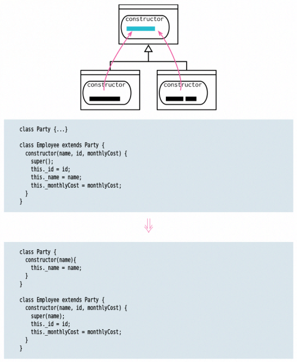

# Pull Up Constructor Body

inverse of: Push Down Field

<!-- TOC -->

- [Pull Up Constructor Body](#pull-up-constructor-body)
    - [思想](#思想)
    - [Motivation](#motivation)
    - [Mechanics](#mechanics)
    - [References](#references)

<!-- /TOC -->

## 思想
消除不必要的重复，统一管理。

## Motivation
1. Constructors are tricky things. They aren’t quite normal methods — so I’m more restricted in what I can do with them. 
2. If I see subclass methods with common behavior, my first thought is to use Extract Function followed by Pull Up Method, which will move it nicely into the superclass. 
3. Constructors tangle that — because they have special rules about what can be done in what order, so I need a slightly different approach.
4. If this refactoring starts getting messy, I reach for Replace Constructor with Factory Function

## Mechanics

## References
* [《重构（第2版）》](https://book.douban.com/subject/33400354/)
