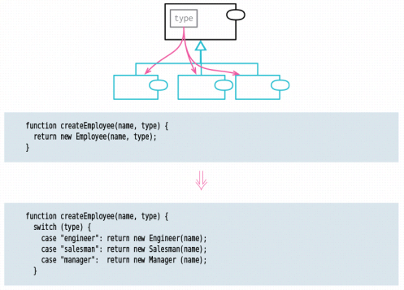

# Replace Type Code with Subclasses

inverse of: Remove Subclass

<!-- TOC -->

- [Replace Type Code with Subclasses](#replace-type-code-with-subclasses)
    - [思想](#思想)
    - [Motivation](#motivation)
        - [创建多个子类相比于单个类兼容多类型的优势](#创建多个子类相比于单个类兼容多类型的优势)
    - [Mechanics](#mechanics)
    - [References](#references)

<!-- /TOC -->

## 思想
和 Replace Conditional with Polymorphism 的思想一样的。如果条件分支里要处理的逻辑比较复杂，不如直接抽出为独立的类。

## Motivation
### 创建多个子类相比于单个类兼容多类型的优势
1. 一个类可以根据不同的传入的类型值呈现出不同的属性和行为。你需要在这个类里面，根据类型值进行不同的逻辑处理。
2. Most of the time, such a type code is all I need. But there are a couple of situations where I could do with something more, and that something more are subclasses. 
3. They allow me to use polymorphism to handle conditional logic. I find this most helpful when I have several functions that invoke different behavior depending on the value of the type code. With subclasses, I can apply Replace Conditional with Polymorphism to these functions.

## Mechanics

## References
* [《重构（第2版）》](https://book.douban.com/subject/33400354/)
