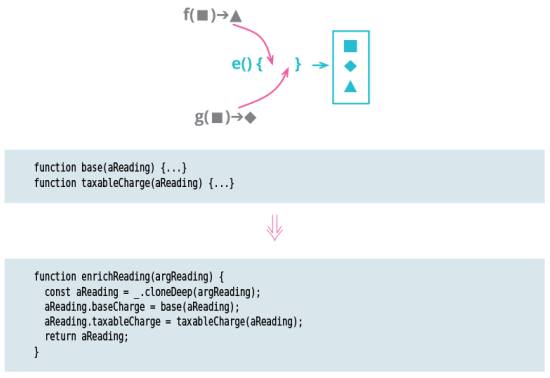

# Combine Functions into Transform

<!-- TOC -->

- [Combine Functions into Transform](#combine-functions-into-transform)
    - [思想](#思想)
    - [Motivation](#motivation)
    - [Mechanics](#mechanics)
    - [References](#references)

<!-- /TOC -->

## 思想

## Motivation
1. Software often involves feeding data into programs that calculate various derived information from it. These derived values may be needed in several places, and those calculations are often repeated wherever the derived data is used. 
2. I prefer to bring all of these derivations together, so I have a consistent place to find and update them and avoid any duplicate logic.
3. One way to do this is to use a data transformation function that takes the source data as input and calculates all the derivations, putting each derived value as a field in the output data. 
4. Then, to examine the derivations, all I need do is look at the transform function.
5. An alternative to Combine Functions into Transform is Combine Functions into Class that moves the logic into methods on a class formed from the source data. Either of these refactorings are helpful, and my choice will often depend on the style of programming already in the software. 
6. But there is one important difference: Using a class is much better if the source data gets updated within the code. 
Using a transform stores derived data in the new record, so if the source data changes, I will run into inconsistencies.
不懂，transform 为什么不能直接引用源数据而要拷贝一份？
7. One of the reasons I like to do combine functions is to avoid duplication of the derivation logic. I can do that just by using Extract Function on the logic, but it’s often difficult to find the functions unless they are kept close to the data structures they operate on. Using a transform (or a class) makes it easy to find and use them.

## Mechanics

1. Create a transformation function that takes the record to be transformed and returns the same values.
    * This will usually involve a deep copy of the record. It is often worthwhile to write a test to ensure the transform does not alter the original record.
2. Pick some logic and move its body into the transform to create a new field in the record. Change the client code to access the new field.
    * If the logic is complex, use Extract Function first.
3. Test.
4. Repeat for the other relevant functions.

## References
* [《重构（第2版）》](https://book.douban.com/subject/33400354/)
