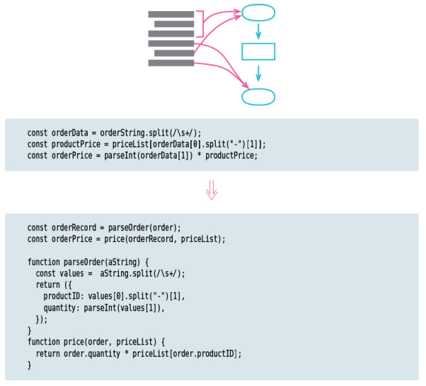

# Split Phase

<!-- TOC -->

- [Split Phase](#split-phase)
    - [思想](#思想)
    - [Motivation](#motivation)
        - [如果一段代码做了两件或者更多的事情，那就把它们分离](#如果一段代码做了两件或者更多的事情那就把它们分离)
        - [这个 bad code 主要是强调一段代码做了两个阶段的事情](#这个-bad-code-主要是强调一段代码做了两个阶段的事情)
        - [编译器的例子](#编译器的例子)
        - [典型的情况就是一个阶段处理输入，然后把处理结果作为输出传递给下一个阶段](#典型的情况就是一个阶段处理输入然后把处理结果作为输出传递给下一个阶段)
    - [Mechanics](#mechanics)
    - [References](#references)

<!-- /TOC -->

## 思想
还是 SRP 思想

## Motivation
### 如果一段代码做了两件或者更多的事情，那就把它们分离
1. When I run into code that’s dealing with two different things, I look for a way to split it into separate modules. 
2. I endeavor to make this split because, if I need to make a change, I can deal with each topic separately and not have to hold both in my head together. 
3. If I’m lucky, I may only have to change one module without having to remember the details of the other one at all.

### 这个 bad code 主要是强调一段代码做了两个阶段的事情
1. One of the neatest ways to do a split like this is to divide the behavior into two sequential phases. 
2. A good example of this is when you have some processing whose inputs don’t reflect the model you need to carry out the logic. 
3. 比如经常可以看到一个发送请求的方法，里面会有两个阶段的逻辑：
    1. 组件参数并发起请求
    2. 处理请求数据和失败处理
4. Before you begin, you can massage the input into a convenient form for your main processing. Or, you can take the logic you need to do and break it down into sequential steps, where each step is significantly different in what it does. 

### 编译器的例子
1. The most obvious example of this is a compiler. 
2. Its a basic task is to take some text (code in a programming language) and turn it into some executable form (e.g., object code for a specific hardware). 
3. Over time, we’ve found this can be usefully split into a chain of phases: 
    1. tokenizing the text, 
    2. parsing the tokens into a syntax tree, 
    3. then various steps of transforming the syntax tree (e.g., for optimization), 
    4. and finally generating the object code. 
4. Each step has a limited scope and I can think of one step without understanding the details of others.

### 典型的情况就是一个阶段处理输入，然后把处理结果作为输出传递给下一个阶段
1. Splitting phases like this is common in large software; the various phases in a compiler can each contain many functions and classes. 
2. But I can carry out the basic split ­phase refactoring on any fragment of code — whenever I see an opportunity to usefully separate the code into different phases. 
3. The best clue is when different stages of the fragment use different sets of data and functions. 
4. By turning them into separate modules I can make this difference explicit, revealing the difference in the code.

## Mechanics

## References
* [《重构（第2版）》](https://book.douban.com/subject/33400354/)
