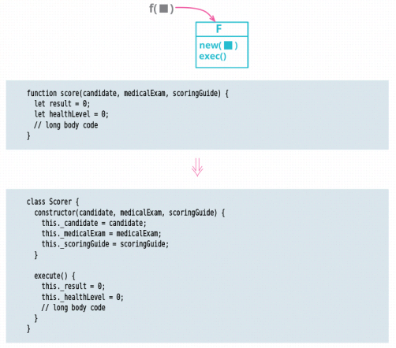

# Replace Function with Command

inverse of: Replace Command with Function

<!-- TOC -->

- [Replace Function with Command](#replace-function-with-command)
    - [思想](#思想)
    - [Motivation](#motivation)
        - [Command 的定义](#command-的定义)
        - [Command 的用途](#command-的用途)
    - [Mechanics](#mechanics)
    - [References](#references)

<!-- /TOC -->

## 思想
1. 一个函数应该只是执行一个单纯的命令，这是 SRP。
2. 但如果你发现，这个命令执行起来会有其他不少附属操作，那就会变得复杂，你可能会需要其他几个函数来辅助，或者还需要独立的数据结构。
3. 这时自然而然的，就发展出了一个对象。

## Motivation
### Command 的定义
1. Functions — either freestanding or attached to objects as methods — are one of the fundamental building blocks of programming. But there are times when it’s useful to encapsulate a function into its own object, which I refer to as a “command object” or simply a command. 
2. Such an object is mostly built around a single method, whose request and execution is the purpose of the object.
3. Like many words in software development, “command” is rather overloaded. In the context I’m using it here, it is an object that encapsulates a request, following the command pattern in Design Patterns [gof]. 
4. When I use “command” in this sense, I use “command object” to set the context, and “command” afterwards. 

### Command 的用途
1. A command offers a greater flexibility for the control and expression of a function than the plain function mechanism. 
2. Commands can have complimentary operations, such as undo. 
3. I can provide methods to build up their parameters to support a richer lifecycle. 
4. I can build in customizations using inheritance and hooks. 
5. If I’m working in a language with objects but without first­class functions, I can provide much of that capability by using commands instead. 
6. Similarly, I can use methods and fields to help break down a complex function, even in a language that lacks nested functions, and I can call those methods directly while testing and debugging. 
7. All these are good reasons to use commands, and I need to be ready to refactor functions into commands when I need to. 
8. But we must not forget that this flexibility, as ever, comes at a price paid in complexity. 
9. So, given the choice between a first­-class function and a command, I’ll pick the function 95% of the time. I only use a command when I specifically need a facility that simpler approaches can’t provide. 

## Mechanics

## References
* [《重构（第2版）》](https://book.douban.com/subject/33400354/)
