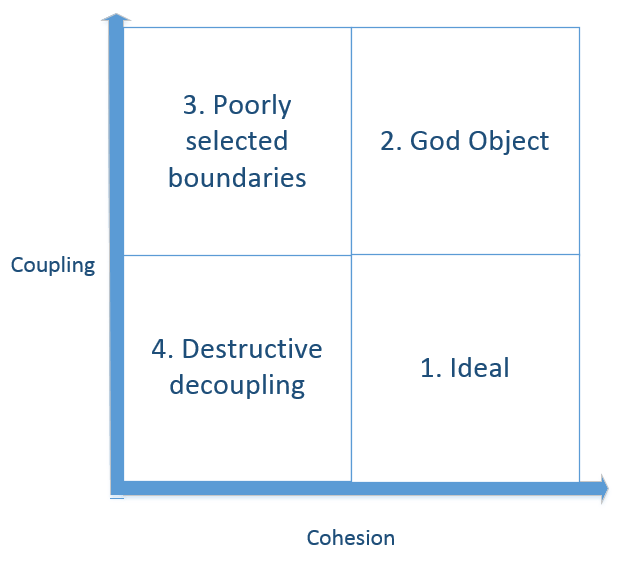
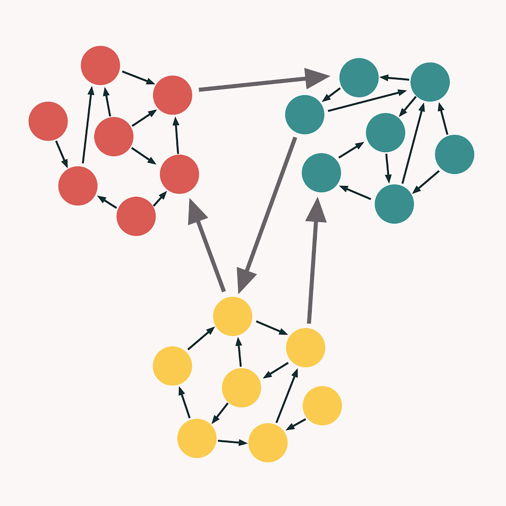
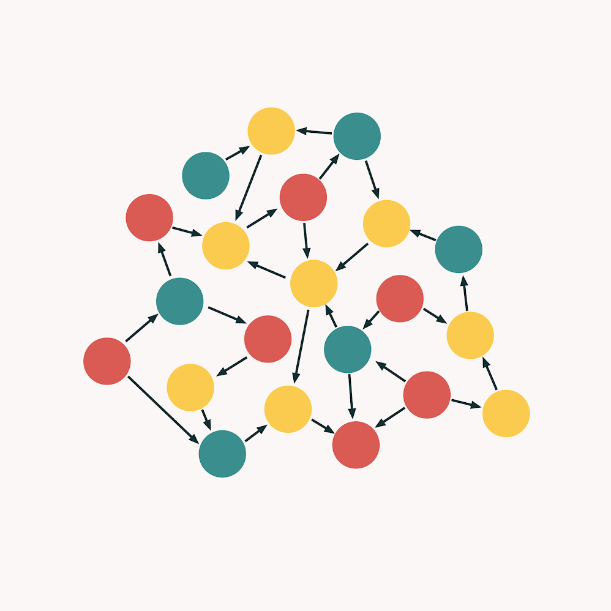
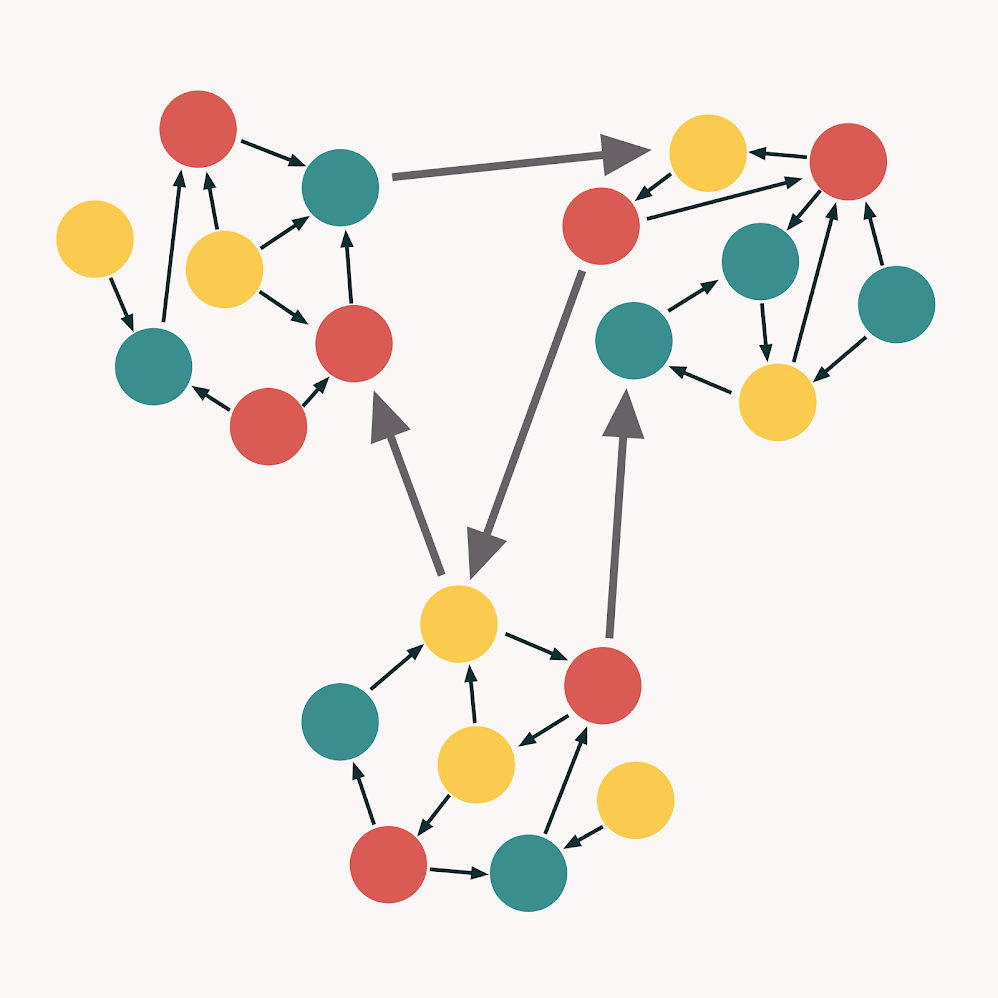
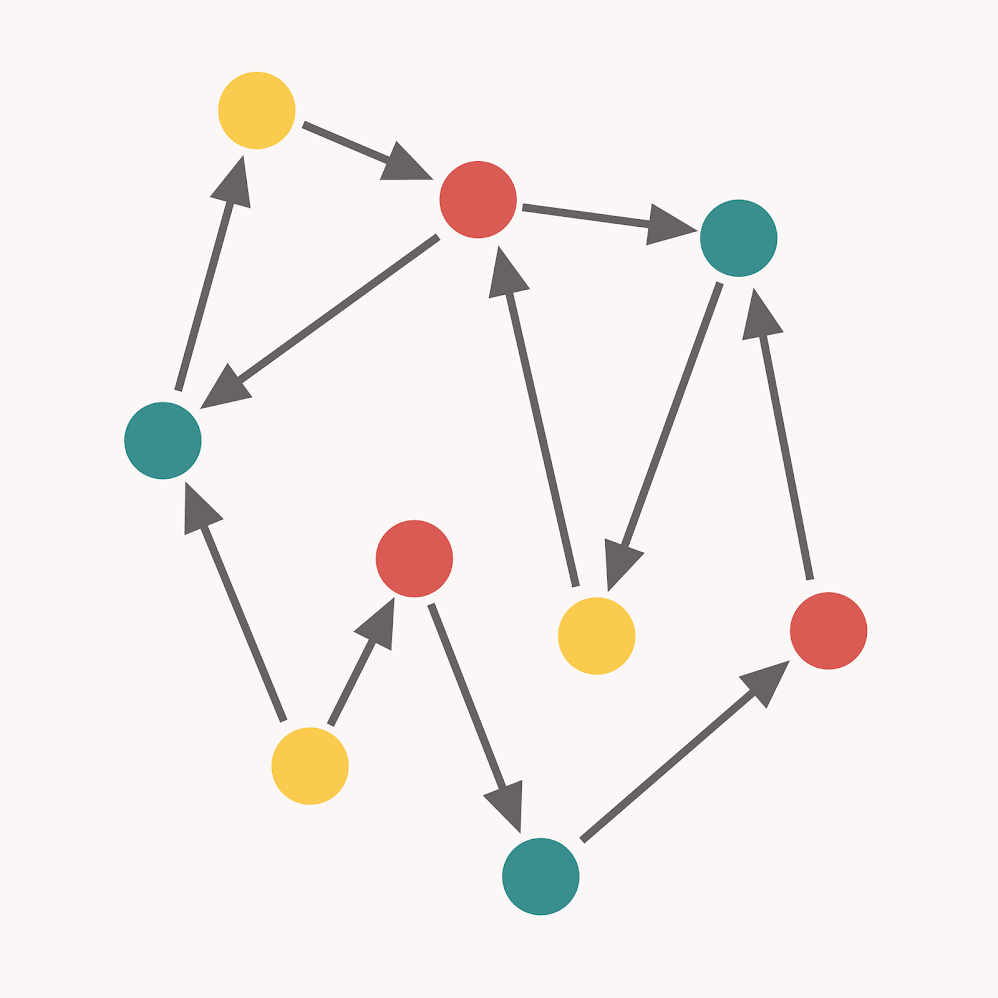

# 低耦合和高内聚

<!-- TOC -->

- [低耦合和高内聚](#低耦合和高内聚)
    - [思想](#思想)
        - [低耦合](#低耦合)
        - [高内聚](#高内聚)
    - [低耦合与高内聚的关系](#低耦合与高内聚的关系)
    - [低耦合](#低耦合-1)
        - [评估耦合程度的几个维度](#评估耦合程度的几个维度)
            - [连接点数量](#连接点数量)
            - [连接点数据影响范围](#连接点数据影响范围)
            - [连接点数据类型](#连接点数据类型)
        - [耦合的类型](#耦合的类型)
            - [语义耦合](#语义耦合)
        - [耦合度高的特征](#耦合度高的特征)
        - [低耦合的好处](#低耦合的好处)
        - [解耦合的权衡](#解耦合的权衡)
            - [耦合度过低会破坏内聚度](#耦合度过低会破坏内聚度)
            - [通用性与效率的权衡](#通用性与效率的权衡)
        - [涉及的 bad codes](#涉及的-bad-codes)
        - [涉及的重构](#涉及的重构)
        - [涉及的设计模式](#涉及的设计模式)
    - [高内聚](#高内聚-1)
        - [高内聚的好处](#高内聚的好处)
        - [涉及的 bad codes](#涉及的-bad-codes-1)
        - [涉及的重构](#涉及的重构-1)
        - [涉及的设计模式](#涉及的设计模式-1)
    - [References](#references)

<!-- /TOC -->

## 思想
### 低耦合
1. 顶层设计原则：ETU 和 $ETC_h$。
2. ETU 是调用环境不需要为了调用而改变太多；$ETC_h$ 是方便扩展。

### 高内聚
1. 顶层设计原则：ETR 和 ETU 和 $ETC_h$。
2. 并没有 $ETC_o$，因为高内聚只是强调放在一起，并没有要求进行封装和隐藏内部实现。

## 低耦合与高内聚的关系
1. 根据耦合度和内聚度两个维度，一个实体的设计可以分为以下四种情况
    
2. 低耦合和高内聚是理想的情况，可以用下图形象的表示
    
3. 第二种情况高耦合高内聚，其实就是大杂烩，各种功能混杂在一起，啥都有，但又很乱
    
4. 第三种情况耦合度很高但内聚度很低，比第二种情况还要更坏一些。同样都是耦合度很高，但第二种情况好歹相同功能的组件还是在一起的，而这里则通过错误的边界划分，进一步增大了理解和使用的难度
    
5. 第四种情况是耦合度和内聚度都很低。这种情况常常是过度解耦合的结果，也就是划分的粒度太细了，把本来应该放在一起的功能都拆分开了
    

## 低耦合
### 评估耦合程度的几个维度
1. 想象两个机构要打交道，要交流和合作，那怎样才算低耦合呢？
2. 首先，最好两个机构分别成立一个小部门专门进行对接，而不是两个机构的多个部门各自为政的进行对接。
3. 其次，一个结构的对接部门最好只是和另一个结构的对接部门对接，而不是深入到对方机构内部和其他部门对接。
4. 还有，对接的部门的对接规则、对接技术等最好都是大家普遍通用的，不要为了对接还要建立不熟悉的规则、引入另外的技术。
5. 这三方面的例子，分别对应下面的三种耦合度评估维度。

#### 连接点数量
1. 两个实体之间最松散的耦合当然是完全没有连接，当然这种情况下也就不能交流了。
2. 在能交流的前提下，最理想的耦合度就是两个实体只有一个连接点，两个实体只需要为对方处理好一个连接点的对接工作就可以交流。
3. 而如果连接点数量很多，两个实体为了实现交流就要做出更多的改变来对接对方，也就是越来越适应对方。越来越适应对方，也就越来越不适应其他的第三方。
4. 例如一个子程序的参数就是和调用方的连接点（返回值也算是一个连接点，不过这里先不考虑）。如果子程序只有一个参数，那么子程序与调用它的调用者之间的连接点的数量就只有一个，调用者只需要处理这一个参数即可。而如果子程序有六个参数，也就是与调用方有六个连接点，那调用方就要为该子程序做更多事情，让自己更多的去适应这个子程序，也就产生了更多的耦合。
5. 不只是子程序，然后实体对外的接口越多则耦合度就越高。
6. Least Knowledge Principle（LKP，或者 Law of Demeter, LoD）其实说的就是这种情况，一个实体尽量少和其他实体发生关系。

#### 连接点数据影响范围
1. 《代码大全2》中的这一条小标题是 “可见性”（Visibility），是说在使用一个模块时如果是明确的传递参数那就是好的，但如果要修改一个全局数据以供模块使用就是不好的。
2. 两个实体交流的数据当然最好是显式传递，而不是隐式的修改一个值，一个偷偷摸摸的行为会被人忽略掉，进而会产生一些问题。但书中的说明并没有明确的体现出这样会增加耦合度。
3. 在大多数情况下，要调用另一个实体时，调用的参数是会特别准备的，大多数情况下参数都是按值传递的。也就是说，传参的方式会尽可能的不影响调用方环境对该参数数据的使用。
4. 而如果是修改全局数据，或者是一个作用域很大的数据，则很有可能该数据也有其他的使用者。那么你这样的修改肯定也会影响到其他地方对该数据的使用，也就是说其他地方也要为这个调用做出调整，也就是增加了耦合度。

#### 连接点数据类型
1. 连接点的数据类型越通用则耦合度越低，不过可能会降低一些效率。
2. 例如一个子程序 `LookupVacationBenefit()`，它根据一个员工的雇佣时间和职位级别来计算该员工的假期数量。
3. 它可以设计成接收 `employee` 对象作为参数，然后内部读取该对象的雇佣时间和职位级别数据进行计算。也可以设计成接收两个更基础的参数，也就是直接的雇佣时间和职位级别，可能这两个参数都是基础的整数值。
4. 如果这个子程序被两个调用方调用，而这两个调用方本身都有 `employee` 对象，那显然第一种设计方法更好，以为可以降低调用方的使用难度，而且也只有一个连接点，耦合度更低。
5. 但是如果两个调用方中有一个并没有 `employee` 对象，该调用方就要仅仅为了使用这个子程序而创建该对象。这种麻烦的原因就是因为 `LookupVacationBenefit()` 的设计耦合了本身有 `employee` 对象的那个调用方。
6. 可以看到，一种设计方法既可能是降低了耦合度，也可能是增加了耦合度，完全要根据实际的使用情况而定。

### 耦合的类型
#### 语义耦合
1. 一个实体不仅使用了另一个实体的语法元素（syntactic element），而且还使用了有关那个实体内部工作细节的语义知识（semantic knowledge）。
2. 《代码大全2》中的例子（5.3）没太看明白，但感觉意思就是：两个实体不仅仅有明确的接口上的耦合，还有隐式的需要知道对方的内部逻辑。
3. 也就是说，当你使用一个实体时，你只看它的接口是不够的，你还需要知道一些它的内部逻辑。
4. 这就要求调用方和被调用方需要一些代码之外的约定，而且除了要求对方接口不要更改以外，还希望对方一直遵守这些私下的约定。

### 耦合度高的特征
一个实体应该有且仅由一个中心思想。如果想给一个实体命名时，发现不能有一个很明确的命名，或者命名时出现 AandB 这样的冲动。

### 低耦合的好处
* 增加易用性：使用一个低耦合的实体不需要太多的连接点，不需要做很多准备工作
* 增加复用性：实体越不耦合具体环境，就越容易复用到其他环境
* 易于修改：一个实体和其他实体或环境关系越少，进行修改时就越不需要考虑影响到其他实体或环境

### 解耦合的权衡
#### 耦合度过低会破坏内聚度
上面四象限中的第四个就是这种情况。

#### 通用性与效率的权衡
1. 从上面评估耦合度的分析可以看到，一个实体如果越需要通用，就越好做到低耦合性。
2. 一个实体只有越不和某些个别环境耦合，才能复用到不同的环境里。也就是说，这个实体不能是为给别环境定制的。
3. 而定制的优点则是更高的效率。就像上面的  `LookupVacationBenefit()`，如果是为有 `employee` 对象的环境定制的话，该环境使用起来效率就会更高。
4. 所以，对于耦合度来说，通用性和效率有时是矛盾的。如果确定实体不需要通用，那就可以好现有环境更多的耦合以追求效率；如果要通用或可能要通用，则还是低耦合会更安全。

### 涉及的 bad codes
* Feature Envy
* Message Chains

### 涉及的重构
* Replace Query with Parameter
* Split Parameter Object

### 涉及的设计模式
* 中介者模式：对象不掌握其他对象的信息，如果必须要其他对象的信息才能处理，那就交给中介代理。

## 高内聚
### 高内聚的好处
* 方便使用
* 易于理解：相关的东西都在一起显然要比散落各处更容易阅读。而且形式上的整体也易于让思维对它形成整体的概念。

### 涉及的 bad codes
* Data Class
* Data Clumps
* Feature Envy
* Long Parameter List
* Shotgun Surgery

### 涉及的重构
* Combine Functions Into Class
* Combine Functions Into Transform
* Combine Variables Into Record
* Inline Class：如果修改散落在好几个 class 里面，那也许这几个 class 逻辑上应该合并为一个
* Inline Function：如果它们应该作为同一个行为，那就可以考虑合并为同一个函数
* Introduce Parameter Object
* Move Function
* Move Statements into Function
* Preserve Whole Object

### 涉及的设计模式

## References
* [*Refactoring: Improving the Design of Existing Code,Second Edition*](https://book.douban.com/subject/30332135/)
* [Cohesion and Coupling: the difference](https://enterprisecraftsmanship.com/posts/cohesion-coupling-difference/)
