# 设计思想层级结构

## 层级逻辑
1. 顶层设计原则是整个程序设计的出发点；
2. 基于这些的目的总结出若干具体的设计原则。这些原则向上对设计目的负责，是为了实现设计目的；向下指导具体编码，作为具体编码的规范；
3. 而在底层实际的编码过程中，如果能遵守中层设计规则，也就能实现顶层设计原则。

## 顶层设计原则
ETR 和 ETU 和 $ETC_h$ 和 $ETC_o$

### 相关原则
* 高内聚和低耦合
* 低耦合和 SRP

## 中层设计规则
SRP OCP 等。

## 底层设计实现
各种设计模式和重构方法等。

## 完整关系
1. 下面的 [DOT](https://en.wikipedia.org/wiki/DOT_(graph_description_language)) 图表使用 [Viz.js](http://viz-js.com/) 绘制，可以通过 VSCode 的 Markdown Preview Enhanced 插件查看
2. 因为 DOT 不支持 Latex 语法，所以 $ETC_h$ 和 $ETC_o$ 分别写为 `ETC_h` 和 `ETC_o`。

```dot
digraph G {

node [shape=record]

YAGNI
ETR -> {语义化 高内聚}
ETU -> {SRP 意图与实现分离 高内聚 帮使用者做它非必要的工作 低耦合 语义化}
ETC_h -> {SRP OCP DRY 意图与实现分离 高内聚 低耦合}
ETC_o -> {封装读取和设置方法 消除非必要的可变性 意图与实现分离}


SRP -> "SRP Bad codes"
"SRP Bad codes" [
label = <{<b>Bad codes</b> 
| Divergent Change
| Large Class and Large Record
| Long Function and Long Module
| Speculative Generality
}>]

SRP -> "SRP 重构方法"
"SRP 重构方法" [
label = <{<b>重构方法</b> 
| Extract Class
| Extract Function
| Remove Flag Argument
| Replace Type Code with Subclasses
| Separate Query from Modifier
| Split Loop
| Split Phase
}>]


OCP -> "OCP Bad codes"
"OCP Bad codes" [
label = <{<b>Bad codes</b> 
| Duplicated Code
}>]

OCP -> "OCP 重构方法"
"OCP 重构方法" [
label = <{<b>重构方法</b> 
| Extract Function
| Split Phase
}>]

OCP -> "OCP 设计模式"
"OCP 设计模式" [
label = <{<b>设计模式</b> 
| 状态模式
| 策略模式
}>]


DRY -> "DRY Bad codes"
"DRY Bad codes" [
label = <{<b>Bad codes</b> 
| Change Value to Reference
| Duplicated Code
}>]


帮使用者做它非必要的工作 -> "帮使用者做它非必要的工作 Bad codes"
"帮使用者做它非必要的工作 Bad codes" [
label = <{<b>Bad codes</b> 
| Long Parameter List
| Replace Parameter with Query
}>]

帮使用者做它非必要的工作 -> "帮使用者做它非必要的工作 重构方法"
"帮使用者做它非必要的工作 重构方法" [
label = <{<b>重构方法</b> 
| Combine Functions into Transform
}>]


消除非必要的可变性 -> "消除非必要的可变性 Bad codes"
"消除非必要的可变性 Bad codes" [
label = <{<b>Bad codes</b> 
| Global Data
| Mutable Data
}>]

消除非必要的可变性 -> "消除非必要的可变性 重构方法"
"消除非必要的可变性 重构方法" [
label = <{<b>重构方法</b> 
| Change Reference to Value
| Encapsulate Collection
| Remove Setting Method
| Replace Derived Variable with Query
| 用常量代替基础类型值
}>]


意图与实现分离 -> "意图与实现分离 Bad codes"
"意图与实现分离 Bad codes" [
label = <{<b>Bad codes</b> 
| MutableData
| Message Chains
| Insider Trading
| Global Data
| Long Parameter List
| Message Chains
}>]

意图与实现分离 -> "意图与实现分离 重构方法"
"意图与实现分离 重构方法" [
label = <{<b>重构方法</b> 
| Encapsulate Collection
| Encapsulate Record
| Encapsulate Variable
| Hide Delegate
| Replace Temp with Query
| 用函数替代判断表达式
}>]

意图与实现分离 -> "意图与实现分离 设计模式"
"意图与实现分离 设计模式" [
label = <{<b>设计模式</b> 
| 代理模式
| 装饰模式
}>]


低耦合 -> "低耦合 Bad codes"
"低耦合 Bad codes" [
label = <{<b>Bad codes</b> 
| Feature Envy
| Message Chains
}>]

低耦合 -> "低耦合 重构方法"
"低耦合 重构方法" [
label = <{<b>重构方法</b> 
| Replace Query with Parameter
}>]

低耦合 -> "低耦合 设计模式"
"低耦合 设计模式" [
label = <{<b>设计模式</b> 
| 中介者模式
}>]


高内聚 -> "高内聚 Bad codes"
"高内聚 Bad codes" [
label = <{<b>Bad codes</b> 
| Data Class
| Data Clumps
| Feature Envy
| Long Parameter List
| Shotgun Surgery
}>]

高内聚 -> "高内聚 重构方法"
"高内聚 重构方法" [
label = <{<b>重构方法</b> 
| Combine Functions Into Class
| Combine Functions Into Transform
| Combine Variables Into Record
| Inline Class
| Inline Function
| Introduce Parameter Object
| Move Statements into Function
| Preserve Whole Object
}>]


语义化 -> "语义化 Bad codes"
"语义化 Bad codes" [
label = <{<b>Bad codes</b> 
| Data Clumps
| Mysterious Name
}>]

语义化 -> "语义化 重构方法"
"语义化 重构方法" [
label = <{<b>重构方法</b> 
| Preserve Whole Object
}>]

}
```

    <!-- 意图与实现分离 -> "Bad code: Data Class" -->

## References
