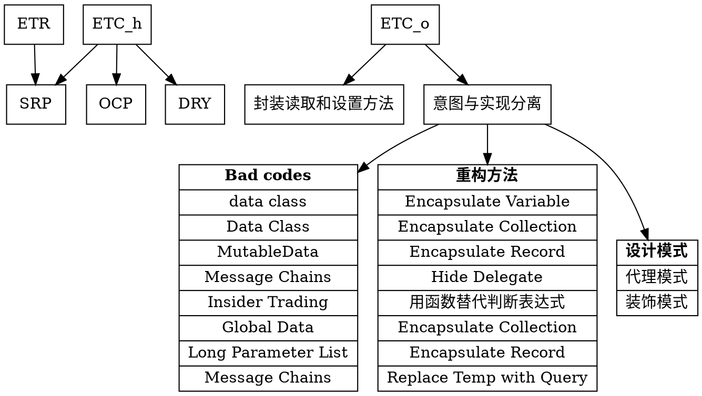

# 设计思想层级结构

## 层级逻辑
1. 顶层设计目的是整个程序设计的出发点；
2. 基于这些的目的总结出若干具体的设计原则。这些原则向上对设计目的负责，是为了实现设计目的；向下指导具体编码，作为具体编码的规范；
3. 而在底层实际的编码过程中，如果能遵守中层设计原则，也就能实现顶层设计目的。

## 顶层设计目的
ETR 和 $ETC_h$ 和 $ETC_o$

## 中层设计原则
SRP OCP 等。

## 底层设计实现
各种设计模式和重构方法等。

## 完整关系
1. 下面的 [DOT](https://en.wikipedia.org/wiki/DOT_(graph_description_language)) 图表使用 [Viz.js](http://viz-js.com/) 绘制，可以通过 VSCode 的 Markdown Preview Enhanced 插件查看
2. 因为 DOT 不支持 Latex 语法，所以 $ETC_h$ 和 $ETC_o$ 分别写为 `ETC_h` 和 `ETC_o`。

    <!-- 意图与实现分离 -> "Bad code: Data Class" -->

## References
