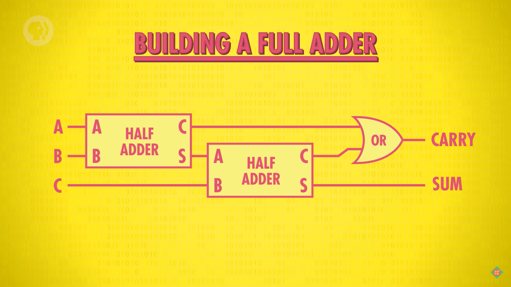

# Summary

## Arithmetic unit
1. 使用异或门可以表示两个位相加的当前为结果，也就是不包括进位
    
2. 再加上一个与门就可以表示进位
    
3. 两个逻辑门组合到一起就组成了一个 **半加器**（half adder）
    
    接收两个位的输入，输出的也是两个位：一个是当前位的结果，一个是进位的结果。
4. 之所以叫半加器，是因为只能处理两个位的相加。如果希望处理当前的两个位和前一个位的进位这三个位的相加，就需要 **全加器**（full adder）
    
5. 可以使用两个半加器组成一个全加器
    
6. 有了半加器和全加器，就可以实现下面的八位二进制数的加法器
    
    第一位因为只有两个输入，所以只需要半加器，剩下的位都需要全加器。
7. 这样的加法器叫做 **8 位行波进位加法器**（8-bit ripple carry adder）。注意最后一位，如果有进位的话，就产生第 9 位。对于这个 8 位加法器来说，就会发生溢出（overflow）。因此 8 位加法器能保存的最大数值是 255。
8. 为了操作更大的数，可以使用位数更多的加法器。更多的位数除了需要更多的逻辑门以外，还会处理更多的进位。虽然每一次进位都很快，但现代计算机计算频率非常高，因此这样频繁的进位也会带来明显的延迟。因此现代计算机的加法电路并不是上面这样的行波进位加法器，而是使用 **超前进位加法器**（carry-look-ahead adder）。

## Logic unit
1. 逻辑单元执行逻辑操作，也能做简单的数值测试。例如，下面的电路检测一个八位值是否为 0
    

## 一个 8 位 ALU 的抽象
1. 如图
    
2. 接收两个 8 位的输入数，还需要一个 4 位的操作码来表明要对两个输入进行怎样的操作；
3. 输出结果是一个 8 位数，以及若干个标志位；
4. 标志位表明计算结果的若干状态，例如结果是否溢出、是否为 0、是否为负等。高级的 ALU 会有更多的标志位。

## References
* [Crash Course Computer Science](https://www.bilibili.com/video/BV1EW411u7th)