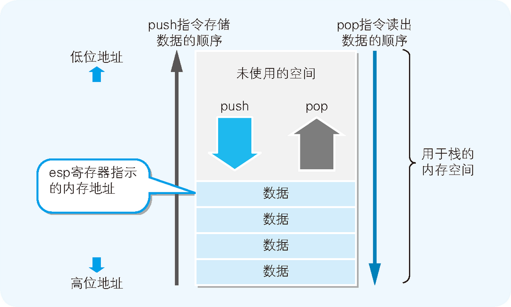

# Summary


<!-- TOC -->

- [Summary](#summary)
    - [汇编语言和本地代码一一对应](#%E6%B1%87%E7%BC%96%E8%AF%AD%E8%A8%80%E5%92%8C%E6%9C%AC%E5%9C%B0%E4%BB%A3%E7%A0%81%E4%B8%80%E4%B8%80%E5%AF%B9%E5%BA%94)
    - [汇编语言的语法](#%E6%B1%87%E7%BC%96%E8%AF%AD%E8%A8%80%E7%9A%84%E8%AF%AD%E6%B3%95)
    - [对栈进行 push 和 pop](#%E5%AF%B9%E6%A0%88%E8%BF%9B%E8%A1%8C-push-%E5%92%8C-pop)
    - [函数调用机制](#%E5%87%BD%E6%95%B0%E8%B0%83%E7%94%A8%E6%9C%BA%E5%88%B6)
    - [References](#references)

<!-- /TOC -->


## 汇编语言和本地代码一一对应
1. 计算机 CPU 能直接解释运行的只有本地代码（机器语言）程序。用 C 语言等编写的源代码，需要通过各自的编译器编译后，转换成本地代码。
2. 通过调查本地代码的内容，可以了解程序最终是以何种形式来运行的。但是，如果直接打开本地代码来看的话，只能看到数值的罗列。如果直接使用这些数值来编写程序的话，还真是不太容易理解。因而就产生了这样一种想法，那就是在各本地代码中，附带上表示其功能的英语单词缩写。例如，在加法运算的本地代码中加上 `add`、在比较运算的本地代码中加上 `cmp`等。这些缩写称为 **助记符**，使用助记符的编程语言称为 **汇编语言**。
3. 这样，通过查看汇编语言编写的源代码，就可以了解程序的本质了。因为这和查看本地代码的源代码，是同一级别的。GCC 中使用命令 `gcc -S test.c` 可以生成汇编文件 `test.asm`。
4. 不过，即使是用汇编语言编写的源代码，最终也必须要转换成本地代码才能运行。负责转换工作的程序称为 **汇编器**，转换这一处理本身称为 **汇编**。在将源代码转换成本地代码这个功能方面，汇编器和编译器是同样的。
5. 用汇编语言编写的源代码，和本地代码是一一对应的。因而，本地代码也可以反过来转换成汇编语言的源代码。持有该功能的逆变换程序称为反汇编程序，逆变换这一处理本身称为 **反汇编**。
6. 用 C 语言编写的源代码，编译后也会转换成特定 CPU 用的本地代码。而将其反汇编的话，就可以得到汇编语言的源代码，并对其内容进行调查。
7. 不过，本地代码变换成 C 语言源代码的反编译（也称为逆向工程），则要比反汇编困难。这是因为，C 语言的源代码同本地代码不是一一对应的。


## 汇编语言的语法
1. 在汇编语言中，1 行表示对 CPU 的一个指令。汇编语言指令的语法结构是 操作码 + 操作数。在汇编语言中，类似于 `mov` 这样的指令称为 **操作码**（opcode），作为指令对象的内存地址及寄存器称为 **操作数**（operand）。
2. 操作码表示的是指令动作，操作数表示的是指令对象。操作码和操作数罗列在一起的语法，就是一个英文的指令文本。 被转换成 CPU 可以直接解析运行的二进制的操作码和操作数，就是本地代码。
3. 以下列 C 原代码进行汇编分析
    ```cpp
    // 返回两个参数值之和的函数
    int AddNum(int a, int b)
    {
        return a + b;
    }

    // 调用 AddNum 函数的函数
    void MyFunc()
    {
        int c;
        c = AddNum(123, 456);
    }
    ```
4. 32 位 x86 系列 CPU 的环境下汇编得到的汇编码如下    
    ```asm
    _TEXT  segment dword public use32 'CODE'
    _TEXT  ends
    _DATA  segment dword public use32 'DATA'
    _DATA  ends
    _BSS   segment dword public use32 'BSS'
    _BSS   ends
    DGROUP group   _BSS,_DATA

    _TEXT  segment dword public use32 'CODE'

    _AddNum        proc    near
    ;
    ;   int AddNum(int a, int b)
    ;
        push      ebp
        mov       ebp,esp
    ;
    ;   {
    ;       return a + b;
    ;
        mov       eax,dword ptr [ebp+8]
        add       eax,dword ptr [ebp+12]
    ;
    ;   }
    ;
        pop       ebp
        ret
    _AddNum        endp

    _MyFunc        proc    near
    ;
    ;   void MyFunc()
    ;
        push      ebp
        mov       ebp,esp
    ;
    ;   {
    ;       int c;
    ;       c = AddNum(123, 456);
    ;
        push      456
        push      123
        call      _AddNum
        add       esp,8
    ;
    ;   }
    ;
        pop       ebp
        ret
    _MyFunc        endp

    _TEXT  ends
        end
    ```
5. 下面是我在 64 位 x64 的环境下汇编得到的
    ```asm
        .file	"pun.c"
        .text
        .globl	_AddNum
        .def	_AddNum;	.scl	2;	.type	32;	.endef
    _AddNum:
    LFB0:
        .cfi_startproc
        pushl	%ebp
        .cfi_def_cfa_offset 8
        .cfi_offset 5, -8
        movl	%esp, %ebp
        .cfi_def_cfa_register 5
        movl	8(%ebp), %edx
        movl	12(%ebp), %eax
        addl	%edx, %eax
        popl	%ebp
        .cfi_restore 5
        .cfi_def_cfa 4, 4
        ret
        .cfi_endproc
    LFE0:
        .globl	_MyFunc
        .def	_MyFunc;	.scl	2;	.type	32;	.endef
    _MyFunc:
    LFB1:
        .cfi_startproc
        pushl	%ebp
        .cfi_def_cfa_offset 8
        .cfi_offset 5, -8
        movl	%esp, %ebp
        .cfi_def_cfa_register 5
        subl	$24, %esp
        movl	$456, 4(%esp)
        movl	$123, (%esp)
        call	_AddNum
        movl	%eax, -4(%ebp)
        nop
        leave
        .cfi_restore 5
        .cfi_def_cfa 4, 4
        ret
        .cfi_endproc
    LFE1:
        .ident	"GCC: (MinGW.org GCC-6.3.0-1) 6.3.0"
    ```
6. 能够使用何种形式的操作码，是由 CPU 的种类决定的。下表是上面 32 位 x86 系列 CPU 汇编代码中的操作码
    <table width="90%" border="1" style="margin-bottom: 10px;">
        <thead>
            <tr>
                    <th>操作码</th>
                    <th>操作数</th>
                    <th>功能</th>
            </tr>
        </thead>
        <tbody>
            <tr>
                <td>mov</td>
                <td>A，B</td>
                <td>把B的值赋给A</td>
            </tr>
            <tr>
                <td>add</td>
                <td>A，B</td>
                <td>把A同B的值相加，并将结果赋给A</td>
            </tr>
            <tr>
                <td>push</td>
                <td>A</td>
                <td>把A的值存储在栈中</td>
            </tr>
            <tr>
                <td>pop</td>
                <td>A</td>
                <td>从栈中读取出值，并将其赋给A</td>
            </tr>
            <tr>
                <td>call</td>
                <td>A</td>
                <td>调用函数A</td>
            </tr>
            <tr>
                <td>ret</td>
                <td>无</td>
                <td>将处理返回到函数的调用源</td>
            </tr>
        </tbody>
    </table>
7. 本地代码加载到内存后才能运行。内存中存储着构成本地代码的指令和数据。程序运行时，CPU 会从内存中把指令和数据读出，然后再将其存储在 CPU 内部的寄存器中进行处理。
8. 寄存器是 CPU 中的存储区域，不过，寄存器并不仅仅具有存储指令和数据的功能，也有运算功能。
9. 寄存器的名称会通过汇编语言的源代码指定给操作数。内存中的存储区域是用地址编号来区分的。CPU 内的寄存器是用 eax 及 ebx 这些名称来区分的。
10. 此外，CPU 内部也有程序员无法直接操作的寄存器。例如，表示运算结果正负及溢出状态的标志寄存器及操作系统专用的寄存器等。


## 对栈进行 push 和 pop
1. 程序运行时，会在内存上申请分配一个称为栈的数据空间。数据在存储时是从内存的下层（大的地址编号）逐渐往上层（小的地址编号）累积，读出时则是按照从上往下的顺利进行的
    
2. 栈是存储临时数据的区域。32 位 x86 系列的 CPU 中，进行 1 次 push 或 pop，即可处理 32 位（4 字节）的数据。
3. push 指令和 pop 指令中只有一个操作数，而不需要指定 “对哪一个地址编号的内存进行 push 或 pop”。这是因为，对栈进行读写的内存地址是由 esp（stack pointer，e 是 extended） 寄存器（栈指针）进行管理的。
4. push 指令和 pop 指令运行后，esp 寄存器的值会自动进行更新（push 指令是 -4，pop 命令是 +4），因而程序员就没有必要指定内存地址了。
    

## 函数调用机制


后面的 TODO


## References
* [程序是怎样跑起来的](https://book.douban.com/subject/26365491/)