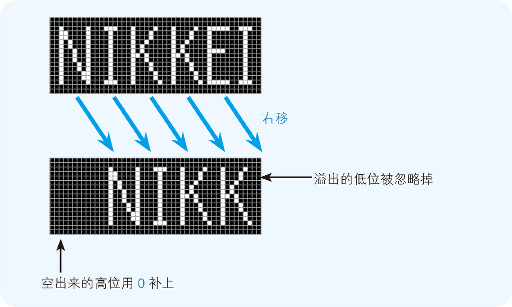

# Summary

<!-- TOC -->

- [Summary](#summary)
    - [设计思想](#设计思想)
        - [减法](#减法)
    - [用二进制数表示计算机信息的原因](#用二进制数表示计算机信息的原因)
    - [补数](#补数)
        - [减法计算](#减法计算)
        - [有符号整数和无符号整数](#有符号整数和无符号整数)
    - [为什么减法要用补数](#为什么减法要用补数)
        - [减数小于等于被减数的十进制减法](#减数小于等于被减数的十进制减法)
        - [减数大于被减数的十进制减法](#减数大于被减数的十进制减法)
        - [二进制减法的情况](#二进制减法的情况)
    - [逻辑右移和算术右移的区别](#逻辑右移和算术右移的区别)
        - [符号扩充](#符号扩充)
    - [References](#references)

<!-- /TOC -->

## 设计思想
### 减法

## 用二进制数表示计算机信息的原因
1. 计算机内部是由 IC 这种电子部件构成的，IC 的所有引脚，只有通电（电压为零）和不通电（电压非零）两个状态。也就是说，IC 的一个引脚，只能表示两个状态。（还存在不接收电流信号的高阻抗（high impedance）状态，但这里暂时不考虑）
2. 当然理论上也可以是使用不同的电压值来表示不同的状态。比如一个引脚，可以有 0V、10V、20V、30V 四种状态。但是实际中，由于干扰或者损耗，电压值可能会发生变化而导致错误的变为其他状态。所以只是有通电和不通电两种状态可以有效的避免这个问题。
3. 一个引脚对应一 **位**（bit），所以比如 32 位微处理器，具有 32 个引脚以用于信息的输入和输出，一次可以处理 32 位（4 字节）的二进制数信息。

## 补数
1. 二进制数中表示负数值时，一般会把最高位作为符号来使用，因此我们把这个最高位称为 **符号位**。符号位是 0 时表示正数，符号位是 1 时表示负数。
2. 那么 $-1$ 用 8 位二进制数来表示的话是什么样的呢？很可能会认为 “$1$ 的二进制数是 $00000001$，因此 $-1$ 就是 $10000001$”，但这个答案是错的，正确答案是 $11111111$。这是因为计算机使用 **补数** 来表述负数。
3. 计算机在做减法运算时，实际上内部是在做加法运算。为了用加法运算来实现减法运算，在表示负数时就需要使用二进制的补数。补数就是用正数来表示负数。
4. 具体的说，是用一个负数的绝对值的补数来表示该负数。例如，我们使用 1 的补数来表示 -1。
5. 补数的定义是：对于给定的进位制，a 的补数是相加后能使自然数 a 的位数增加 1 的最小的数。
6. 那么对于二进制数，为了计算一个数的补数，我们需要将该数的二进制数的各数位的数值全部取反，然后再将结果加 1。这样得到的补数和原数相加就正好满足补数的定义。
7. 例如，为了用 8 位二进制数表示 $-1$ 时，我们要用 $1$ 的补数来表示，也就是 $00000001$ 的补数。具体来说，就是将 $00000001$ 各数位的取反，变成 $11111110$，然后再加 1，最后就转化成了 $11111111$。

### 减法计算
1. 补数的思考方式，虽然直观上不易理解，但逻辑上却非常严谨。以 $1-1$ 为例，也就是 $1 + (-1)$ 这一运算。
2. 首先，让我们将 $-1$ 表示成 $10000001$（错误的表示方法）来运算，$00000001 + 10000001 = 10000010$，很明显结果不是 0。
3. 接下来，让我们把 $-1$ 表示成 $11111111$（正确的表示方法）来进行运算。 $00000001 + 11111111$ 确实为 0。这个运算中出现了最高位溢出的情况，不过，正如之前所介绍的那样，对于溢出的位，计算机会直接忽略掉。
4. 当运算结果为负数时，计算结果的值也是以补数的形式来表示的。比如 $3-5$ 这个运算，用 8 位二进制数表示，$3$ 为 $00000011$，而 $-5$ 为 $00000101$ 的补数，也就是 $11111011$。因此 $3 - 5$ 其实就是 $00000011 + 11111011$ 的运算，结果为 $11111110$，但这是个补数形式。
5. 最高位变成了 1，说明是一个负数。但它是补数形式，我们需要还原成基本的形式才能看出来它的值。该怎么求补数的原数呢？
6. 根据补数的规则可以看出来，一个数和它的补数是互为补数的。所以要求一个补数的原数，只需要对其再次求补数。
7. 那么对上面的负数的补数结果 $11111110$ 再求补数，就会得到负数的绝对值，即 $00000010$。所以上面的结果就是 -2。

### 有符号整数和无符号整数
1. 编程语言包含的整数数据类型中，有的可以处理负数，有的则不能处理。例如，C 语言的数据类型中，既有不能处理负数的 unsigned short 类型，也有能处理负数的 short 类型。
2. 这两种类型，都是 2 字节（16 位）的变量，都能表示 2 的 16 次幂 = 65536 种值，这一点是相同的。不过，值的范围有所不同，short 类型是 -32768～32767，unsigned short 类型是 0～65535。
3. short 类型和 unsigned short 类型的另一个不同点在于，如果二进制数的最高位为 1：short 类型会被看作负数的补数形式，而 unsigned short 类型则会被看做 32768（1000000000000000）以上的值。
4. 注意到 short 类型的负数要比正数多一个，因为在最高位为 0 的所有可能中，有一个要用来表示 0。

## 为什么减法要用补数
1. 根据上面说到的补数的定义，对于十进制来说，对于一个 n 位的自然数 a，它的补数就是 $10^n - a$。或者模仿二进制中取反加一的形式，就是 $10^n - 1 - a + 1$。
2. 例如对 176 求补数，就是 $999 - 176 + 1 = 824$。

### 减数小于等于被减数的十进制减法
1. 减法没有进位，但是有更麻烦的借位。以 $253 - 176$ 为例。
2. 计算机实际的计算中并没有用到借位，而是用下面的方法绕过借位实现减法。
3. 为了避免借位，首先用和减数同位的最大数减去减数，在这里，就是用 999 减去 176，结果为 823。可以看到，这个计算过程并不需要借位。
5. 将求出的数与被减数相加 $823 + 253 = 1076$。
6. 现在还需要减去刚才加上的 999。但是这里可以通过 $+ 1 - 1000$ 来绕过借位。
7. 上面的计算如果使用补数来理解，也就是把 $253 - 176$ 理解为 $253 + (-176)$ 并且把 $-176$ 表示为补数形式 $824$。这样就可以把减法变成加法  $253 + 824$，当然租后还要减去求补数时加上 1000，计算结果就是 $253 + 824 - 1000 = 77$。
8. 把减去一个正数理解为加上一个负数，那么通过求补数保证了让第二个操作数变成了正数。
9. 接下来就是使用已经实现的加法。因为减数小于等于被减数，所以加法的和一定会发生进位，也就是多出一位。
10. 多出一位后，多出来的这一位正好是求补数时加上的，所以直接减去这个最高位就行。

### 减数大于被减数的十进制减法
1. 以 $176 - 253$ 为例。
2. 253 的补数是 747，再加上被减数等于 923，所以计算相当于 $176 + 747 - 1000 = 923 - 1000$。
3. 因为这里减数大于被减数，所以补数和被减数的和不会进位，导致这个和要再减去求补数时加上的 1000 时还是需要借位。
4. 但是因为这里求得的和肯定是小于 999，而又要减去 $999+1$。所以可以颠倒过来用 $999+1$ 减去这个和之后再求相反数。就本例来说，就是 $-(999-923+1) = -77$。这一过程仍然不需要借位。

### 二进制减法的情况
1. $253 - 176$ 的二进制表示是 $11111101 - 10110000$。
2. $10110000$ 求补数，就是 $01001111 + 1 = 01010000$；
3. 减数变成补数后，减法就可以变成加法，也就是 $11111101 + 01010000 = 1 01001101$，进了一位；
4. 然后再减去求补数时加上的 $1 00000000$，其实就是忽略进位，结果就是 $01001101$，即十进制的 77。

## 逻辑右移和算术右移的区别
1. 右移有移位后在最高位补 0 和补 1 两种情况。
2. 当二进制数的值表示图形模式而非数值时，移位后需要在最高位补 0。类似于霓虹灯往右滚动的效果。这就称为 **逻辑右移**
    
3. 将二进制数作为带符号的数值进行运算时，移位后要在最高位填充移位前符号位的值，这就称为 **算术右移**。如果数值是用补数表示的负数值，那么右移后在空出来的最高位补 1，就可以正确地实现 1/2、1/4、1/8 等的数值运算。如果是正数，只需在最高位补 0 即可。
4. 现在我们来看一个右移的例子。将 -4（11111100）右移两位。这时，逻辑右移的情况下结果就会变成 00111111，也就是十进制数 63，显然不对。而算术右移的情况下，结果就会变成 11111111，也就是用补数表示的 -1。    
5. 只有在右移时才必须区分逻辑位移和算术位移。左移时，无论是图形模式（逻辑左移）还是相乘运算（算术左移），都只需在空出来的低位补 0 即可。

### 符号扩充
1. 以 8 位二进制数为例，符号扩充就是指在保持值不变的前提下将其转换成 16 位和 32 位的二进制数。
2. 将 01111111 这个正的 8 位二进制数转换成 16 位二进制数时，很容易就能得出 0000000001111111 这个正确结果。
3. 补数 11111111 这样的数值，该如何处理比较好呢？
4. 因为扩充后要相同，那扩充前后的相反数也要相同。相反数是正数，如果要相同，那么往高位填充的就肯定要是 0。那负数的补数形式前面填充的就要是 1。
5. 所以 11111111 要填充为 1111111111111111。
6. 也就是说，不管是正数还是用补数表示的负数，为了实现符号扩充，都只需用符号位的值（0 或者 1）填充高位即可。

## References
* [程序是怎样跑起来的](https://book.douban.com/subject/26365491/)