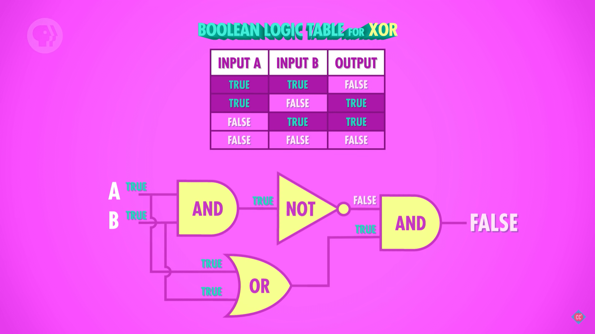

# Boolean Logic

## 一些不同于不同代数的计算规则
### 加法分配律
1. 公式
    $$W + (B× F) = (W + B) × (W + F)$$
2. 左边是全部的 W 加上 B 和 F 的交集；右边的话，是整体求交集，但两边都有 W，所以相交的时候就是 W 和 W 滋镇相交，还是全部的 W；然后再并上 B 和 F 的交集。

### $1$ 表示全集，$0$ 表示空集
1. 例如
    $$1 × F= F$$
    $$0 × F = 0$$
    $$0 + F = F$$
    $$F + (1-F) = 1$$
2. 与传统代数不同的
    $$1 + F = 1$$ 
    $$F × (1-F) = 0$$ 
    $$F × F = F \quad 或者 \quad F^2 = F$$
    $$F + F= F$$

## 例子
### 苏格拉底必有一死
1. 用 P 表示所有人的集合，M 表示必有一死的事物，S 表示苏格拉底的集合。
2. 所有人都难逃一死：$P × M = P$（1）；
3. 苏格拉底是人：$S × P = S$（2）；
4. 把等式（1）带入等式（2）： $S × P × M = S$（3）；
5. 根据结合律将等式（3）改写为：$(S × P) × M = S$（4）；
6. 把等式（2）带入等式（4）：$S × M = S$；

### 选小猫的例子
直接看《编码》“逻辑与开关” 章节。

## 继电器（relay）和晶体管（transistor）
1. 直接看 [Crash Course Computer Science 第二集](https://www.bilibili.com/video/BV1EW411u7th?p=2)。
2. 继电器使用电磁铁的通电与否控制电路的机械开关，进而控制电路的连通和断开；晶体管使用对半导体的通电与否控制半导体是否导电，进而控制电路的连通和断开。
3. 由于使用机械结构的机械运动来实现开关，因此继电器无法高速切换状态，也就是无法进行高速运算。而且频繁运动的机械结构也更容易损坏。
4. 但无论如何，两者的原理都是一样的：通过外部电源控制继电器或晶体管中电路的连通和断开。

## 布尔电路
1. 直接看《编码》“逻辑与开关” 章节。

## 逻辑门
1. 直接看 [Crash Course Computer Science 第三集](https://www.bilibili.com/video/BV1EW411u7th?p=3) 和《编码》“门” 章节。
2. 使用串联电路可以实现与门。两个晶体管都通电，整个电路才会通电
    
3. 使用并联电路可以实现或门。只要有一个晶体管通电，整个电路就会通电
    
4. 按照下面的示意修改晶体管可以实现非门。当有电流接入时，半导体通电，电流流向接地，因此输出端没有电流；没有电流结束时，半导体绝缘，电流可以流向输出端
    
5. 将两个非门并联可以实现 **或非门**（NOR gate）。或非门和或门的输出结果相反，实现如下
    
    只要有一个非门输入为 1，半导体都会通电，C 的输入电流就会流向接地，X 的输出就没有电流；
6. 将两个非门串联可以实现 **与非门**(NAND gate)。与非门和与门的输出结果相反，实现如下
    
    只有两个非门输入都为以 1 时，两个非门都会通电，导致输入电流流向接地；
7. 异或门的实现稍微复杂一点
    

## References
* [Crash Course Computer Science](https://www.bilibili.com/video/BV1EW411u7th)
* [《编码》](https://book.douban.com/subject/20260928/)
* [NOR Gate: What is it?](https://www.electrical4u.com/nor-gate/)
* [transistor-NAND-Gate](https://www.101computing.net/from-transistors-to-micro-processors/transistor-nand-gate/)