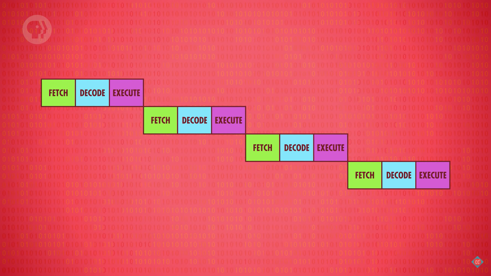

# Advanced CPU Designs —— 提升处理器速度的设计

<!-- TOC -->

- [Advanced CPU Designs —— 提升处理器速度的设计](#advanced-cpu-designs--提升处理器速度的设计)
    - [设计更复杂的指令](#设计更复杂的指令)
    - [CPU 缓存](#cpu-缓存)
    - [指令流水线（instruction pipeline）](#指令流水线instruction-pipeline)
        - [流水线增加了复杂度](#流水线增加了复杂度)
            - [处理依赖](#处理依赖)
            - [分支预测](#分支预测)
    - [超标量处理器（superscalar processor）](#超标量处理器superscalar-processor)
    - [多核和多 CPU](#多核和多-cpu)
    - [References](#references)

<!-- /TOC -->

## 设计更复杂的指令
1. 例如简单的 ALU 可以用减法来计算触发，比如 16 / 4 可以通过连续减 4 来实现。
2. 但这样的计算会用到多个时钟周期，所以现代 CPU 都是直接在硬件层面上设计了除法指令。
3. 更复杂的执行会让运算变得更快，但也会让 CUP 的逻辑电路设计变得更复杂，毕竟现代 CPU 的高级指令可比除法要高级得多。

## CPU 缓存
1. CPU 运算速度要比内存的处理速度快得多，这种情况下内存就成了性能瓶颈。
2. 另一方面，CPU 要和内存通过 **总线**（bus） 交换数据，虽然这段线路的距离只有几厘米，以及信号在其中的传输速度接近光速，但是对于每秒几十亿次的 CPU 计算频率来说，这仍然是可观的延迟。
3. 因此，CPU 通过内置缓存来平衡和内存之间的速度差异。CPU 的缓存通过两个方面来实现这一点：缓存的处理速度本身比内存更快，缓存距离 CPU 更近。
4. 内存使用的存储类型是 DRAM，而 CPU 缓存使用的存储类型是 SRAM。两者的差别如下
    
5. 缓存本身封装在 CPU 内部，所以大大缩减了传输距离。
6. 缓存不仅仅是批量加载内存数据供 CPU 使用，CPU 需要向内存写入数据而正好要写入的地址在当前批量复制进缓存的一批地址里面时，CPU 就可以把数据先写入缓存中以节省时间。
7. 这时，缓存中的数据就和内存中的数据不一样了，因此 CPU 会对这一批数据进行一个标记，通过一个叫做 dirty bit 的标志位。
8. 之后，当需要加载新的缓存来覆盖当前缓存时，先检查一下 dirty bit，如果发现这批缓存有修改，就先把这一批覆盖到内存对应的位置，然后再加载新的缓存。

## 指令流水线（instruction pipeline）
1. 如果没有指令流水线，那 CPU 在一个时钟周期里就只会执行 取指令-解码-执行 三个阶段，然后下一个时钟周期再依次执行这三个阶段
    
2. 负责每个指令的单元都很轻松，因为每个周期都只需要干一次活。但是资本家不允许这样的事情发生，所以有了流水线
    
    现在，每个时钟周期里，每个单元都要干三次活，处理效率变成了原来的三倍。

### 流水线增加了复杂度
#### 处理依赖
1. 没有并行的处理流程中，只有在本条指令的执行阶段结束后，才会发生下一条指令的取指令阶段和解码指令阶段。
2. 而流水线有了并行，本条指令的执行阶段之前可能就会进行下一条指令的取指令阶段，而如果本次指令的指令阶段改变了某个数据，而这个数据又正好是下一条指令取到的数据，那下一条指令就会取到旧的数据。
3. 因此流水线浏览器要处理数据的依赖性，必要时停止流水线，避免出现问题。
4. 高级的处理器会动态的排序有依赖关系的指令，尽量减少流水线的停工时间。这被称为 **乱序执行**（out-of-order execution）。

#### 分支预测
1. 另一个问题是在面对跳转指令时，因为跳转指令会改变执行流的顺序。简单的流水线处理器在遇到跳转指令时会停止流水线，等待跳转指令的结果，然后再继续启动流水线。
2. 高级浏览器则会通过 **分支预测**（branch prediction）算法推测跳转的位置，并将之后的指令放入流水线。这被称为 **推测执行**（speculative execution）。
3. 跳转指令出结果后，如果预测正确则继续执行；如果错误，则需要将推测执行加入流水线的指令清空。现代 CPU 的分支预测正确率已经超过 90%。

## 超标量处理器（superscalar processor）
1. 流水线虽然可以实现并行，但是在同一个时钟周期内，还是只能完整的执行一条指令。而超标量处理器则可以在一个周期内完成多条指令。
2. 从上面流水线的图中可以看到，在同一个时间段（同一列），尽管可以同时进行取指令、解码和执行三个阶段，但不能同时进行两个执行阶段。
3. 但在实际需求中，比如在一个指令的执行阶段，可能需要取一个数据然后进行计算。那么在取数据的时候，ALU 就是空闲的。
4. 这时，如果可以一次取两个指令，依次解码这两个指令，那么在执行阶段，就有可能第一个指令在取数据，第二个指令利用此时空闲的 ALU 进行计算。
5. 更进一步，我们可以多加几条相同的电路，这样就可以同时取指令、解码和执行。不懂，如果三个阶段的电路都同时增加，那执行阶段不是还是有空余吗
     
6. 很多 CPU 都有 4 个、8 个甚至更多 ALU，可以同时执行多个运算。

## 多核和多 CPU
1. 上面的优化方法都是在同一个指令流内尽可能的提升吞吐量，而另一个提升性能的方法就是同时运行多个指令流。
2. 多核浏览器是在一个 CPU 里面有多个处理单元，这些核心经过整合，可以共享一些资源（例如缓存），以及可以合作运算。
3. 当多个核心的单 CPU 还不够时，就会上升到多 CPU。两个、四个直到很多个的超级计算机。

## References
* [Crash Course Computer Science](https://www.bilibili.com/video/BV1EW411u7th)
* [CPU Cache Explained - What is Cache Memory?](https://www.youtube.com/watch?v=yi0FhRqDJfo)
* [Different Types of RAM (Random Access Memory )](https://www.geeksforgeeks.org/different-types-ram-random-access-memory/)