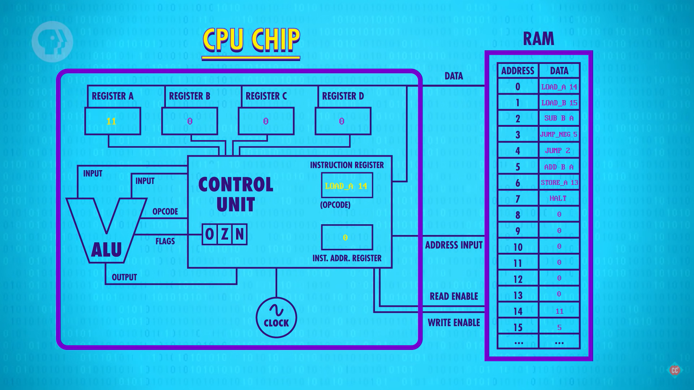
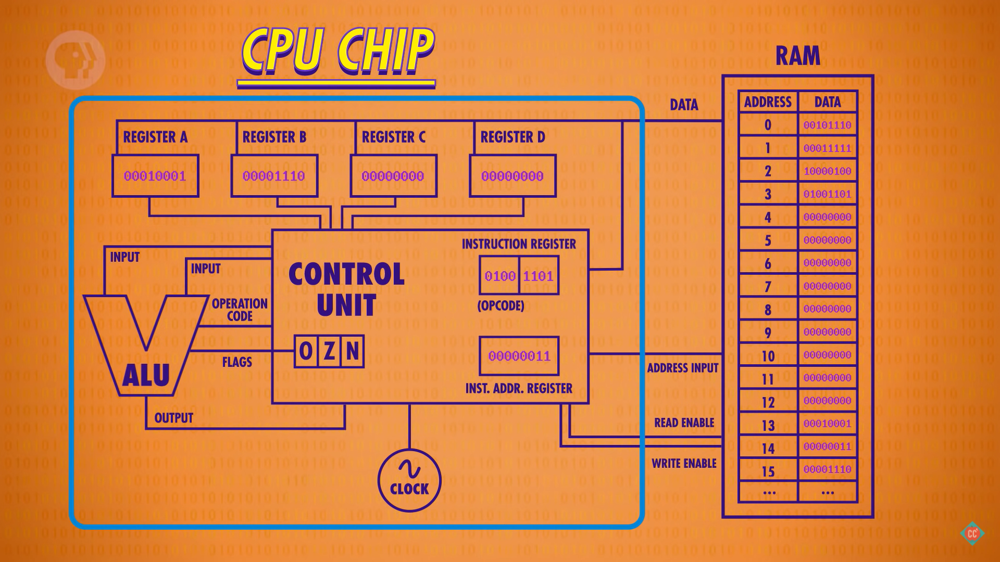

# Microarchitecture

<!-- TOC -->

- [Microarchitecture](#microarchitecture)
    - [指令集和寄存器](#指令集和寄存器)
        - [跳转指令和停止指令](#跳转指令和停止指令)
    - [执行指令](#执行指令)
        - [取指令阶段（fetch phase）](#取指令阶段fetch-phase)
        - [解码阶段（decode phase）](#解码阶段decode-phase)
        - [执行阶段（execute phase）](#执行阶段execute-phase)
    - [完整结构](#完整结构)
    - [References](#references)

<!-- /TOC -->

## 指令集和寄存器
1. 首先是指令集。假设我们的简单 CPU 有以下四种 8bit 指令
    
    * 第一列是指令名；
    * 第二里是该指令的描述；
    * 第三列是指令的前 4bit，是指令的操作码，用来表明执行什么操作；
    * 第四列是指令的后 4bit，用来存储该条指令涉及的数据的地址，该地址可能是内存的也可能是寄存器的。
2. 我们的 CPU 设计有四个寄存器，用来临时保存数据以及操作数据；
3. 另外作为示例，我们需要一个内存。从指令集可以看出来数据地址最多是 4bit，所以我们这里的内存最多只有 16 个地址
    
    可以看到，内存中已经保存了一些数据，这就是我们这个例子中的一小段程序。
4. 我们还需要另外两个特殊功能的寄存器：
    * **指令寄存器**（address register）：保存当前指令的内容；
    * **指令地址寄存器**（instruction address register）：为了追踪程序的运行，这个寄存器保存当前指令的内存地址，以及下一个指令的地址；

### 跳转指令和停止指令

1. 例如循环操作中，执行完循环体后可以通过 `JUMP` 操作跳回到循环体的第一个指令来循环执行。
2. `JUMP` 指令中会包含要跳转到的指令的内存地址，跳转方法是把该地址指令地址寄存器。
3. 对于循环来说，如果只有 `JUMP`，那么循环就会一直执行下去，因此还需要跳出循环的操作。
4. 例如一个循环条件 `while (sum >=0)`，循环体每次会更新 `sum`，`sum` 为非负时则跳转到循环体的第一个指令，否则跳转到循环之后的指令。
5. 这时就可以用到 `JUMP_NEG` 指令，在执行循环的 `JUMP` 之前先执行 `JUMP_NEG`。`JUMP_NEG` 会检查 ALU 输出值是否为负值，是的话跳转到循环之后的那个指令；如果非负的话，则不跳转，顺序的执行下一个指令，也就是 `JUMP` 来继续循环。
6. 而程序的最后一个指令应该是 `HALT` 指令，否则 CPU 就会继续执行后面无意义的指令。
7. 下面是一个例子，实际的过程可以看 [Crash Course Computer Science](https://www.bilibili.com/video/BV1EW411u7th) 第 8 节
    

## 执行指令
### 取指令阶段（fetch phase）

1. 当计算机启动时，所有寄存器的值都是 0，然后开始进入取指令阶段。
2. 将指令地址寄存器连接到内存，该寄存器的值为 0，所以内存返回地址 0 的值 $00101110$。
3. 这个值被复制到指令寄存器中，作为当前要执行的指令。

### 解码阶段（decode phase）
1. 接下来要对拿到的指令解码，明确到底要做什么。
2. $00101110$ 的前四位 $0010$ 表明要执行 `LOAD_A` 操作，也就是说要从后四位的内存地址中读取数据并保存进寄存器 A。
3. 检查操作是否为 `LOAD_A`，可以用下面的电路实现
    
    可以看到，这个电路检查操作码是否是 $0010$，也就是确定是否是 `LOAD_A` 操作。
3. 后四位 $1110$ 是内存地址 14，就是要 `LOAD_A` 操作要读取的数据的内存地址。

### 执行阶段（execute phase）

1. 检查操作是否为 `LOAD_A` 的电路会连接到内存上，如果输出为 1，就会打开内存的 read enable 线；
2. 指令寄存器也连接着内存，所以会把其后四位的地址传递给内存；
3. 内存根据地址读取地址为 14 上数据 $00000011$；
4. 内存要把数据传给暂存数据的四个寄存器，所以就会和这四个寄存器也有连接；
5. 如图显示，内存通过同一根线连接这四个结存器。所以其实内存本身并不是主动的把数据发送给某个特定的寄存器，也是需要指定的内存开启自己的允许写入线，就和往指定锁存器里写入数据的原理一样；
6. 这里，检查操作是否为 `LOAD_A` 的电路也会连接到寄存器 A 上（同样，检查操作是否为 `LOAD_B` 的电路也会连接到寄存器 B 上），所以该电路输出为 1 时，上面的寄存器 A 就会打开允许写入线，而其他三个寄存器并不会打开，因此内存输出的数据就只会写入寄存器 A。
7. 至此，本条指令就执行完成了，我们可以关掉所有的线路。然后，指令地址寄存器的地址数会加一，下一轮取指令就是从下一个地址，在本例中就是地址 1。

## 完整结构
1. 上面例子的第二个指令是从内存读数并保存到寄存器 B；第三个指令是把寄存器 A 和 B 里的数相加，因此 CPU 中还要包括 ALU。
2. 另外，CPU 是通过 **时钟**（clock）来触发执行每一条指令。时钟会按照一定的频率，触发点信号，完成上面执行指令的每一步，然后再推进下一个条指令的执行。
3. 一个 CPU 的完整结构如下
    

## References
* [Crash Course Computer Science](https://www.bilibili.com/video/BV1EW411u7th)