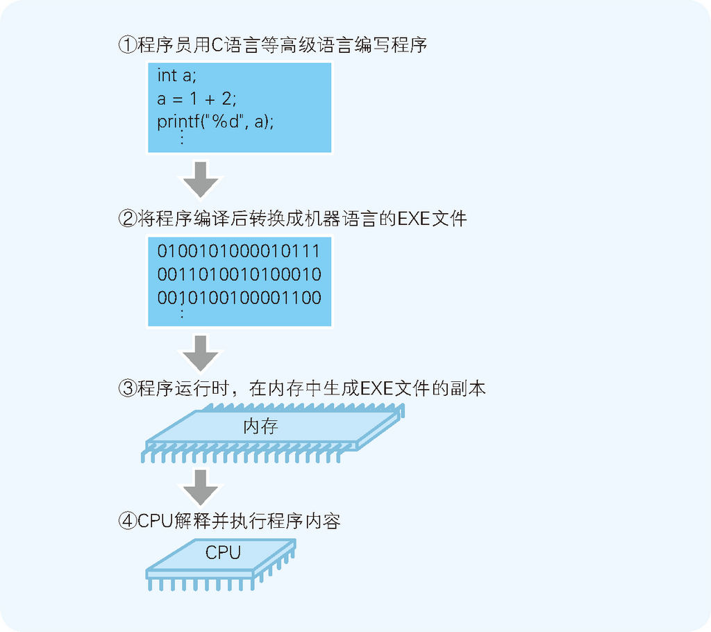
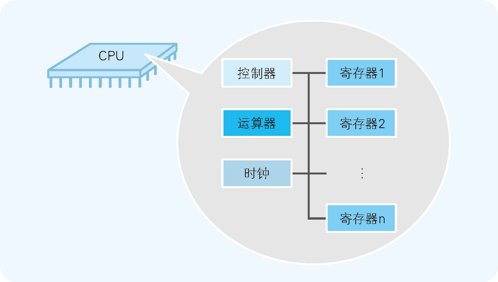
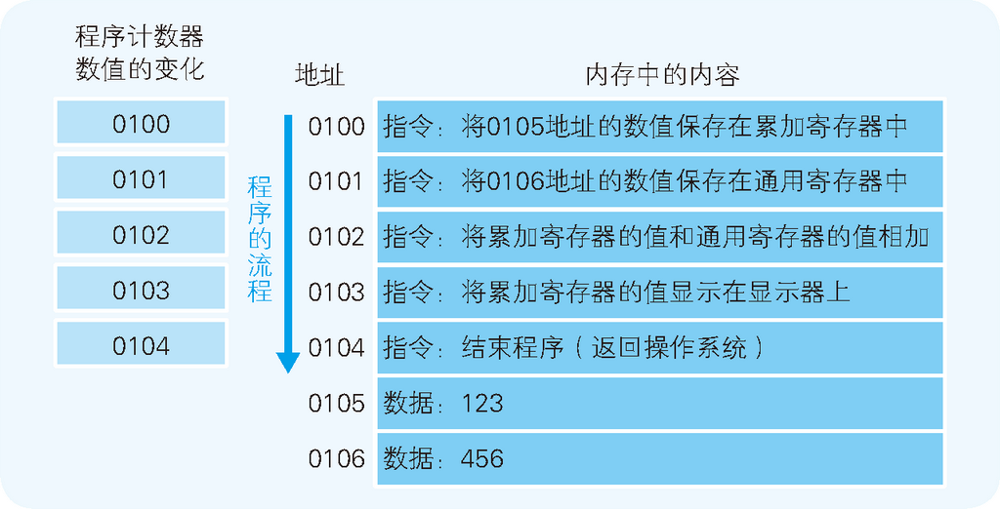
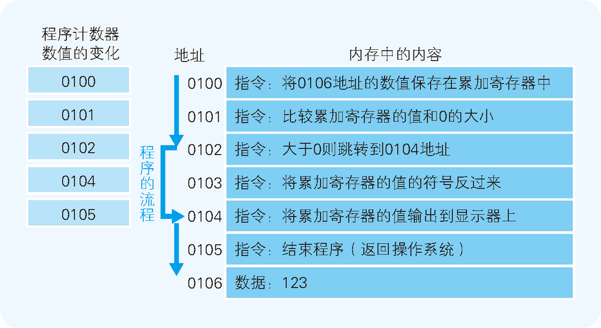
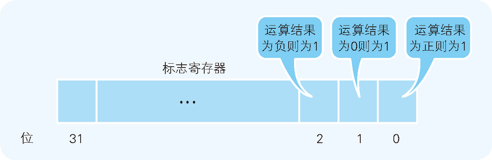
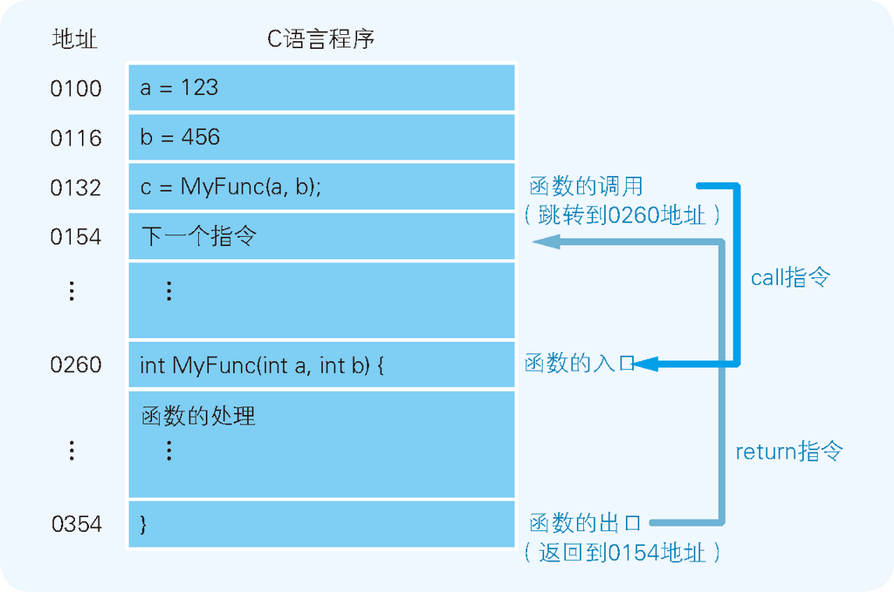
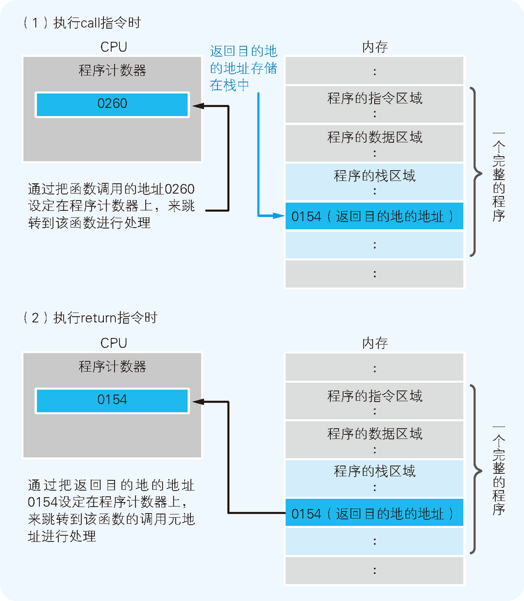
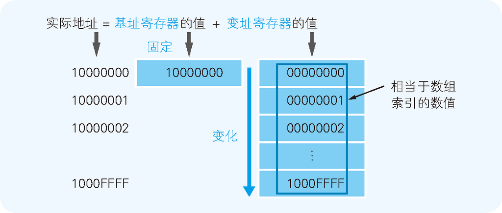

# Summary


<!-- TOC -->

- [Summary](#summary)
    - [CPU 的内部结构解析](#cpu-%E7%9A%84%E5%86%85%E9%83%A8%E7%BB%93%E6%9E%84%E8%A7%A3%E6%9E%90)
    - [CPU 是寄存器的集合体](#cpu-%E6%98%AF%E5%AF%84%E5%AD%98%E5%99%A8%E7%9A%84%E9%9B%86%E5%90%88%E4%BD%93)
        - [寄存器的主要种类和功能](#%E5%AF%84%E5%AD%98%E5%99%A8%E7%9A%84%E4%B8%BB%E8%A6%81%E7%A7%8D%E7%B1%BB%E5%92%8C%E5%8A%9F%E8%83%BD)
        - [CPU 指令的大致类型](#cpu-%E6%8C%87%E4%BB%A4%E7%9A%84%E5%A4%A7%E8%87%B4%E7%B1%BB%E5%9E%8B)
    - [决定程序流程的程序计数器](#%E5%86%B3%E5%AE%9A%E7%A8%8B%E5%BA%8F%E6%B5%81%E7%A8%8B%E7%9A%84%E7%A8%8B%E5%BA%8F%E8%AE%A1%E6%95%B0%E5%99%A8)
    - [条件分支和循环机制](#%E6%9D%A1%E4%BB%B6%E5%88%86%E6%94%AF%E5%92%8C%E5%BE%AA%E7%8E%AF%E6%9C%BA%E5%88%B6)
        - [标志寄存器](#%E6%A0%87%E5%BF%97%E5%AF%84%E5%AD%98%E5%99%A8)
    - [函数的调用机制](#%E5%87%BD%E6%95%B0%E7%9A%84%E8%B0%83%E7%94%A8%E6%9C%BA%E5%88%B6)
    - [通过地址和索引实现数组](#%E9%80%9A%E8%BF%87%E5%9C%B0%E5%9D%80%E5%92%8C%E7%B4%A2%E5%BC%95%E5%AE%9E%E7%8E%B0%E6%95%B0%E7%BB%84)
    - [References](#references)

<!-- /TOC -->


## CPU 的内部结构解析
1. 下图展示了程序运行的一般流程
    
2. CPU 和内存是由许多晶体管组成的电子部件，通常称为 **IC**（Integrated Circuit，集成电路）。从功能方面来看，CPU 的内部由寄存器、控制器、运算器和时钟四个部分构成，各部分之间由电流信号相互连通
    
    
    * **寄存器**：可用来暂存指令、数据等处理对象，可以将其看作是内存的一种。
    * **控制器**：负责把内存上的指令、数据等读入寄存器，并根据指令的执行结果来控制整个计算机。
    * **运算器**：负责运算从内存读入寄存器的数据。
    * **时钟**：负责发出 CPU 开始计时的时钟信号。时钟信号的频率越高，CPU 的运行速度越快。（也有些计算机的时钟位于 CPU 的外部。）
3. 程序启动后，根据时钟信号，控制器会从内存中读取指令和数据。通过对这些指令加以解释和运行，运算器就会对数据进行运算，控制器根据该运算结果来控制计算机。
4. 另外简单地解释一下内存。通常所说的内存指的是计算机的 **主存储器**（main memory），简称主存。主存通过控制芯片等与 CPU 相连，主要负责存储指令和数据。主存由可读写的元素构成，每个字节都带有一个地址编号。CPU 可以通过该地址读取主存中的指令和数据，当然也可以写入数据。


## CPU 是寄存器的集合体
1. CPU 的四个构成部分中，对于程序员来说最重要的是寄存器，因为程序是把寄存器作为对象来描述的。
2. 首先我们来看一下下面的代码，这是用 **汇编语言**（assembly）编写的程序的一部分
    ```
    mov  eax, dword ptr [ebp-8]   # 把数值从内存复制到 eax
    add  eax, dword ptr [ebp-0Ch] # eax 的数值和内存的数值相加
    mov  dword ptr [ebp-4], eax   # 把 eax 的数值（上一步的相加结果）存储在内存中
    ```
3. 汇编语言采用 **助记符**（memonic）来编写程序，每一个原本是电气信号的机器语言指令都会有一个与其相应的助记符。（把汇编语言转化成机器语言的程序称为 **汇编器**（assembler）。）
4. 助记符通常为指令功能的英语单词的简写。例如，`mov` 和 `add` 分别是数据的存储（move）和相加（addition）的简写。
5. 汇编语言和机器语言基本上是一一对应的。这一点和 C 语言、Java 语言等高级编程语言有很大不同，这也是我们使用汇编语言来说明 CPU 运行的原因。
6. 通常我们将汇编语言编写的程序转化成机器语言的过程称为 **汇编**；反之，机器语言程序转化成汇编语言程序的过程则称为 **反汇编**。
7. 上面的代码中，`eax` 和 `ebp` 是 CPU 内部的寄存器的名称。内存的存储场所通过地址编号来区分，而寄存器的种类则通过名字来区分。
8. 使用高级语言编写的程序会在编译后转化成机器语言，然后再通过 CPU 内部的寄存器来处理。

### 寄存器的主要种类和功能
1. 不同类型的 CPU，其内部寄存器的数量、种类以及寄存器存储的数值范围都是不同的。不过，根据功能的不同，我们可以将寄存器大致划分为八类
    <table width="90%" border="1" style="margin-bottom: 10px;">
        <thead>
            <tr>
                <th>种类</th>
                <th>功能</th>
            </tr>
        </thead>
        <tbody>
            <tr>
                <td>累加寄存器（accumulator register）</td>
                <td>存储执行运算的数据和运算后的数据</td>
            </tr>
            <tr>
                <td>标志寄存器（flag register）</td>
                <td>存储运算处理后的CPU的状态</td>
            </tr>
            <tr>
                <td>程序计数器（program counter）</td>
                <td>存储下一条指令所在内存的地址</td>
            </tr>
            <tr>
                <td>基址（base pointer）寄存器</td>
                <td>存储数据内存的起始地址</td>
            </tr>
            <tr>
                <td>变址寄存器（index register）</td>
                <td>存储基址寄存器的相对地址</td>
            </tr>
            <tr>
                <td>通用寄存器（general purpose register）</td>
                <td>存储任意数据</td>
            </tr>
            <tr>
                <td>指令寄存器（instruction register）</td>
                <td>存储指令。CPU内部使用，程序员无法通过程序对该寄存器进行读写操作</td>
            </tr>
            <tr>
                <td>栈寄存器（stack register）</td>
                <td>存储栈区域的起始地址</td>
            </tr>
        </tbody>
    </table>
2. 可以看出，寄存器中存储的内容既可以是指令也可以是数据。其中，数据分为 “用于运算的数值” 和 “表示内存地址的数值” 两种。
3. CPU 中每个寄存器的功能都是不同的。用于运算的数值放在累加寄存器中存储，表示内存地址的数值则放在基址寄存器和变址寄存器中存储。上面汇编代码中用到的 `eax` 和 `ebp` 分别是累加寄存器和基址（base pointer，e 是 extended）寄存器。
4. 程序计数器、累加寄存器、标志寄存器、指令寄存器和栈寄存器都只有一个，其他的寄存器一般有多个。

### CPU 指令的大致类型
<table width="90%" border="1" style="margin-bottom: 10px;">
    <thead>
        <tr>
            <th>类型</th>
            <th>功能</th>
        </tr>
    </thead>
    <tbody>
        <tr>
            <td>数据转送指令</td>
            <td>寄存器和内存、内存和内存、寄存器和外围设备之间的数据读写操作</td>
        </tr>
        <tr>
            <td>运算指令</td>
            <td>用累加寄存器执行算术运算、逻辑运算、比较运算和移位运算</td>
        </tr>
        <tr>
            <td>跳转指令</td>
            <td>实现条件分支、循环、强制跳转等</td>
        </tr>
        <tr>
            <td>call/return指令</td>
            <td>函数的调用/返回调用前的地址</td>
        </tr>
    </tbody>
</table>


## 决定程序流程的程序计数器
1. 用户发出启动程序的指示后，操作系统会把硬盘中保存的程序复制到内存中。下图是示例程序启动时内存内容的模型，示例程序实现的是将 123 和 456 两个数值相加，并将结果输出到显示器上
    
2. 存储指令和数据的内存，是通过地址来划分的。实际上，一个命令和数据通常被存储在多个地址上，但为了便于说明，这里我们把指令、数据分配到了一个地址中。
3. 地址 0100 是程序运行的开始位置。操作系统把程序从硬盘复制到内存后，会将程序计数器设定为 0100，然后程序便开始运行。
4. CPU 每执行一个指令，程序计数器的值就会自动加 1。（当执行的指令占据多个内存地址时，增加与指令长度相应的数值）。
5. 然后，CPU 的控制器就会参照程序计数器的数值，从内存中读取命令并执行。也就是说，程序计数器决定着程序的流程。


## 条件分支和循环机制
1. 程序的流程分为顺序执行、条件分支和循环三种。顺序执行的情况比较简单，每执行一个指令程序计数器的值就自动加上该条指令的长度值。
2. 但若程序中存在条件分支和循环，机器语言的指令就可以将程序计数器的值设定为任意地址。这样一来，程序便可以返回到上一个地址来重复执行同一个指令，或者跳转到任意地址。
3. 接下来，我们就以条件分支为例来说明。下图表示把内存中存储的数值（123）的绝对值输出到显示器的程序的内存状态
    
4. 程序运行的开始位置是 0100 地址。随着程序计数器数值的增加，当到达 0102 地址时：如果累加寄存器的值是正数，则执行跳转指令（`jump` 指令）跳转到 0104 地址。
5. 此时，由于累加寄存器的值是 123，为正数，因此 0103 地址的指令被跳过，程序的流程直接跳转到了 0104 地址。
6. 也就是说，“跳转到 0104 地址” 这个指令间接执行了 “将程序计数器设定成 0104 地址” 这个操作。

### 标志寄存器
1. 条件分支和循环中使用的跳转指令，会参照当前执行的运算结果来判断是否跳转。无论当前累加寄存器的运算结果是负数、零还是正数，标志寄存器都会将其保存。
2. CPU 在进行运算时，标志寄存器的数值会根据运算结果自动设定。下图 32 位 CPU（寄存器的长度是 32 位）的标志寄存器的示例
    
    标志寄存器的第一个字节位、第二个字节位和第三个字节位的值为 1 时，表示运算结果分别为正数、零和负数。
3. 条件分支在跳转指令前会进行比较运算，由 CPU 在参考标志寄存器的数值后进行判断。
4. 程序中的比较指令，就是在 CPU 内部做减法运算，然后将正数、零或是负数的结果保存到标志寄存器中，作为比较操作的结果。


## 函数的调用机制
1. 函数调用处理也是通过把程序计数器的值设定成函数的存储地址来实现的。不过，这和条件分支、循环的机制有所不同，因为单纯的跳转指令无法实现函数的调用。函数的调用需要在完成函数内部的处理后，处理流程再返回到函数调用点（函数调用指令的下一个地址）。
2. 下图是给变量 `a` 和 `b` 分别代入 123 和 456 后，将其赋值给参数来调用 `MyFunc` 函数的 C 语言程序
    
    图中的地址是将 C 语言编译成机器语言后运行时的地址，由于 1 行 C 语言程序在编译后通常会变成多行的机器语言，所以图中的地址是离散的。
3. 通过跳转指令把程序计数器的值设定成 0260 可以实现调用 MyFunc 函数。
4. 函数的调用原点（0132 地址）和被调用函数（0260 地址）之间的数据传递，可以通过内存或寄存器来实现。
5. 不过，当函数处理进行到最后的 0354 地址时，我们知道应该将程序计数器的值设定成函数调用后要执行的 0154 地址，应该怎么实现呢？
6. 机器语言的 `call` 指令和 `return` 指令能够解决这个问题。
7. 函数调用使用的是 `call` 指令，而不是跳转指令。在将函数的入口地址设定到程序计数器之前，`call` 指令会把调用函数后要执行的指令地址存储在名为栈的主存内。
8. 函数处理完毕后，再通过函数的出口来执行 `return` 命令。`return` 命令的功能是把保存在栈中的地址设定到程序计数器中。
9. 如下图所示，`MyFunc` 函数被调用之前，0154 地址保存在栈中。`MyFunc` 函数的处理完毕后，栈中的 0154 地址就会被读取出来，然后再被设定到程序计数器中
    


## 通过地址和索引实现数组
1. 接下来我们看一下上面提到的 **基址寄存器** 和 **变址寄存器**。通过这两个寄存器，我们可以对主内存上特定的内存区域进行划分，从而实现类似于数组的操作。
2. 首先，我们用十六进制数将计算机内存上 00000000～FFFFFFFF 的地址划分出来。那么，凡是该范围的内存区域，只要有一个 32 位的寄存器，即可查看全部的内存地址。
3. 但如果想要像数组那样分割特定的内存区域以达到连续查看的目的，使用两个寄存器会更方便些。例如，查看 10000000 地址～1000FFFF 地址时，如下图所示，可以将 10000000 存入基址寄存器，并使变址寄存器的值在 00000000～0000FFFF 变化，CPU 则会把 基址寄存器＋变址寄存器 的值解释为实际查看的内存地址
    
    变址寄存器的值就相当于高级编程语言程序中数组的索引功能。


## References
* [程序是怎样跑起来的](https://book.douban.com/subject/26365491/)