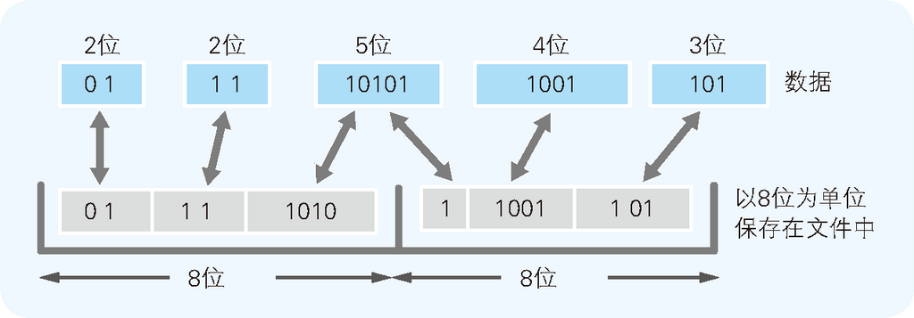
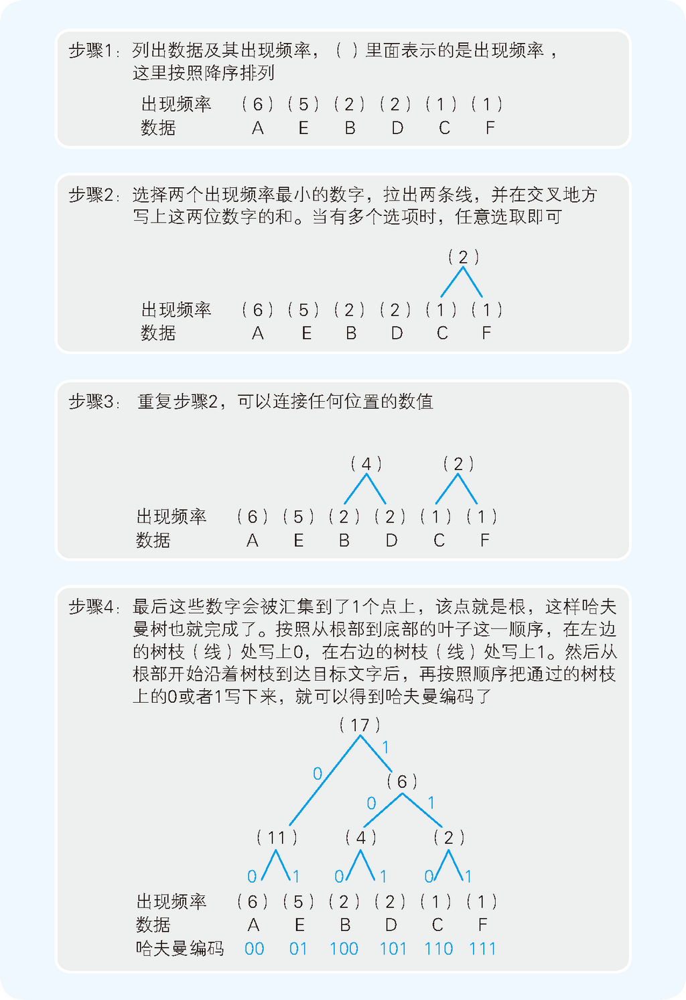

# Summary

<!-- TOC -->

- [Summary](#summary)
    - [RLE 算法的机制](#rle-算法的机制)
    - [哈夫曼算法](#哈夫曼算法)
        - [用二叉树实现哈夫曼编码](#用二叉树实现哈夫曼编码)
    - [References](#references)

<!-- /TOC -->

##　RLE 算法的机制
1. **RLE**（Run Length Encoding，行程长度编码）算法是将文件的内容用 “数据 × 重复次数” 这样的表现方式来压缩呢。
2. 让我们来尝试一下对存储着 AAAAAABBCDDEEEEEF 这 17 个半角字符的文件（文本文件）进行压缩。
3. 由于半角字母中，1 个字符是作为 1 个字节的数据被保存在文件中的。因此上述文件的大小就是 17 个字节。
4. 在这个例子中，不难看出有不少字符是重复出现的。在字符后面加上重复出现次数，AAAAAABBCDDEEEEEF 就可以用 A6B2C1D2E5F1 来表示。
5. RLE 算法经常被用于压缩黑白图像等，由于黑白图像的数据中，白或黑通常是部分连续的，这样压缩效率就得到了大幅提升。
6. 然而，在实际的文本文件中，同样字符多次重复出现的情况并不多见，所以 RLE 它并不适合文本文件的压缩。例如下面使用 RLE 算法压缩程序对三种类型的文件进行过压缩测试
    <table width="90%" border="1">
        <thead>
            <tr>
                <th>文件类型</th>
                <th>压缩前文件大小</th>
                <th>压缩后文件大小</th>
                <th>压缩比率</th>
            </tr>
        </thead>
        <tbody>
            <tr>
                <td>文本文件</td>
                <td>14862 字节</td>
                <td>29506 字节</td>
                <td>199%</td>
            </tr>
            <tr>
                <td>图像文件</td>
                <td>96062 字节</td>
                <td>38328 字节</td>
                <td>40%</td>
            </tr>
            <tr>
                <td>EXE 文件</td>
                <td>24576 字节</td>
                <td>15198 字节</td>
                <td>62%</td>
            </tr>
        </tbody>
    </table>
    因为普通文本文件中同样字符连续出现的部分并不多，所以 RLE 为字符添加长度值反而增加了总长度。
7. 当然，RLE 算法也可以不以 1 个字符或一个字节为单位，而以字符串或字节串为单位来查找重复次数，从而优化压缩效率。

## 哈夫曼算法
1. 例如，在某一个文本文件中，A 出现了 100 次左右，Q 仅用到了 3 次，类似这样的情况是很常见的。而哈夫曼（Huffman）算法的关键就在于 “多次出现的数据用小于 8 位的字节数来表示，不常用的数据则可以用超过 8 位的字节数来表示”。
2. A 和 Q 都用 8 位来表示时，原文件的大小就是 $100×8 + 3×8= 824$ 位，而假设 A 用 2 位、Q 用 10 位来表示，压缩后的大小就是 $100×2 + 3×10 = 230$ 位。
3. 不过有一点需要注意，不管是不满 8 位的数据，还是超过 8 位的数据，最终都要以 8 位为单位保存到文件中。这是因为磁盘是以字节为单位来保存数据的。为了实现这一处理，压缩程序的内容会复杂很多，不过作为回报，最终得到的压缩率也是相当高的
    

### 用二叉树实现哈夫曼编码
1. 以文本为例，不同类型的文本里面的字符的频率不同的。因此，在对文本进行压缩时，就要针对具体的类型来为不同的字符设置合适的位数。
2. 哈夫曼算法会为不同类型的压缩对象构造最佳的编码体系，并以该编码体系为基础来进行压缩。因此，用什么样式的编码（哈夫曼编码）对数据进行分割，就要为各类文件制定相应的编码信息。因此，用哈夫曼算法压缩过的文件中，也会同时存储着哈夫曼编码信息和压缩过的数据。
3. 接下来，我们尝试一下把 AAAAAABBCDDEEEEEF 中的字符，按照 “出现频率高的字符用尽量少的位数编码来表示” 这一原则进行整理。按照出现频率从高到低的顺序整理后，结果就如下表所示。该表中同时也列出了编码的方案
    <table width="90%" border="1">
        <thead>
            <tr>
                <th>字符</th>
                <th>出现频率</th>
                <th>编码（方案）</th>
                <th>位数</th>
            </tr>
        </thead>
        <tbody>
            <tr>
                <td>A</td>
                <td>6</td>
                <td>0</td>
                <td>1</td>
            </tr>
            <tr>
                <td>E</td>
                <td>5</td>
                <td>1</td>
                <td>1</td>
            </tr>
            <tr>
                <td>B</td>
                <td>2</td>
                <td>10</td>
                <td>2</td>
            </tr>
            <tr>
                <td>D</td>
                <td>2</td>
                <td>11</td>
                <td>2</td>
            </tr>
            <tr>
                <td>C</td>
                <td>1</td>
                <td>100</td>
                <td>3</td>
            </tr>
            <tr>
                <td>F</td>
                <td>1</td>
                <td>101</td>
                <td>3</td>
            </tr>
        </tbody>
    </table>
4. 不过，这个编码体系是存在问题的。该问题就是，例如 100 这个 3 位的编码，我们该如何解释它？“1 0 0”？“10 0”？“100”？因此，如果不加入用来区分字符的符号，这个编码方案就无法使用。
5. 而在哈夫曼算法中，通过借助哈夫曼树构造编码体系，即使在不使用字符区分符号的情况下，也可以构建能够明确进行区分的编码体系。
6. 接下来我们就来看一下如何制作哈夫曼树。自然界的树是从根开始生枝长叶的，而哈夫曼树则是从叶开始的。下图展示了对 AAAAAABBCDDEEEEEF 进行编码的哈夫曼树的制作过程
    
7. 使用哈夫曼树后，出现频率越高的数据所占用的数据位数就越少，而且数据的区分也可以很清晰地实现。因为在用枝条连接数据时，我们是从出现频率较低的数据开始的，这就意味着出现频率越低的数据到达根部的枝条数就越多。而枝条数越多，编码的位数也就随之增多了。
8. 而从用哈夫曼算法压缩过的文件中读取数据后，就会以位为单位对该数据进行排查，并与哈夫曼树进行比较看是否到达了目标编码。
9. 再看一下哈夫曼算法的压缩比率。用上图得到的哈夫曼编码表示 AAAAAABBCDDEEEEEF，结果为 0000000000001001001101011010101010101111，40 位 = 5 字节（这里没有包含哈夫曼编码信息的情况）。我们得到了 $5 ÷ 17 ≒ 29%$ 这样高的压缩率。
10. 下表是上面 RLE 压缩测试的三个文件使用应用了哈夫曼算法的压缩工具进行压缩后的结果。可以看出，不管是哪种类型的文件，都得到了很高的压缩比率
    <table width="90%" border="1">
        <thead>
            <tr>
            <th>文件类型</th>
            <th>压缩前</th>
            <th>压缩后</th>
            <th>压缩比率</th>
            </tr>
        </thead>
        <tbody>
            <tr>
            <td>文本文件</td>
            <td>14 862字节</td>
            <td>4119字节</td>
            <td>28%</td>
            </tr>
            <tr>
            <td>图像文件</td>
            <td>96 062字节</td>
            <td>9456字节</td>
            <td>10%</td>
            </tr>
            <tr>
            <td>EXE文件</td>
            <td>24 576字节</td>
            <td>4652字节</td>
            <td>19%</td>
            </tr>
        </tbody>
    </table>

## References
* [程序是怎样跑起来的](https://book.douban.com/subject/26365491/)