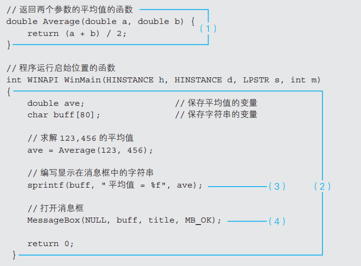
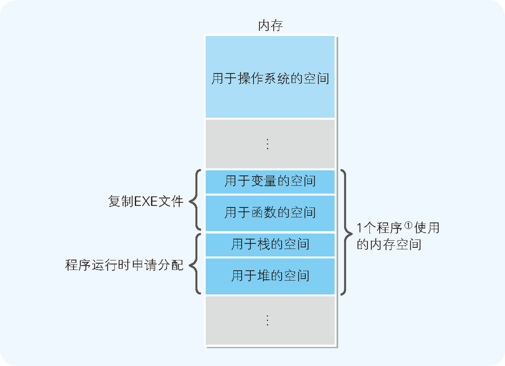

# Summary

<!-- TOC -->

- [Summary](#summary)
    - [编译和链接](#编译和链接)
        - [编译](#编译)
        - [链接](#链接)
    - [LL 文件及导入库](#ll-文件及导入库)
    - [再配置信息](#再配置信息)
    - [栈和堆](#栈和堆)
    - [References](#references)

<!-- /TOC -->

## 编译和链接
### 编译
1. 能够把 C 语言等高级编程语言编写的源代码转换成本地代码的程序称为编译器。每个编写源代码的编程语言都需要其专用的编译器。将 C 语言编写的源代码转换成本地代码的编译器称为 C 编译器。
2. 编译器首先读入代码的内容，然后再把源代码转换成 **本地代码**。
3. 根据 CPU 类型的不同，本地代码的类型也不同。因而，编译器不仅和编程语言的种类有关，和 CPU 的类型也是相关的
    
4. 因为编译器本身也是程序的一种，所以也需要运行环境。例如，有 Windows 用的 C 编译器、Linux 用的 C 编译器等。此外，还有一种交叉编译器，它生成的是和运行环境中的 CPU 不同的 CPU 所使用的本地代码。
5. 因此，在确定使用哪一种编译器，需要考虑三方面：
    * 要编译哪种语言
    * 编译生成的本地代码用于哪种 CPU
    * 编译器在哪种环境中使用
6. 编译器是在运行前对所有源代码进行解释处理的；而解释器则是在运行时对源代码的内容一行一行地进行解释处理的。    

### 链接
1. 编译后生成的不是 EXE 文件，而是扩展名为 “.obj” 的目标文件。虽然目标文件的内容是本地代码，但却无法直接运行。因为当前程序还处于未完成状态，编译之后还需要进行 “链接” 处理。
2. 参考下面代码
    
3. （1）围起来的函数 `Average()` 同（2）围起来的函数 `WinMain()` 是程序员自己作成的，处理内容记述在源代码中。（3）指出的 `sprintf()` 函数和（4）指出的 `MessageBox()` 函数并不在当前文件的源代码。
4. 因此，在对当前文件编译生成 obj 文件后，还必须将存储着 `sprintf()` 和 `MessageBox()` 的处理内容的目标文件同当前 obj 结合，否则处理就不完整，EXE 文件也就无法完成。
5. 把多个目标文件结合，生成 1 个 EXE 文件的处理就是链接，运行连接的程序就称为 **链接器**。
    
    
## LL 文件及导入库
1. Windows 以函数的形式为应用提供了各种功能。上面示例代码中调用的 `MessageBox()`，它并不是 C 语言的标准函数，而是 Windows 提供的 API 的一种。
2. Windows 中，API 的目标文件，并不是存储在通常的库文件中，而是存储在名为 **DLL**（Dynamic Link Library）文件的特殊库文件中。就如 Dynamic 这一名称所表示的那样，DLL 文件是程序 **运行时动态结合** 的文件。
3. 与此相反，直接和 EXE 文件结合的库文件形式称为 **静态链接库**。例如存储着 `sprintf()` 的目标文件就是静态链接库。

## 再配置信息
1. 本地代码在对程序中记述的变量进行读写时，是参照数据存储的内存地址来运行命令的。在调用函数时，程序的处理流程就会跳转到存储着函数处理内容的内存地址上。
2. EXE 文件作为本地代码的程序，并没有指定变量及函数的实际内存地址。在类似于 Windows 操作系统这样的可以加载多个可执行程序的运行环境中，每次运行时，程序内的变量及函数被分配到的内存地址都是不同的。
3. 那么，在 EXE 文件中，变量和函数的内存地址的值，是如何来表示的呢？
4. EXE 文件中给变量及函数分配了虚拟的内存地址。在程序运行时，虚拟的内存地址会转换成实际的内存地址。链接器会在 EXE 文件的开头，追加转换内存地址所需的必要信息。这个信息称为 **再配置信息**。
5. EXE 文件的再配置信息，就成为了变量和函数的相对地址。相对地址表示的是相对于基点地址的偏移量，也就是相对距离。
6. 在源代码中，虽然变量及函数是在不同位置分散记述的，但在链接后的 EXE 文件中，变量及函数就会变成一个连续排列的组。
7. 这样一来，各变量的内存地址就可以用相对于变量组起始位置这一基点的偏移量来表示；同样，各函数的内存地址也可以用相对于函数组起始位置这一基点的偏移量来表示。而各组基点的内存地址则是在程序运行时被分配的
    

## 栈和堆
1. 当程序加载到内存后，除了变量和函数的内存组以外，还会生成两个组，那就是栈和堆。
2. 栈是用来存储函数内部临时使用的变量（局部变量）以及函数调用时所用的参数的内存区域；堆是用来存储程序运行时的任意数据及对象的内存领域。
3. EXE 文件中并不存在栈及堆的组，栈和堆需要的内存空间是在 EXE 文件加载到内存后开始运行时得到分配的。
4. 因而，内存中的程序，就是由 4 部分构成的
    * 用于变量的内存空间
    * 用于函数的内存空间
    * 用于栈的内存空间
    * 用于堆的内存空间
    
5. 栈及堆的相似之处在于，他们的内存空间都是在程序运行时得到申请分配的。
6. 不过，在内存的使用方法上，二者存在些许不同。栈中对数据进行存储和舍弃（清理处理）的代码，是由编译器自动生成的，因此不需要程序员的参与。使用栈的数据的内存空间，每当函数被调用时都会得到申请分配，并在函数处理完毕后自动释放。与此相对，堆的内存空间，则要根据程序员编写的程序，来明确进行申请分配或释放。

## References
* [程序是怎样跑起来的](https://book.douban.com/subject/26365491/)