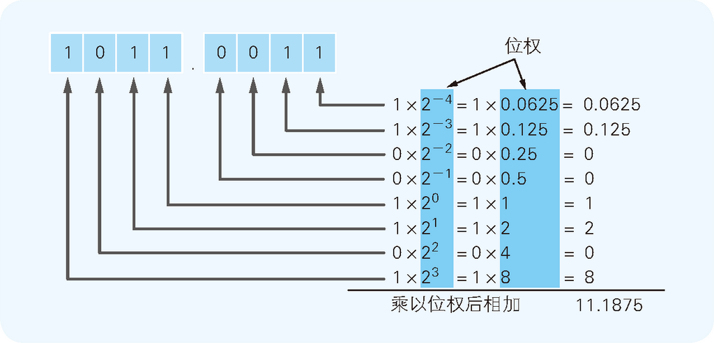
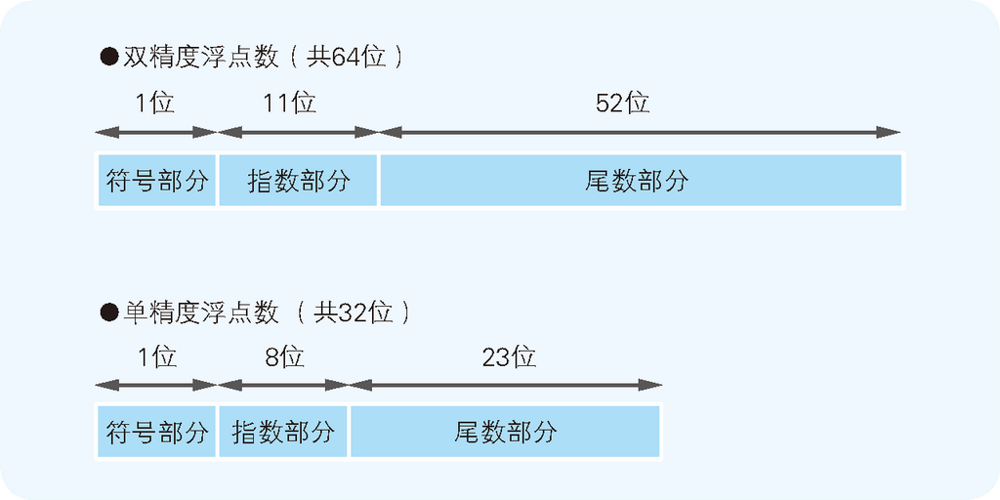
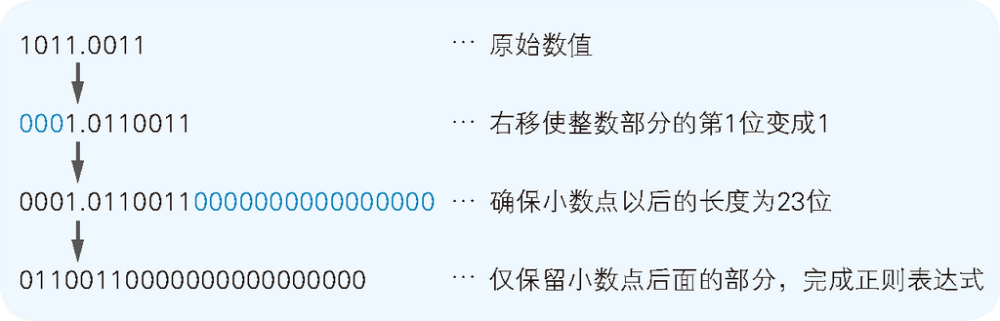

# Summary


<!-- TOC -->

- [Summary](#summary)
    - [用二进制数表示小数的方法和舍入误差](#%E7%94%A8%E4%BA%8C%E8%BF%9B%E5%88%B6%E6%95%B0%E8%A1%A8%E7%A4%BA%E5%B0%8F%E6%95%B0%E7%9A%84%E6%96%B9%E6%B3%95%E5%92%8C%E8%88%8D%E5%85%A5%E8%AF%AF%E5%B7%AE)
    - [浮点数](#%E6%B5%AE%E7%82%B9%E6%95%B0)
    - [正则表达式和 EXCESS 系统](#%E6%AD%A3%E5%88%99%E8%A1%A8%E8%BE%BE%E5%BC%8F%E5%92%8C-excess-%E7%B3%BB%E7%BB%9F)
        - [正则表达式](#%E6%AD%A3%E5%88%99%E8%A1%A8%E8%BE%BE%E5%BC%8F)
        - [EXCESS 系统](#excess-%E7%B3%BB%E7%BB%9F)
    - [测试单精度浮点数在内存中的保存情况](#%E6%B5%8B%E8%AF%95%E5%8D%95%E7%B2%BE%E5%BA%A6%E6%B5%AE%E7%82%B9%E6%95%B0%E5%9C%A8%E5%86%85%E5%AD%98%E4%B8%AD%E7%9A%84%E4%BF%9D%E5%AD%98%E6%83%85%E5%86%B5)
    - [References](#references)

<!-- /TOC -->


## 用二进制数表示小数的方法和舍入误差
1. 我们把 1011.0011 这个有小数点的二进制数转换成十进制数。小数点后面的部分的处理方法其实和整数是一样的，也是将各数位的数值和位权相乘的结果相加即可
    
2. 计算机在处理某些小数的时候会出现运算错误，是因为有一些十进制数的小数无法转换成二进制数。例如，十进制数 0.1，就无法用二进制数正确表示。
3. 下表是小数点后 4 位用二进制数表示时的数值范围为 0.0000～0.1111，下表是所有四位小数可能的结果
    <table width="90%" border="1" style="margin-bottom: 10px;">
        <thead>
            <tr>
                <th>二进制数</th>
                <th>对应的十进制数</th>
            </tr>
        </thead>
        <tbody>
            <tr>
                <td>0.0000</td>
                <td>0</td>
            </tr>
            <tr>
                <td>0.0001</td>
                <td>0.0625</td>
            </tr>
            <tr>
                <td>0.0010</td>
                <td>0.125</td>
            </tr>
            <tr>
                <td>0.0011</td>
                <td>0.1875</td>
            </tr>
            <tr>
                <td>0.0100</td>
                <td>0.25</td>
            </tr>
            <tr>
                <td>0.0101</td>
                <td>0.3125</td>
            </tr>
            <tr>
                <td>0.0110</td>
                <td>0.375</td>
            </tr>
            <tr>
                <td>0.0111</td>
                <td>0.4375</td>
            </tr>
            <tr>
                <td>0.1000</td>
                <td>0.5</td>
            </tr>
            <tr>
                <td>0.1001</td>
                <td>0.5625</td>
            </tr>
            <tr>
                <td>0.1010</td>
                <td>0.625</td>
            </tr>
            <tr>
                <td>0.1011</td>
                <td>0.6875</td>
            </tr>
            <tr>
                <td>0.1100</td>
                <td>0.75</td>
            </tr>
            <tr>
                <td>0.1101</td>
                <td>0.8125</td>
            </tr>
            <tr>
                <td>0.1110</td>
                <td>0.875</td>
            </tr>
            <tr>
                <td>0.1111</td>
                <td>0.9375</td>
            </tr>
        </tbody>
    </table>
4. 只用四位二进制小数的话，0.0001（0.0625） 再大一级的数就是 0.0010（0.125），显然只用四位二进制小数是不可能准确表示十进制 0.1 的。
5. 但实际上，0.0001 之后再增加任意个 0 或 1，都不可能准确的落在十进制的 0.1 上。也就是说，2 的任意负整数幂都不等于 0.1。
6. 实际上，十进制数 0.1 转换成二进制后，会变成 0.00011001100…（1100 循环）这样的循环小数。因此，在遇到循环小数时，计算机就会根据变量数据类型所对应的长度将数值从中间截断或者四舍五入，所以会出现小数舍入误差的情况。


## 浮点数
1. 像 1011.0011 这样带小数点的表现形式，完全是纸面上的二进制数表现形式，在计算机内部是无法使用的。那么，实际上计算机是以什么样的表现形式来处理小数的呢？
2. 像 $0.12345×10^3$ 和 $0.12345×10^{-1}$ 这样使用与实际小数点位置不同的书写方法来表示小数的形式称为 **浮点数**。与浮点数相对的是 **定点数**，使用定点数表示小数时，小数点的实际位置固定不变。例如，$0.12345×10^3$ 和 $0.12345×10^{-1}$ 用定点数来表示的话即为 123.45 和 0.012345。
3. 浮点数用符号、尾数、基数和指数这四部分来表示的小数
    
    因为计算机内部使用的是二进制数，所以基数自然就是 2。因此，实际的数据中往往不考虑基数，只用符号、尾数、指数这三部分即可表示浮点数。
4. 很多编程语言中都提供了两种表示小数的数据类型，分别是 **双精度浮点数** 和 **单精度浮点数**。双精度浮点数类型用 64 位、单精度浮点数类型用 32 位来表示小数。
5. 64 位（双精度浮点数）和 32 位（单精度浮点数）的数据，会被分为三部分来使用
    
6. 浮点数的表现方式有很多种，这里我们使用最为普遍的 IEEE 标准。双精度浮点数和单精度浮点数在表示同一个数值时使用的位数不同。此外，双精度浮点数能够表示的数值范围要大于单精度浮点数。


## 正则表达式和 EXCESS 系统
尾数部分和指数部分并不只是单单存储着用整数表示的二进制数。尾数部分用的是 “将小数点前面的值固定为 1 的正则表达式”，而指数部分用的则是 “EXCESS 系统表现”。

### 正则表达式
1. 按照特定的规则来表示数据的形式即为 **正则表达式**。除小数之外，字符串以及数据库等，也都有各自的正则表达式。
2. 尾数部分使用正则表达式，可以将表现形式多样的浮点数统一为一种表现形式。例如，十进制数 0.75 就有很多种表现形式，如下图所示
    
    虽然它们表示的都是同一个数值，但因为表现方法太多，计算机在处理时会比较麻烦。
3. 因此，为了方便计算机处理，需要制定一个统一的规则。例如，十进制数的浮点数应该遵循 “小数点前面是 0，小数点后面第 1 位不能是 0” 这样的规则。根据这个规则，0.75 就是 “0.75×10 的 0 次幂”，也就是说，只能用尾数部分是 0.75、指数部分是 0 这个方法来表示。
4. 在二进制数中，我们使用的是 “**将小数点前面的值固定为 1**” 的正则表达式。
5. 具体来讲，就是将二进制数表示的小数左移或右移（这里是逻辑移位，因为正如上面说的，浮点数的符号位是独立保存的）数次后，整数部分的最低位变为 `1`，其他位都变为 `0`。
6. 而且，因为整数部分最低位永远是 `1`，所以在实际的数据中不保存，也节省了一个数据位
    

### EXCESS 系统
1. 接下来，让我们一起来看一下指数部分中使用的 EXCESS 系统，使用这种方法主要是为了表示负数时不使用符号位。
2. 举例来说明原理，假设有这样一个游戏，用 1~13（A~K）的这些整数值扑克牌来表示包含包含负数的范围 -6~6。这时，我们可以把中间的 7 这张牌当成 0。如果扑克牌 7，那就表示 0，如果扑克牌是 10 就表示 +3，扑克牌是 3 就表示 -4。
3. 再来看看单精度浮点数的情况。指数部分是 0 为，范围是 00000000~11111111。为了在不使用符号位的情况下用这个范围表示负数和正数，那么应该选取中间值 01111111（127）来表示 0。这样 00000000~11111111 就能表示 -127~128 的值
    <table width="90%" border="1">
        <thead>
            <tr>
                <th><p class="表头单元格">实际的值（二进制数）</p></th>
                <th><p class="表头单元格">实际的值（十进制数）</p></th>
                <th><p class="表头单元格">EXCESS系统表现（十进制数）</p></th>
            </tr>
        </thead>
        <tbody>
            <tr>
                <td>11111111</td>
                <td>255</td>
                <td>128（=255-127）</td>
            </tr>
            <tr>
                <td>11111110</td>
                <td>254</td>
                <td>127（=254-127）</td>
            </tr>
            <tr>
                <td>…</td>
                <td>…</td>
                <td>…</td>
            </tr>
            <tr>
                <td>01111111</td>
                <td>127</td>
                <td>0（=127-127）</td>
            </tr>
            <tr>
                <td>01111110</td>
                <td>126</td>
                <td>-1（=126-127）</td>
            </tr>
            <tr>
                <td>…</td>
                <td>…</td>
                <td>…</td>
            </tr>
            <tr>
                <td>00000001</td>
                <td>1</td>
                <td>-126（=1-127）</td>
            </tr>
            <tr>
                <td>00000000</td>
                <td>0</td>
                <td>-127（=0-127）</td>
            </tr>
        </tbody>
    </table>


## 测试单精度浮点数在内存中的保存情况
1. 上面说到，单精度浮点数会保存为 32 位，最高位是符号，之后的 8 位是指数，剩下的 23 位是尾数。
2. 我们这里测试二进制数 0.11（0.75）的单精度浮点数在内存中的 32 位的情况。
3. 指数部分的值是 -1，根据 EXCESS 系统规则，如果是十进制的话，应该表示为 126，二进制的话就是 01111110。
4. 根据上面的正则表达式规则，尾数会被转换为 1.1，然后保存为 23 位 10000000000000000000000。
5. 所以在内存中的保存 32 位数据应该是（加上了破折号作区分） 0-01111110-10000000000000000000000。
6. 实际测试一下
    ```cpp
    #include <stdio.h>
    #include <string.h>

    void main() {
        float data; // 32 位单精度浮点数
        unsigned long buff; // 32 位长整型
        char s[34];

        // 将 0.75 以单精度浮点数的形式存储在变量 date 中
        data = 0.75;

        // 把 data 中 32 位的数据复制到 32 位的长整数变量 buff 中
        // 把这些数据作为整数来解释，就可以通过下面的对 2 求模运算逐个获得每一位的值
        memcpy(&buff, &data, 4);

        // 逐一提取出每一位
        for (int i = 33; i >= 0; i--) {
            // 加入两个破折号来区分符号部分、指数部分和尾数部分。
            if (i == 1 || i == 10) {
                s[i] = '-';
            } 
            else {
                if (buff % 2 == 1) { // 最低位是 1
                    s[i] = '1';
                } 
                else { // 最低位是 0
                    s[i] = '0';
                }
                buff /= 2;
            }
        }

        s[34] = '\0';

        printf("%s\n", s); 
        // 0-01111110-10000000000000000000000
    }
    ```


## References
* [程序是怎样跑起来的](https://book.douban.com/subject/26365491/)