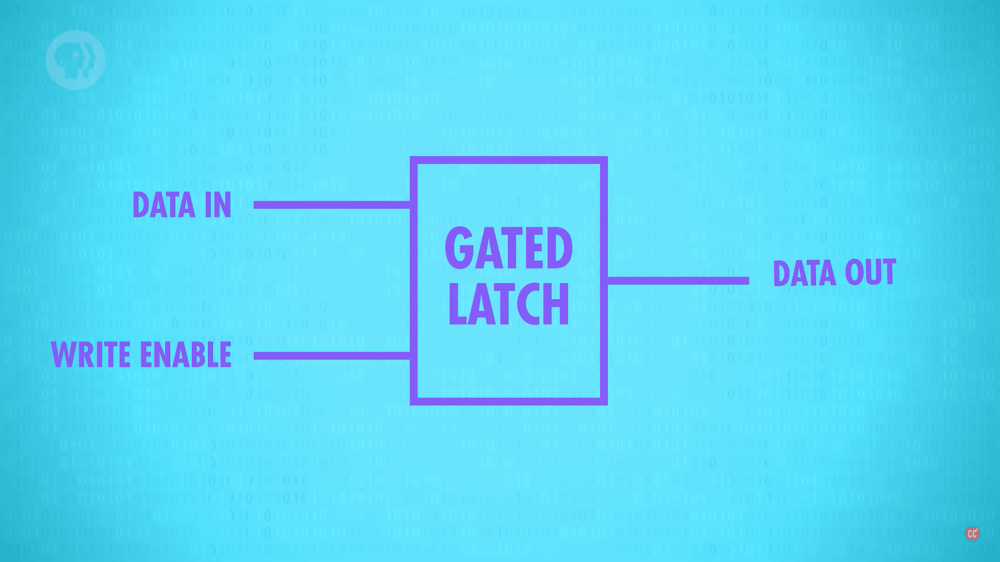
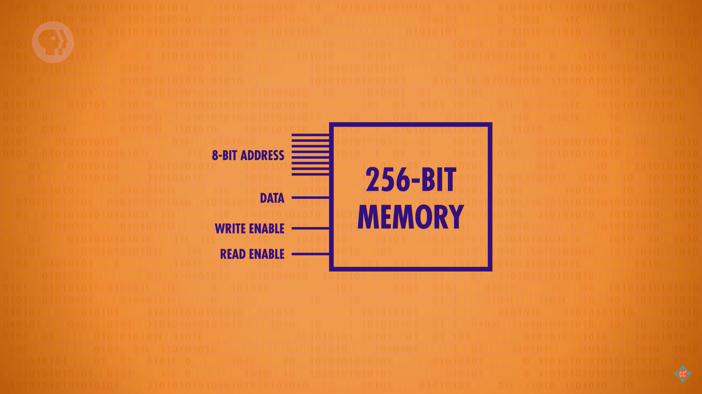

# Latch

<!-- TOC -->

- [Latch](#latch)
    - [触发器（Flip-Flop）](#触发器flip-flop)
    - [锁存器（latch）](#锁存器latch)
    - [用锁存器组成寄存器](#用锁存器组成寄存器)
    - [寄存器组成 RAM 内存](#寄存器组成-ram-内存)
    - [References](#references)

<!-- /TOC -->

## 触发器（Flip-Flop）
1. 看下面一个电路
    
2. 左边或非门的输出是右边或非门的输入，而右边或非门的输出是左边或非门的输入。这种连接方式我们称之为 **反馈**（feedback）。
3. 在初始状态下，两个开关都没有闭合，电路中只有左边的或非门有输出电流。
4. 当闭合上面的开关，左边或非门将立刻输出 0，右边或非门的输出随之变为 1，这时灯泡将被点亮
    
5. 此时，即使断开上面的开关，灯泡依然亮着。这是因为右边或非门的输出 1 反馈给了左边的或非门的输入，所以左边的或非门就始终输出 0，导致右边的或非门输出 1
    
6. 现在闭合下面的开关，则右边的或非门输出 0，因此灯泡熄灭。同时反馈到左边的或非门后，输出变为 1
    
7. 此时，即使断开下面的开关，灯泡依然保持熄灭，因为右边或非门已经有一个输入是 1 了。    
    
8. 也就是说，在不同时闭合两个开关的情况下：
    * 闭合上面的开关，灯泡点亮，断开此开关灯泡仍然亮着。
    * 闭合下面的开关，灯泡熄灭，断开此开关灯泡仍然不亮。
9. 如果同时闭合两个开关，则灯泡熄灭；如果同时断开两个开关，灯泡保持当前状态。

## 锁存器（latch）
1. 在不同时闭合两个开关的情况下，触发器可以记住最近一次闭合的是哪个开关：
    * 如果一个触发器的灯泡是亮着的，就可以推测出最后一次闭合的是上面的开关；
    * 而如果灯泡不亮则可推测出最后一次闭合的是下面的开关。
2. 这个触发器可以记住上一次发生的操作，开或者关。也就是说，这个触发器可以记住 1bit 的信息。这个电路称为锁存器。
3. 再抽象一步，通常我们会把锁存器绘制成下面的形状
    
    * 用 Q 来表示整体输出为 1 的情况，也就是上面灯泡点亮的情况；
    * 用 $\overline Q$ 表示对 Q 取反；
    * S（Set，把 Q 设置为 1） 对应上文中上面的开关；
    * R（Reset，把 Q 设置为 0） 对应上文中下面的开关；
4. 可以再简化为
    
5. 下面是输入输出的逻辑表
    S | R | Q | $\overline Q$
    --|--|--|--
    1 | 0 | 1 | 0
    0 | 1 | 0 | 1
    0 | 0 | Q | $\overline Q$
    1 | 1 | 禁 | 止

    * 两个输入都是 0 时，输出保持不变；
    * 在设计锁存器电路时，不允许两个输入都是 1。也就是不允许上面说到的两个开关同时闭合。
6. 在实际的场景中，会进一步添加若干逻辑门并进行封装。我们使用一个输入的 1 和 0 的值来代替两个输入的 S 和 R；同时再增加一个输入，用来控制该锁存器是否能被写入。变成
    

## 用锁存器组成寄存器
1. 一个锁存器可以保存 1bit 二进制数，而如果将一组锁存器组合起来，就可以组成一个 **寄存器**（register）。寄存器的 bit 数称为该寄存器的 **位宽**（width）。
2. 实际中的寄存器，其中的锁存器使用矩阵排列。下面是一个 256 位的寄存器
    
3. 要使用某个锁存器，就要打开响应的行线和列线
    
4. 被选中的这么锁存器的内部，使用一个与门（左下角的）连接的输入连接打开的行线和列线
    
5. 可以看到，在整个矩阵中只有这一个锁存器的这个与门会输出 1，这样就完成了选中唯一的待操作的锁存器。
6. 这个与门的输出会作为另外两个与门的输入，分别对应该寄存器允许写入和允许读出两个状态开关（下面会看到整个寄存器的所有锁存器共用同一个允许写入线和允许读出线）：
    * 连接 write enable 的那个与门：如果此时寄存器本身允许写入，也就是 write enable 为 1，那么这个与门就会输出 1，该锁存器可以写入数据；
        
    * 连接 read enable 的那个与门：如果此时寄存器本身允许读出，也就是 read enable 为 1，那么这个与门就会输出 1，该锁存器的输出可以被读取；
        
7. 可以看到，通过三个与门，可以确定对矩阵中的某个确定的锁存器进行写入和读取操作，而不影响其他锁存器；
8. 通过行线和列线的定为，矩阵中所有的锁存器可以共享同一根 write enable 线，共享同一根 read enable 线，共享同一个根 data in/out 线。
9. 例如，整个矩阵的同一根 write enable 为 1 时，表明整个寄存器都是可写入状态，但是只有通过行线和列线选中的那个锁存器才会真正可写入，因为这两个条件要通过与门串联。
10. 这样，对于这个 16*16 的矩阵寄存器，就总共需要 35 根线：其中 32 个是行线和列线，其他三个是所有锁存器共享的那三个线。
11. 对于要确定选中哪个锁存器，对于这个 16*16 的矩阵来说，只需要一个 8bit 的地址就刚好，因为 4bit 正好保存 16 种数。
12. 对这个寄存器进行抽象封装
    

## 寄存器组成 RAM 内存
1. 上面的 256bit 寄存器有 256 个地址，每个地址可以保存 1bit 数据。
2. 但是实际中的内存一般是一个地址可以保存 8bit/1byte 数据，所以我们可以用 8 个上面的寄存器，组成一个小的内存。
3. 这个内存有 256 个地址，每个地址保存 1btye 数据。所以这是一个 256btye 的内存
    
4. 需要写数据时，提供一个 8bit 的地址和一个 8bit 的数据，根据地址找到 8 个寄存器中对应的那个锁存器，然后把 8 个 bit 的 0 或 1 分别存入这 8 个锁存器里。
5. 平时在理解内存时是知道一个 byte 的数据存储在 8bit 的空间里，但现在知道了其实是分别存储在 8 个寄存器里。
6. 可以看到，所有的锁存器都同享同一根允许写入和同一根允许读出线。
7. 把上面的 256byte 内存封装抽象为常见的形式
    

## References
* [程序是怎样跑起来的](https://book.douban.com/subject/26365491/)
* [Crash Course Computer Science](https://www.bilibili.com/video/BV1EW411u7th)