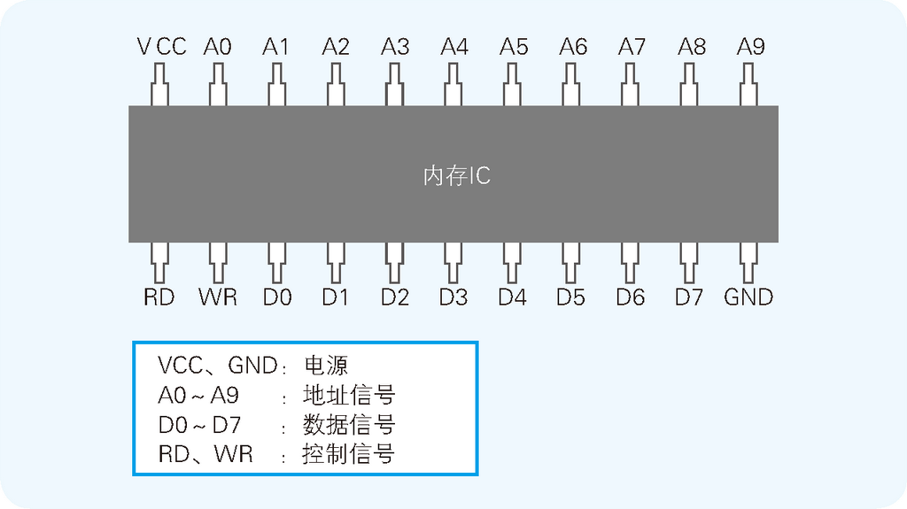
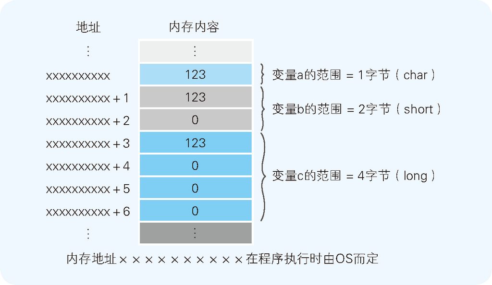
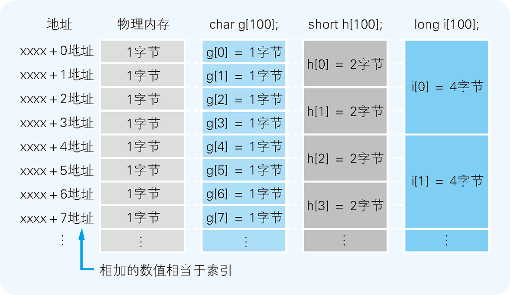
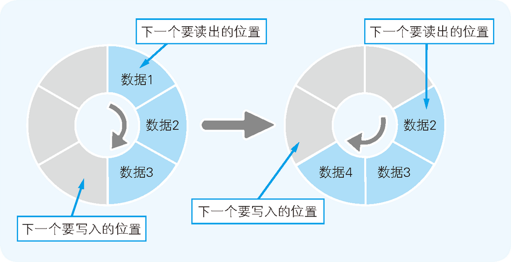
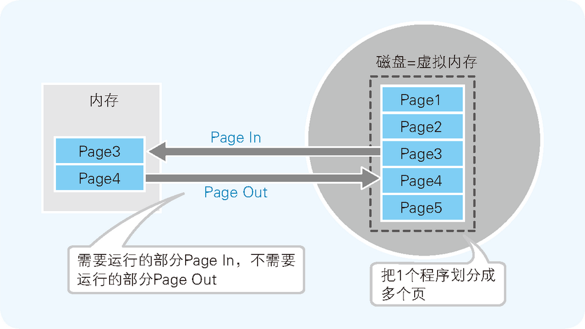

# Summary


<!-- TOC -->

- [Summary](#summary)
    - [内存的物理机制](#内存的物理机制)
        - [数据读写](#数据读写)
    - [内存的逻辑模型](#内存的逻辑模型)
    - [数组是高效使用内存的基础](#数组是高效使用内存的基础)
    - [栈、队列以及环形缓冲区](#栈队列以及环形缓冲区)
    - [磁盘虚拟内存](#磁盘虚拟内存)
    - [节约内存的编程方法](#节约内存的编程方法)
        - [通过 DLL 文件实现函数共有](#通过-dll-文件实现函数共有)
        - [通过调用 `_stdcall` 来减小程序文件的大小](#通过调用-_stdcall-来减小程序文件的大小)
    - [磁盘的物理结构](#磁盘的物理结构)
    - [References](#references)

<!-- /TOC -->


## 内存的物理机制
1. 内存 IC 中有电源、地址信号、数据信号、控制信号等大量引脚，通过为其指定地址（address），来进行数据的读写。
2. 下图是内存 IC（在这里假设它为 RAM）的引脚配置示例
    
3. 虽然这是一个虚拟的内存 IC，但它的引脚和实际的内存 IC 是一样的：VCC 和 GND 是电源，A0～A9 是地址信号的引脚，D0～D7 是数据信号的引脚，RD 和 WR 是控制信号的引脚。
4. 数据信号引脚有 D0～D7 共八个，表示一次可以输入输出 8 位（1 字节）的数据。
5. 地址信号引脚有 A0～A9 共十个，表示可以指定 0000000000～1111111111 共 1024 个地址。因此我们可以得出这个内存 IC 中可以存储 1024 个 1 字节的数据，所以该内存 IC 的容量就是 1KB。
6. 将电源连接到 VCC 和 GND 后，就可以给其他引脚传递比如 0 或者 1 这样的信号。大多数情况下，+5V 的直流电压表示 1，0V 表示 0。

### 数据读写
1. 假设要往该内存 IC 中写入 1 字节的数据。为了实现该目的，可以给 VCC 接入 +5V，给 GND 接入 0V 的电源，并使用 A0～A9 的地址信号来指定数据的存储场所，然后再把数据的值输入给 D0～D7 的数据信号，并把 WR（write）信号设定成 1。执行完这些操作，就可以在内存 IC 内部写入数据了。
2. 读出数据时，只需通过 A0～A9 的地址信号指定数据的存储场所，然后再将 RD（read）信号设成 1 即可。执行完这些操作，指定地址中存储的数据就会被输出到 D0～D7 的数据信号引脚中。
3. 另外，像 WR 和 RD 这样可以让 IC 运行的信号称为 **控制信号**。其中，当 WR 和 RD 同时为 0 时，写入和读出的操作都无法进行。


## 内存的逻辑模型
1. 下面的代码是一个往 `a`、`b`、`c` 3 个变量中写入数据 123 的 C 语言程序
    ```cpp
    char a;
    short b;
    long c;

    a = 123;
    b = 123;
    c = 123;
    ```
2. 这 3 个变量表示的是内存的特定区域。通过使用变量，即便不指定物理地址，也可以在程序中对内存进行读写。这是因为，在程序运行时，操作系统会自动决定变量的物理地址。
3. 这 3 个变量的数据类型分别是，表示 1 字节长度的 `char`，表示 2 字节长度的 `short`，以及表示 4 字节长度的 `long`。因此，虽然同样是数据 123，存储时其所占用的内存大小是不一样的。
4. 这里，我们假定采用的是将数据低位存储在内存低位地址的低字节序（little endian）方式
    


## 数组是高效使用内存的基础
1. 数组是指多个同样数据类型的数据在内存中连续排列的形式。作为数组元素的各个数据会通过连续的编号被区分开来，这个编号称为索引（index）。
2. 指定索引后，就可以对该索引所对应地址的内存进行读写操作。而索引和内存地址的变换工作则是由编译器自动实现的，CPU 利用基址寄存器和变址寄存器来指定内存地址的。
3. 之所以说数组是内存的使用方法的基础，是因为数组和内存的物理构造是一样的。特别是 1 字节类型的数组，它和内存的物理构造完全一致。
4. 不过，如果只能逐个字节地来读写，程序就会变得比较麻烦，因而可以指定任意数据类型来定义数组。下面的代码是 C 语言中定义 `char` 类型、`short` 类型和 `long` 类型的三个数组    
    ```cpp
    char g[100]; 
    short h[100];
    long i[100]; 
    ```
5. 下面是这三个数组在内存中的分布示意
    


## 栈、队列以及环形缓冲区
1. 栈和队列，都可以不通过指定地址和索引来对数组的元素进行读写。需要临时保存计算过程中的数据、连接在计算机上的设备或者输入输出的数据时，都可以通过这些方法来使用内存。如果每次保存临时数据都需指定地址和索引，程序就会变得比较麻烦，因此要加以改进。
2. 这里所说的栈并不是函数调用时使用的栈，而是指程序员自身做成的 LIFO 形式的数据存储方式，该栈的实体是数组。
3. 如果要在程序中实现栈和队列，就需要以适当的元素数来定义一个用来存储数据的数组，以及对该数组进行读写的函数对。当然，在这些函数的内部，对数组的读写会涉及索引的管理，但从使用函数的角度来说，就没有必要考虑数组及索引了。
4. 队列一般是以 **环状缓冲区**（ring buffer）的方式来实现的。例如，假设我们要用有 6 个元素的数组来实现一个队列。这时可以从数组的起始位置开始有序地存储数据，然后再按照存储时的顺序把数据读出。在数组的末尾写入数据后，后一个数据就会被写入数组的起始位置（此时需要保证起始位置的数据出列）。这样，数组的末尾就和开头连接了起来，数据的写入和读出也就循环起来了
    


## 磁盘虚拟内存
1. 磁盘虚拟内存是指把磁盘的一部分作为假想的内存来使用。通过借助磁盘虚拟内存，在内存不足时也可以运行程序。例如，在只剩下 5MB 内存空间的情况下也能运行 10MB 大小的程序。
2. 不过，CPU 只能执行加载到内存中的程序。磁盘虚拟内存虽说是把磁盘作为内存的一部分来使用，但实际上正在运行的程序部分，在这个时间点上是必须存在在内存中的。
3. 也就是说，为了实现磁盘虚拟内存，就必须把实际内存（也可称为物理内存）的内容，和磁盘上的虚拟内存的内容进行部分 **置换**（swap），并同时运行程序。
4. 磁盘虚拟内存的方法有 **分页式** 和 **分段式** 两种。Windows 采用的是分页式。该方式是指，在不考虑程序构造的情况下，把运行的程序按照一定大小的 **页**（page）进行分割，并以页为单位在内存和磁盘间进行置换。
5. 为了实现磁盘虚拟内存功能，Windows 在磁盘上提供了虚拟内存用的 **页文件**（page file）。该文件由 Windows 自动做成和管理。文件的大小也就是虚拟内存的大小。    
6. 在分页式中，我们把磁盘的内容读出到内存称为 **Page In**，把内存的内容写入磁盘称为 **Page Out**。
    


## 节约内存的编程方法
1. 虚拟内存能避免因内存不足导致的应用无法启动。不过，由于使用虚拟内存时发生的 Page In 和 Page Out 往往伴随着低速的磁盘访问，因此在这个过程中应用的运行会变得迟钝起来。想必大家也都有过在操作应用的过程中硬盘访问灯一直亮着（这时正在进行 Page In 和 Page Out），导致应用一时无法操作的不愉快经历吧。也就是说，虚拟内存无法彻底解决内存不足的问题。
2. 为了从根本上解决内存不足的问题，需要增加内存的容量，或者尽量把运行的应用文件变小。接下来会向大家介绍两个把应用文件变小的编程方法。

### 通过 DLL 文件实现函数共有
1. **DLL**（Dynamic Link Library）文件，顾名思义，是在程序运行时可以动态加载 library（函数和数据的集合）的文件。
2. 多个应用可以共有同一个 DLL 文件，而通过共有同一个 DLL 文件则可以达到节约内存的效果。
3. 例如，假设我们编写了一个具有某些处理功能的函数 `MyFunc()`。应用 A 和应用 B 都会使用这个函数。在各个应用的运行文件中内置函数 `MyFunc()`（这个称为 **Static Link**，**静态链接**）后同时运行这两个应用，内存中就存在了具有同一函数的两个程序。但这会导致内存的利用效率降低。
4. Windows 中，可以执行的应用文件的扩展名是 .exe，这样的文件就称为 EXE 文件。exe 是 executable（可执行）的略写。另一方面，DLL 文件的扩展名为 .dll。
5. Windows 的操作系统本身也是多个 DLL 文件的集合体。有时在安装新应用时，DLL 文件也会被追加。应用则会通过利用这些 DLL 文件的功能来运行。
6. 而且 DLL 文件还有一个优点就是，在不变更 EXE 文件的情况下，只通过升级 DLL 文件就可以更新。

### 通过调用 `_stdcall` 来减小程序文件的大小
1. 在调用函数后，需要执行栈清理处理指令。栈清理处理是指，把不需要的数据从接收和传递函数的参数时使用的内存上的栈区域中清理出去。该命令不是程序记述的，而是在程序编译时由编译器自动附加到程序中的。
2. 编译器默认将该处理附加在 **函数调用方**。例如在下面的代码中，从函数 `main()` 中调用了函数 `MyFunc()`。按照默认设定，栈的清理处理会附加在函数 `main()` 这一方
    ```cpp
    //函数调用方
    void main()
    {
        int a;
        a = MyFunc(123, 456);
    }

    //被调用方
    int MyFunc(int a, int b)
    {
        ...
    }
    ```
3. 在同一个程序中，同样的函数可能会被多次反复调用。而如果是同样的函数，栈清理处理的内容也是一样的。由于该处理是在调用函数一方，因此就会导致同一处理被反复进行，这就造成了内存的浪费。
4. 下面是调用函数 `MyFunc()` 的汇编语言来表示，最后 1 行的处理就是清理处理
    ```
    push 1C8h                         # 将参数 456 (= 1c8h)存入栈中
    push 7Bh                          # 将参数123 (= 7Bh) 存入栈中
    call @LTD+15 (MyFunc)(00401014)   # 调用 MyFunc() 函数
    add  esp, 8                       # 运行栈清理
    ```
    1. `push` 是往栈中存入数据的指令。32 位 CPU 中，1 次 `push` 指令可以存储 4 个字节的数据，这里使用了两次 `push` 指令把两个参数存入到了栈中，因此总的来说就是存储了 8 字节的数据。
    2. 通过 `call` 指令调用函数 `MyFunc()` 后，栈中存储的数据就不再需要了。于是这时就通过 `add esp, 8` 这个指令，使存储着栈数据的 esp 寄存器前进 8 位（设定为指向高 8 位字节地址），来进行数据清理。
    3. 由于栈是在各种情况下都可以再利用的内存领域，因此使用完毕后有必要将其恢复到原状态。
5. 栈清理处理，比起在函数调用方进行，在反复被调用的函数一方进行时，程序整体要小一些。这时所使用的就是 `_stdcall` 模式。
6. 在函数前加上 `_stdcall`，就可以把栈清理处理变为在被调用函数一方进行
    ```cpp
    int _stdcall MyFunc(int a, int b)
    {
        ...
    }
    ```
7. 现在，和 `add esp, 8` 同样的处理就会在函数 `MyFunc()` 一方执行。虽然该处理只能节约 3 个字节（`add esp, 8` 是机器语的 3 个字节）的程序大小，不过在整个程序中还是有效果的。不懂，那 `MyFunc()` 不也是每次都要清理吗？


## 磁盘的物理结构
1. 磁盘是通过把其物理表面划分成多个空间来使用的。划分的方式有扇区方式和可变长方式两种，前者是指将磁盘划分为固定长度的空间，后者则是指把磁盘划分为长度可变的空间。
2. 扇区方式中，把磁盘表面分成若干个同心圆的空间就是 **磁道**，把磁道按照固定大小（能存储的数据长度相同）划分而成的空间就是 **扇区**
    
3. 扇区是对磁盘进行物理读写的最小单位。不过，操作系统在逻辑方面（软件方面）对磁盘进行读写的单位是扇区整数倍的 **簇**（例如一个簇包含 64 个扇区），因此不同的文件不能存储在同一个簇中的。以簇为单位进行读写时，1 簇中没有填满的区域会保持不被使用的状态。
4. 


## References
* [程序是怎样跑起来的](https://book.douban.com/subject/26365491/)