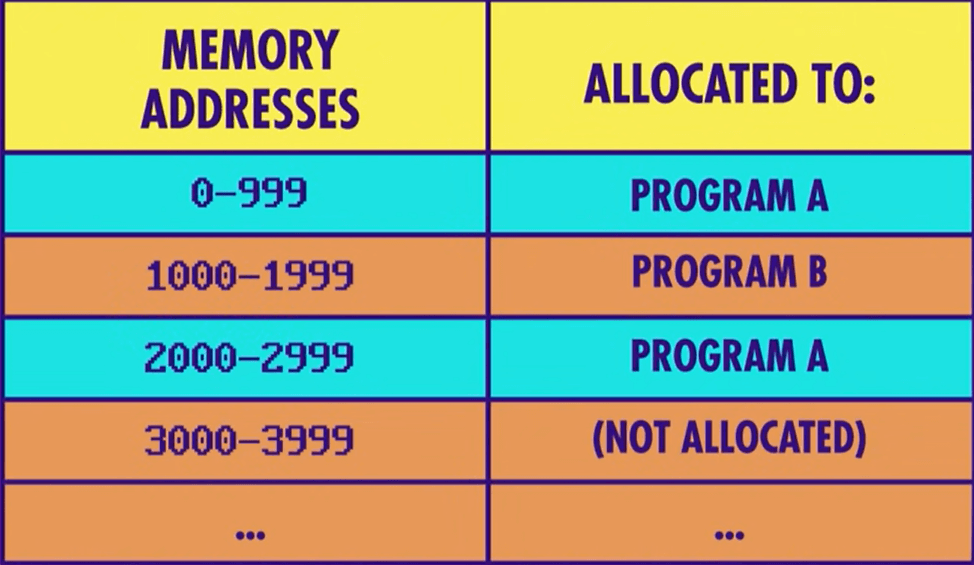

# Summary


<!-- TOC -->

- [Summary](#summary)
    - [系统调用和硬件抽象化](#系统调用和硬件抽象化)
    - [设备驱动](#设备驱动)
    - [多任务功能](#多任务功能)
    - [虚拟内存](#虚拟内存)
    - [内存保护（Memory protection）](#内存保护memory-protection)
    - [References](#references)

<!-- /TOC -->


## 系统调用和硬件抽象化
1. 以下面的代码为例
    ```cpp
    #include <stdio.h>
    #include <time.h>

    void main() {
        //保存当前日期和时间信息的变量
        time_t tm;

        //取得当前的日期和时间
        time(&tm);

        //在显示器上显示日期和时间
        printf("%s\n", ctime(&tm));
    }
    ```
2. 这些代码是无法直接控制计算机中配置的时钟 IC 及显示器用的 I/O 等硬件的，而是通过操作系统来间接控制硬件的。变量定义中涉及的内存的申请分配，以及 `time()` 和 `printf()` 这些函数的运行结果，都不是面向硬件而是面向操作系统的。操作系统收到应用发出的指令后，首先会对该指令进行解释，然后会对时钟 IC 和显示器用的 I/O 进行控制。    
3. 操作系统的硬件控制功能，通常是通过一些小的函数集合体的形式来提供的，这些函数及调用函数的行为统称为 **系统调用**（system call）。在前面的程序中用到了 `time()` 及 `printf()` 等函数，这些函数内部也都使用了系统调用。
4. C 语言等高级编程语言并不依存于特定的操作系统，这是因为人们希望不管是 Windows 还是 Linux，都能使用几乎相同的源代码。因此，高级编程语言的机制就是，使用独自的函数名，然后再在编译时将其转换成相应操作系统的系统调用（也有可能是多个系统调用的组合）。也就是说，用高级编程语言编写的应用在编译后，就转换成了利用系统调用的本地代码
    
5. 在高级编程语言中，也存在可以直接调用系统调用的编程语言。不过，利用这种方式做成的应用，移植性并不友好。例如，直接调用 Windows 系统调用的应用，在 Linux 上显然是无法运行的。
6. 通过使用操作系统提供的系统调用，程序员就没必要编写直接控制硬件的程序了。而且，通过使用高级编程语言，有时甚至也无需考虑系统调用的存在。这是因为操作系统和高级编程语言能够使硬件抽象化。


## 设备驱动
1. 新的设备连接到计算机后，系统就会自动安装和设定用来控制该设备的 **设备驱动**（device driver） 程序。设备驱动是操作系统的一部分，提供了同硬件进行基本的输入输出的功能。
2. 键盘、鼠标、显示器、磁盘装置等，这些计算机中必备的硬件的设备驱动，一般都是随操作系统一起安装的。如果之后再追加新的网卡等硬件的话，就需要向操作系统追加该硬件专用的设备驱动。
3. 有时 DLL 文件也会同设备驱动文件一起安装。这些 DLL 文件中存储着用来利用该新追加硬件的 API。通过这些 API，可以制作出运用该新硬件的应用。


## 多任务功能
1. **多任务**（multitasking）指的是同时运行多个程序的功能。操作系统是通过 **时钟分割** 技术来实现多任务功能的。
2. 时钟分割指的是在短时间间隔内，多个程序切换运行的方式。在用户看来，就是多个程序在同时运行。也就是说，Windows 会自动切换多个程序的运行
    
3. 此外，Windows 中还具有以程序中的函数为单位来进行时钟分割的多线程功能。


## 虚拟内存
1. 多任务带来的一个问题是，在切换到另一个程序时，当前程序的内存需要继续保留。以及，再新启动一个程序时进行内存分配时不能影响到已有的程序；或者某个正在运行的程序需要更多内存时，为其分配内存也不能影响其他程序。
2. 这样的内存需求，导致下面两个比较麻烦的地方：
    * 某个程序的内存并不是从内存的第一个字节开始分配的。因为最多只能有一个程序只能占用包含第一个字节的内存块。例如下面程序 B 使用的内存。
    * 为一个程序追加内存时，很有可能追加的内存和之前的内存不是连续的。例如下面程序 A 使用的内存。
    
3. 实际的程序所使用的内存可能被分割为几十个块，因此对于程序来说，要追踪不同地址区域的内存就会变得很复杂。
4. 为了隐藏这种复杂性，操作系统会通过 **虚拟内存**（Virtual Memory） 的机制对实际的物理内存进行虚拟化，向程序隐藏实际的内存情况。
5. 有了虚拟内存，对于每个程序来说，它所分配到的内存都是连续的；程序也不需要考虑偏移的存在，就好像只有它自己占用一块完整内存一样
    


## 内存保护（Memory protection）
1. 给每个程序分配专属的内存区域的另一个好处是，把每个程序都隔离在自己的内存空间里。
2. 这样，当一个程序出现错误时，它只能搞乱自己使用的内存区域，而不会影响到其他程序。
3. 另外，当一个程序遭到了病毒入侵，也可以避免病毒侵入其他程序的内存。


## References
* [程序是怎样跑起来的](https://book.douban.com/subject/26365491/)