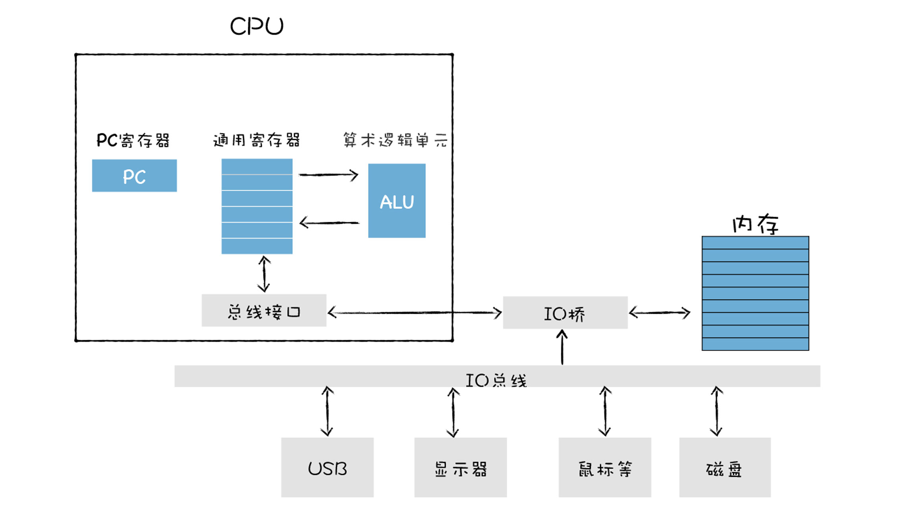
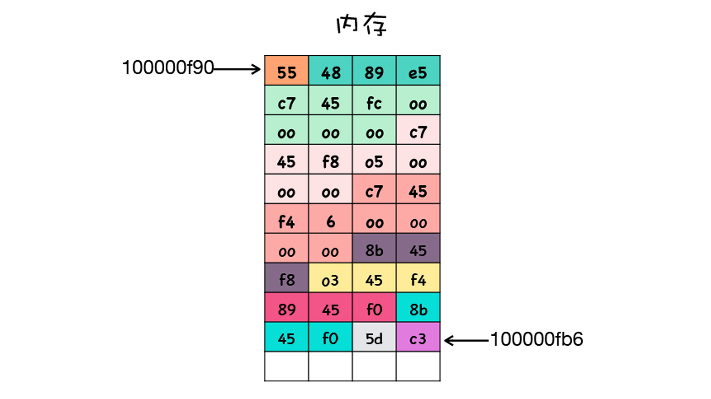
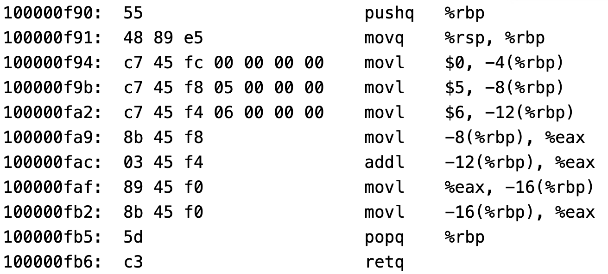
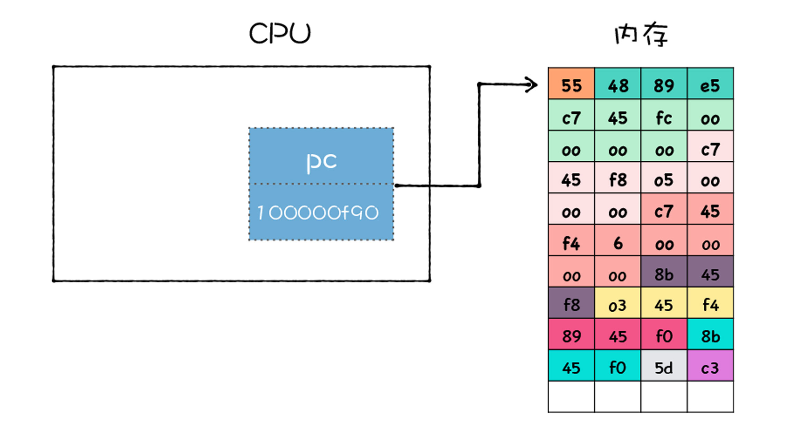
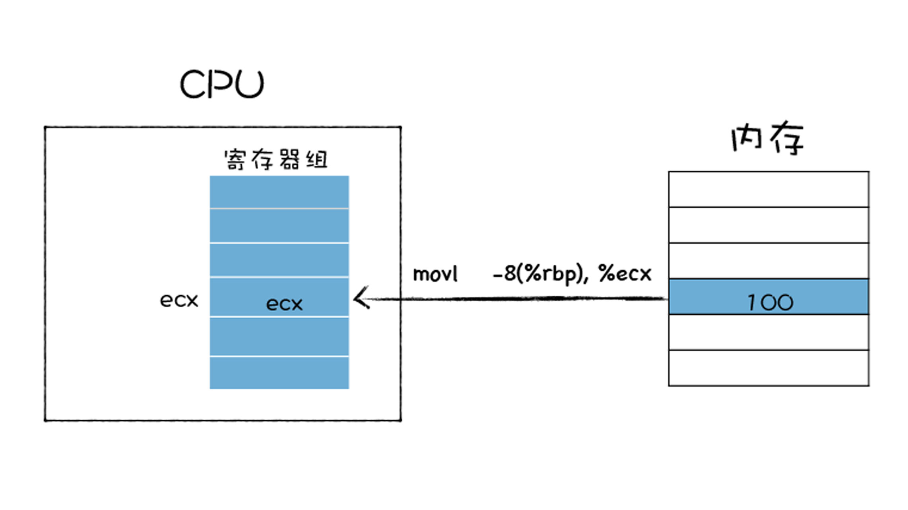
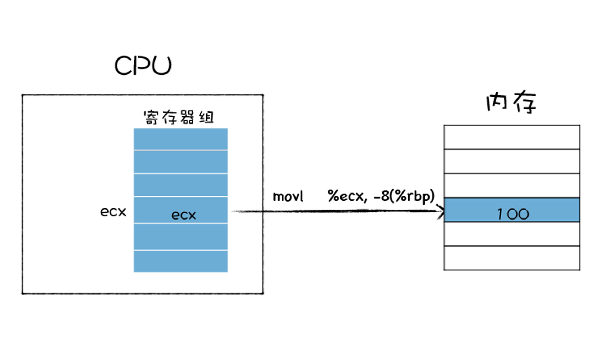
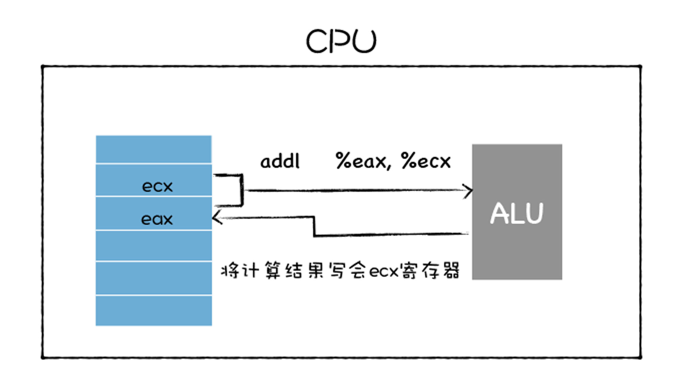
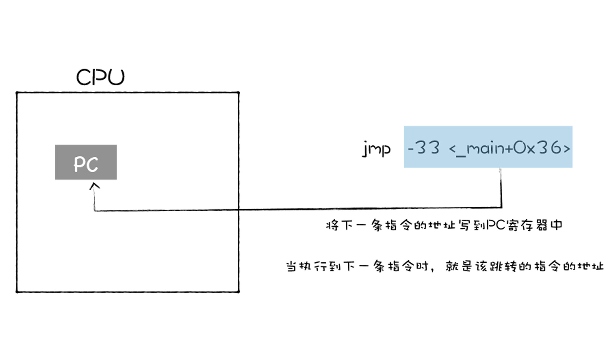

# 执行机器码


<!-- TOC -->

- [执行机器码](#执行机器码)
    - [将源码编译成机器码](#将源码编译成机器码)
    - [CPU 是怎么执行程序的](#cpu-是怎么执行程序的)
        - [内存相关](#内存相关)
        - [读取和分析指令](#读取和分析指令)
        - [执行指令](#执行指令)
    - [分析一段汇编代码的执行流程](#分析一段汇编代码的执行流程)
    - [References](#references)

<!-- /TOC -->


## 将源码编译成机器码
1. 我们以一段 C 代码为例，来看一下代码被编译成二进制可执行程序之后，是如何被 CPU 执行的
    ```cpp
    int main()
    {  
        int x = 1;
        int y = 2;
        int z = x + y;
        return z;
    }
    ```
2. 先将这段 C 代码编译成二进制文件，在对其进行反汇编，这样我们就可以看到二进制代码和对应的汇编代码
    
3. 上图左边就是编译生成的机器码，在这里它是使用十六进制来展示的。你可以观察到上图是由很多行组成的，每一行其实都是一个指令，该指令可以让 CPU 执行指定的任务。
4. 中间的部分是汇编代码，汇编代码采用 **助记符**（memonic）来编写程序。原本是二进制表示的指令，在汇编代码中可以使用单词来表示，比如 `mov`、`add` 就分别表示数据的存储和相加。汇编语言和机器语言是一一对应的，这一点和高级语言有很大的不同。
5. 这一大堆指令按照顺序集合在一起就组成了程序，所以程序的执行，本质上就是 CPU 按照顺序执行这一大堆指令的过程。


## CPU 是怎么执行程序的
1. 现在我们知道了编译后的程序是由一堆二进制代码组成的，也知道二进制代码是由一条条指令构成的，那么接下来我们就可以来分析 CPU 是如何执行这些指令的了。
2. 不过为了分析程序的执行过程，我们还需要理解典型的计算机系统的硬件组织结构，参看下图
   


### 内存相关
1. 首先，在程序执行之前，我们的程序需要被装进内存。比如在 Windows 下面，你可以通过鼠标点击一个可执行文件，当你点击该文件的时候，系统中的程序加载器会将该文件加载到内存中。
2. 在内存中，每个存放字节的空间都有其唯一的地址，而且地址是按照顺序排放的。
3. CPU 可以通过指定内存地址，从内存中读取数据，或者往内存中写入数据，有了内存地址，CPU 和内存就可以有序地交互。
4. 上面的那段 C 代码会被编译成可执行文件，可执行文件中包含了二进制的机器码，当二进制代码被加载进了内存后，那么内存中的每条二进制代码便都有了自己对应的地址，如下图所示
   
    有时候一条指令只需要一个字节就可以了，但是有时候一条指令却需要多个字节。在上图中，对于同一条指令，使用了相同的颜色来标记。
5. 我们可以把上面这个一堆二进制数据反汇编成一条条指令的形式，这样可以方便我们的阅读，效果如下图所示（第五条指令应该是少画了一个字节）
   

### 读取和分析指令   
1. 好了，一旦二进制代码被装载进内存，CPU 便可以从内存中取出一条指令，然后分析该指令，最后执行该指令。我们把 **取出指令**、**分析指令**、**执行指令** 这三个过程称为一个 **CPU 时钟周期**。
2. CPU 是永不停歇的，当它执行完成一条指令之后，会立即从内存中取出下一条指令，接着分析该指令，执行该指令，CPU 一直重复执行该过程，直至所有的指令执行完成。
3. CPU 是怎么知道要取出内存中的哪条指令呢？CPU 中有一个 **PC 寄存器**（Program Counter Register），它保存了将要执行的指令地址
   
4. 当二进制代码被装载进了内存之后，系统会将二进制代码中的第一条指令的地址写入到 PC 寄存器中，到了下一个时钟周期时，CPU 便会根据 PC 寄存器中的地址，从内存中取出指令。
5. PC 寄存器中的指令取出来之后，系统首先将下一条指令的地址更新到 PC 寄存器中。比如上图中，CPU 将第一个指令 55 取出来之后，系统会立即将下一个指令的地址填写到 PC 寄存器中，在上面的例子中，下一个指令的地址是 100000f91。
6. 更新了 PC 寄存器之后，CPU 就会分析该指令，并识别出不同类型的指令，以及各种获取操作数的方法。
7. 在指令分析完成之后，就要执行指令了。

### 执行指令
1. 要了解 CPU 是如何执行指令的，我们还需要了解 CPU 中的一个重要部件：**通用寄存器**。
2. 通用寄存器是 CPU 中用来存放数据的设备。通用寄存器容量小，读写速度快，内存容量大，读写速度慢。
3. 通用寄存器通常用来存放数据或者内存中某块数据的地址，我们把这个地址又称为指针。通常情况下寄存器对存放的数据是没有特别的限制的，比如某个通用寄存器既可以存储数据，也可以存储指针。
4. 接下来我们分析 CPU 是如何执行指令的，来了解几种常用的指令类型。
5. 第一种是 **加载的指令**，其作用是从内存中复制指定长度的内容到通用寄存器中，并覆盖寄存器中原来的内容
   
    上图使用了 **movl** 指令，指令后面跟着的第一个参数是要拷贝数据的内存的位置，第二个参数是要拷贝到 ecx 这个寄存器。
6. 第二种 **存储的指令**，和加载类型的指令相反，其作用是将寄存器中的内容复制内存某个位置，并覆盖掉内存中的这个位置上原来的内容
   
    这里也是使用 movl 指令，movl 指令后面的 %ecx 就是寄存器地址，-8(%rbp) 是内存中的地址。
7. 第三种是 **更新指令**，其作用是复制两个寄存器中的内容到 **ALU** (算术逻辑单元，arithmetic and logic unit)中，也可以是一块寄存器和一块内存中的内容到 ALU 中。ALU 将两个字相加，并将结果存放在其中的一个寄存器中，并覆盖该寄存器中的内容
   
    **addl** 指令将寄存器 eax 和 ecx 中的值传给 ALU，ALU 对它们进行相加操纵，并将计算的结果写回 eax。
8. 还有一个 **跳转指令*，从指令本身抽取出一个字，这个字是下一条要执行的指令的地址，并将该字复制到 PC 寄存器中，并覆盖掉 PC 寄存器中原来的值。那么当执行下一条指令时，便会跳转到对应的指令了
   
    通过 **jmp** 来实现跳转指令，jmp 后面跟着要跳转的内存中的指令地址。
9. 除了以上指令之外，还有 IO 读/写指令，这些指令可以从一个 IO 设备中复制指定长度的数据到寄存器中，也可以将一个寄存器中的数据复制到指定的 IO 设备。


## 分析一段汇编代码的执行流程
1. 了解指令的类型，接下来我们就可以分析上面那段简单的程序的执行过程了。
2. 在 C 程序中，CPU 会首先执行调用 `main` 函数。在调用 `main` 函数时，CPU 会保存上个栈帧上下文信息和创建当前栈帧的上下文信息，主要是通过下面这两条指令实现的
    ```
    pushq   %rbp
    movq    %rsp, %rbp
    ```
    第一条指令 `pushq %rbp`，是将 rbp 寄存器中的值写到内存中的栈区域。第二条指令是将 rsp 寄存器中的值写到 rbp 寄存器中。
3. 然后将 0 写到栈帧的第一个位置，对应的汇编代码如下
    ```
    movl  $0, -4(%rbp)
    ```
4. 接下来给 `x` 和 `y` 赋值
    ```
    movl  $1, -8(%rbp)
    movl  $2, -12(%rbp)
    ```
    第一行指令是将常数值 1 压入到栈中，然后再将常数值 2 压入到栈中，这两个值分别对应着 `x` 和 `y`。
5. 接下来，`x` 的值从栈中复制到 eax 寄存器中
    ```
    movl  -8(%rbp), %eax
    ```
6. 现在 eax 寄存器中保存了 `x` 的值，那么接下来，再将内存中的 `y` 和 eax 中的 `x` 相加，相加的结果再保存在 eax 中
    ```
    addl  -12(%rbp), %eax
    ```
7. 现在 `x+y` 的结果保存在了 eax 中了，接下来 CPU 会将结果保存到内存中
    ```
    movl  %eax, -16(%rbp)
    ```
8. 最后又将结果 `z` 加载到 eax 寄存器中
    ```
    movl  -16(%rbp), %eax
    ```
9. 注意这里的 eax 寄存器中的内容就被默认作为返回值了，执行到这里函数基本就执行结束了，然后需要继续执行一些恢复现场的操作
    ```
    popq  %rbp 
    retq
    ```
    到了这里，整个程序就执行结束了。
    

## References
* [图解 Google V8](https://time.geekbang.org/column/intro/296)


