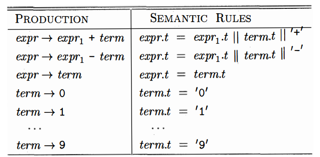
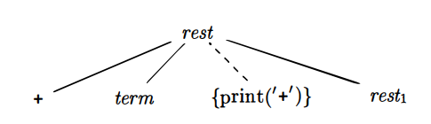
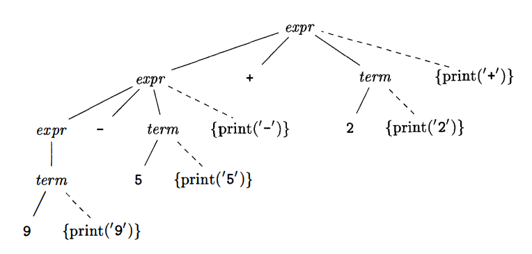

# 语法制导翻译

<!-- vscode-markdown-toc -->
* [Summary](#Summary)
	* [关于语法制导翻译的两个概念](#)
		* [属性（attribute）](#attribute)
		* [翻译方案（translation schemes）](#translationschemes)
* [Synthesized Attributes](#SynthesizedAttributes)
	* [一个语法制导定义的例子](#-1)
* [Simple Syntax-Directed Definitions](#SimpleSyntax-DirectedDefinitions)
* [树的遍历](#-1)
* [Translation Schemes](#TranslationSchemes)

<!-- vscode-markdown-toc-config
	numbering=false
	autoSave=true
	/vscode-markdown-toc-config -->
<!-- /vscode-markdown-toc -->

## Summary
1. 语法制导翻译，是通过向一个文法的产生式附加一些规则或程序片段而实现的。
2. 例如，考虑下面产生式生成的表达式 `expr`
    $$expr \to expr_1 + term$$
3. 这里我们根据这个产生式，使用下面的伪代码规则翻译它
    $$ 
    translate \ expr_1; \\
    translate \ term; \\
    handle \ +; 
    $$

### 关于语法制导翻译的两个概念
#### 属性（attribute）
1. 属性表示与某个程序构造相关的量。属性可以是多种多样的，比如表达式的数据类型，生成的代码中的指令数目，或者为某个构造声场的代码中第一条指令的位置等等。
2. Since we use grammar symbols (nonterminals and terminals)  to represent programming constructs, we extend the notion of attributes  from constructs to the symbols that represent them. 不懂

#### 翻译方案（translation schemes）
1. 语法制导的翻译方案。
2. 翻译方案是一种将程序片段添加到文法产生式上的表示法。
3. 当对一个产生式进行语法分析时，添加在其上的程序片段就会执行。
4. 这些程序片段的执行结果按照语法分析过程的顺序组合起来，就是这次对源程序分析/综合过程所得到的翻译结果。

## Synthesized Attributes
1. 通过文法，可以把具体的值和程序构造关联起来。例如把数值和类型与某个表达式相关联。看起来这里说的意思就是把属性和纯逻辑的表达式结合起来，让纯逻辑的表达式具有实际的意义。也就是把属性赋予文法中的终端和非终端。
2. 然后，再把规则添加到文法的表达式之上。规则描述了这些终端和非终端上的属性应该进行怎样的运算。
3. 在语法树的层面，节点和它的子节点根据它们之间的产生式逻辑、它们各自的属性、以及它们之间的规则，就可以实现翻译。
4. **语法制导定义**（syntax-derected definition）进行下面两部分的关联工作：
    * 把每个文法符号和它的一组属性相关联。也就是把纯逻辑的文法符号赋予具体的值；
    * 把每个产生式和一组 **语义规则**（semantic rule）相关联。那么规则就知道了产生式应该如何计算，计算的过程中，也会用到产生式中的文法符合上面的属性。
5. 其实也就是说，产生式本身只是由一组没有实际意义的符号组成的表达式，我们需要通过属性来给每个符号赋予意义，并且通过规则来给整个表达式赋予意义。
6. 如果一棵语法分析树的各个节点上标记了相应的属性值，那么这棵语法分析树就称为注释（annotated）语法分析树，或简称注释分析树。
7. 如果语法分析树中节点 N 的某个属性是由 N 和 N 的子节点的属性值决定的，那么这个属性就被称为 **综合属性**（synthesized attribute）。
8. 综合属性的一个优点是，只需要对语法分析树进行一次自底向上的便利，就可以计算出属性的值。
9. 还有另一种对应的属性，继承属性。继承属性的值是由当前节点、它的父节点和它的兄弟节点的属性决定的。

### 一个语法制导定义的例子
1. 这个例子把中序表达式源代码翻译成后续表达式。
2. 先看下面应用于一组产生式的语义规则
    
3. 左边是一组产生式，但产生式本身是没有语义的，它只是说明了语法。右边对应的语义规则为每个产生式说明它的语义是什么，也就是它具体表示什么意思，要如何进行翻译。
4. 这就是语法制导定义两部分关联工作之一，把产生式和予以规则相关联。
5. 右侧予以规则中每个非终端都有一个属性 `t`，在本例中，它表示该非终端生成的后续表达式的字符串。这种语法制导定义的另一个关联工作，把属性和文法符号相关联。
6. `||` 表示字符串的连接运算符。
7. 例如第一条产生式，它对应的语义规则说明：表达式 $expr$ 的属性 $t$ 的值，等于 $expr_1$ 的属性 $t$ 值连接 $term$ 的属性 $t$ 的值再连接 $+$ 号。也就是说，$expr$ 的后序表达式等于 $expr_1$ 的后序表达式连接 $term$ 的后序表达式再连接 $+$ 号。

## Simple Syntax-Directed Definitions 
1. 简单语法制导的 “简单”，需要满足：要得到一个产生式 head 的翻译结果字符串，只需要把该产生式 body 里的非终端翻译结果按照它们在产生式中的顺序连接起来，并在其中穿插一个额外的字符串即可。
2. 例如上面第一个语义规则中，$expr_1.t$ 和 $term.t$ 的前后顺序，是和产生式中 $expr_1$ 和 $term$ 的前后顺序相同的。

## 树的遍历
1. 语法分析树的遍历过程，就是对每个节点的属性的求值过程，也是一个翻译方案中代码片段的执行过程。
2. 语法制导定义没有规定一棵语法分析树中对各个节点属性求值的顺序，只要一个顺序能保证就按属性 a 的值是，a 所依赖的其他属性都已经计算完毕即可。
3. 综合属性可以再自底向上遍历的时候计算。但当既有综合属性又有继承属性时，关于求值顺序的问题就变得相当复杂。

## Translation Schemes
1. 上面通过使用语法制导定义，把后序表达式字符串作为节点的属性值，从而得到翻译结果。
2. 这里，我们使用语法制导翻译方案这种翻译方法时，不需要去操作每一部分的字符串，而是通过执行程序片段，逐步生成翻译结果。
3. 语法制导翻译方案会在文法产生式中附加一些程序片段，这些程序片段的执行过程，就会增量的输出翻译结果。
4. 被嵌入到产生式中的程序片段称为 **语义动作**（semantic action）。一个语义动作用花括号括起来，并写入产生式的 body 中。它嵌入的位置也决定了它的执行顺序。
5. 下面是一个例子
    $$ rest \to + \ term \ \{print('+')\} \ rest_1 $$
6. 当我们画出一个翻译方案的语法分析树时，我们为每个语义动作构造一个额外的子节点，并使用虚线将它和该产生式的头部对应的节点相连
    
7. 使用语法制导翻译方案翻译出后序表达式
    
    后序深度优先的遍历这棵树，就能打印出期望的后序表达式。
8. 实现语法制导翻译方案时不需要真的构造出一棵语法分析树，只要能保证语义动作的执行过程等同于我们真的构建了语法分析树并且在后序遍历中执行这些动作时的情形。