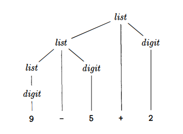
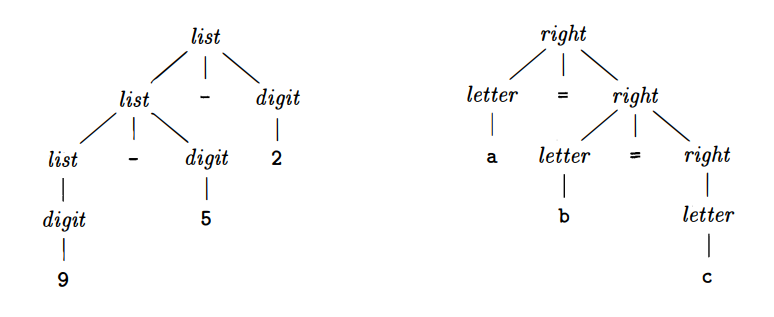

# 语法定义

<!-- vscode-markdown-toc -->
* [文法定义](#)
* [推导](#-1)
* [语法分析树](#-1)

<!-- vscode-markdown-toc-config
	numbering=false
	autoSave=true
	/vscode-markdown-toc-config -->
<!-- /vscode-markdown-toc -->


## <a name=''></a>文法定义
1. **上下文无关文法**（context-free grammar）或简称文法，用于表明一个语言的语法。在《编译原理》一书中用于组织编译器前端。
2. 文法描述了大多数程序设计语言的 **层次化结构**。
3. 例如 Java 的 if-else 语句具有如下形式
    ```
    if (expression) statement else statement
    ```
4. 如果我们用变量 `expr` 来表示表达式，用变量 `stmt` 来表示语句，上述规则可以表示为
    ```
    stmt -> if ( expr ) stmt else stmt
    ```
    其中的箭头可以读作 “可以具有如下形式（can have the form）”
5. 这种表示称为 **产生式（production）**。在一个产生式中，像关键字 `if` 和括号这样的词法元素称为 **终端（terminal）**；像 `expr` 和 `stmt` 这样的变量，表示终端的序列，称为 **非终端（nonterminal）**。（原书翻译为 “终结符号”，但显示它并没有结束的意思）

### 词法单元（token）和终端
1. 在编译器中，词法分析器（lexical analyzer）读入源程序的字符序列，将它们组织成具有词法含义的词素（lexemes），生成并输出代表这些词素的词法单元序列。
2. 词法单元由两部分组成：名字和属性。
3. 名字是分析器进行语法分析时使用的抽象符号。通常把这些名字称为终端，因为它们在文法中以终端的形式出现。
4. 如果词法单元具有属性，则该属性的值是一个指向符号表的指针，指向的内容包含了该词法单元的附加信息。
5. 这些附加信息不是文法的组成部分，因为在讨论语法分析时，通常将词法单元和终端当做同义词。

### 文法有四部分组件
* 终端的集合。也被成为 tokens。在使用文法定义一个语言时，终端是其中的基础符号。
* 非终端的集合。也被称为 syntactic variables。每个非终端都表示了一组终端字符串的集合。
* 产生式的集合。每个生产式由以下元素组成：
    * 一个称为该产生式的 **head** 或 **left side** 的非终端；
    * 一个箭头；
    * 一个由终端和非终端组成的序列，称为该产生式的 **body** 或 **right side**。
* 一个作为开始符号的非终端。


### 产生式
1. 产生式的用途是表示某个结构的书写形式。
2. 如果一个产生式的 head 指代一个结构，则该产生式的 body 就表示出该结构的书写形式。
3. 在描述文法时，我们会列出该文法的产生式，并且首先列出开始符号的产生式。我们假设斜体字符串为非终端，其他非斜体的名字或符号都可以看作是终端（例如 digit、数学符号或者程序关键字等）。
4. 为方便表示，同一个 head 的多个产生式的多个 body 可以放在一起表示，多个 body 之间用 `|` 分隔。

#### 例子
1. 对于由加减符号分隔的 digit 序列，例如 `1 + 2`、`5 - 3` 或者 `9 - 5 + 2`，下面的文法产生式表达了这种序列的语法
    ```
     list -> list + digit
     list -> list - digit
     list -> digit
    digit -> 0 | 1 | 2 | 3 | 4 | 5 | 6 | 7 | 8 | 9
    ```
2. 前三个产生式因为是同一个 head，所以也可以写成
    ```
    list  -> list + digit | list - digit | digit
    ```
3. 这个文法的终端包括如下符号：`+ - 0 1 2 3 4 5 6 7 8 9`；非终端是 `list` 和 `digit`，其中 `list` 是文法的开始符号。
4. 非终端 `digit` 的 10 个产生式可以表达 0~9 的是个数。
5. 之所以是 `list  -> digit`，这里认为 digit 也是一个 list。
6. 如果某个非终端是某个产生式的 head，我们就说该产生式是该非终端的产生式。
7. 一个终端串是有零个或多个终端组成的序列。零个终端的终端串称为空串，记为 `ε`（epsilon）。

#### 另一个例子
1. 一个参数可选的函数调用，由一个函数名加一对括号，以及括号里的零个、一个或更多参数组成。
2. 它的文法产生式如下
    ```
          call -> id (optparamas)
    optparamas -> params | ε
        params -> params, param | param
    ```
3. 因为是参数可选，所以 `optparamas` 的 body 可能是空串；
4. `params` 可以但单一的 param；也可以是多个，也就是至少包含一个 param 的 params 再加上一个 param。
5. `param` 也是非终端，但这里暂时没有给出它的产生式。


## <a name='-1'></a>推导（Derivations）
1. 根据文法推导出符号串时，我们先从文法的开始符号出发，不断地把其中的非终端符号替换为该非终端的产生式的 body。
2. 可以从开始符号推导出的所有终端符号串的集合称为该文法定义的 **语言（language）**。
3. 上面包含 `list` 和 `digit` 的那个文法例子中，这个文法定义的语言是由加减号以及它分割的 digit 组成的。
4. 根据这个文法的产生式，我们就可以定义出对应的语言，也就是由加减符号分隔的 digit 序列。例如，我们可以推断出 `9 - 5 + 2` 对应该文法的一个 list：
    1. `9` 是 digit，而 digit 是 list，所以 `9` 是 list；
    2. 同时，`5` 也是一个 digit；
    3. 所以 `9 - 5` 就是 list - digit，也就是一个 list；
    4. 又因为 `2` 是一个 digti，所以 `9 - 5 + 2` 就是 list + digit，也就是一个 list。
5. 语法分析（parsing）的要做的是，接受一个终端组成的字符串，然后尝试从文法的开始符号推导出这个终端字符串。如果无法从文法的开始符号推导出这个终端字符串，则报告该终端字符串中包含语法错误。
6. 一般情况下，一个源程序会包含多字符组成的词素，这些词素由词法分析转换为词法单元，词法单元的名字就是被语法分析器处理的终端符号。


## <a name='-1'></a>语法分析树
1. 语法分析树以图形的方式展现了从文法的开始符号推导出相应语言中符号串的过程。
2. 如果非终端 A 有一个生产式 A->XYZ，那么在语法分析树中就可能有一个标号为 A 的内部节点，该节点由三个子节点，从左到右分别为 X、Y、Z。
3. 内部节点和它的子节点组成一个产生式。内部节点对应产生式的 head，它的子节点对应产生式的 body。
4. 更准确定义，看《编译原理》2.2.3 语法分析树。
5. 例如， `9 - 5 + 2` 的语法分析树如下
    
6. 这棵树的叶子节点从左向右构成了树的 **yield**，也就是从这个语法分析树根节点的非终端推导出的符号串。
7. 一个文化的语言的另一个定义是：任何能够由某棵语法分析树生成的符号串的集合。
8. 为一个给定的终端符号串构建一棵语法分析树的过程，称为对该符号串进行 **parsing**。


## 二义性（Ambiguity）


## 运算符的结合性（Associativity of Operators）
1. 当一个运算数的左右两侧都有运算符时，我们需要规则来确定运算数要和哪个运算符进行运算。
2. 这里的结合性看起来是在讨论两侧的运算符是相同优先级的情况。
3. 例如 `9 + 5 + 2`，这里的运算数 5 左右两边都有运算符 +，实际计算时，是左边的 + 在和 5 进行运算，而右边的 + 是在和左边的整体进行运算。
4. 如果某个运算数左右两侧都有某个运算符，而计算式运算数要和左边的这个运算符进行运算，那就说这个运算符是 **左结合**（left-associative）的。
5. 例如 `9 + 5 + 2`，5 要和它左边的 `+` 进行运算。
6. 这个概念有点绕，它说的是 运算符 的结合性，但是是使用 运算数 的结合方向来描述的。
7. 一个右结合运算符的例子是赋值运算符 `=`。也就是说，`a = b = c` 和 `a = (b = c)` 相同。
8. 带有右结合运算符的字符串，可以用如下文法产生
    ```
     right -> letter = right | letter
    letter -> a | b | ... | z
    ```
9. 例如 `a = b = c`，就是 `a = (b = c)`，也就是 `letter = right`；而 `b = c` 这个 right 进一步又是 `letter = letter`。
10. 下图比较了左结合运算符和右结合运算符的语法分析树
    


## 运算符的优先级（Precedence of Operators）
### 定义两个非终端 factor 和 term
1. factor 是不能被任何运算符分开的表达式。它可以使一个单独的运算数，也可以是一个具有最高优先级的算式，
2. 例如一个带括号的算式。如果是运算数，那自然不会被分开；如果是最高优先级的算式，那出现在它左边或右边的运算符也不能把这个算式拆开，例如 `(1+2)/3`，除法运算符只能作用于 `(1+2)` 整体，而不能 `2/3`。
4. 而 term 是一个有可能被更高优先级拆分开但不能被更低优先级拆分开的表达式。
4. 除以上两者以外，一个既不是 factor 也不是 term 的表达式，可能被任何一个运算符拆分。
5. 以四则运算为例，factor 的产生式如下
    ```
    factor -> digit | (expr)
    ```
    factor 要么是一个数要么是一个括号表达式，都不能被拆分。
6. 同样以四则运算为例，term 的产生式如下
    ```
    term -> term * factor
          | term / factor
          | factor
    ```
    term 的三种 body 都不能被四则运算中优先级更低的 +/- 拆分。
7. term 产生式的前两个 body，左侧都是 term 而右侧都是 factor。不懂为什么是这样，既然根据第三个产生式，term 可以是 factor，那前两个产生式的右侧也可以是 term 吧

### 四则运算的产生式
1. 书上说非终端 expr 代表加减运算，但上面的 `factor -> digit | (expr)` 中的 expr 其实也可以是乘除运算。并且书中 expr 的产生式看起来也不是局限于加减运算
    ```
    expr -> expr + term
        | expr - term
        | term
    ```
2. `factor`、`term` 和 `expr` 三个产生式结合起来就是四则运算的产生式
    ```
    expr -> expr + term
        | expr - term
        | term

    term -> term * factor
        | term / factor
        | factor
    
    factor -> digit | (expr)
    ```
3. 使用这个文法时，一个表达式就是一个有 + 或 － 分隔开的 term 的列表，而 term 是由 * 或 / 分隔开的 factor 的列表。
4. 因为任何由括号括起来的表达式都是一个 factor，所以我们可以使用括号来构造出具有任意嵌套深度的表达式。