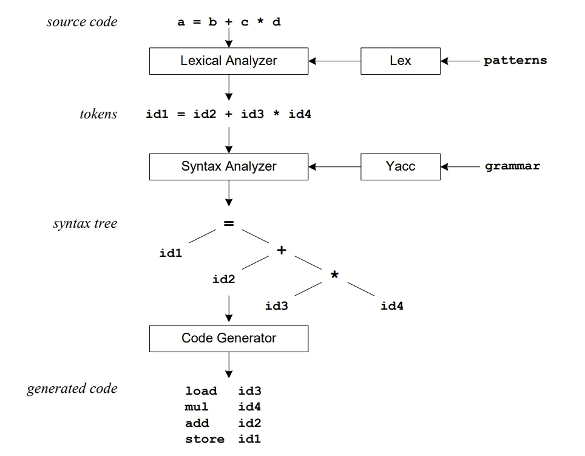
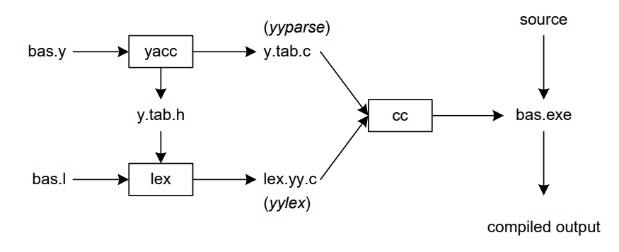

# Lex 和 Yacc 教程

<!-- vscode-markdown-toc -->
* 1. [Introduction](#Introduction)
	* 1.1. [Lex 和 Yacc 参与下的编译流程](#LexYacc)
	* 1.2. [Lex 和 Yacc 参与的编译中涉及到的文件和流程](#LexYacc-1)
* 2. [Lex](#Lex)
	* 2.1. [`.l` 编写规则](#.l)
		* 2.1.1. [rules 区块](#rules)
		* 2.1.2. [subroutines 区块](#subroutines)
		* 2.1.3. [definitions 区块](#definitions)
		* 2.1.4. [Lex 预定义的变量、宏和函数](#Lex-1)
* 3. [References](#References)

<!-- vscode-markdown-toc-config
	numbering=true
	autoSave=true
	/vscode-markdown-toc-config -->
<!-- /vscode-markdown-toc -->


##  1. <a name='Introduction'></a>Introduction
###  1.1. <a name='LexYacc'></a>Lex 和 Yacc 参与下的编译流程
1. 编译器工作流程
    
2. 从上图可以看到，Lex 的作用就是生成词法分析器，而 Yacc 的作用就是生成语法分析器。
3. 而具体需要根据什么规则来词法分析和语法分析，则需要用户通过 pattern 和 grammar 来告诉 Lex 和 Yacc。
4. When the lexical analyzer finds identifiers in the input stream it enters them in a symbol table. 
5. The symbol table may also contain other information such as data type (integer or real) and 
location of each variable in memory. 
6. All subsequent references to identifiers refer to the appropriate symbol table index.
7. The syntax analyzer uses grammar rules that allow it to analyze tokens from the lexical analyzer and create a syntax tree.
8. The next step, code generation, does a depth first walk of the syntax tree to generate code. Some compilers produce machine code, while others, as shown above, output assembly language.

###  1.2. <a name='LexYacc-1'></a>Lex 和 Yacc 参与的编译中涉及到的文件和流程
1. 图示
    
2. Lex 所需的 pattern 编写在 *.l* 文件中，Yacc 所需的 grammar 编写在 *.y* 文件中。
3. Yacc 读取 *.y* 文件中的 grammar 描述，以此生成一个语法分析器（*y.tab.c*），其中包含函数 `yyparse`。
4. 生成 *y.tab.c* 命令中的 `-d` 参数会让 Yacc 生成 token 的定义并保存在生成的 *y.tab.h* 文件中，这些定义供给 Lex 使用。
5. Lex 读取 *.l* 中的 pattern 描述，并结合 *y.tab.h* 来生成词法分析器（*lex.yy.c*），其中包含函数 `yylex`。
6. 最后，上面生成词法分析器和语法分析器被编译并链接，生成最终的编译器可执行文件（*.exe*）。其中的 `yyparse` 被调用后开始执行编译，`yyparse` 会调用 `yylex` 来进行词法分析。


##  2. <a name='Lex'></a>Lex
1. Lex 通过正则表达式来指定 pattern，对输入的源代码字符串进行匹配。
2. 每个 pattern 都对应一个 action，action 是一段 C 代码，该 pattern 的正则匹配到了一段源代码后，对应的 action 就会执行。
3. 通常，一个 action 会返回一个代表匹配到的字符串的 token，这个 token 会供之后的语法分析器使用。
4. pattern 的正则表达式会被 Lex 翻译成一段 FSA 程序来进行匹配。

###  2.1. <a name='.l'></a>`.l` 编写规则
1. `.l` 里面的代码通常被两个 `%% ` 分为三部分
    ```
    ... definitions ... 
    %% 
    ... rules ... 
    %% 
    ... subroutines ...
    ```

####  2.1.1. <a name='rules'></a>rules 区块
1. rules 区块是必须要有的，它位于第一个 `%% ` 之后。看起来如果没有 subroutines 区块，则可以省略第二个 `%% `。
2. 看起来，rules 区块虽然是必须的，但在里面可以不指定任何规则。However if we don’t specify any rules then the default action is to match everything and copy it to output。不懂具体是怎么原样拷贝的。
3.  Defaults for input and output are `stdin` and `stdout`, respectively.
4. 下面是一个最简单的例子
    ```lex
    %% 
        /* match everything except newline */ 
    . ECHO; 
        /* match newline */ 
    \n ECHO; 
    %% 
    int yywrap(void) { 
        return 1; 
    } 
    int main(void) { 
        yylex(); 
            return 0; 
        }
    ```
    1. rules 区块指定了两个规则。第一个规则匹配换行符以外的其他字符，第二个规则匹配换行符。
    2. 规则必须从当前行的第一列开始写，后面跟着若干个空白符（space, tab or newline），然后可以跟一个可选的 action。
    3. action 可以是单独一个 C 语句，也可以是 `{}` 包裹的语句块。
    4. 如果规则区除了 C 语句以外的没有从第一列开始书写的内容会被原样拷贝到生成 C 文件中。利用这个规则可以像上面例子中那样来写注释。C 语句没有从第一列开始的行的情况如下
    ```
    . {
        fprintf(stderr, "lexical error.\n");
        exit(1);
    }
    ```
5. 上面例子中两个规则的 action 都是一个单独的 `ECHO`。这是 Lex 定义的宏命令之一。`ECHO` 的定义如下
    ```cpp
    #define ECHO fwrite(yytext, yyleng, 1, yyout) 
    ```
    不懂，怎么感觉这里 `fwrite` 第二个和第三个参数是颠倒的。
6. `yytext` 是指向匹配到的字符串的指针，`yyleng` 是匹配到的自付出啊你的长度，`yyout` 默认是 `stdout`。
7. If two patterns match the same string, the longest match wins. In case both matches are the same length, then the first pattern listed is used. 所以下面这个规则可以作为最后一个规则，用来匹配任何不合法的字符
    ```
    . {
        fprintf(stderr, "lexical error.\n");
        exit(1);
    }
    ```
    这个规则的正则虽然可以匹配换行符以外的任何字符，但因为它写在最后面，所以只有当前面的规则都匹配不到时，才会被最后这个规则捕获。

####  2.1.2. <a name='subroutines'></a>subroutines 区块
1. Function `yywrap` is called by lex when input is exhausted. Return 1 if you are done or 0 if more processing is required.
2. Every C program requires a `main` function. In this case we simply call `yylex` that is the 
main entry-point for lex. 
3. Some implementations of lex include copies of `main` and `yywrap` in a library thus eliminating the need to code them explicitly. 
4. The following example prepends line numbers to each line in a file. Some implementations of lex 
predefine and calculate `yylineno`. The input file for lex is `yyin` and defaults to `stdin` 不懂
    ```lex
    %{ 
        int yylineno;
    %} 
    %% 
    ^(.*)\n printf("%4d\t%s", ++yylineno, yytext); 
    %% 
    int main(int argc, char *argv[]) { 
        yyin = fopen(argv[1], "r"); 
        yylex(); 
        fclose(yyin); 
    }
    ```

####  2.1.3. <a name='definitions'></a>definitions 区块
1. definitions 区块内 `%{` 和 `%}` 包裹的部分，是要让生成的词法分析器将此部分代码原样输出。
2. 在这个区块里我们还可以把正则表达式定义为标识符，之后在 rules 区块里使用这些标识符。使用这些标识符时要包裹在 `{}` 中，以此和字面量区分
    ```lex
    digit [0-9] 
    letter [A-Za-z] 
    %{ 
        int count; 
    %} 
    %% 
        /* match identifier */ 
    {letter}({letter}|{digit})* count++; 
    %% 
    int main(void) { 
        yylex(); 
        printf("number of identifiers = %d\n", count); 
        return 0; 
    }
    ```

####  2.1.4. <a name='Lex-1'></a>Lex 预定义的变量、宏和函数
Name | Function 
--|--
`int yylex(void)`  | call to invoke lexer, returns token 
`char *yytext`     | pointer to matched string 
`yyleng`           | length of matched string 
`yylval`           | value associated with token 
`int yywrap(void)` | wrapup, return 1 if done, 0 if not done 
`FILE *yyout`      | output file 
`FILE *yyin`       | input file 
`INITIAL`          | initial start condition 
`BEGIN`            | condition switch start condition 
`ECHO`             | write matched string 


## Yacc
### BNF
1. Yacc 用到的 grammar 是使用 BNF 的一个变体来描述的。BFN 可用于表示 context-free 的语言，大多数现代的编程语言都可以使用 BNF 来表示。
2. 例如，下面是一个数值加法和乘法的 BNF grammar，包含三个产生式（purduction）
    ```
    E -> E + E
    E -> E * E
    E -> id
    ```
3. 产生式的 `->` 的左边（lhs）的 term 是非终端；产生式的右边（rhs）的若干个 term 可能是非终端也可能是终端。
4. 上面的 grammer 描述了，一个 E（expression）可以是两个 E 的和、也可以是两个 E 的乘积、也可是一个标识符（identifier）。
5. 我们可能根据这个 grammar 生成具体的源代码表达式。例如下面从产生式 `E -> E + E` 生成具体代码 `x + y * z` 的过程（看起来下面这个例子中没有遵照一般情况下预期的运算优先级，也就是从第二行到第三行时，看起来是 + 的优先级更高，所以把 E 展开为 E + E）
    ```
    E -> E * E 
      -> E * z
      -> E + E * z
      -> E + y * z
      -> x + y * z
    ```
6. 上面每一步的展开过程，我们都是把 grammar 中一个产生式的 lhs 替换成对应的 rhs。

### 语法解析过程
1. 而在进行语法解析时，我们的操作过程是和上面展开过程相反的，会把一个表达式规约为一个单独的非终端。
2. 这个过程被称为 bottom-up 解析或者 shift-reduce（移进-规约）解析，会使用一个栈结构来保存 term。
3. 下面的例子演示了这一过程。其中的 `.` 作为分隔，右边是待移进的字符，左边是移进后的栈结构
    ```
    1    . x + y * z    shift 
    2    x . + y * z    reduce(r3) 
    3    E . + y * z    shift 
    4    E + . y * z    shift 
    5    E + y . * z    reduce(r3) 
    6    E + E . * z    shift 
    7    E + E * . z    shift 
    8    E + E * z .    reduce(r3) 
    9    E + E * E .    reduce(r2)        emit multiply 
    10   E + E .        reduce(r1)        emit add 
    11   E .            accept
    ```
4. 上面就是不断的移进和规约的过程。但注意第 6 步，栈里的 `E + E` 是可以规约为 `E` 的，但这里并没有规约，而是继续移进了第三个运算数，然后让第二个和第三个运算数先进行了规约。这里就涉及了优先级的问题。
5. 如果没有知名优先级，那上面的第 6 步则可以移进也可以规约，这就是 **移进-规约冲突**。为了解决这种冲突，我们可以重写 grammar 或者告知 Yacc 优先级规则。通常后者的方法更简单。如果不解决冲突，Yacc 默认会优先移进。
6. 另外还以一种冲突，是 **规约-规约冲突**，也就是同一个 rhs 有两种不同的 lhs，例如
    ```
    E -> T
    E -> id
    T -> id
    ```
    这种情况下 Yacc 会优先使用冲突规则中的第一个。

### `.y` 编写规则
`.y` 和 `.l` 也是分为那三个区块。下面用一个实现整数加减法计算器的例子来解释，下面是它完整的 `.l` 和 `.y`
```lex
%{ 
#include <stdlib.h> 
void yyerror(char *); 
#include "y.tab.h" 
%} 
%% 
[0-9]+      { 
                yylval = atoi(yytext); 
                return INTEGER; 
            } 
[-+\n]      return *yytext; 
[ \t]       ; /* skip whitespace */ 
.           yyerror("invalid character"); 
%% 
int yywrap(void) { 
    return 1; 
}
```
```yacc
%{ 
    #include <stdio.h> 
    int yylex(void); 
    void yyerror(char *); 
%} 
%token INTEGER 
%% 
program: 
        program expr '\n' { printf("%d\n", $2); } 
        | 
        ; 
expr: 
        INTEGER { $$ = $1; } 
        | expr '+' expr { $$ = $1 + $3; } 
        | expr '-' expr { $$ = $1 - $3; } 
        ; 
%% 
void yyerror(char *s) { 
    fprintf(stderr, "%s\n", s); 
} 
int main(void) { 
    yyparse(); 
    return 0; 
} 
```

#### definitions 区块
1. 对于 token 的定义放在这里区块里。
2. 因为要实现整数加减法，所以运算数的 token 就是整数类型的 token。这里我们把整数的 token 定义为 `INTEGER`
    ```yacc
    %token INTEGER
    ```
3. Tokens are numerical representations of strings, and simplify processing. 
4. Yacc 生成的 *y.tab.h* 中，就会包含上面的 `INTEGER`，并且可以看到它被定义为整数的宏
    ```h
    #ifndef YYSTYPE 
    #define YYSTYPE int 
    #endif 
    #define INTEGER 258 
    extern YYSTYPE yylval; 
    ```
5. Lex 会包含这个头文件并且使用里面的 token 定义。
6. 为了获得一个 token，Yacc 会调用 `yylex` 函数，这个函数的返回值类型的 `int` 类型，返回的整数就是对应一个 token。而这个 token 的值则会保存在全局变量 `yylval` 中
    ```lex
    [0-9]+      { 
                    yylval = atoi(yytext); 
                    return INTEGER; 
                }
    ```
7. 上面这个例子中，如果通过正则表达式 `[0-9]+` 匹配到了整数，后面的 `yylex` 函数就会返回之前定义的表示整数 token 的 `INTEGER`。
8. 用户自定义的 token 类型的整数值一般大概是从 258 开始的。因为 0-255 是保留给一些基础符号用的，比如加号减号之类的；另外 Lex 还保留了几个用于 EOF 和错误处理。
9. `yylval` 是由 `YYSTYPE` 决定的，默认是 `int` 类型，如上面示例的 *y.tab.h* 中所示。我们这个简单的例子中只有整数类型，所以使用默认值刚好。但大多数情况下都是有多种数据类型的，所以会使用 union 来定义 `YYSTYPE` 的类型，下面例子中有。

#### Yacc 的两个栈
1. Yacc 内部维持着两个栈，一个是解析（parse）栈，一个是值（value）栈。
2. 解析栈里存储着终端符和非终端符，用来表示当前的解析状态。值栈存储着 `YYSTYPE` 元素和与解析栈里元素一一对应的值。
3. 例如 Lex 返回了一个 `INTEGER` token，Yacc 把它移进解析栈，同时，该 token 的值 `yylval` 也被移进值栈。
4. 解析栈和值栈一直是保持同步的，所以可以很直接的从值栈里找到解析栈里对应 token 的值。

#### rules 区块
1. 这里的规则也是类似于 BNF 文法，每个规则的 lhs 写在最左边，后面跟冒号，然后之后是 lhs 对应一个或多个展开，每个展开独占一行，后面的花括号里是对应的 action。
2. 如果匹配到了一个展开，会打印表达式的值。When a newline is detected we print the value of the 
expression. When we apply the rule。不懂，打印规约后的值？输出到哪儿？
3. 例如如果匹配到下面这个展开时，Yacc 会把解析栈里的 `expr '+' expr` 规约为 `expr`。也就是先让栈里的 `expr`、`+` 和 `expr` 弹出，然后再移进 `expr` 放到栈顶
    ```yacc
    expr: expr '+' expr { $$ = $1 + $3; } 
    ```
4. 后面花括号里带 `$` 的标识符是指向值栈里面元素的指针：
    * `$1` 指向的这个展开的右边的第一个元素，也就是 `expr '+' expr` 中左边那个 `expr` 的元素；
    * `$2` 指向的这个展开的右边的第二个元素，也就是 `expr '+' expr` 中 `+` 的元素；
    * `$3` 指向的这个展开的右边的第一个元素，也就是 `expr '+' expr` 中右边那个 `expr` 的元素；
    * `$$` 指向的使用该条展开规约之后的栈顶元素。
    
### 错误处理
1. 当发生语法错误时，Yacc 会调用用户提供的 `yyerror` 函数。
2. If you need to modify the interface to yyerror then alter the canned file that yacc includes to fit your needs. 

### 完善计算器的例子
1. 现在我们要给计算器加上乘除、括号和赋值，并且设置优先级。
2. 还增加了单字母变量，因此除了上面的 `INTEGER` 外，我们还要新增一个 `VARIABLE` token。
3. 对于 `INTEGER` 和 `VARIABLE` token，把它们的值 `yylval` 设置为一个整数，这个整数符号表（symbol table）`sym` 的索引值。`INTEGER` 类型的整数值就是把该整数字符串转为对应的整数，`VARIABLE` 类型的 token 这里是匹配小写英文字母，它使用的整数值，从下面的代码看，是当前字母和字幕 `a` 的差值。不懂，那这里 `INTEGER` 和 `VARIABLE` 不就会产生相同的索引值了吗？
4. 下面是给 Lex 的输入
    ```lex
    %{ 
        #include <stdlib.h> 
        void yyerror(char *); 
        #include "y.tab.h" 
    %} 

    %% 
        /* variables */ 
    [a-z]       { 
                    yylval = *yytext - 'a'; 
                    return VARIABLE; 
                } 

        /* integers */ 
    [0-9]+      { 
                    yylval = atoi(yytext); 
                    return INTEGER; 
                } 
        /* operators */ 
    [-+()=/*\n] { return *yytext; } 

        /* skip whitespace */ 
    [ \t]       ; 

        /* anything else is an error */ 
    .           yyerror("invalid character"); 
    %% 

    int yywrap(void) { 
        return 1; 
    }
    ```
5. `INTEGER` 和 `VARIABLE` 是声明在给 Yacc 的输入中的。这个输入中还要加上乘除符号声明，并且要设置乘除的优先级高于加减。下面是输入的代码
    ```yacc
    %token INTEGER VARIABLE 
    %left '+' '-' 
    %left '*' '/' 

    %{ 
        void yyerror(char *); 
        int yylex(void); 
        int sym[26]; 
    %} 

    %% 
    program: 
            program statement '\n' 
            | 
            ; 
    statement: 
            expr { printf("%d\n", $1); } 
            | VARIABLE '=' expr { sym[$1] = $3; } 
            ; 
    expr: 
    INTEGER 
            | VARIABLE { $$ = sym[$1]; } 
            | expr '+' expr { $$ = $1 + $3; } 
            | expr '-' expr { $$ = $1 - $3; } 
            | expr '*' expr { $$ = $1 * $3; } 
            | expr '/' expr { $$ = $1 / $3; } 
            | '(' expr ')' { $$ = $2; } 
            ; 
    %% 
    void yyerror(char *s) { 
        fprintf(stderr, "%s\n", s); 
        return 0; 
    } 
    int main(void) { 
        yyparse(); 
        return 0; 
    }
    ```
5. `%left` 是声明左结合运算符的。如果要声明右结合运算符则是 `%right`。
6. 根据 Yacc 的规则，因为乘除的声明在加减之后，所以乘除的优先级更高。


## TODO 
* [LEX & YACC TUTORIAL by Tom Niemann](http://ftp.mozgan.me/Compiler_Manuals/LexAndYaccTutorial.pdf) 的后续内容


##  3. <a name='References'></a>References
* [LEX & YACC TUTORIAL by Tom Niemann](http://ftp.mozgan.me/Compiler_Manuals/LexAndYaccTutorial.pdf)