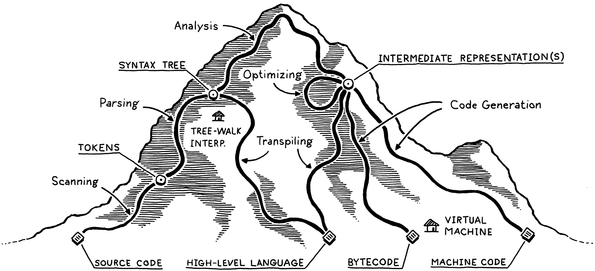

# Introduction

<!-- vscode-markdown-toc -->
* 1. [实现一个语言的路径图](#)
	* 1.1. [前端（front end）](#frontend)
		* 1.1.1. [扫描/词法分析（scanning/lexing）](#scanninglexing)
		* 1.1.2. [解析（parsing）](#parsing)
		* 1.1.3. [静态分析（Static analysis）](#Staticanalysis)
		* 1.1.4. [对分析结果的存储](#-1)
	* 1.2. [中端（middle end）](#middleend)
		* 1.2.1. [中间表示（Intermediate representations, IR）](#IntermediaterepresentationsIR)
		* 1.2.2. [优化（Optimization）](#Optimization)
	* 1.3. [后端（back end）](#backend)
		* 1.3.1. [代码生成（Code generation）](#Codegeneration)
		* 1.3.2. [虚拟机（Virtual machine, VM）](#VirtualmachineVM)
		* 1.3.3. [运行时（Runtime）](#Runtime)
* 2. [捷径和替代路线](#-1)
	* 2.1. [单遍编译器（Single-pass compilers）](#Single-passcompilers)
	* 2.2. [树遍历解释器（Tree-walk interpreters）](#Tree-walkinterpreters)
	* 2.3. [转译器（Transpilers）](#Transpilers)
	* 2.4. [即时编译（Just-in-time compilation，JIT）](#Just-in-timecompilationJIT)
* 3. [编译器（Compilers）和解释器（Interpreters）](#CompilersInterpreters)
* 4. [References](#References)

<!-- vscode-markdown-toc-config
	numbering=true
	autoSave=true
	/vscode-markdown-toc-config -->
<!-- /vscode-markdown-toc -->


## 术语
### syntax vs semantics vs grammar 
1. syntax 是语言应该符合的一些结构，它不关心一句话是什么意思，不关心一句话表达的意思是否正确，只关心一句话的结构是否正确。
2. semantics 是语言所表达出的意思。
3. 例如，“太阳是正方体”。这句话是符合 syntax 的，但它的 semantics 是错误的。但 “太阳球体是” 这句话，一般人可以理解这句话的 semantics，知道它说的是事实，但它不符合中文的 syntax（倒是符合日文 syntax）。
4. 而 grammar 和它俩不是一个类型的概念，grammar 是用来定义 syntax 的规则。
5. The syntax of a language defines its surface form. Semantics assigns computational meaning to valid strings in a programming language syntax.

### parse 和 revolve
这两个词都可以翻译成 “解析”，所以在表示 revolve 时全部使用英文原文。


##  1. <a name=''></a>实现一个语言的路径图


以对下面的一行源代码处理为例


###  1.1. <a name='frontend'></a>前端（front end）
####  1.1.1. <a name='scanninglexing'></a>扫描/词法分析（scanning/lexing）
scanner/lexer 接收上面的源代码，将它分成一个个具有独立意义的 token


####  1.1.2. <a name='parsing'></a>解析（parsing）
1. This is where our syntax gets a grammar—the ability to compose larger expressions and statements out of smaller parts.
2. 解析器（parser）读取线性的 token 流，构建出一个反映出语法嵌套结构的树形结构。这个树形结构被称为 **解析树**（parse tree） 或 **抽象语法树**（abstract syntax tree，AST）
    

####  1.1.3. <a name='Staticanalysis'></a>静态分析（Static analysis）
1. 例如对于表达式 `a + b`，我们虽然知道要把 `a` 和 `b` 相加，但是不知道 `a` 和 `b` 代表的是什么。它们是全局变量还是局部变量，它们是哪个局部的局部变量。
2. 大多数编程语言所做的第一步的分析是 binding 或 resolution：找到每个标识符定义的位置，以此确定它到底代表什么值。这就是作用域机制的用途。
3. 如果语言是静态类型的，这时我们会进行类型检查。一旦我们知道了 `a` 和 `b` 在哪里声明，我们就可以确定它们的类型。然后，如果这些类型不支持相互添加，我们会报告类型错误。
4. 对于动态类型语言，类型检查不会在静态分析阶段进行，而是在运行时进行。

####  1.1.4. <a name='-1'></a>对分析结果的存储
1. 上面所有对源代码的分析，我们需要把分析的结果（比如某个标识符是否是变量，变量的类型等）保存在某些地方。
2. 通常，它会被存储为语法树本身的属性。
3. 其他时候会存储在一个单独的 **符号表**（symbol table）中，符号表的 key 是标识符，value 则会告诉我们标识符指代的是什么。
4. 还可以把语法树转换为一个全新的数据结构，以便更直接的表达代码的语义。

###  1.2. <a name='middleend'></a>中端（middle end）
1. 可以将编译器视为一个有若干阶段的管道，每个阶段接收上个阶段处理过的数据，对这些数据进行处理，然后再交给下一个阶段。
2. 每一个阶段的处理工作都可以理解为下一个阶段的预处理。例如词法分析阶段先把源代码处理为 token，这样解析阶段才能把这些 token 转化为语法树。
3. 编译器前端的处理工作与特定的编程语言相关，因为它就是对源代码的处理；而后端的工作则与程序所要运行于的平台架构相关。
4. 也就是说，不同语言的编译器有不同的前端处理；而不同架构的平台有不同的后端处理逻辑。前端绑定于特定语言，后端绑定于特定平台。或者说，前端绑定于源代码，后端绑定于目标代码。

####  1.2.1. <a name='IntermediaterepresentationsIR'></a>中间表示（Intermediate representations, IR）
1. 在中间阶段，代码可能存储在某种中间表示中，这种表示并不与源代码或目标代码紧密相关。相反，IR 充当这两者之间的接口。
2. 并不是每种语言都对应一个 IR，也并不是每种架构都对应一个 IR，而是有少数几个通用的 IR。每种语言的编译器只要能把源代码转换成这少数集中 IR 即可运行在所有架构上。所以不需要每种语言都要自己去兼容所有的架构。

####  1.2.2. <a name='Optimization'></a>优化（Optimization）
1. 一旦我们理解了用户程序的含义，我们就可以自由地将其替换为具有相同语义但更有效地实现它们的其他程序，也就是对其进行优化。
2. 一个简单的例子是 **常量折叠**（constant folding）：如果某个表达式总是求出完全相同的值，我们可以在编译时进行求值，并用其结果替换表达式的代码。如果用户输入以下内容：
    ```
    pennyArea = 3.14159 * (0.75 / 2) * (0.75 / 2);
    ```
    我们可以在编译器中完成所有的算术运算，并将代码改为：
    ```
    pennyArea = 0.4417860938;
    ```

###  1.3. <a name='backend'></a>后端（back end）
####  1.3.1. <a name='Codegeneration'></a>代码生成（Code generation）
1. 我们已经将能想到的所有优化都应用到了用户的程序中。最后一步是将其转换为机器可以实际运行的形式。也就是生成代码（code gen），这里的代码通常是指 CPU 运行的原始汇编类指令。
2. 我们必须做出决定。我们为真实 CPU 还是虚拟 CPU 生成指令？如果我们生成真实机器代码，我们将获得一个可执行文件，操作系统可以直接将其加载到芯片上。这样代码速度极快，但生成它需要大量工作。当今的架构拥有大量指令、复杂的管道和巨量的历史包袱。
3. 而且直接生成 CPU 可用的指令还意味着编译器于特定架构绑定。如果您的编译器以 x86 机器代码为目标，则它无法在 ARM 设备上运行。
4. 为了解决这个问题，可以生成虚拟的机器码，这种机器码并不是针对真实的 CPU 而生成，而是针对一个假想的、理想化的机器。我们通常称这种虚拟的机器码为 **字节码**，它们的每条指令通常由一个字节。
5. 字节码的指令旨在更紧密地映射语言的语义，而不会与任何一种计算机架构的特性紧密相关。

####  1.3.2. <a name='VirtualmachineVM'></a>虚拟机（Virtual machine, VM）
1. 可以编写编译器把字节码转换为真实的机器码，这就需要为该语言支持的所有架构编写机器码编译器。
2. 在这个转换过程总，你需要决定什么时候把字节码转换为和特定架构绑定的代码。越晚和特定架构绑定，你就可以更多的处理通用的字节码，越少的考虑不同架构的情况；而越早和特定架构绑定，你就可以越多的针对每种架构进行特定的优化。
3. 如果不编写编译器把字节码转换为机器码，则可以编写虚拟机，虚拟机在运行时模拟特定的架构来执行机器码。
4. 在运行时执行字节码当然要比先转为机器码再运行的运行速度要慢，但可以获得更好的可移植性。例如用 C 语言实现的虚拟机，可以再具有任何 C 编译器的平台上运行。

####  1.3.3. <a name='Runtime'></a>运行时（Runtime）
1. 我们终于将用户的程序打磨成可以执行的形式。最后一步是运行它。如果我们将其编译为机器代码，我们只需告诉操作系统加载可执行文件即可。如果我们将其编译为字节码，我们需要启动虚拟机并将程序加载到其中。
2. 在这两种情况下，我们的语言在程序运行时还需要提供的一些服务。例如，如果语言自动管理内存，需要一个垃圾收集器来回收未使用的内存位。这些在运行时提供的服务就叫做 **运行时**。
3. 在完全编译的语言中，实现运行时的代码会直接插入到生成的可执行文件中。例如在 Go 中，每个编译的应用程序都直接嵌入了 Go 运行时的副本。
4. 如果该语言在解释器或虚拟机中运行，则运行时就由解释器或虚拟机负责。Java、Python 和 JavaScript 等大多数语言就是这样的实现方式。


##  2. <a name='-1'></a>捷径和替代路线
上面就是实现一个语言的所有阶段。许多语言确实会走完整条路，但也有一些捷径和替代路径。

###  2.1. <a name='Single-passcompilers'></a>单遍编译器（Single-pass compilers）
一些简单的编译器会交错执行解析、分析和代码生成，这样它们就可以直接在解析器中生成输出代码，而无需分配任何语法树或其他 IR。

###  2.2. <a name='Tree-walkinterpreters'></a>树遍历解释器（Tree-walk interpreters）
一些编程语言在将代码解析为 AST（可能应用了一些静态分析）后立即开始执行代码。要运行程序，解释器会一次遍历语法树的一个分支和叶子，并在遍历过程中评估每个节点。

###  2.3. <a name='Transpilers'></a>转译器（Transpilers）
将你的语言编译为另一种已有语言的源代码，而不需要把考虑编译成字节码或机器码的工作。

###  2.4. <a name='Just-in-timecompilationJIT'></a>即时编译（Just-in-time compilation，JIT）


##  3. <a name='CompilersInterpreters'></a>编译器（Compilers）和解释器（Interpreters）


1. 编译一般是指将源代码翻译成其他形式，例如字节码或机器码。所以，严格的编译器只是对源代码进行翻译。
2. 而解释器，一般是接收源码，并且立刻使用源码执行程序。
3. 但很多实现，其实是间距这两者的。它会对源码进行编译，然后再执行。


##  4. <a name='References'></a>References
* [*Crafting interpreters*: A Map of the Territory](https://craftinginterpreters.com/a-map-of-the-territory.html)
