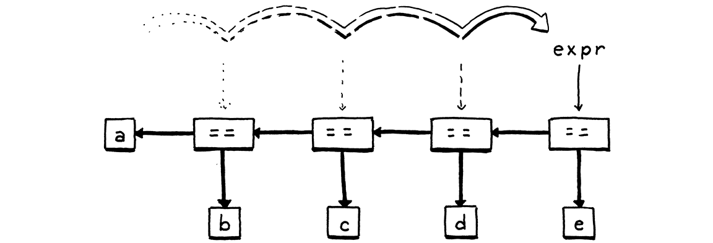

# Parsing Expressions

- [Ambiguity and the Parsing Game](#ambiguity-and-the-parsing-game)
  - [二义性](#二义性)
  - [优先级和结合性](#优先级和结合性)
    - [`Term` 和 `Factor`](#term-和-factor)
  - [Stratify the grammar](#stratify-the-grammar)
    - [`expression` 规则](#expression-规则)
    - [`primary` 规则](#primary-规则)
    - [`unary` 规则](#unary-规则)
    - [`factor` 规则以及其他二元表达式规则](#factor-规则以及其他二元表达式规则)
      - [如果使用左侧递归](#如果使用左侧递归)
      - [我们使用的 `factor` 规则，以及其他二元表达式的规则](#我们使用的-factor-规则以及其他二元表达式的规则)
    - [完整的表达式规则](#完整的表达式规则)
- [Recursive Descent Parsing](#recursive-descent-parsing)
  - [工作原理](#工作原理)
    - [第1步：入口](#第1步入口)
    - [第2步：解析 equality](#第2步解析-equality)
    - [第3步：解析第一个 comparison (`3 + 6 * -2 > 5`)](#第3步解析第一个-comparison-3--6---2--5)
    - [第4步：解析第一个 term (`3 + 6 * -2`)](#第4步解析第一个-term-3--6---2)
    - [第5步：解析第二个 factor (`6 * -2`)](#第5步解析第二个-factor-6---2)
    - [第6步：解析第二个 unary (`-2`)](#第6步解析第二个-unary--2)
    - [第7步：自底向上组装](#第7步自底向上组装)
    - [最终生成的抽象语法树（AST）结构示意](#最终生成的抽象语法树ast结构示意)
  - [代码实现](#代码实现)
    - [The parser class](#the-parser-class)
    - [`expression` 规则](#expression-规则-1)
    - [`equality` 规则](#equality-规则)
      - [`match` 方法](#match-方法)
    - [其他二元运算表达式规则](#其他二元运算表达式规则)
    - [`unary` 规则](#unary-规则-1)
    - [`primary` 规则](#primary-规则-1)
- [Syntax Errors](#syntax-errors)
  - [错误处理需要满足的要求](#错误处理需要满足的要求)
  - [Panic mode error recovery](#panic-mode-error-recovery)
  - [Entering panic mode](#entering-panic-mode)
  - [Synchronizing a recursive descent parser](#synchronizing-a-recursive-descent-parser)
- [Wiring up the Parser](#wiring-up-the-parser)
- [References](#references)


## Ambiguity and the Parsing Game
### 二义性
1. Here’s the Lox expression grammar we put together in the last chapter:
    ```
    expression     → literal
                    | unary
                    | binary
                    | grouping ;

    literal        → NUMBER | STRING | "true" | "false" | "nil" ;
    grouping       → "(" expression ")" ;
    unary          → ( "-" | "!" ) expression ;
    binary         → expression operator expression ;
    operator       → "==" | "!=" | "<" | "<=" | ">" | ">="
                    | "+"  | "-"  | "*" | "/" ;
    ```
2. This is a valid string in that grammar:
    ```
    6 / 3 - 1
    ```
3. But there are two ways we could have generated it. 
4. One way is:
    1. Starting at `expression`, pick `binary`.
    2. For the left-hand `expression`, pick `NUMBER`, and use `6`.
    3. For the operator, pick `"/"`.
    4. For the right-hand `expression`, pick `binary` again.
    5. In that nested `binary` expression, pick `3 - 1`.
5. Another is:
    1. Starting at `expression`, pick `binary`.
    2. For the left-hand `expression`, pick `binary` again.
    3. In that nested `binary` expression, pick `6 / 3`.
    4. Back at the outer `binary`, for the operator, pick `"-"`.
    5. For the right-hand `expression`, pick `NUMBER`, and use `1`.
6. Those produce the same strings, but not the same syntax trees:
    
7. In other words, the grammar allows seeing the expression as `(6 / 3) - 1` or `6 / (3 - 1)`.

### 优先级和结合性
1. **优先级**（Precedence）决定了在包含不同运算符的表达式中哪个运算符首先被求值。
2. **结合性**（Associativity）决定了在一系列相同的运算符中哪个运算符首先被求值。
    * 当一个运算符是 **左结合**（left-associative）时，左边的运算符先于右边的运算符求值：
        ```
        5 - 3 - 1
        ```
        相当于
        ```
        (5 - 3) - 1
        ```
    * **右结合**（right-associative）则相反：
        ```
        a = b = c
        ```
        ```
        a = (b = c)
        ```
3. 如果没有明确定义的优先级和结合性，使用多个运算符的表达式就会产生歧义，它可以解析为不同的语法树，而这些语法树又可能得出不同的结果。
4. Lox 中通过应用与 C 相同的优先级规则（从上到下优先级依次增高）来解决这个问题
    | Name       | Operators         | Associates |
    | ---------- | ----------------- | ---------- |
    | Equality   | `==` `!=`         | Left       |
    | Comparison | `>` `>=` `<` `<=` | Left       |
    | Term       | `-` `+`           | Left       |
    | Factor     | `/` `*`           | Left       |
    | Unary      | `!` `-`           | Right      |

#### `Term` 和 `Factor`
1. 在代数表达式中，`term` 是加减法表达式，`factor` 是乘除法表达式。
2. 以 `2x + 4y - 9` 为例：
    * `2x + 4y` 是一个 `term`；
    * `2x + 4y - 9` 是一个 `term`；
    * `4y - 9` 从语法结构上也是一个合法的 `term`，虽然这个表达式实际上并不会执行;
    * `2x` 和 `4y` 是隐含的乘法运算，因此它们各自是一个 `factor`;
    * `9` 是一个数字字面量，在语法树中它本身属于更基础的 `primary`，一般也可以视为一个 `factor`。

### Stratify the grammar
1. 我们通过对语法进行分层来实现优先级。
2. 我们为每个优先级级别定义一条单独的规则
    ```
    expression     → ...
    equality       → ...
    comparison     → ...
    term           → ...
    factor         → ...
    unary          → ...
    primary        → ...
    ```
3. 这里的每条规则都只匹配优先级等于或高于其优先级的表达式。
4. For example, `unary` matches a unary expression like `!negated` or a `primary` expression like `1234`. And `term` can match `1 + 2` but also `3 * 4 / 5`. The final `primary` rule covers the highest-precedence forms—literals and parenthesized expressions.
5. 下面我们为每条规则填写相应的产生式。

#### `expression` 规则
1. 最顶层的 `expression` 规则匹配任何优先级的任何表达式。
2. `equality` 是优先级最低的运算，或者说是树的最顶端的节点，所以 `expression` 匹配 `equality` 就可以匹配一个完整的表达式。
    ```
    expression     → equality ;
    ```

#### `primary` 规则
`primary` 规则匹配优先级最高的表达式，也就是字面量和括号表达式
```
primary        → NUMBER | STRING | "true" | "false" | "nil" 
                | "(" expression ")" ;
```

#### `unary` 规则
1. 一元表达式以一元运算符开头，后跟操作数。
2. 操作数可以是 `primary` 表达式
    ```
    unary          → ( "!" | "-" ) primary ;
    ```
3. 但由于一元运算符可以嵌套（例如 `!!true`），所以操作数也可以是一个一元运算表达式
    ```
    unary          → ( "!" | "-" ) unary ;
    ```
4. 合并起来就是
    ```
    unary          → ( "!" | "-" ) unary
                    | primary ;
    ```

#### `factor` 规则以及其他二元表达式规则
1. The rule recurses to match the left operand. That enables the rule to match a series of multiplication and division expressions like `1 * 2 / 3`。
2. 将递归产生式放在操作数左侧，将 `unary` 放在右侧，让该规则实现左结合，并且无歧义性
    ```
    factor          → factor ( "/" | "*" ) unary
                    | unary ;
    ```
3. 理论上，不管把乘法作为左结合还有右结合结果都是一样的。但由于计算机表示数的精度有限，舍入误差将导致左结合和右结合结果不同。例如下面两个表达式
    ```
    0.1 * (0.2 * 0.3);
    (0.1 * 0.2) * 0.3;
    ```
    在使用 IEEE 754 标准的语言中，第一个结果是 $0.006$，第二个结果是 $0.006000000000000001$。
4. 第一个表达式的括号代表着右侧操作数进行递归，第二个表达式的括号代表着左侧操作数递归。这两种结果并无对错之分，可以根据具体的情况来制定。

##### 如果使用左侧递归
1. 递归规则如下
    ```
    factor         → factor ( "/" | "*" ) unary
    ```
2. 可以看到，操作符右侧是单独的操作数，而左侧是递归的 `factor` 表达式。
3. 如果 `factor` 表达式没有嵌套就只有两个表达式，或者递归匹配到最后，那操作符的左侧的 `factor` 就是一个 `unary` 表达式，所以 `factor` 也应该匹配 `unary` 表达式
    ```
    factor         → unary
    ```
4. 结合起来就是
    ```
    factor         → factor ( "/" | "*" ) unary
                    | unary ;
    ```
5. 但是，对于递归下降解析器（我们的解析器就是这种），这种直接的左递归会导致无限递归调用。
6. 递归下降解析器的函数结构直接对应语法规则。当解析器尝试解析一个 `factor` 时，它会执行 `parseFactor()` 函数（举例函数名）。
    1. 该函数首先查看第一个产生式选项 `factor ("/" | "*") unary`。为了匹配这个选项，它需要先匹配一个 `factor`。
    2. 于是，它再次调用自己，即 `parseFactor()`。
    3. 新的调用又看到第一个选项，再次尝试先匹配一个 `factor`，从而又一次调用自己，进而无限递归。
7. 下面代码演示了 `parseFactor` 的左递归实现，可以看到它会立刻递归调用自身，而 `current` 永远不会增加，所以只是毫无意义的递归
    ```js
    // 模拟词法分析：将输入字符串转为 token 流
    let tokens = ['2', '*', '3', '/', '4', '*', '5'];
    let current = 0;

    function parseFactor() {
        console.log(`进入 parseFactor，当前 token: ${tokens[current]}`);
        
        // 尝试第一个产生式: factor ("/" | "*") unary
        // 根据左递归文法，必须先匹配一个 factor
        parseFactor(); // 左递归调用自身
        
        // 注意：由于上面的递归调用永远不会返回，以下代码永远不会执行
        if (current < tokens.length && (tokens[current] === '*' || tokens[current] === '/')) {
            current++; // 跳过操作符
            parseUnary(); // 匹配右侧的 unary
        }
        
        // 或者尝试第二个产生式: unary
        parseUnary();
    }

    function parseUnary() {
        console.log(`进入 parseUnary，当前 token: ${tokens[current]}`);
        // 简单实现：unary 就是数字
        if (current < tokens.length && !isNaN(tokens[current])) {
            console.log(`匹配数字: ${tokens[current]}`);
            current++;
        }
    }

    // 开始解析
    try {
        parseFactor();
    } catch (error) {
        console.error('发生栈溢出错误：', error.message);
    }
    ```
8. 因此，我们不使用上面的左递归产生式。

##### 我们使用的 `factor` 规则，以及其他二元表达式的规则
1. 新的规则如下，它将递归改为循环
    ```
    factor         → unary ( ( "/" | "*" ) unary )* ;
    ```
2. 以 `2 * 3 / 4 * 5` 为例
    1. `parseFactor()` 首先匹配第 一个 `unary`，也就是数字 2；
    2. 然后进入 `( ( "/" | "*" ) unary )*` 所表示的循环；
    3. `( "/" | "*" )` 匹配到 `*`，之后的 `unary` 匹配数字 3;
    4. 循环的下一轮，`( "/" | "*" )` 匹配到 `？`，之后的 `unary` 匹配数字 4;
    5. 以此类推。
3. 下面的代码演示了使用循环进行解析
    ```js
    // 模拟词法分析：将输入字符串转为 token 流
    let tokens = ['2', '*', '3', '/', '4', '*', '5'];
    let current = 0;

    function parseFactor() {
        console.log(`进入 parseFactor，当前 token: ${tokens[current]}`);

        // 解析第一个 unary
        let left = parseUnary();
        console.log(`解析到第一个 unary: ${left}`);

        // 循环解析 ( ( "/" | "*" ) unary )* 部分
        while (current < tokens.length && (tokens[current] === '*' || tokens[current] === '/')) {
            // 获取操作符
            let operator = tokens[current];
            current++; // 消耗操作符

            // 解析右侧的 unary
            let right = parseUnary();
            console.log(`解析到操作符 ${operator} 和右侧 unary: ${right}`);

            // 构建AST节点（这里用对象表示）
            left = {
                type: 'BinaryExpression',
                operator: operator,
                left: left,
                right: right
            };
        }

        console.log(`parseFactor 完成，返回 AST 节点`);
        return left;
    }

    function parseUnary() {
        console.log(`进入 parseUnary，当前 token: ${tokens[current]}`);
        // 简单实现：unary 就是数字
        if (current < tokens.length && !isNaN(tokens[current])) {
            let token = tokens[current];
            current++;
            console.log(`匹配数字: ${token}`);
            return {
                type: 'Number',
                value: parseFloat(token)
            };
        } else {
            throw new Error(`在位置 ${current} 期望数字，但得到 ${tokens[current]}`);
        }
    }

    // 打印解析树
    function printAST(node, indent = 0) {
        const spaces = ' '.repeat(indent);
        if (node.type === 'Number') {
            console.log(spaces + `数字: ${node.value}`);
        } else {
            console.log(spaces + `二元表达式: ${node.operator}`);
            console.log(spaces + '左:');
            printAST(node.left, indent + 2);
            console.log(spaces + '右:');
            printAST(node.right, indent + 2);
        }
    }

    // 开始解析
    try {
        console.log('开始解析表达式: 2 * 3 / 4 * 5\n');
        let ast = parseFactor();

        console.log('\n解析完成，打印AST结构:');
        printAST(ast);

        console.log('\n最终AST结构（JSON格式）:');
        console.log(JSON.stringify(ast, null, 2));
    } catch (error) {
        console.error('解析错误:', error.message);
    }
    ```
4. 其他二元表达式的规则也使用类似的规则
    ```
    equality       → comparison ( ( "!=" | "==" ) comparison )* ;
    comparison     → term ( ( ">" | ">=" | "<" | "<=" ) term )* ;
    term           → factor ( ( "-" | "+" ) factor )* ;
    ```

#### 完整的表达式规则
```
expression     → equality ;
equality       → comparison ( ( "!=" | "==" ) comparison )* ;
comparison     → term ( ( ">" | ">=" | "<" | "<=" ) term )* ;
term           → factor ( ( "-" | "+" ) factor )* ;
factor         → unary ( ( "/" | "*" ) unary )* ;
unary          → ( "!" | "-" ) unary
               | primary ;
primary        → NUMBER | STRING | "true" | "false" | "nil"
               | "(" expression ")" ;
```


## Recursive Descent Parsing
1. 解析器使用上面的一套规则来递归地将一维的 Token 序列构建成具有正确优先级和结合性的语法树（AST）。
2. 它从顶部或最外层的语法规则（这里的 `expression`）开始解析，然后向下解析嵌套的子表达式，最后到达语法树的叶节点。
3. 然后再从高优先级（primary）到低优先级（expression）进行自底向上的 “组装”。
4. 这样的解析器称为递归下降解析器。
5. 优先级体现在规则的嵌套顺序中，结合性体现在循环的解析顺序。

### 工作原理
以解析 `3 + 6 * -2 > 5 == false` 为例说明

#### 第1步：入口
1. 解析器从最高层级的 expression 开始：`expression → equality ;`。
2. 所以，它尝试解析一个 equality。
   
#### 第2步：解析 equality
1. 使用规则 `equality → comparison ( ( "!=" | "==" ) comparison )* ;`，先尝试解析一个 comparison（稍后进入）；
2. 然后查看后续 token，如果看到 `==` 或 `!=`，就记录下来，再解析一个 comparison，并构建一个相等性判断节点，然后可以循环多次。
3. 本例中，在解析完整个 `3 + 6 * -2 > 5` 作为第一个 comparison 后，遇到了 `==`，于是记录操作符 `==`，然后去解析下一个 comparison，即 `false`。

#### 第3步：解析第一个 comparison (`3 + 6 * -2 > 5`)
1. 使用规则 `comparison → term ( ( ">" | ">=" | "<" | "<=" ) term )* ;` 先解析一个 term（稍后进入）。
2. 解析完第一个 term (`3 + 6 * -2`) 后，看到了 `>`，于是记录操作符 `>`，再去解析第二个 term (`5`)。

#### 第4步：解析第一个 term (`3 + 6 * -2`)
1. 使用规则 `term → factor ( ( "-" | "+" ) factor )* ;` 先解析一个 factor（稍后进入）。
2. 解析完第一个 factor (`3`) 后，看到了 `+`，记录 `+`，再去解析第二个 factor (`6 * -2`)。

#### 第5步：解析第二个 factor (`6 * -2`)
1. 使用规则 `factor → unary ( ( "/" | "*" ) unary )* ;` 先解析一个 unary（稍后进入）。
2. 解析完第一个 unary (`6`) 后，看到了 `*`，记录 `*`，再去解析第二个 unary (`-2`)。

#### 第6步：解析第二个 unary (`-2`)
1. 使用规则 `unary → ( "!" | "-" ) unary | primary ;` 看到 token `-`，这是一元负号；
2. 消耗掉 `-`，然后递归地去解析它后面的 unary，即 `2`。
3. `2` 匹配 `primary → NUMBER`。

#### 第7步：自底向上组装
现在解析到了最底层的 primary，开始像栈一样返回，根据之前记录的运算符构建子树：
1. `2` 作为 primary 返回。
2. `-2`组装成一个 unary​ 节点。
3. 返回到 factor 层：将 `6`（也是一个 unary，由 primary `6` 提升而来）和刚刚的 `-2` 节点用 `*` 组合，构建成 乘法表达式​ 节点（factor）。
4. 返回到 term 层：将 `3`（由 `factor-> unary-> primary` 3 提升而来）和刚刚的 `6 * -2` 节点用 `+` 组合，构建成 加法表达式​ 节点（term）。
5. 返回到 comparison 层：将 `3 + 6 * -2` 节点和 `5`（另一个 term）用 `>` 组合，构建成 比较表达式​ 节点（comparison）。
6. 返回到 equality 层：将 `3 + 6 * -2 > 5` 节点和 `false`（另一个 comparison）用 `==` 组合，构建成 相等性判断表达式​ 节点（equality）。
7. 最后返回到 expression，完成。

#### 最终生成的抽象语法树（AST）结构示意
```text
== (equality)
       /             \
      > (comparison)  false
     /          \
    + (term)     5
   /      \
 3 (num)   * (factor)
          /      \
        6 (num)  - (unary)
                    \
                    2 (num)
```

### 代码实现
1. 递归下降解析器将 grammar 规则直接翻译成命令式代码。每条规则都变成一个函数。
2. 规则 body 翻译成的代码大意如下：
    Grammar 符号 | 翻译成的代码
    --|--
    终结符       | Code to match and consume a token
    非终结符     | Call to that rule’s function
    `\|`        | `if` or `switch` statement
    `*` or `+`  | `while` or `for` loop
    `?`         | `if` statement
3.  这种下降被描述为递归，因为当规则直接或间接引用其自身时，就会转化为递归函数调用。

#### The parser class
1. 每个规则都成为下面这个类中的一个方法
    ```java
    // Parser.java

    package com.craftinginterpreters.lox;

    import java.util.List;

    import static com.craftinginterpreters.lox.TokenType.*;

    class Parser {
        private final List<Token> tokens;
        private int current = 0;

        Parser(List<Token> tokens) {
            this.tokens = tokens;
        }
    }
    ```
2. 与扫描器一样，解析器使用固定的输入序列，只是现在我们读取的是 token 而不是字符。我们存储 token 列表，并用`current` 来指向下一个被解析的 token。
3. 我们将直接运行表达式语法规则，并将每条规则转换为 Java 代码。

#### `expression` 规则
1. 根据上面对 `expression` 规则的分析， 它直接扩展为 `equality` 规则。
    ```java
    private Expr expression() {
        return equality();
    }
    ```
2. 解析 grammar 规则的每种方法都会为该规则生成一个语法树并将其返回给调用者。当规则 body 包含非终结符（对另一条规则的引用）时，我们调用这另一条规则的方法。
3. 这就是左递归对于递归下降来说有问题的原因。左递归规则的函数会立即调用自身，然后再次调用自身，依此类推，直到解析器遇到堆栈溢。不懂，递归到基础表达式不就应该结束了吗？

#### `equality` 规则
1. 主方法如下
    ```java
    private Expr equality() {
        Expr expr = comparison();

        while (match(BANG_EQUAL, EQUAL_EQUAL)) {
            Token operator = previous();
            Expr right = comparison();
            expr = new Expr.Binary(expr, operator, right);
        }

        return expr;
    }
    ```
2. 对照着 `equality` 规则的产生式看一下
    ```
    equality       → comparison ( ( "!=" | "==" ) comparison )* ;
    ```
3. 产生式 body 里的 `comparison` 是非终结符，所以要转换为它对应规则的函数，在这里就是 `comparison` 函数。
3. `Expr expr = comparison();` 把第一个 `comparison` 非终结符转换为函数，返回的表达式保存在变量 `expr` 中。
4. `(...)*` 要转换为循环，所以 `( ( "!=" | "==" ) comparison )*` 转换为后面的 `while` 循环。
5. 因为 `( "!=" | "==" ) comparison` 有零个、一个或者多个，它的每一个都是 `"!=" | "=="` 符号再接一个 `comparison`。所以遍历得以开始和继续条件就是，每轮都可以匹配到 `"!=" | "=="` 符号。对应到这里的 Java 代码就是 `while (match(BANG_EQUAL, EQUAL_EQUAL))`。
6. 匹配到 `"!=" | "=="` 符号后，进入循环，把这个符号保存为 `operator`。
7. 后面紧接着的部分是第二个 `comparison`，保存为 `right`。
8. 如果至少有一次比较，那 `while` 至少循环一轮，`expr` 就会被重新赋值为本轮对应的二元表达式。如果继续循环，这个二元表达式的右侧操作符还会再展开一次，直到循环结束，它就会完全展开。循环退出后，`equality` 方法返回整个比较表达式
    
9. 如果一次比较都没有，也就是没有进入 `while` 循环，那此时就不是比较表达式，此时 `expr` 就是某个其他表达式。在这种情况下，`equality()` 方法实际上会调用并返回 `comparison()`，这意味着当前表达式是更高优先级的表达式（所以 `comparison` 函数内部会调用更高优先级的 `term` 函数）。

##### `match` 方法
1. 如下
    ```java
    private boolean match(TokenType... types) {
        for (TokenType type : types) {
            if (check(type)) {
                advance();
                return true;
            }
        }

        return false;
    }

    private boolean check(TokenType type) {
        if (isAtEnd()) return false;
        return peek().type == type;
    }

    private Token advance() {
        if (!isAtEnd()) current++;
        return previous();
    }

    private boolean isAtEnd() {
        return peek().type == EOF;
    }

    private Token peek() {
        return tokens.get(current);
    }

    private Token previous() {
        return tokens.get(current - 1);
    }
    ```
2. `match` 遍历参数里面的 token 类型，遍历的每一轮，`check` 检查本轮的类型是否和当前 token 类型相同，如果相同的话，再返回 `true` 之前，还要调用 `advance` 消费掉这个 token，让 `current` 指向下一个 token。如果不相同，则直接返回 `false`。

#### 其他二元运算表达式规则
* `comparison`
    ```java
    private Expr comparison() {
        Expr expr = term();

        while (match(GREATER, GREATER_EQUAL, LESS, LESS_EQUAL)) {
            Token operator = previous();
            Expr right = term();
            expr = new Expr.Binary(expr, operator, right);
        }

        return expr;
    }
    ```
* `term`
    ```java
    private Expr term() {
        Expr expr = factor();

        while (match(MINUS, PLUS)) {
        Token operator = previous();
        Expr right = factor();
        expr = new Expr.Binary(expr, operator, right);
        }

        return expr;
    }
    ```
* `factor`
    ```java
    private Expr factor() {
        Expr expr = unary();

        while (match(SLASH, STAR)) {
            Token operator = previous();
            Expr right = unary();
            expr = new Expr.Binary(expr, operator, right);
        }

        return expr;
    }
    ```

#### `unary` 规则
1. 产生式
    ```
    unary        → ( "!" | "-" ) unary
                | primary ;
    ```
    对应的 Java 方法
    ```java
    private Expr unary() {
        if (match(BANG, MINUS)) {
            Token operator = previous();
            Expr right = unary();
            return new Expr.Unary(operator, right);
        }

        return primary();
    }
    ```
2. 如果有一元操作符就返回一元表达式，否则就只剩下优先级最高的 `primary` 表达式可返回了。

#### `primary` 规则
```java
private Expr primary() {
    if (match(FALSE)) return new Expr.Literal(false);
    if (match(TRUE)) return new Expr.Literal(true);
    if (match(NIL)) return new Expr.Literal(null);

    if (match(NUMBER, STRING)) {
        // current 已经到下一个 token 了，这里要返回这个字面量的 token
        return new Expr.Literal(previous().literal);
    }

    if (match(LEFT_PAREN)) {
        Expr expr = expression();
        // `consume` 方法下面会说
        consume(RIGHT_PAREN, "Expect ')' after expression.");
        return new Expr.Grouping(expr);
    }
}
```


## Syntax Errors
1. 解析器实际上有两个任务：
    * 给定一个有效的标记序列，生成相应的语法树。
    * 给定无效的标记序列，检测任何错误并告诉用户他们的错误。
2. 在现代 IDE 和编辑器中，解析器会不断重新解析代码（通常是在用户仍在编辑代码时），以便突出显示语法并支持自动完成等功能。这意味着它会一直遇到不完整、半错误状态的代码。

### 错误处理需要满足的要求
* **Detect and report the error**
* **Avoid crashing or hanging**: Segfaulting or getting stuck in an infinite loop isn’t allowed. While the source may not be valid code, it’s still a valid input to the parser because users use the parser to learn what syntax is allowed.
* **Be fast**: We expect editors to reparse files in milliseconds after every keystroke.
* **Report as many distinct errors as there are**: 尽可能让用户一次性修改更多的错误，而不是改一个编译一遍再报错一个。
* **Minimize cascaded errors**: 如果是一个错误的原因而导致其他多个地方出错，那应该只报真正根源的那个错误。

### Panic mode error recovery
1. 解析器响应错误并继续查找后续错误的方式称为 **错误恢复**（error recovery）。
2. 在过去设计的所有恢复技术中，最经得起时间考验的技术被称为 **恐慌模式**（panic mode）。解析器一旦检测到错误，就会进入恐慌模式。它知道在某些 grammar 产生式栈中间，至少一个 token 在其当前状态下是没有意义的。
3. 在重新开始解析之前，它需要将其状态与即将出现的 token 序列对齐，以便下一个 token 与正在解析的规则相匹配。这个过程称为 **同步**（synchronization）。看起来的意思是，在解析一个表达式发现错误时，需要跳过错误区域的 token，找到下一个可以继续解析的 token。
4. 为此，我们在 grammar 中选择一些规则来标记同步点。解析器通过跳出任何嵌套产生式直到回到该规则来修复其解析状态。然后它通过丢弃 token 来同步 token 流，直到它到达规则中该点可以出现的 token。看起来这里说的丢弃 token 的意思就是丢弃掉当前发生错误的区域的若干个 token，直到下一个表达式的第一个 token。
5. 隐藏在这些丢弃的标记中的任何其他实际语法错误都不会被报告，但这也意味着任何由初始错误引起的错误级联错误也不会被错误地报告，这是一个不错的权衡。一个发生错误的表达式只会报告第一个错误。
6. Grammar 中同步的传统位置是在语句之​​间。我们还没有这些，所以我们实际上不会在本章中同步，但我们会为以后做好准备。也就是说，在一个语句里发生了解析错误，那就回跳过这个语句，同步到下一个语句开始 token 来继续解析？

### Entering panic mode
1. 上面在匹配括号表达式时，我们用到了 `consume` 方法，第一个参数是所期待的反括号 token 类型，第二个参数是如果没有匹配到反括号时的错误提示
    ```java
    private Token consume(TokenType type, String message) {
        if (check(type)) return advance();

        throw error(peek(), message);
    }
    ```
2. `error` 方法
    ```java
    private ParseError error(Token token, String message) {
        Lox.error(token, message);
        return new ParseError();
    }
    ```
3. 这个方法被调用时，会好首先调用一个静态方法 `error`，这将报告给定 token 的错误。它显示 token 的位置和 token 的 lexeme
    ```java
    static void error(Token token, String message) {
        if (token.type == TokenType.EOF) {
            report(token.line, " at end", message);
        } else {
            report(token.line, " at '" + token.lexeme + "'", message);
        }
    }
    ```
4. 报告完错误后，这个静态方法创建并返回一个 `ParseError` 类的示例
    ```java
    private static class ParseError extends RuntimeException {}
    ```
5. This is a simple sentinel class we use to unwind the parser. The `error()` method *returns* the error instead of *throwing* it because we want to let the calling method inside the parser decide whether to unwind or not. 这里是返回给 `consume` 方法，让 `consume` 方法决定是否抛出？
6. Some parse errors occur in places where the parser isn’t likely to get into a weird state and we don’t need to synchronize. In those places, we simply report the error and keep on truckin’. 例如，Lox 限制了可以传递给函数的参数数量，如果传递的参数太多，解析器需要报告该错误，但它可以并且应该继续解析额外的参数，而不是进入恐慌模式。所以什么情况才算是进入恐慌模式？`error` 方法外层抛出错误时？不懂

### Synchronizing a recursive descent parser
1. 对于递归下降，解析器的状态（它正在识别哪些规则）不会明确存储在字段中。我们使用 Java 自己的调用栈来跟踪解析器正在做什么。
2. 解析过程中的每个规则都是栈上的一个调用帧。为了重置该状态，我们需要清除这些调用帧。这里说的重置就是指同步？
3. 在 Java 中，实现这一点的自然方式是 exception。当我们想要同步时，我们会抛出 `ParseError` 对象（上面 `consume` 那样抛出），在我们要同步的语法规则方法的更高层，我们会捕获它。
4. 由于我们在语句边界上同步，所以我们会在那里捕获异常。捕获异常后，解析器处于正确状态，剩下的就是同步标记。
5. 我们希望丢弃标记，直到我们正好处于下一个语句的开头。这个边界很容易发现：`;` 可能标记着一个语句的结束，而且大多数语句都以特定关键字开头——`for`、`if`、`return` 和 `var` 等。
6. `;` 不是语句结尾的一个情况是它也会出现在 `for` 循环中作为分隔符。Our synchronization isn’t perfect, but that’s OK. We’ve already reported the first error precisely, so everything after that is kind of “best effort”. 不懂，这里说没关系，但如果把 `for` 循环中作为分隔符的 `;` 作为语句的结尾，那之后的解析不就会从这里开始了吗？但这里并不是一个语句的开始，解析不就还会出错吗？
7. 下面是  `synchronize` 方法
    ```java
    // Parser.java

    private void synchronize() {
        advance();

        while (!isAtEnd()) {
            if (previous().type == SEMICOLON) return;

            switch (peek().type) {
                case CLASS:
                case FUN:
                case VAR:
                case FOR:
                case IF:
                case WHILE:
                case PRINT:
                case RETURN:
                return;
            }

            advance();
        }
    }
    ```
8. 它会丢弃 token，直到它认为找到了语句边界。捕获 `ParseError` 后，我们将调用此方法。当它运行良好时，我们会丢弃可能导致 cascaded errors 的 token，现在我们可以从下一个语句开始解析文件的其余部分。
9. 现在我们还不能看到这种方法的实际应用，因为我们还没有语句。


## Wiring up the Parser
1. 还有一个地方我们需要添加一些错误处理。当解析器逐一解析每个 grammar 规则的解析方法时，它最终会命中 `primary()`。如果其中没有任何情况匹配，则意味着我们处于无法启动表达式的标记上。我们也需要处理该错误
    ```java
    // Parser.java

    throw error(peek(), "Expect expression.");
    ```
2. 最后，初始方法来启动解析。稍后我们将在语言中添加语句时重新讨论此方法。目前，它解析单个表达式并返回它
    ```java
    // Parser.java

    Expr parse() {
        try {
            return expression();
        } catch (ParseError error) {
            return null;
        }
    }
    ```
3. 当语法错误发生时，此方法返回 `null`。解析器承诺不会因无效语法而崩溃或挂起，但它不承诺在发现错误时返回可用的语法树。一旦解析器报告错误，`hadError` 就会设置，并跳过后续阶段。
4. 我们还有一些临时代码来退出恐慌模式。语法错误恢复是解析器（parser）的工作，因此我们不希望 `ParseError` 异常逃逸到解释器（interpreter）的其余部分。
5. 最后，我们可以将全新的解析器连接到主 `Lox` 类并试用它。我们仍然没有解释器，所以现在，我们将解析为语法树，然后使用上一章中的 `AstPrinter` 类来显示它。
6. 上一章中，我们还没有实现把 token 流解析为语法树，所以我们手动实例化了一个语法树然后打印
    ```java
    // lox/AstPrinter.java

    public static void main(String[] args) {
        Expr expression = new Expr.Binary(
            new Expr.Unary(
                new Token(TokenType.MINUS, "-", null, 1),
                new Expr.Literal(123)
            ),
            new Token(TokenType.STAR, "*", null, 1),
            new Expr.Grouping(new Expr.Literal(45.67))
        );

        System.out.println(new AstPrinter().print(expression));
    }
    ```
7. 现在我们实现了解析为语法树，就可以把 `Scanner` 输出的字节流解析为语法树并打印
    ```java
    // Lox.java
    
    private static void run(String source) {
        Scanner scanner = new Scanner(source);
        List<Token> tokens = scanner.scanTokens();
    
        Parser parser = new Parser(tokens);
        Expr expression = parser.parse();

        if (hadError) return;

        System.out.println(new AstPrinter().print(expression));
    }
    ```
8. 编译之后运行 Lox.java。


## References
* [*Crafting interpreters*: Parsing Expressions](https://craftinginterpreters.com/parsing-expressions.html)