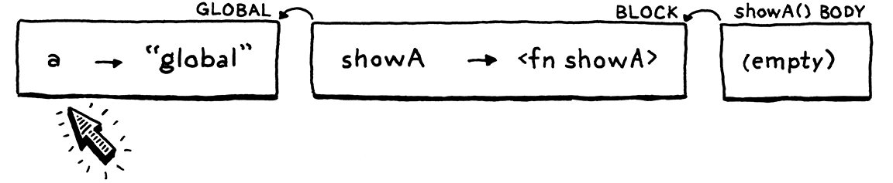

# Resolving and Binding


<!-- vscode-markdown-toc -->
* 1. [术语](#)
* 2. [Static Scope](#StaticScope)
	* 2.1. [Scopes and mutable environments](#Scopesandmutableenvironments)
	* 2.2. [Persistent environments](#Persistentenvironments)
* 3. [Semantic Analysis](#SemanticAnalysis)
	* 3.1. [A variable resolution pass](#Avariableresolutionpass)
* 4. [A Resolver Class](#AResolverClass)
	* 4.1. [Resolving blocks](#Resolvingblocks)
	* 4.2. [Resolving variable declarations](#Resolvingvariabledeclarations)
	* 4.3. [Resolving variable expressions](#Resolvingvariableexpressions)
	* 4.4. [Resolving assignment expressions](#Resolvingassignmentexpressions)
	* 4.5. [Resolving function declarations](#Resolvingfunctiondeclarations)
	* 4.6. [Resolving the other syntax tree nodes](#Resolvingtheothersyntaxtreenodes)
		* 4.6.1. [语句](#-1)
		* 4.6.2. [表达式](#-1)
* 5. [Interpreting Resolved Variables](#InterpretingResolvedVariables)
	* 5.1. [Accessing a resolved variable](#Accessingaresolvedvariable)
	* 5.2. [Assigning to a resolved variable](#Assigningtoaresolvedvariable)
	* 5.3. [Running the resolver](#Runningtheresolver)
* 6. [Resolution Errors](#ResolutionErrors)
	* 6.1. [Invalid return errors](#Invalidreturnerrors)
* 7. [References](#References)

<!-- vscode-markdown-toc-config
	numbering=true
	autoSave=true
	/vscode-markdown-toc-config -->
<!-- /vscode-markdown-toc -->


##  1. <a name=''></a>术语
由于这里的 revolve 和之前的 parse 都可以翻译成 “解析”，所以在表示 revolve 时全部使用英文原文。


##  2. <a name='StaticScope'></a>Static Scope
1. A *variable usage* refers to the *preceding* declaration with the same name in the *innermost* scope that encloses the expression where the variable is used.
2. There’s a lot to unpack in that:
	* I say “variable usage” instead of “variable expression” to cover both variable expressions and assignments.
	* “Preceding” means appearing before in the program text. 所以下面打印的 `a` 应该是 "outer"
		```js
		var a = "outer";
		{
			print a;
			var a = "inner";
		}
		```
	* “Innermost” is there because of shadowing.
3. 由于此规则未提及任何运行时行为，因此它意味着：变量表达式在整个程序执行过程中始终引用相同的声明。
4. 到目前为止，我们的解释器基本正确实现了该规则。但是当我们添加闭包时，错误就出现了
	```js
	var a = "global";
	{
		fun showA() {
			print a;
		}

		showA();

		var a = "block";
		showA();
	}
	```
5. 我们的解释器在执行上面代码时打印出的分别是 "global" 和 "block"，但这就是在执行过程中引用不同的声明了。（如果在 JS，中，打印出的确实是 "global" 和 "block"，用 `let` 声明的话会报错）

###  2.1. <a name='Scopesandmutableenvironments'></a>Scopes and mutable environments
1. 在我们的解释器中，环境是静态作用域的动态表现。两者大多保持同步：当我们进入新作用域时，我们会创建一个新环境，而当我们离开该作用域时，我们会丢弃它。
2. 但当我们对环境执行了这种操作就会出现问题：把一个变量绑定到环境。
3. 看一下上面有问题的例子中，每一步的环境是什么情况。
4. 首先我们在全局作用域声明变量 `a`。现在有了一个环境，其中有一个变量
	

5. 然后我们进入块，为这个块创建一个新的环境里，并在这个环境里声明函数 `showA`。这个函数对应一个 `LoxFunction` 对象，该对象的 `closure` 指向声明所在的环境，也就是块的环境
	
6. 然后是第一次调用 `showA`。解释器动态地为函数体创建一个新环境。由于该函数内部未声明任何变量，因此这个新环境它是空的。新环境的父级是函数的闭包，也就是函数声明所在的块的环境
	
7. 在函数的主体中需要打印 `a` 的值。解释器通过遍历环境链来查找此值。它一直到全局环境，然后在那里找到，并打印"global"。没问题。
8. 接下来，声明第二个变量 `a`。这次是在块里声明的，它和 `showA` 声明在同一个环境
	
9. 然后是第二次调用 `showA`，解释器同样动态地为这次函数调用的函数体创建一个新环境，这个新环境父级就是同样是函数的闭包，也就是块的环境
	
	
10. 在这第二个的调用中，解释器同样遍历环境链来查找 `a` 的值。但这次它走不到全局环境，它在块的环境里就找到了新生命的那个 `a`。
11. 我们的编译器实现将块内的所有代码视为在同一作用域内，因此我们的解释器使用单个环境来表示它。每个环境都是一个可变哈希表，当声明新的局部变量时，它会被添加到该作用域的现有环境中。
12. 也就是说，在我们的实现中，一个环境可能随着时间发生变化。这本身并没什么问题，但因为函数的出现，这意味着一个函数的闭包是可变的，这个函数在不同的地方调用时，它里面用的变量的值也是可变的。
13. 我们希望函数的闭包是不变的。函数应该捕获声明该函数所在环境的冻结快照。

###  2.2. <a name='Persistentenvironments'></a>Persistent environments
1. 有一种编程风格使用所谓的持久数据结构。与您熟悉的命令式编程中的松散数据结构不同，持久数据结构永远不能直接修改。对现有结构的任何修改尝试都会产生一个全新的对象，其中包含所有原始数据和新修改。
2. 如果我们将这种技术应用于环境，那么每次声明变量时，它都会返回一个新环境，其中包含所有先前声明的变量以及一个新名称。声明变量会对环境链进行隐式拆分，在声明变量之前有一个环境，在声明变量之后有一个新环境：
	
3. 这是解决问题的合法方法，也是在 Scheme 解释器中实现环境的经典方法。我们也可以使用这个方法，但需要更改很多代码，因此我们不会改变环境的表示方法。Instead of making the data more statically structured, we’ll bake the static resolution into the access operation itself.


##  3. <a name='SemanticAnalysis'></a>Semantic Analysis
1. 目前，每次评估变量表达式时，我们的解释器都会 resolve 变量，也就是追踪它引用的声明。如果该变量被包裹在运行一千次的循环中，那么该变量就会被重新 resolve 一千次。
2. 上面说了，静态作用域意味着变量始终 resolve 为相同的声明。所以，其实我们只需要 resolve 一次就可以了。
3. 我们可以用很多方法来存储变量和其声明之间的绑定。在下篇 C 解释器的部分我们会实现一个更高效的存储和访问变量的方案，但这里我们不去做太多改变，将充分利用现有的 `Environment` 类的实现。
4. 再看看上面有问题的例子中两次对变量 `a` 的 resolve 。第一次沿着环境链找了三个环境找到了 `a` 的声明，这是正确的 resolve ；而第二次只找了两个环境就找到了，这是错误的 resolve。
5. 如果我们可以确保每次 resolve 变量时查找的环境数量都和第一次的数量相同，那就可以保证每次都找的是同一个变量声明了，也就是正确的那一个。

###  3.1. <a name='Avariableresolutionpass'></a>A variable resolution pass
1. After the parser produces the syntax tree, but before the interpreter starts executing it, we’ll do a single walk over the tree to resolve all of the variables it contains. 
2. Additional passes between parsing and execution are common. If Lox had static types, we could slide a type checker in there. Optimizations are often implemented in separate passes like this too. 
3. Basically, any work that doesn’t rely on state that’s only available at runtime can be done in this way.
4. Our variable resolution pass works like a sort of mini-interpreter. It walks the tree, visiting each node, but a static analysis is different from a dynamic execution:
	* **No side effects**. When the static analysis visits a `print` statement, it doesn’t actually print anything. Calls to native functions or other operations that reach out to the outside world are stubbed out and have no effect.
	* **No control flow**. Loops are visited only once. Both branches are visited in `if` statements. Logic operators are not short-circuited.


##  4. <a name='AResolverClass'></a>A Resolver Class
1. 新建  Resolver 类。由于  resolver 要访问语法树中的每个节点，因此它实现了我们已经拥有的访问者抽象
	```java
	// lox/Resolver.java

	package com.craftinginterpreters.lox;

	import java.util.HashMap;
	import java.util.List;
	import java.util.Map;
	import java.util.Stack;

	class Resolver implements Expr.Visitor<Void>, Stmt.Visitor<Void> {
		private final Interpreter interpreter;

		Resolver(Interpreter interpreter) {
			this.interpreter = interpreter;
		}
	}
	```
2. 在 resolve 变量时，只有几种节点是有用的：
	* 块语句为其包含的语句引入了新的作用域。
	* 函数声明为其函数体引入了新的作用域，并将其参数绑定在该作用域中。
	* 变量声明将新变量添加到当前范围。
	* 变量表达式和赋值表达式需要 resolve 它们的变量。
3. 其余节点没有做任何特殊的事情，但我们仍然需要为它们实现访问方法，以便遍历它们的子树。比如即使 `+` 表达式本身没有任何变量需要 resolve，但它的任何一个操作数都可能有。

###  4.1. <a name='Resolvingblocks'></a>Resolving blocks
1.  resolve 块的 visit 方法如下，这个方法开启一个新的作用域，遍历块内的语句，然后丢弃该作用域
	```java
	// Resolver.java

	@Override
	public Void visitBlockStmt(Stmt.Block stmt) {
		beginScope();
		resolve(stmt.statements);
		endScope();
		return null;
	}
	```
2. `resolve` 方法
	```java
	// Resolver.java

	void resolve(List<Stmt> statements) {
        for (Stmt statement : statements) {
            resolve(statement);
        }
    }

    private void resolve(Stmt stmt) {
        stmt.accept(this);
    }
	```
3. While we’re at it, let’s add another overload that we’ll need later for resolving an expression
	```java
	// Resolver.java

	private void resolve(Expr expr) {
		expr.accept(this);
	}
  	```
4. These methods are similar to the `evaluate()` and `execute()` methods in Interpreter—they turn around and apply the Visitor pattern to the given syntax tree node.
5. A new block scope is created like so
	```java
	// Resolver.java

	private void beginScope() {
        scopes.push(new HashMap<String, Boolean>());
    }
	```
6. Lexical scopes nest in both the interpreter and the resolver. They behave like a stack. The interpreter implements that stack using a linked list—the chain of Environment objects. 
7. In the resolver, we use an actual Java Stack. This field keeps track of the stack of scopes currently
	```java
	// Resolver.java

	private final Stack<Map<String, Boolean>> scopes = new Stack<>();
	```
8. Each element in the stack is a Map representing a single block scope. Keys, as in Environment, are variable names. The values are Booleans, for a reason I’ll explain soon.
9. 作用域栈仅用于本地块作用域。全局作用域顶层声明的变量不会被 resolve 器跟踪，因为它们在 Lox 中更具动态性。resolve 变量时，如果我们在本地作用域栈中找不到它，我们会假设它一定是全局的。
10. Since scopes are stored in an explicit stack, exiting one is straightforward
	```java
	// Resolver.java

	private void endScope() {
		scopes.pop();
	}
	```

###  4.2. <a name='Resolvingvariabledeclarations'></a>Resolving variable declarations
1. Resolving a variable declaration adds a new entry to the current innermost scope’s map
	```java
	// Resolver.java

	@Override
    public Void visitVarStmt(Stmt.Var stmt) {
        declare(stmt.name);
        if (stmt.initializer != null) {
            resolve(stmt.initializer);
        }
        define(stmt.name);
        return null;
    }
	```
2. We split binding into two steps, declaring then defining, in order to handle funny edge cases like this
	```js
	var a = "outer";
	{
		var a = a;
	}
	```
3. What happens when the initializer for a local variable refers to a variable with the same name as the variable being declared? 也就是说，局部作用域里的 `var a = a;` 应该处理？可以有三种处理方法：
	* 声明一个变量 `a`，此时它的值暂时是 `nil`；然后用全局的 `a` 给这个新变量初始化，这个新变量 `a` 的值现在变成 `"outer"`；所以这里把初始化式里的 `a` 看作是全局的那个 `a`。
	* 声明一个变量 `a`，此时它的值暂时是 `nil`；然后用局部的这个刚声明的 `a` 给它自身初始化，这个新变量 `a` 的值还是 `nil`；所以这里把初始化式里的 `a` 看作是局部刚声明的那个 `a`。
	* 不允许这种行为，报错。
4. 第一种情况看起来很费解，定义同名变量也是一般更有可能是疏忽导致的错误而不是有意为之；第二种情况则完全没有意义。所以，我们会把这种情况作为一个编译错误。
5. In order to do that, as we visit expressions, we need to know if we’re inside the initializer for some variable. We do that by splitting binding into two steps. 
6. The first is declaring it
	```java
	// Resolver.java

	private void declare(Token name) {
		// 作用域栈仅用于本地块作用域，如果 scopes 说明当前只有全局作用域
		if (scopes.isEmpty()) return;

		Map<String, Boolean> scope = scopes.peek();
		scope.put(name.lexeme, false);
	}
	```
7. Declaration adds the variable to the innermost scope so that it shadows any outer one. 
8. We mark it as “not ready yet” by binding its name to `false` in the scope map. The value associated with a key in the scope map represents whether or not we have finished resolving that variable’s initializer.
9. After declaring the variable, we resolve its initializer expression in that same scope where the new variable now exists but is unavailable. 
10. Once the initializer expression is done, the variable is ready for prime time. We do that by defining it
	```java
	// Resolver.java

	private void define(Token name) {
        if (scopes.isEmpty()) return;
        scopes.peek().put(name.lexeme, true);
    }
	```
11. We set the variable’s value in the scope map to `true` to mark it as fully initialized and available for use. 

###  4.3. <a name='Resolvingvariableexpressions'></a>Resolving variable expressions
1. Variable declarations—and function declarations, which we’ll get to—write to the scope maps. Those maps are read when we resolve variable expressions
	```java
	// Resolver.java

	@Override
    public Void visitVariableExpr(Expr.Variable expr) {
        if (!scopes.isEmpty() && scopes.peek().get(expr.name.lexeme) == Boolean.FALSE) {
            Lox.error(expr.name, "Can't read local variable in its own initializer.");
        }

        resolveLocal(expr, expr.name);
        return null;
    }
	```
2. First, we check to see if the variable is being accessed inside its own initializer. This is where the values in the scope map come into play. If the variable exists in the current scope but its value is `false`, that means we have declared it but not yet defined it. We report that error. `if` 为真表示当前处于类似下面的情况
	```js
	{
		var n = n + 1;
	}
	```
3. After that check, we actually resolve the variable itself using this helper
	```java
	// Resolver.java

	private void resolveLocal(Expr expr, Token name) {
		for (int i = scopes.size() - 1; i >= 0; i--) {
			if (scopes.get(i).containsKey(name.lexeme)) {
				interpreter.resolve(expr, scopes.size() - 1 - i);
				return;
			}
		}
	}
	```
4. We start at the innermost scope and work outwards, looking in each map for a matching name. 
5. If we find the variable, we resolve it, passing in the number of scopes between the current innermost scope and the scope where the variable was found.（`interpreter.resolve` 之后说）
6. If we walk through all of the block scopes and never find the variable, we leave it unresolved and assume it’s global.

###  4.4. <a name='Resolvingassignmentexpressions'></a>Resolving assignment expressions
1. The other expression that references a variable is assignment. Resolving one looks like this
	```java
	// Resolver.java

	@Override
    public Void visitAssignExpr(Expr.Assign expr) {
        resolve(expr.value);
        resolveLocal(expr, expr.name);
        return null;
    }
	```
2. First, we resolve the expression for the assigned value in case it also contains references to other variables. 
3. Then we use our existing `resolveLocal()` method to resolve the variable that’s being assigned to.

###  4.5. <a name='Resolvingfunctiondeclarations'></a>Resolving function declarations
1. Functions both bind names and introduce a scope. The name of the function itself is bound in the surrounding scope where the function is declared. When we step into the function’s body, we also bind its parameters into that inner function scope
	```java
	// Resolver.java
	
    @Override
    public Void visitFunctionStmt(Stmt.Function stmt) {
        declare(stmt.name);
        define(stmt.name);

        resolveFunction(stmt);
        return null;
    }
	```
2. We declare and define the name of the function in the current scope. We define the name before resolving the function’s body, this lets a function recursively refer to itself inside its own body.
3. Then we resolve the function’s body using this
	```java
	// Resolver.java

    private void resolveFunction(Stmt.Function function) {
        beginScope();
        for (Token param : function.params) {
            declare(param);
            define(param);
        }
        resolve(function.body);
        endScope();
    }	
	```
4. It creates a new scope for the body and then binds variables for each of the function’s parameters.
5. Once that’s ready, it resolves the function body in that scope. This is different from how the interpreter handles function declarations. At runtime, declaring a function doesn’t do anything with the function’s body. The body doesn’t get touched until later when the function is called. In a static analysis, we immediately traverse into the body right then and there.

###  4.6. <a name='Resolvingtheothersyntaxtreenodes'></a>Resolving the other syntax tree nodes
####  4.6.1. <a name='-1'></a>语句
* Expression statement
	```java
	// Resolver.java

	@Override
	public Void visitExpressionStmt(Stmt.Expression stmt) {
		resolve(stmt.expression);
		return null;
	}
	```
* `if` statement
	```java
	// Resolver.java

	@Override
	public Void visitIfStmt(Stmt.If stmt) {
		resolve(stmt.condition);
		resolve(stmt.thenBranch);
		if (stmt.elseBranch != null) resolve(stmt.elseBranch);
		return null;
	}
	```
* `print` statement
	```java
	// Resolver.java

	@Override
	public Void visitPrintStmt(Stmt.Print stmt) {
		resolve(stmt.expression);
		return null;
	}
	```
* `return` statement
	```java
	// Resolver.java

	@Override
	public Void visitReturnStmt(Stmt.Return stmt) {
		if (stmt.value != null) {
			resolve(stmt.value);
		}

		return null;
	}
	```
* `while` statement
	```java
	// Resolver.java

	@Override
	public Void visitWhileStmt(Stmt.While stmt) {
		resolve(stmt.condition);
		resolve(stmt.body);
		return null;
	}
	```

####  4.6.2. <a name='-1'></a>表达式
* binary expression
	```java
	// Resolver.java

	@Override
    public Void visitBinaryExpr(Expr.Binary expr) {
        resolve(expr.left);
        resolve(expr.right);
        return null;
    }
	```
* call expression
	```java
	// Resolver.java

	@Override
    public Void visitCallExpr(Expr.Call expr) {
        resolve(expr.callee);

        for (Expr argument : expr.arguments) {
            resolve(argument);
        }

        return null;
    }
	```
* Parentheses expression
	```java
	// Resolver.java

	@Override
    public Void visitGroupingExpr(Expr.Grouping expr) {
        resolve(expr.expression);
        return null;
    }
	```
* Literal expression
	```java
	// Resolver.java

	@Override
    public Void visitLiteralExpr(Expr.Literal expr) {
        return null;
    }
	```
* Logical expression
	```java
	// Resolver.java

    @Override
    public Void visitLogicalExpr(Expr.Logical expr) {
        resolve(expr.left);
        resolve(expr.right);
        return null;
    }
	```
* Unary expression
	```java
	// Resolver.java

	@Override
    public Void visitUnaryExpr(Expr.Unary expr) {
        resolve(expr.right);
        return null;
    }
	```


##  5. <a name='InterpretingResolvedVariables'></a>Interpreting Resolved Variables
1. 每次访问变量时， resolver 都会告诉解释器当前作用域和定义变量所在的作用域之间有多少个作用域。在运行时，这恰好对应于当前环境和解释器可以找到变量值的环境之间的环境数量。
2.  resolver 通过调用以下命令将该数字传递给解释器
	```java
	// Interpreter.java

	void resolve(Expr expr, int depth) {
        locals.put(expr, depth);
    }
	```
3. 我们需要将 resolve 信息存储在某个地方，以便稍后执行变量表达式和赋值表达式时可以使用它。一个直观的存储的地方就是语法树节点本身，许多编译器都会将此类分析的结果存储在这个位置。
4. 我们可以这样做，但这需要对语法树生成器进行一些改动。而且存储在语法树中的话，如果语法树频繁的重建，对于很深的节点，重新计算它们的数据并不容易。
5. 这里我们采用另一种常见方法，将其存储单独的一个 map 中，其中映射了每个语法树节点和它对应的 resolve 数据。我们这里并不会建立树形或者嵌套结构，所以会简单一些；而且如果想要清除 resolve 信息，只要很方便的清除 map 就可以了。定义需要的 map
	```java
	// Interpreter.java

	private final Map<Expr, Integer> locals = new HashMap<>();
	```

###  5.1. <a name='Accessingaresolvedvariable'></a>Accessing a resolved variable
1. Our interpreter now has access to each variable’s resolved location. Finally, we get to make use of that. 我们将变量表达式的 visit 方法替换为
	```java
	// Interpreter.java

	public Object visitVariableExpr(Expr.Variable expr) {
        // return environment.get(expr.name);
        return lookUpVariable(expr.name, expr);
    }
	```
2. `lookUpVariable` 方法
	```java
	// Interpreter.java

	private Object lookUpVariable(Token name, Expr expr) {
        Integer distance = locals.get(expr);
        if (distance != null) {
            return environment.getAt(distance, name.lexeme);
        } else {
            return globals.get(name);
        }
    }
	```
3. `lookUpVariable` 方法首先根据表达式 `expr` 从 `locals` 中找到该表达式之前 resolve 到的环境个数距离。如果没找到，那就说明这个变量是全局变量，否则就使用 `getAt` 方法从根据距离和变量名查找该变量
	```java
	// Environment.java

	Object getAt(int distance, String name) {
        return ancestor(distance).values.get(name);
    }

    Environment ancestor(int distance) {
        Environment environment = this;
        for (int i = 0; i < distance; i++) {
            environment = environment.enclosing; 
        }
    
        return environment;
    }
	```
4. `get` 方法会沿着环境连依次查找，而 `getAt` 方法则根据距离直接跳到目标环境对象查找。

###  5.2. <a name='Assigningtoaresolvedvariable'></a>Assigning to a resolved variable
1. We can also use a variable by assigning to it. The changes to visiting an assignment expression are similar
	```java
	// Interpreter.java

	@Override
    public Object visitAssignExpr(Expr.Assign expr) {
        Object value = evaluate(expr.value);

        // environment.assign(expr.name, value);
        Integer distance = locals.get(expr);
        if (distance != null) {
            environment.assignAt(distance, expr.name, value);
        } else {
            globals.assign(expr.name, value);
        }

        return value;
    }
	``` 
2. `assignAt` 方法
	```java
	// Environment.java

	void assignAt(int distance, Token name, Object value) {
		ancestor(distance).values.put(name.lexeme, value);
	}
	```

###  5.3. <a name='Runningtheresolver'></a>Running the resolver
在 Lox 的 `run` 方法中运行 resolver
```java
// Lox.java

private static void run(String source) {
	Scanner scanner = new Scanner(source);
	List<Token> tokens = scanner.scanTokens();

	Parser parser = new Parser(tokens);
	List<Stmt> statements = parser.parse();

	if (hadError) return;

	Resolver resolver = new Resolver(interpreter);
	resolver.resolve(statements);

	if (hadError) return;

	interpreter.interpret(statements);
}
```

##  6. <a name='ResolutionErrors'></a>Resolution Errors
1. Since we are doing a semantic analysis pass, we have an opportunity to make Lox’s semantics more precise, and to help users catch bugs early before running their code. 
2. Take a look at this bad boy:
	```js
	fun bad() {
		var a = "first";
		var a = "second";
	}
	```
3. We do allow declaring multiple variables with the same name in the global scope, but doing so in a local scope is probably a mistake. 
4. We can detect this mistake statically while resolving
	```java
	// Resolver.java

	private void declare(Token name) {
		if (scopes.isEmpty()) return;

		Map<String, Boolean> scope = scopes.peek();

		// 新增
		if (scope.containsKey(name.lexeme)) {
			Lox.error(name, "Already a variable with this name in this scope.");
		}
			
		scope.put(name.lexeme, false);
	}
	```

###  6.1. <a name='Invalidreturnerrors'></a>Invalid return errors
1. 在函数体外不允许出现 `return` 语句，我们的 resolver 可以对此进行静态检查，我们可以跟踪当前访问的代码是否在函数声明内。
2. 定义一个枚举类型 `FunctionType` 以及一个该类型的变量 `currentFunction`，用来计算当前是否正在 resolve 函数声明
	```java
	// Resolver.java

	private FunctionType currentFunction = FunctionType.NONE;

	private enum FunctionType {
		NONE,
		FUNCTION
	}
	```
3. 当我们 resolve 函数声明时，把这个枚举类型变量传给 `resolveFunction`
	```java
	// Resolver.java

	@Override
    public Void visitFunctionStmt(Stmt.Function stmt) {
        declare(stmt.name);
        define(stmt.name);

        // resolveFunction(stmt);
        resolveFunction(stmt, FunctionType.FUNCTION);
        return null;
    }
	```
4. 在 `resolveFunction` 中，我们首先将 `currentFunction` 字段的先前值存储在局部变量中 `enclosingFunction` 中，然后用参数 `type` 重设 `currentFunction`。等到 resolve 完函数后，再把 `currentFunction` 恢复到函数外面对应的 `currentFunction` 值
	```java
	// Resolver.java

	private void resolveFunction(Stmt.Function function, FunctionType type) {
		FunctionType enclosingFunction = currentFunction;
		currentFunction = type;

		beginScope();
		for (Token param : function.params) {
			declare(param);
			define(param);
		}
		resolve(function.body);
		endScope();

		currentFunction = enclosingFunction;
	}
	```
5. 现在我们可以随时判断我们是否处于函数声明中，我们会在 resolve `return` 语句时检查这一点
	```java
	// Resolver.java

	@Override
	public Void visitReturnStmt(Stmt.Return stmt) {
		// 新增
		if (currentFunction == FunctionType.NONE) {
			Lox.error(stmt.keyword, "Can't return from top-level code.");
		}

		if (stmt.value != null) {
			resolve(stmt.value);
		}

		return null;
	}
	```


##  7. <a name='References'></a>References
* [*Crafting interpreters*: Resolving and Binding](https://craftinginterpreters.com/resolving-and-binding.html)
