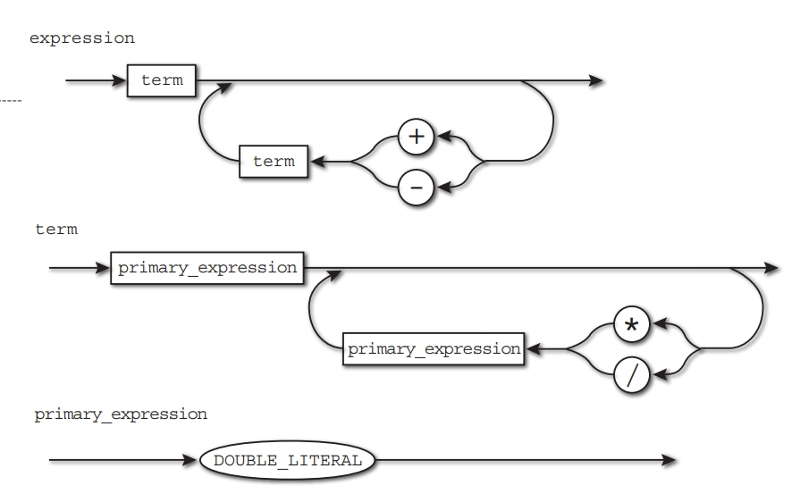

# 不借助工具编写计算器


## 自制词法分析器
1. 这个计算器的算式只能出现在一行，换行就进行计算，因此解析一个算式的时候会解析单独一行的字符。
2. 会用到下面两个函数
    ```cpp
    /* 将接下来要解析的行置入词法分析器中 */
    void set_line(char *line);

    /* 从被置入的行中，分割出 token 并返回
     * 在行尾会返回 END_OF_LINE_TOKEN 这种特殊的记号
     */
    void get_token(Token *token);
    ```
3. `get_token()` 接受的入口参数为一个 `Token` 结构体指针，函数中会分割出记号的信息装入 `Token` 结构体并返回。上面两个函数的声明以及 `Token` 结构体的定义位于 *token.h* 文件
    ```cpp
    #ifndef TOKEN_H_INCLUDED
    #define TOKEN_H_INCLUDED

    typedef enum {
        BAD_TOKEN,
        NUMBER_TOKEN,
        ADD_OPERATOR_TOKEN,
        SUB_OPERATOR_TOKEN,
        MUL_OPERATOR_TOKEN,
        DIV_OPERATOR_TOKEN,
        END_OF_LINE_TOKEN
    } TokenKind;

    #define MAX_TOKEN_SIZE (100)

    typedef struct {
        TokenKind   kind;
        double      value;
        char        str[MAX_TOKEN_SIZE];
    } Token;

    void set_line(char *line);
    void get_token(Token *token);

    #endif /* TOKEN_H_INCLUDED */
    ```
4. 源代码在 *lexicalanalyzer.c* 
    ```cpp
    #include <stdio.h>
    #include <stdlib.h>
    #include <ctype.h>
    #include "token.h"

    // 当前解析的字符串行
    static char *st_line;
    // 解析到了该行的哪个位置
    static int st_line_pos;

    /**
     * 由于下面扫描字符时是每次扫描一个字符，运算符是单个字符，所以扫描到之后可以直接确定，
     * 但数值字符串可能并不是单个字符所以如果扫描到一个数字字符时，必须要确保扫描到可能得完整的数值字符串。
     * 因此定义一个枚举类型 LexerStatus 实现这个功能。不懂，为什么不直接定义枚举变量，而是定义了一个类型？* 具体的逻辑是：
     *  1. 定义一个 LexerStatus 类型的变量 status，初始值 INITIAL_STATUS
     *  2. 当扫描到一个数字字符时，将值设为 IN_INT_PART_STATUS
     *  3. 再扫描到小数点时，将值从 IN_INT_PART_STATUS 设为 DOT_STATUS
     *  4. 然后再扫描到一个数字字符时，将值从 DOT_STATUS 设为 IN_FRAC_PART_STATUS
     *  5. 最后，如果扫描到不是数字和小数点的字符时，则扫描到了完整的数值类型字符串
     */
    typedef enum {
        INITIAL_STATUS,
        IN_INT_PART_STATUS,
        DOT_STATUS,
        IN_FRAC_PART_STATUS
    } LexerStatus;

    
    /**
     * get_token 词法分析器的核心部分，分割出具体的 token
     * 每解析到一个 token 时该函数会返回，如果该行没有结束，则会被再次调用解析后面可能存在的其他 token；
     * 如果解析发现错误时直接退出
     * get_token 内部会不断地向右移动 st_line_pos，因为外部不需要控制 st_line_pos 的位置，
     * 每次调用 get_token 时 st_line_pos 都会移动到下一个需要被解析的 token 字符串的起始位置
     */
    void get_token(Token *token)
    {
        int out_pos = 0;
        LexerStatus status = INITIAL_STATUS;
        char current_char;

        token->kind = BAD_TOKEN;
        // while 扫描当前行的字符，每次扫描一个字符
        while (st_line[st_line_pos] != '\0') {
            current_char = st_line[st_line_pos];
            
            // 扫描完了一个数值字符串
            if ( (status == IN_INT_PART_STATUS || status == IN_FRAC_PART_STATUS)
                    && !isdigit(current_char) 
                    && current_char != '.'
                ) {
                // 设置 token 的类型
                token->kind = NUMBER_TOKEN;
                // 从 token 的字符串解析出 double 类型的数值，写入 token 的 value 属性中
                sscanf(token->str, "%lf", &token->value);
                return;
            }

            // 扫描到了空白字符
            if (isspace(current_char)) {
                // 换行符也属于空白字符。如果换行符则该行扫描结束
                if (current_char == '\n') {
                    token->kind = END_OF_LINE_TOKEN;
                    return;
                }
                // 如果不是换行符则接着扫描下一个字符
                st_line_pos++;
                continue;
            }

            /**
             * 上面两个 if 都是说明当前 token 已经解析结束了；如果走到这里，
             * 说明是当前字符仍然是当前 token 的一部分，在本例中就是正在解析数值字符串，
             * 那就要检查这个作为数值字符串是不是超长了。
             * 不懂，等于 MAX_TOKEN_SIZE-1 为什么也不行？下一个字符如果是当前 token 的最后一个字符，
             * 那不就刚好不超过 MAX_TOKEN_SIZE 吗？
             */
            if (out_pos >= MAX_TOKEN_SIZE-1) {
                fprintf(stderr, "token too long.\n");
                exit(1);
            }

            // 记录当前 token 字符串
            token->str[out_pos] = st_line[st_line_pos];

            st_line_pos++;
            out_pos++;
            token->str[out_pos] = '\0';

            // 四个运算符是单个字符，扫描到就可以立刻返回了
            if (current_char == '+') {
                token->kind = ADD_OPERATOR_TOKEN;
                return;
            } 
            else if (current_char == '-') {
                token->kind = SUB_OPERATOR_TOKEN;
                return;
            } 
            else if (current_char == '*') {
                token->kind = MUL_OPERATOR_TOKEN;
                return;
            } 
            else if (current_char == '/') {
                token->kind = DIV_OPERATOR_TOKEN;
                return;
            } 
            // 下面两个 else if 解析数值字符串
            else if (isdigit(current_char)) {
                if (status == INITIAL_STATUS) {
                    status = IN_INT_PART_STATUS;
                } 
                else if (status == DOT_STATUS) {
                    status = IN_FRAC_PART_STATUS;
                }
            } 
            else if (current_char == '.') {
                if (status == IN_INT_PART_STATUS) {
                    status = DOT_STATUS;
                } 
                else {
                    fprintf(stderr, "syntax error.\n");
                    exit(1);
                }
            } 
            // 非法字符
            else {
                fprintf(stderr, "bad character(%c)\n", current_char);
                exit(1);
            }
        }
    }


    // 设置当前要解析的行，并且把 st_line_pos 设置为初始状态
    void set_line(char *line)
    {
        st_line = line;
        st_line_pos = 0;
    }

    
    void parse_line(char *buf)
    {
        Token token;

        set_line(buf);
        /*
        * 传入 token 结构体的指针，get_token 中解析当前行里的 token，
        * 解析完一个 token 后就设置参数中 token 的结构体的值。
        * 如果这个 token 是该行行尾，则 parse_line 结束；
        * 如果是其他类型的 token，就打印出这个 token 的 kind 和 str 属性，
        * 然后进入下一轮循环，解析下一个 token。
        */
        for (;;) {
            get_token(&token);
            if (token.kind == END_OF_LINE_TOKEN) {
                break;
            } else {
                printf("kind..%d, str..%s\n", token.kind, token.str);
            }
        }
    }

    
    int main(int argc, char **argv)
    {
        char buf[1024];
        // 从输入中读取一行字符进行解析
        while (fgets(buf, 1024, stdin) != NULL) {
            parse_line(buf);
        }

        return 0;
    }
    ```
5. 编译执行 *lexicalanalyzer.c*，输入 "1 * 2 + 4 / 2 - 6 - 5" 后打印如下
    ```sh
    kind..1, str..1
    kind..4, str..*
    kind..1, str..2
    kind..2, str..+
    kind..1, str..4
    kind..5, str../
    kind..1, str..2
    kind..3, str..-
    kind..1, str..6
    kind..3, str..-
    kind..1, str..5
    ```


## 自制语法分析器
```cpp
#include <stdio.h>
#include <stdlib.h>
#include "token.h"

#define LINE_BUF_SIZE (1024)

static Token st_look_ahead_token;
static int st_look_ahead_token_exists;


// 如果之前有 get 好了但被退回的 token 那就用被退回的这个，否则 get 一个新的
static void my_get_token(Token *token)
{
    if (st_look_ahead_token_exists) {
        *token = st_look_ahead_token;
        st_look_ahead_token_exists = 0;
    } else {
        get_token(token);
    }
}

/**
 * unget_token 并不是 get_token 反向，并不会把 st_line_pos 左移
 * 而是把当前不用的这个 token 保存下来，之后要继续获取 token 时直接用这个 get 好的
 */
static void unget_token(Token *token)
{
    st_look_ahead_token = *token;
    st_look_ahead_token_exists = 1;
}

double parse_expression(void);

// 解析 primary_expression token，也就是获得它的 value 值，即字面量值
// 如果不是 primary_expression 类型的 token，则会报错退出
static double parse_primary_expression()
{
    Token token;

    my_get_token(&token);
    if (token.kind == NUMBER_TOKEN) {
        return token.value;
    }
    fprintf(stderr, "syntax error.\n");
    exit(1);
    return 0.0; /* make compiler happy */
}

// 下面有对这个函数的详解
static double parse_term()
{
    double v1;
    double v2;
    Token token;

    v1 = parse_primary_expression();
    for (;;) {
        my_get_token(&token);
        if (token.kind != MUL_OPERATOR_TOKEN
            && token.kind != DIV_OPERATOR_TOKEN) {
            unget_token(&token);
            break;
        }
        v2 = parse_primary_expression();
        if (token.kind == MUL_OPERATOR_TOKEN) {
            v1 *= v2;
        } else if (token.kind == DIV_OPERATOR_TOKEN) {
            v1 /= v2;
        }
    }
    return v1;
}

// 和 parse_term 原理相同
double parse_expression()
{
    double v1;
    double v2;
    Token token;

    v1 = parse_term();
    for (;;) {
        my_get_token(&token);
        if (token.kind != ADD_OPERATOR_TOKEN 
            && token.kind != SUB_OPERATOR_TOKEN) {
            unget_token(&token);
            break;
        }
        v2 = parse_term();
        if (token.kind == ADD_OPERATOR_TOKEN) {
            v1 += v2;
        } else if (token.kind == SUB_OPERATOR_TOKEN) {
            v1 -= v2;
        } else {
            unget_token(&token);
        }
    }
    return v1;
}

double parse_line(void)
{
    double value;

    st_look_ahead_token_exists = 0;
    value = parse_expression();

    return value;
}

int main(int argc, char **argv)
{
    char line[LINE_BUF_SIZE];
    double value;

    while (fgets(line, LINE_BUF_SIZE, stdin) != NULL) {
        set_line(line);
        value = parse_line();
        printf(">>%f\n", value);
    }

    return 0;
}
```

### 递归下降分析
1. Yacc 版的计算器曾使用下面的语法规则
    ```yacc
    expression /* 表达式的规则 */
        : term /* 表达式 */
        | expression ADD term /* 或 表达式 + 表达式 */
        | expression SUB term /* 或 表达式 - 表达式 */
        ;
    term /* 表达式的规则 */
        : primary_expression /* 一元表达式 */
        | term MUL primary_expression /* 或 表达式 * 表达式 */
        | term DIV primary_expression /* 或 表达式 / 表达式 */
        ;
    primary_expression /* 一元表达式的规则 */
        : DOUBLE_LITERAL /* 实数的字面常量 */
        ;
    ```
2. 这些语法规则可以用下面的语法图（syntax.graph, syntax.diagram）来表示
    
    其中，非终端用长方形表示，终端用椭圆形表示。
3. 以 `term` 的语法图为例：
    1. `term` 语法图开始是一个 `primary_expression`，然后可以直接一直向右结束，那就是匹配了 `term` 产生式的第一条规则；
    2. 但也可以不直接结束，而是走向下的分支，走向乘除法那里；乘以或者除以一个 `primary_expression` 然后再拐上去；
    3. 拐上去之后，可以直接结束，也可以再次拐下来继续乘除 `primary_expression`；
    4. 但是，第一次拐下来的时候，看上去是最初的那个 `primary_expression` 再乘除另一个 `primary_expression`，但产生式中却是 `term` 在乘除 `primary_expression`；这是不是因为，`primary_expression` 可以规约为 `term`，所以 `primary_expression MUL primary_expression` 就可以规约为 `term MUL primary_expression`？
4. 下面是解析 term 的函数
    ```cpp
    static double parse_term()
    {
        double v1;
        double v2;
        Token token;
        // 解析产生式右边的第一个 primary_expression 类型 token 的 value 值
        v1 = parse_primary_expression();
        for (;;) {
            // 获得第二个 token
            my_get_token(&token);
            /**
             * 如果第二个 token 不是乘除运算符，则说明这个 term 只是一个单独的 primary_expression，
             * 因此回退这个 token 的获得，因为它不属于这个 term。
             * 然后 直接 break 并返回 v1，完成对这个 term: primary_expression 的解析
             */
            if (token.kind != MUL_OPERATOR_TOKEN
                && token.kind != DIV_OPERATOR_TOKEN) {
                unget_token(&token);
                break;
            }
            /**
             * 走到这里说明第二个 token 是乘除运算符，获得第三个 token 的 value 值，
             * 也就是乘除号右边的 primary_expression 的 value 值。
             * 但注意，这里计算完并没有跳出循环，而是进入了下一轮循环
             */
            v2 = parse_primary_expression();
            if (token.kind == MUL_OPERATOR_TOKEN) {
                v1 *= v2;
            } else if (token.kind == DIV_OPERATOR_TOKEN) {
                v1 /= v2;
            }
        }
        return v1;
    }
    ```
5. 用几个例子来理解 `parse_term` 函数
    * 当匹配 `term: primary_expression` 时，例如匹配到的是 `"2"` 时：调用 `parse_term` 后 `v1` 被赋值为 `2`，循环第一轮就 break，`parse_term` 函数返回 `2`；
    * 当匹配 `term: term MUL primary_expression` 且右边的 `term` 也是 `primary_expression` 时，例如匹配到的是 `"2 * 3"` 时：调用 `parse_term` 后，`v1` 被赋值为 `2`，第一轮循环中 `token.kind == MUL_OPERATOR_TOKEN` 为真，`v2` 被赋值为 `3`，计算后 `v1` 被赋值为 `6`；进入第二轮循环，但此时该 `term` 已经解析完成，所以会 break 并返回 `6`；
    * 当匹配 `term: term MUL primary_expression` 且右边的 `term` 是 `term DIV primary_expression` 时，例如匹配到的是 `"6 / 2 * 4"` 时：调用 `parse_term` 后，`v1` 被赋值为 `6`，第一轮循环中 `token.kind == DIV_OPERATOR_TOKEN` 为真，`v2` 被赋值为 `2`，计算后 `v1` 被赋值为 `3`；进入第二轮循环，`token.kind == MUL_OPERATOR_TOKEN` 为真，`v2` 被赋值为 `4`，计算后 `v1` 被赋值为 `12`；进入第三轮循环，但此时该 `term` 已经解析完成，所以会 break 并返回 `12`。
    * 当输入是 `1 * 2 + 3` 时，`term` 只会匹配 `1 * 2`，看一下对后面 `+ 3` 的处理：调用 `parse_term` 后，`v1` 被赋值为 `1`，第一轮循环中 `token.kind == primary_expression` 为真，`v2` 被赋值为 `2`，计算后 `v1` 被赋值为 `2`；进入第二轮循环，`token.kind == ADD_OPERATOR_TOKEN` 为真，已经不属于 `term` 了，所以会调用 `unget_token` 把这个 token 退回，供之后的 token 解析使用。接着就是 break 循环，返回 `2`，完成了对 `1 * 2` 的解析。

### 一个更完整的例子
1. 以输入 `1 * 2 + 6 / 2` 为例。
2. `main` 调用 `parse_line`，`parse_line` 调用 `parse_expression`；
3. `parse_expression` 调用 `parse_term()` 返回 `2` 保存在 `v1` 中；
4. `parse_expression` 进入 `for` 循环，`my_get_token(&token)` 获得 `+` 的 token，`token.kind` 为 `= ADD_OPERATOR_TOKEN`；
5. `parse_term()` 返回 `3` 保存在 `v2` 中；
6. 执行 `v1 += v2`，`v1` 值更新为 `5`；进入下一轮循环。
7. `my_get_token(&token)` 获得 `END_OF_LINE_TOKEN`，循环结束，返回 `5`。
8. 编译 *parser.c*（`gcc parser.c lexicalanalyzer.c -o calc`），但要注意，因为 `parser.c` 已经定义了 `parse_line` 和 `main` 函数，所以这里编译时要把 `lexicalanalyzer` 里这两个函数删掉。编译完成后执行，所以输入 "1 * 2 + 6 / 2" 后打印出 `5.000000`。

### 预读记号的处理
1. 本书中采用的递归下降解析法，会预先读入一个记号，一旦发现预读的记号是不需要的，则通过 `unget_token()` 将记号 “退回”。
2. 换一种思路，其实也可以考虑 “始终保持预读一个记号” 的方法。按照这种思路，`parse_term` 可以改为 TODO
    ```cpp
    static double parse_term()
    {
        double v1;
        double v2;
        Token token;

        v1 = parse_primary_expression();
        for (;;) {
            my_get_token(&token);
            if (token.kind != MUL_OPERATOR_TOKEN
                && token.kind != DIV_OPERATOR_TOKEN) {
                unget_token(&token);
                break;
            }
            v2 = parse_primary_expression();
            if (token.kind == MUL_OPERATOR_TOKEN) {
                v1 *= v2;
            } else if (token.kind == DIV_OPERATOR_TOKEN) {
                v1 /= v2;
            }
        }
        return v1;
    }
    ```

### LL(1) 与 LALR(1)
TODO
