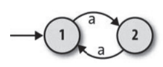
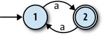
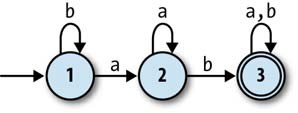

# 有限自动机
Finite Automaton

<!-- vscode-markdown-toc -->
* 1. [有限自动机的基本元素](#)
	* 1.1. [状态](#-1)
	* 1.2. [输入](#-1)
	* 1.3. [规则](#-1)
	* 1.4. [输出](#-1)
* 2. [确定性有限状态自动机](#-1)
	* 2.1. [状态、规则和输入](#-1)
	* 2.2. [输出](#-1)
	* 2.3. [确定性](#-1)
	* 2.4. [模拟](#-1)
	* 2.5. [构建一个 DFA 对象](#DFA)
* 3. [非确定性有限自动机](#-1)
	* 3.1. [非确定性](#-1)
	* 3.2. [输出](#-1)
	* 3.3. [模拟](#-1)
		* 3.3.1. [逻辑](#-1)
		* 3.3.2. [与 NFA 的不同](#NFA)
		* 3.3.3. [代码](#-1)
	* 3.4. [自由移动](#-1)
* 4. [正则表达式](#-1)
	* 4.1. [语法](#-1)
	* 4.2. [语义](#-1)
	* 4.3. [解析](#-1)
	* 4.4. [等价性](#-1)

<!-- vscode-markdown-toc-config
	numbering=true
	autoSave=true
	/vscode-markdown-toc-config -->
<!-- /vscode-markdown-toc -->


## 术语
* 有限自动机读取的字符通常叫作 **符号**（symbol）
* 状态之间移动的规则叫作 **转移**（transition）
* 组成一台机器的规则集合叫 **作转移函数**（有时候也叫 NFA 的转移关系）
* 因为表示空字符串的数学符号是希腊字母 ε，能自由移动的 NFA 称为 NFA-ε，自由移动本身通常称为 ε 转移。


##  1. <a name=''></a>有限自动机的基本元素
###  1.1. <a name='-1'></a>状态
1. 有限自动机没有持久化的存储并且几乎没有 RAM，只拥有一些可能的状态，并且能追踪到自己当前具体处于其中哪个状态。
2. 因为可以在不同的状态之间变换，所以上面所谓的“几乎没有 RAM”，可以理解虽然拥有 RAM，但只能存储一个值，也就是当前的状态。

###  1.2. <a name='-1'></a>输入
有限自动机没有各种输入设备，只能接收外部的字符输入流，且每次只能读取一个字符。

###  1.3. <a name='-1'></a>规则
1. 有限自动机没有通用的 CPU 执行任意程序，而是硬编码了一些规则集合，以决定在相应的输入下如何从一个状态切换到另一个状态。
2. 有限自动机先从一个初始状态开始，读取输入的字符，根据规则进行操作，可能会改变当前的状态。

###  1.4. <a name='-1'></a>输出
1. 有限自动机会把一些状态标记为特别状态，在接收输入序列并运用规则进行状态改变时，如果状态改变为这些特别状态，则表示对于当前输入序列来说的状态为接受状态，否则为拒绝状态。
2. 是否为接收状态，就是作为当前输入序列的输出。


##  2. <a name='-1'></a>确定性有限状态自动机
Deterministic Finite Automaton

###  2.1. <a name='-1'></a>状态、规则和输入
1. 有限状态机（finite state machine），也叫有限自动机（finite automaton），是一台计算机的极简模型。它没有持久化的存储并且几乎没有 RAM。
2. 它只是一台小机器，拥有一些可能的状态，并能够跟踪到自己当前具体处于其中的哪个状态。试着把它看成一台 RAM 只够存储一个值的计算机。
3. 同样，有限自动机没有键盘、鼠标和接收输入的网络接口，只有一 个外部的字符输入流可以一次读取一个字符。
4. 每台有限自动机没有通用的 CPU 执行任意程序，而是硬编码了一些规则集合，以决定在相应的输入下如何从一个状态切换到另一个状态。
5. 自动机先从一个特定的状态开始，然后从输入流中读入字符——按照规则它每次读取一个字符。
6. 最简单的自动机甚至没有输出，不会反馈任何信息。下面图示的状态机，直箭头指示了它的起始状态，也就是状态 1 开始。在这个状态下，如果接收输入 a 则会切换到状态 2；此时如果再接收输入 a 则会切换回状态 1。之后可以继续重复这个过程
    

###  2.2. <a name='-1'></a>输出
1. 状态机最简单的反馈输出，是将某个状态标记为 **接受状态**，以此来反馈是否接受某些输入。
2. 下面图示的状态机用双层圆把状态 2 标记为接受状态：如果输入可以让状态机的状态切换到该状态时则接受，否则拒绝
    
3. 例如从最初状态开始，如果输入时 a，则切换到状态 2，接受；如果从开始状态输入 aa，则会切换会状态 1，不接受。
4. 现在这个状态机已经有了最简单的功能：反馈一个字符串有奇数还是偶数个 a。
5. 虽然现在依然功能很简单，但状态具备构造出复杂逻辑的能力。下面示例的状态机就进一步增加了复杂性
    

###  2.3. <a name='-1'></a>确定性
1. 确定性要满足以下两个约束：
    * **没有冲突**：不存在这样的状态：它的下一次转换状态因为有彼此冲突的规则而有二义性。（这意味着一个状态对于同样的输入，不能有多个规则。）
    * **没有遗漏**：不存在这样的状态：它的下一次转换状态因为缺失规则而未知。（这意味着每个状态都必须针对每个可能的输入字符有至少一个规则。）
2. 遵守这些确定性约束的机器就是 **确定性有限自动机**（Deterministic Finite Automaton，DFA）。

###  2.4. <a name='-1'></a>模拟
1. DFA 非常简单，我们很容易用Ruby 对其进行模拟，然后直接与它交互。
2. 让我们通过实现一个规则集合对其进行模拟，并把这个规则集合称为规则手册（rulebook）
    ```rb
    # 规则类，用来生成一个具体的转换规则
    class FARule < Struct.new(:state, :character, :next_state)
        # 该规则是否能应用于制定的状态和输入字符
        def applies_to?(state, character)
            self.state == state && self.character == character
        end
        
        # 应用该规则的话会切换到的下一个状态
        def follow
            next_state
        end

        def inspect
            "#<FARule #{state.inspect} --#{character}--> #{next_state.inspect}>"
        end
    end

    # 接受若干个转换规则，作为一个状态机的规则手册
    class DFARulebook < Struct.new(:rules)
        # 切换到下个状态
        # 参数是状态机当前的状态和输入字符
        def next_state(state, character)
            rule_for(state, character).follow
        end

        # 找到用于该状态和该输入字符的那条规则
        # 参数是状态机当前的状态和输入字符
        def rule_for(state, character)
            rules.detect { |rule| rule.applies_to?(state, character) }
        end
    end
    ```
3. 示例
    ```rb
    rulebook = DFARulebook.new([
        FARule.new(1, 'a', 2), 
        FARule.new(1, 'b', 1),
        FARule.new(2, 'a', 2), 
        FARule.new(2, 'b', 3),
        FARule.new(3, 'a', 3), 
        FARule.new(3, 'b', 3),
    ])

    puts( rulebook.next_state(1, 'a') ); # 2
    puts( rulebook.next_state(1, 'b') ); # 1
    puts( rulebook.next_state(2, 'b') ); # 3
    ```

###  2.5. <a name='DFA'></a>构建一个 DFA 对象
1. 有了一个规则手册之后，我们可以用它来构建一个 DFA 对象，以跟踪它的当前状态，并且可以报告它当前是否处于接受状态
    ```rb
    class DFA < Struct.new(:current_state, :accept_states, :rulebook)
        def accepting?
            accept_states.include?(current_state)
        end
    end

    puts( DFA.new(1, [1, 3], rulebook).accepting? ) # true
    puts( DFA.new(1, [3], rulebook).accepting? )    # false
    ```
2. 写一个方法从输入中读取一个字符，然后查阅规则手册相应地改变状态
    ```rb
    class DFA < Struct.new(:current_state, :accept_states, :rulebook)
        def accepting?
            accept_states.include?(current_state)
        end

        def read_character(character)
            self.current_state = rulebook.next_state(current_state, character)
        end
    end
    ```
3. 现在尝试创建一个 DFA 示例，然后用上面的规则手册，输入不同的值来改变状态，看看状态改变后是否处于可接受状态
    ```rb
    dfa = DFA.new(1, [3], rulebook);

    puts( dfa.current_state ) # 1
    puts( dfa.accepting? ) # false

    dfa.read_character('b');
    puts( dfa.current_state ) # 1
    puts( dfa.accepting? ) # false

    3.times do dfa.read_character('a') end;
    puts( dfa.current_state ) # 2
    puts( dfa.accepting? ) # false

    dfa.read_character('b'); 
    puts( dfa.current_state ) # 3
    puts( dfa.accepting? ) # true
    ```
4. 再添加一个输入字符串的方法
    ```rb
    class DFA < Struct.new(:current_state, :accept_states, :rulebook)
        def accepting?
            accept_states.include?(current_state)
        end

        def read_character(character)
            self.current_state = rulebook.next_state(current_state, character)
        end

        def read_string(string)
            string.chars.each do |character|
                read_character(character)
            end
        end
    end

    # 上一步的例子，现在直接输入字符串
    dfa = DFA.new(1, [3], rulebook); 
    puts( dfa.accepting? ) # false

    dfa.read_string('baaab');
    puts( dfa.accepting? ) # true
    ```
5. 一旦 DFA 获得了一些输入，它就可能不再处于起始状态了，因此我们不能再次使用它检查输入的一个新的完整序列，而要从头创建它。现在我们在上面的基础上再进一步封装，实现一个 `DFADesign` 类，它有一个 `accepts` 方法，每次接收一个测试字符串时，都会初始化 DFA 然后再转换状态并测试是否是可接受状态
    ```rb
    class DFADesign < Struct.new(:start_state, :accept_states, :rulebook)
        def to_dfa
            DFA.new(start_state, accept_states, rulebook)
        end

        def accepts?(string)
            # #tap 方法对一个代码块求值，然后返回调用它的对象。
            # 创建一个新的 DFA 示例然后读入输入字符串再检测是否是接受状态
            to_dfa.tap { |dfa| dfa.read_string(string) }.accepting?
        end
    end

    dfa_design = DFADesign.new(1, [3], rulebook)
    puts( dfa_design.accepts?('a') )    # false
    puts( dfa_design.accepts?('baa') )  # false
    puts( dfa_design.accepts?('baba') ) # true
    ```


##  3. <a name='-1'></a>非确定性有限自动机
Nondeterministic Finite Automaton

###  3.1. <a name='-1'></a>非确定性
* 一个状态对于同样的输入，可能有多个规则
* 一个状态可能根本没有对应的规则
* DFA 的状态改变一定是因为有了数据读取，但 NFA 有可能在不读取数据的情况下自己改变状态

###  3.2. <a name='-1'></a>输出
1. 对于 DFA 来说，一个字符序列能否被接受是确定的。但 NFA 对于一个字符序列可能有多个处理路径，所以一个字符序列的结果可能是接收也可能是拒绝。
2. 这里的规则是：只要一个字符序列有可能被接受，那就认为它是被接受的。

###  3.3. <a name='-1'></a>模拟
####  3.3.1. <a name='-1'></a>逻辑
1. 初始状态接收一个字符，可能会变更到若干个状态。
2. 在这若干个状态，分别再接收第二个字符，又会分别变更到若干个状态
3. 以此类推，在倒数第二个状态后，会变更到若干个状态
4. 最后一步，在上一步的若干个状态下再分别接收最后一个字符，变更到最终的若干个状态。
5. 如果最终状态有一个是接受的，则输入的字符序列就是被接受的。

####  3.3.2. <a name='NFA'></a>与 NFA 的不同
1. DFA 没有状态的分叉，每次变更状态的起点都是唯一的一个状态，而变更后的状态也是唯一的。但 NFA 每次变更的起点是若干个状态，而变更后的也是若干个状态。
2. 因此对应到 ruby 的模拟中：DFA 中的变更方法是`next_state`，参数中的状态是单个的数值，返回的状态也是单个的数值；而下面 NFA 中的变更方法是`next_states`，参数中的状态是 set 数据结构，包含若干个状态数值，返回的状态也是包含若干个状态数值的 set。

####  3.3.3. <a name='-1'></a>代码
```ruby
require 'set'

# FA 的一个具体规则
=begin
规则的结构是：在当前状态(state)、接收一个输入字符(character)，改变到下一个状态(next_state)
=end
class FARule < Struct.new(:state, :character, :next_state)
    # state 和 character 决定了一个规则，如果 applies_to 参数的 state 和 character
    # 与这条规则的 state 和 character 相同，则说明匹配上了这条规则，就会引用这条规则
    def applies_to?(state, character)
        self.state == state && self.character == character
    end

    # 运用这条规则，切换到的状态
    def follow
        next_state
    end

    def inspect
        "#<FARule #{state.inspect} --#{character}--> #{next_state.inspect}>"
    end
end

class NFARulebook < Struct.new(:rules)
    # 当前位于若干个状态，获取一个输入字符，其中每个状态都会依照规则变更到若干个状态
    # 每个状态会使用 follow_rules_for 方法变更到若干个状态。然后使用 to_set 合并这些
    # 状态
    def next_states(states, character)
        states.flat_map { |state| follow_rules_for(state, character) }.to_set
    end

    # 当前某个状态接收一个字符，运用若干个规则，转变到若干个状态
    def follow_rules_for(state, character)
        rules_for(state, character).map(&:follow)
    end

    # 根据当前状态和输入字符，查找匹配的若干个规则
    def rules_for(state, character)
        rules.select { |rule| rule.applies_to?(state, character) }
    end
end


rulebook = NFARulebook.new([
    # 相比于 DFA，这里在状态 1 时，接收输入"b"会有两个规则
    FARule.new(1, 'a', 1), FARule.new(1, 'b', 1), FARule.new(1, 'b', 2),
    FARule.new(2, 'a', 3), FARule.new(2, 'b', 3),
    # 相比于 DFA，这里在最终状态 4 时，不会有任何规则
    FARule.new(3, 'a', 4), FARule.new(3, 'b', 4)
])
# puts rulebook.next_states(Set[1], 'b') # <Set: {1, 2}>
# puts rulebook.next_states(Set[1, 2], 'a') # <Set: {1, 3}>
# puts rulebook.next_states(Set[1, 3], 'b') # <Set: {1, 2, 4}>


class NFA < Struct.new(:current_states, :accept_states, :rulebook)
    # 若干个当前状态和若干个接收状态是否有交集
    def accepting?
        (current_states & accept_states).any?
    end

    # 读取输入字符，执行一次操作
    def read_character(character)
        self.current_states = rulebook.next_states(current_states, character)
    end

    # 读取输入字符串，逐个字符进行操作
    def read_string(string)
        string.chars.each do |character|
            read_character(character)
        end
    end
end


# nfa = NFA.new(Set[1], [4], rulebook)
# puts nfa.accepting? # false
# nfa.read_character('b')
# puts nfa.accepting? # false
# nfa.read_character('a')
# puts nfa.accepting? # false
# nfa.read_character('b')
# puts nfa.accepting? # true
# nfa = NFA.new(Set[1], [4], rulebook)
# puts nfa.accepting? # false
# nfa.read_string('bbbbb')
# puts nfa.accepting? # true


# 和 DFADesign 一样，实现下面每次检测后都初始化的版本
class NFADesign < Struct.new(:start_state, :accept_states, :rulebook)
    def accepts?(string)
        to_nfa.tap { |nfa| nfa.read_string(string) }.accepting?
    end

    def to_nfa
        NFA.new(Set[start_state], accept_states, rulebook)
    end
end

nfa_design = NFADesign.new(1, [4], rulebook)
puts nfa_design.accepts?('bab') # true
puts nfa_design.accepts?('bbbbb') # true
puts nfa_design.accepts?('bbabb') # false
```

###  3.4. <a name='-1'></a>自由移动
1. 自由移动的设计，看起来可以在非确定性的情况下，让自动机有更自由的的设计。
2. 对于 NFA 的逻辑来说，就是当处于某一个状态，再不接收输入字符的情况下，改变到另一个状态。例如 `FARule.new(1, nil, 2)`

下面在上述 NFA 的基础上做修改，加上自由移动的功能
```ruby
require 'set'

class FARule < Struct.new(:state, :character, :next_state)
    def applies_to?(state, character)
        self.state == state && self.character == character
    end

    def follow
        next_state
    end

    def inspect
        "#<FARule #{state.inspect} --#{character}--> #{next_state.inspect}>"
    end
end

class NFARulebook < Struct.new(:rules)
    def next_states(states, character)
        states.flat_map { |state| follow_rules_for(state, character) }.to_set
    end

    def follow_rules_for(state, character)
        rules_for(state, character).map(&:follow)
    end

    def rules_for(state, character)
        rules.select { |rule| rule.applies_to?(state, character) }
    end

    # 从某个位置开始，可以自由移动到的所有状态
    def follow_free_moves(states)
        more_states = next_states(states, nil)
        # more_states 是否是 states 的子级
        # 第一步时，从若干个初始状态开始，返回自由移动之后的若干个目标状态
        # 除非这些初始状态都不能自由移动，否则 more_states 就不会是 states 的子集
        # 这些目标状态如果还可以再自由移动到其他新的目标状态
        # 只有最终遍历到所有的自由移动的目标位以后，这个判断值才会为 true
        if more_states.subset?(states)
            states
        else
            # 从初始状态和上一轮自由移动的目标状态开始，再进行自由移动，会返回目前所在的状态和本次自由移动之后的状态的集合
            # 如果还可以移动到新的目标状态，则因为是新的，所以不可能是现有状态集合的子集，因此就可以继续移动
            # 该步骤不断进行，就能遍历到所有的可自由移动到的目标状态
            follow_free_moves(states + more_states)
        end
    end
end


rulebook = NFARulebook.new([
    FARule.new(1, nil, 2), FARule.new(1, nil, 4),
    FARule.new(2, 'a', 3),
    FARule.new(3, 'a', 2),
    FARule.new(4, 'a', 5),
    FARule.new(5, 'a', 6),
    FARule.new(6, 'a', 4)
])


# puts rulebook.follow_free_moves(Set[1]) # #<Set: {1, 2, 4}>


class NFA < Struct.new(:current_states, :accept_states, :rulebook)

    # 每次使用 current_states 时，都不仅仅是当前上次移动到的状态，还要包括上次移动完再自由移动后的状态
    def current_states
        rulebook.follow_free_moves(super)
    end

    def accepting?
        (current_states & accept_states).any?
    end

    def read_character(character)
        self.current_states = rulebook.next_states(current_states, character)
    end

    def read_string(string)
        string.chars.each do |character|
            read_character(character)
        end
    end
end


class NFADesign < Struct.new(:start_state, :accept_states, :rulebook)
    def accepts?(string)
        to_nfa.tap { |nfa| nfa.read_string(string) }.accepting?
    end

    def to_nfa
        NFA.new(Set[start_state], accept_states, rulebook)
    end
end

nfa_design = NFADesign.new(1, [2, 4], rulebook) # #<struct NFADesign ...>
puts nfa_design.accepts?('aa') # true
puts nfa_design.accepts?('aaa') # true
puts nfa_design.accepts?('aaaaa') # false
puts nfa_design.accepts?('aaaaaa') # true
```


##  4. <a name='-1'></a>正则表达式
正则表达式提供了书写**模式**的语言。  

1. 能被一台特定机器接受的字符串集合称为一种语言：我们说这台机器识别了这种语言。不是所有的语言都有一台 DFA 或者 NFA 能识别它们，但那些能被有限自动机识别的语言称为正则语言（regular language）。
2. 正则表达式就是这样的原理：正则表达式就是一个有若干规则的有限状态机，而待检验的字符串就是输入到机器的字符序列。
3. 正则表达式可以使用 DFA 的形式完全匹配某个特定的字符串，也可以用 NFA 的形式匹配到一类字符串。

###  4.1. <a name='-1'></a>语法
使用 ruby 为每类正则表达式定义一个类，并使用这些类的实例表示任何正则表达式的抽象语法树

###  4.2. <a name='-1'></a>语义
上面已经用 ruby 实现了正则表达式的抽象语法树，下面要把每种正则匹配的模式转换为 NFA，用来接受相应到的字符串

```ruby
require 'set'

class FARule < Struct.new(:state, :character, :next_state)
    def applies_to?(state, character)
        self.state == state && self.character == character
    end

    def follow
        next_state
    end

    def inspect
        "#<FARule #{state.inspect} --#{character}--> #{next_state.inspect}>"
    end
end

class NFARulebook < Struct.new(:rules)
    def next_states(states, character)
        states.flat_map { |state| follow_rules_for(state, character) }.to_set
    end

    def follow_rules_for(state, character)
        rules_for(state, character).map(&:follow)
    end

    def rules_for(state, character)
        rules.select { |rule| rule.applies_to?(state, character) }
    end

    # 从某个位置开始，可以自由移动到的所有状态
    def follow_free_moves(states)
        more_states = next_states(states, nil)
        # more_states 是否是 states 的子级
        # 第一步时，从若干个初始状态开始，返回自由移动之后的若干个目标状态
        # 除非这些初始状态都不能自由移动，否则 more_states 就不会是 states 的子集
        # 这些目标状态如果还可以再自由移动到其他新的目标状态
        # 只有最终遍历到所有的自由移动的目标位以后，这个判断值才会为 true
        if more_states.subset?(states)
            states
        else
            # 从初始状态和上一轮自由移动的目标状态开始，再进行自由移动，会返回目前所在的状态和本次自由移动之后的状态的集合
            # 如果还可以移动到新的目标状态，则因为是新的，所以不可能是现有状态集合的子集，因此就可以继续移动
            # 该步骤不断进行，就能遍历到所有的可自由移动到的目标状态
            follow_free_moves(states + more_states)
        end
    end
end


class NFA < Struct.new(:current_states, :accept_states, :rulebook)

    # 每次使用 current_states 时，都不仅仅是当前上次移动到的状态，还要包括上次移动完再自由移动后的状态
    def current_states
        rulebook.follow_free_moves(super)
    end

    def accepting?
        (current_states & accept_states).any?
    end

    def read_character(character)
        self.current_states = rulebook.next_states(current_states, character)
    end

    def read_string(string)
        string.chars.each do |character|
            read_character(character)
        end
    end
end


class NFADesign < Struct.new(:start_state, :accept_states, :rulebook)
    def accepts?(string)
        to_nfa.tap { |nfa| nfa.read_string(string) }.accepting?
    end

    def to_nfa
        NFA.new(Set[start_state], accept_states, rulebook)
    end
end


module Pattern

    def bracket(outer_precedence)
        if precedence < outer_precedence
            '(' + to_s + ')'
        else
            to_s
        end
    end

    def matches?(string)
        to_nfa_design.accepts?(string)
    end

    def inspect
        "/#{self}/"
    end
end

class Empty
    include Pattern

    def to_nfa_design
        # 开始状态是一个对象实例
        start_state = Object.new
        # 接收状态同样的对象实例。也就是说不需要移动，就是被接受的。
        accept_states = [start_state]
        # 没有任何匹配规则，不会有移动，直接就是接受
        # 但没看懂为什么非空字符为什么会返回 false。如果没有规则，难道不是状态永远不会改变吗？
        rulebook = NFARulebook.new([])

        NFADesign.new(start_state, accept_states, rulebook)
    end

    def to_s
        ''
    end

    def precedence
        3
    end
end

class Literal < Struct.new(:character)
    include Pattern

    def to_nfa_design
        # 开始状态是一个对象实例
        start_state = Object.new
        # 接受状态是另一个对象实例。这是两个不同的实例，所以是不相等的。
        accept_state = Object.new
        # 这个规则，只要输入字符是创建 Literal 实例时的参数，就可以把当前状态从初始状态变到接收状态
        rule = FARule.new(start_state, character, accept_state)

        rulebook = NFARulebook.new([rule])

        NFADesign.new(start_state, [accept_state], rulebook)
    end

    def to_s
        character
    end

    def precedence
        3
    end
end

class Concatenate < Struct.new(:first, :second)
    include Pattern

    def to_nfa_design
        # 两个要连接的 NFA
        first_nfa_design = first.to_nfa_design
        second_nfa_design = second.to_nfa_design

        # 连接后的整体初始状态是第一个 NFA 的初始状态
        start_state = first_nfa_design.start_state

        # 连接后的整体接受状态是第二个 NFA 的接收状态
        accept_states = second_nfa_design.accept_states

        # 现在的规则是原有的两者的所有规则再加上从第一个 NFA 的接受状态自由移动到第二个 NFA 开始状态的规则
        rules = first_nfa_design.rulebook.rules +
                second_nfa_design.rulebook.rules
        extra_rules = first_nfa_design.accept_states.map { |state|
            FARule.new(state, nil, second_nfa_design.start_state)
        }
        rulebook = NFARulebook.new(rules + extra_rules)

        NFADesign.new(start_state, accept_states, rulebook)
    end

    # 连接两个模式，如果模式的优先级小于 1，则给模式加括号
    # 可以看到，优先级为 0 的模式只有 Choose
    # 所以如果想连接 a|b 和 a，就会给优先级更低的 a|b 加上括号，变成 (a|b)b
    def to_s
        [first, second].map { |pattern| pattern.bracket(precedence) }.join
    end

    def precedence
        1
    end
end

class Choose < Struct.new(:first, :second)
    include Pattern

    def to_nfa_design
        # 两个或关系的 NFA
        first_nfa_design = first.to_nfa_design
        second_nfa_design = second.to_nfa_design

        # 整体的初始状态
        start_state = Object.new
        # 因为是或关系，所以整体的接受状态包含两者的所有接受状态
        accept_states = first_nfa_design.accept_states + second_nfa_design.accept_states

        rules = first_nfa_design.rulebook.rules +
                second_nfa_design.rulebook.rules
        # 这里额外的规则，是从整体的初始状态自由移动到两个 DFA 各自的初始状态，进而两者的规则都可以被应用
        extra_rules = [first_nfa_design, second_nfa_design].map { |nfa_design|
            FARule.new(start_state, nil, nfa_design.start_state)
        }
        rulebook = NFARulebook.new(rules + extra_rules)

        NFADesign.new(start_state, accept_states, rulebook)
    end

    # 该模式的优先级是 0，只有 first 或 second 的模式为负数时，firts 或 second 才会被加上括号
    # 目前其他模式里最低的是 Concatenate，为 1，也不会加括号。所以 ab|c 的模式里，ab 的优先级为 1，匹配的是 ab 或者 c，而不是 a 加 b或c
    def to_s
        [first, second].map { |pattern| pattern.bracket(precedence) }.join('|')
    end

    def precedence
        0
    end
end

class Repeat < Struct.new(:pattern)
    include Pattern

    # def to_nfa_design
    #     # 即将被重复零次或多次的 NFA
    #     pattern_nfa_design = pattern.to_nfa_design
    #
    #     # 总的起始状态
    #     start_state = Object.new
    #
    #     # 重复模式下：如果重复了零次，则接受状态就是初始状态；如果重复了若干次，则最终的接受状态其实就是不重复状态下的接受状态
    #     accept_states = pattern_nfa_design.accept_states + [start_state]
    #
    #     rules = pattern_nfa_design.rulebook.rules
    #     extra_rules = pattern_nfa_design.accept_states.map { |accept_state|
    #         # 每次进行重复，其实都是从接受状态自由移动到初始状态，然后进行下一轮的匹配
    #         # 所以要给所有的接受状态添加自由移动到初始状态的规则
    #         FARule.new(accept_state, nil, pattern_nfa_design.start_state)}
    #         # 从初始状态自由移动到开始状态，而开始状态就是接受状态。也就是说，在接收空字符串输入的情况下，也会是接受状态。即可以匹配重复零次
    #         + [FARule.new(start_state, nil, pattern_nfa_design.start_state)]
    #
    #     rulebook = NFARulebook.new(rules + extra_rules)
    #
    #     NFADesign.new(start_state, accept_states, rulebook)
    # end

    def to_nfa_design
        # 即将被重复零次或多次的 NFA
        pattern_nfa_design = pattern.to_nfa_design

        # 总的起始状态
        start_state = Object.new

        # 重复模式下：如果重复了零次，则接受状态就是初始状态；如果重复了若干次，则最终的接受状态其实就是不重复状态下的接受状态
        accept_states = pattern_nfa_design.accept_states + [start_state]

        rules = pattern_nfa_design.rulebook.rules
        extra_rules =
            # 每次进行重复，其实都是从接受状态自由移动到初始状态，然后进行下一轮的匹配
            pattern_nfa_design.accept_states.map { |accept_state|
                FARule.new(accept_state, nil, pattern_nfa_design.start_state)
            } +
            # 从初始状态自由移动到开始状态，而开始状态就是接受状态。也就是说，在接收空字符串输入的情况下，也会是接受状态。即可以匹配重复零次
            [FARule.new(start_state, nil, pattern_nfa_design.start_state)]

        rulebook = NFARulebook.new(rules + extra_rules)

        NFADesign.new(start_state, accept_states, rulebook)
    end

    # 该模式的优先级为 2，如果要重复 Choose 模式或 Concatenate 模式，就要给这两个模式加上括号
    def to_s
        pattern.bracket(precedence) + '*'
    end

    def precedence
        2
    end
end


puts pattern = Repeat.new(
    Concatenate.new(
        Literal.new('a'),
        Choose.new(Empty.new, Literal.new('b'))
    )
) # (a(|b))*
puts pattern.matches?('') # true
puts pattern.matches?('a') # true
puts pattern.matches?('ab') # true
puts pattern.matches?('aba') # true
puts pattern.matches?('abab') # true
puts pattern.matches?('abaab') # true
puts pattern.matches?('abba') # false
```

###  4.3. <a name='-1'></a>解析
不懂

###  4.4. <a name='-1'></a>等价性
