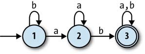

# 确定性有限状态自动机
Deterministic Finite Automaton


<!-- vscode-markdown-toc -->
* 1. [状态、规则和输入](#)
* 2. [输出](#-1)
* 3. [确定性](#-1)
* 4. [模拟](#-1)
* 5. [构建一个 DFA 对象](#DFA)

<!-- vscode-markdown-toc-config
	numbering=true
	autoSave=true
	/vscode-markdown-toc-config -->
<!-- /vscode-markdown-toc -->


##  1. <a name=''></a>状态、规则和输入
1. 有限状态机（finite state machine），也叫有限自动机（finite automaton），是一台计算机的极简模型。它没有持久化的存储并且几乎没有 RAM。
2. 它只是一台小机器，拥有一些可能的状态，并能够跟踪到自己当前具体处于其中的哪个状态。试着把它看成一台 RAM 只够存储一个值的计算机。
3. 同样，有限自动机没有键盘、鼠标和接收输入的网络接口，只有一 个外部的字符输入流可以一次读取一个字符。
4. 每台有限自动机没有通用的 CPU 执行任意程序，而是硬编码了一些规则集合，以决定在相应的输入下如何从一个状态切换到另一个状态。
5. 自动机先从一个特定的状态开始，然后从输入流中读入字符——按照规则它每次读取一个字符。
6. 最简单的自动机甚至没有输出，不会反馈任何信息。下面图示的状态机，直箭头指示了它的起始状态，也就是状态 1 开始。在这个状态下，如果接收输入 a 则会切换到状态 2；此时如果再接收输入 a 则会切换回状态 1。之后可以继续重复这个过程
    


##  2. <a name='-1'></a>输出
1. 状态机最简单的反馈输出，是将某个状态标记为 **接受状态**，以此来反馈是否接受某些输入。
2. 下面图示的状态机用双层圆把状态 2 标记为接受状态：如果输入可以让状态机的状态切换到该状态时则接受，否则拒绝
    
3. 例如从最初状态开始，如果输入时 a，则切换到状态 2，接受；如果从开始状态输入 aa，则会切换会状态 1，不接受。
4. 现在这个状态机已经有了最简单的功能：反馈一个字符串有奇数还是偶数个 a。
5. 虽然现在依然功能很简单，但状态具备构造出复杂逻辑的能力。下面示例的状态机就进一步增加了复杂性
    


##  3. <a name='-1'></a>确定性
1. 确定性要满足以下两个约束：
    * **没有冲突**：不存在这样的状态：它的下一次转换状态因为有彼此冲突的规则而有二义性。（这意味着一个状态对于同样的输入，不能有多个规则。）
    * **没有遗漏**：不存在这样的状态：它的下一次转换状态因为缺失规则而未知。（这意味着每个状态都必须针对每个可能的输入字符有至少一个规则。）
2. 遵守这些确定性约束的机器就是 **确定性有限自动机**（Deterministic Finite Automaton，DFA）。


##  4. <a name='-1'></a>模拟
1. DFA 非常简单，我们很容易用Ruby 对其进行模拟，然后直接与它交互。
2. 让我们通过实现一个规则集合对其进行模拟，并把这个规则集合称为规则手册（rulebook）
    ```rb
    # 规则类，用来生成一个具体的转换规则
    class FARule < Struct.new(:state, :character, :next_state)
        # 该规则是否能应用于制定的状态和输入字符
        def applies_to?(state, character)
            self.state == state && self.character == character
        end
        
        # 应用该规则的话会切换到的下一个状态
        def follow
            next_state
        end

        def inspect
            "#<FARule #{state.inspect} --#{character}--> #{next_state.inspect}>"
        end
    end

    # 接受若干个转换规则，作为一个状态机的规则手册
    class DFARulebook < Struct.new(:rules)
        # 切换到下个状态
        # 参数是状态机当前的状态和输入字符
        def next_state(state, character)
            rule_for(state, character).follow
        end

        # 找到用于该状态和该输入字符的那条规则
        # 参数是状态机当前的状态和输入字符
        def rule_for(state, character)
            rules.detect { |rule| rule.applies_to?(state, character) }
        end
    end
    ```
3. 示例
    ```rb
    rulebook = DFARulebook.new([
        FARule.new(1, 'a', 2), 
        FARule.new(1, 'b', 1),
        FARule.new(2, 'a', 2), 
        FARule.new(2, 'b', 3),
        FARule.new(3, 'a', 3), 
        FARule.new(3, 'b', 3),
    ])

    puts( rulebook.next_state(1, 'a') ); # 2
    puts( rulebook.next_state(1, 'b') ); # 1
    puts( rulebook.next_state(2, 'b') ); # 3
    ```


##  5. <a name='DFA'></a>构建一个 DFA 对象
1. 有了一个规则手册之后，我们可以用它来构建一个 DFA 对象，以跟踪它的当前状态，并且可以报告它当前是否处于接受状态
    ```rb
    class DFA < Struct.new(:current_state, :accept_states, :rulebook)
        def accepting?
            accept_states.include?(current_state)
        end
    end

    puts( DFA.new(1, [1, 3], rulebook).accepting? ) # true
    puts( DFA.new(1, [3], rulebook).accepting? )    # false
    ```
2. 写一个方法从输入中读取一个字符，然后查阅规则手册相应地改变状态
    ```rb
    class DFA < Struct.new(:current_state, :accept_states, :rulebook)
        def accepting?
            accept_states.include?(current_state)
        end

        def read_character(character)
            self.current_state = rulebook.next_state(current_state, character)
        end
    end
    ```
3. 现在尝试创建一个 DFA 示例，然后用上面的规则手册，输入不同的值来改变状态，看看状态改变后是否处于可接受状态
    ```rb
    dfa = DFA.new(1, [3], rulebook);

    puts( dfa.current_state ) # 1
    puts( dfa.accepting? ) # false

    dfa.read_character('b');
    puts( dfa.current_state ) # 1
    puts( dfa.accepting? ) # false

    3.times do dfa.read_character('a') end;
    puts( dfa.current_state ) # 2
    puts( dfa.accepting? ) # false

    dfa.read_character('b'); 
    puts( dfa.current_state ) # 3
    puts( dfa.accepting? ) # true
    ```
4. 再添加一个输入字符串的方法
    ```rb
    class DFA < Struct.new(:current_state, :accept_states, :rulebook)
        def accepting?
            accept_states.include?(current_state)
        end

        def read_character(character)
            self.current_state = rulebook.next_state(current_state, character)
        end

        def read_string(string)
            string.chars.each do |character|
                read_character(character)
            end
        end
    end

    # 上一步的例子，现在直接输入字符串
    dfa = DFA.new(1, [3], rulebook); 
    puts( dfa.accepting? ) # false

    dfa.read_string('baaab');
    puts( dfa.accepting? ) # true
    ```
5. 一旦 DFA 获得了一些输入，它就可能不再处于起始状态了，因此我们不能再次使用它检查输入的一个新的完整序列，而要从头创建它。现在我们在上面的基础上再进一步封装，实现一个 `DFADesign` 类，它有一个 `accepts` 方法，每次接收一个测试字符串时，都会初始化 DFA 然后再转换状态并测试是否是可接受状态
    ```rb
    class DFADesign < Struct.new(:start_state, :accept_states, :rulebook)
        def to_dfa
            DFA.new(start_state, accept_states, rulebook)
        end

        def accepts?(string)
            # #tap 方法对一个代码块求值，然后返回调用它的对象。
            # 创建一个新的 DFA 示例然后读入输入字符串再检测是否是接受状态
            to_dfa.tap { |dfa| dfa.read_string(string) }.accepting?
        end
    end

    dfa_design = DFADesign.new(1, [3], rulebook)
    puts( dfa_design.accepts?('a') )    # false
    puts( dfa_design.accepts?('baa') )  # false
    puts( dfa_design.accepts?('baba') ) # true
    ```
