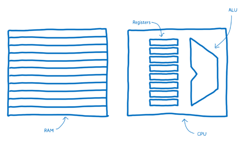
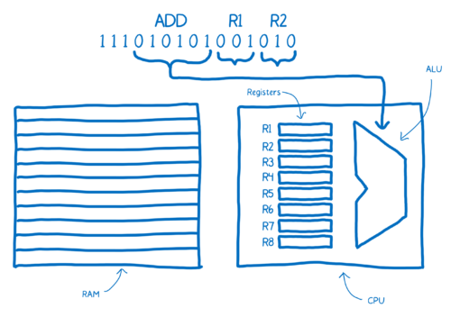
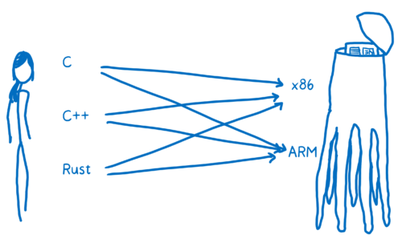
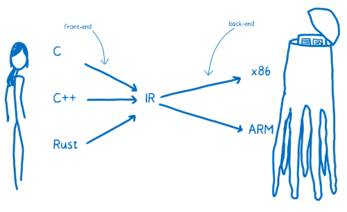

# Assembly

## Architecture
* 负责执行计算的 Arithmetic-logic Unit (ALU)
* 负责短时存储的 registers.
* 负责较长时间存储的 Random Access Memory (or RAM).

## 对指令（Instruction）的处理
1. 如下图所示，前面的 6bit 告诉 ALU 要进行加法操作，之后的两个 3bit 指定两个加数在寄存器中的地址。
  

2. Note the annotations above the machine code here, which make it easier for us humans to understand what’s going on. This is what assembly is. It’s called symbolic machine code. It’s a way for humans to make sense of the machine code.
3. You can see here there is a pretty direct relationship between the assembly and the machine code for this machine. Because of this, there are different kinds of assembly for the different kinds of machine architectures that you can have. When you have a different architecture inside of a machine, it is likely to require its own dialect of assembly.
4. It’s not just one language called machine code. It’s many different kinds of machine code. Just as we speak different languages as people, machines speak different languages.
5. With human to alien translation, you may be going from English, or Russian, or Mandarin to Alien Language A or Alien language B. In programming terms, this is like going from C, or C++, or Rust to x86 or to ARM.
6. You want to be able to translate any one of these high-level programming languages down to any one of these assembly languages (which corresponds to the different architectures). One way to do this would be to create a whole bunch of different translators that can go from each language to each assembly.
  
  
7. That’s going to be pretty inefficient. To solve this, most compilers put at least one layer in between. The compiler will take this high-level programming language and translate it into something that’s not quite as high level, but also isn’t working at the level of machine code. And that’s called an intermediate representation (IR).
8. This means the compiler can take any one of these higher-level languages and translate it to the one IR language. From there, another part of the compiler can take that IR and compile it down to something specific to the target architecture. The compiler’s front-end translates the higher-level programming language to the IR. The compiler’s backend goes from IR to the target architecture’s assembly code.

  

## References
* [A crash course in assembly](https://hacks.mozilla.org/2017/02/a-crash-course-in-assembly/)
* [《A crash course in assembly》 译文](https://zhuanlan.zhihu.com/p/25718411)
