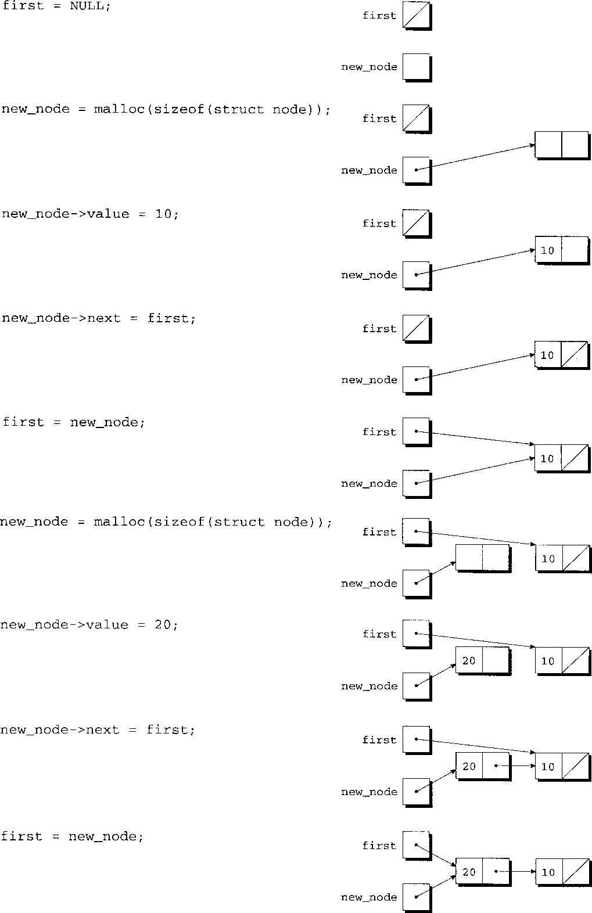

# Advanced Uses of Pointers


<!-- TOC -->

- [Advanced Uses of Pointers](#advanced-uses-of-pointers)
    - [动态存储分配](#动态存储分配)
        - [内存分配函数](#内存分配函数)
        - [空指针](#空指针)
            - [0 强制转化为 `void *`](#0-强制转化为-void-)
    - [动态分配字符串](#动态分配字符串)
        - [使用 `malloc` 函数为字符串分配内存](#使用-malloc-函数为字符串分配内存)
        - [在字符串函数中使用动态存储分配](#在字符串函数中使用动态存储分配)
        - [为字符串指针数组数组项分配内存](#为字符串指针数组数组项分配内存)
        - [动态分配字符串的数组](#动态分配字符串的数组)
    - [动态分配数组](#动态分配数组)
        - [使用 `malloc` 函数为数组分配存储空间](#使用-malloc-函数为数组分配存储空间)
        - [`calloc` 函数](#calloc-函数)
        - [`realloc` 函数](#realloc-函数)
    - [释放存储空间](#释放存储空间)
        - [`free` 函数](#free-函数)
        - [“悬空指针” 问题](#悬空指针-问题)
    - [链表](#链表)
        - [声明结点类型](#声明结点类型)
            - [两个结构互相引用对方](#两个结构互相引用对方)
        - [创建结点](#创建结点)
        - [`->` 运算符](#--运算符)
        - [在链表的开始处插入结点](#在链表的开始处插入结点)
        - [搜索链表](#搜索链表)
        - [从链表中删除结点](#从链表中删除结点)
        - [有序链表](#有序链表)
    - [指向指针的指针](#指向指针的指针)
    - [指向函数的指针](#指向函数的指针)
        - [函数指针作为参数](#函数指针作为参数)
        - [`qsort` 函数](#qsort-函数)
            - [对字符串数组进行排序](#对字符串数组进行排序)
        - [函数指针的其他用途](#函数指针的其他用途)
        - [示例程序　列三角函数表](#示例程序　列三角函数表)
    - [受限指针](#受限指针)
    - [灵活数组成员](#灵活数组成员)
        - [限制](#限制)
    - [练习](#练习)
    - [References](#references)

<!-- /TOC -->


## 动态存储分配
1. C 语言的数据结构通常是固定大小的。例如，一旦程序完成编译，数组元素的数量就固定了。在 C99 中，变长数组的长度在运行时确定，但在数组的生命周期内仍然是固定长度的。
2. 因为在编写程序时强制选择了大小，所以固定大小的数据结构可能会有问题。也就是说，在不修改程序并且再次编译程序的情况下无法改变数据结构的大小。
3. C 语言支持动态存储分配，即在程序执行期间分配内存单元的能力。利用动态存储分配，可以设计出能根据需要扩大（和缩小）的数据结构。
4. 虽然动态存储分配适用于所有类型的数据，但主要用于字符串、数组和结构。动态分配的结构是特别有趣的，因为可以把它们链接形成表、树或其他数据结构。

### 内存分配函数
1. 为了动态地分配存储空间，需要调用三种内存分配函数的一种，这些函数都是声明在 `<stdlib.h>` 头中的
    * `malloc` 函数——分配内存块，但是不对内存块进行初始化。
    * `calloc` 函数——分配内存块，并且对内存块进行清零。
    * `realloc` 函数——调整先前分配的内存块大小。
2. 在这三种函数中，`malloc` 函数是最常用的一种。因为 `malloc` 函数不需要对分配的内存块进行清零，所以它比 `calloc` 函数更高效。
3. 当为申请内存块而调用内存分配函数时，由于函数无法知道计划存储在内存块中的数据是什么类型的，所以它不能返回 `int` 类型、`char` 类型等普通类型的指针。取而代之的，函数会返回 `void *` 类型的值。`void *` 类型的值是 “通用” 指针，本质上它只是内存地址。

### 空指针
1. 当调用内存分配函数时，总存在这样的可能性：找不到满足我们需要的足够大的内存块。如果真的发生了这类问题，函数会返回 **空指针**（null pointer）。
2. 空指针是 “不指向任何地方的指针”，这是一个区别于所有有效指针的特殊值。
3. 在把函数的返回值存储到指针变量中以后，需要判断该指针变量是否为空指针。程序员的责任是测试任意内存分配函数的返回值，并且在返回空指针时采取适当的动作。试图通过空指针访问内存的效果是未定义的，程序可能会崩溃或者出现不可预测的行为。
4. 空指针用名为 `NULL` 的宏来表示，所以可以用下列方式测试 `malloc` 函数的返回值：
    ```cpp
    p = malloc(10000);
    if (p == NULL) {
        /* allocation failed;  take appropriate action  */
    }
    ```
    一些程序员把 `malloc` 函数的调用和 `NULL` 的测试组合在一起：
    ```cpp
    if ((p = malloc(10000))  == NULL) {
        /* allocation failed;  take appropriate action  */
    }
    ```
5. 名为 `NULL` 的宏在 6 个头 `<locale.h>`、`<stddef.h>`、`<stdio.h>`、`<stdlib.h>`、`<string.h>` 和 `<time.h>` 中都有定义。C99 的 `<wchar.h>` 也定义了 `NULL`。只要把这些头中的一个包含在程序中，编译器就可以识别出 `NULL`。当然，使用任意内存分配函数的程序都会包含 `<stdlib.h>`，这使 `NULL` 必然有效。
6. 在 C 语言中，指针测试真假的方法和数的测试一样。所有非空指针都为真，而只有空指针为假。
7. `NULL` 实际表示 0。当在要求指针的地方使用 0 时，C 语言编译器会把它看成是空指针而不是整数 0。提供宏 `NULL` 只是为了避免混淆。赋值表达式
    ```cpp
    p = 0;
    ```
    既可以是给数值型变量赋值为 0，也可以是给指针变量赋值为空指针。而我们无法简单地说明到底是哪一种。相反，赋值表达式
    ```cpp
    p = NULL;
    ```
    可以让我们明白 `p` 是指针。

#### 0 强制转化为 `void *`
1. 在伴随编译器的头文件中，`NULL` 可以定义如下：
    ```cpp
    #define NULL (void *) 0
    ```
2. 这种技巧在 C 标准中是合法的。它可以帮助编译器检查到空指针的不正确使用。例如，假设试图把 `NULL` 赋值给整型变量：
    ```cpp
    i = NULL;
    ```
    如果 `NULL` 定义为 0，那么这个赋值绝对是合法的。但是，如果把 `NULL` 定义为 `(void *)0`，那么编译器将提示我们把指针赋值给了整型变量。
3. 还有一个更重要的好处。假设调用带有可变长度实际参数列表的函数，且用 `NULL` 作为其中一个实际参数。如果 `NULL` 定义为 0，那么编译器将会错误地把整数值零传递给函数，如果 `NULL` 定义为 `(void *)0`，那么编译器将会传递空指针。


## 动态分配字符串
动态内存分配对字符串操作非常有用。字符串存储在字符数组中，而且可能很难预测这些数组需要的长度。通过动态地分配字符串，可以推迟到程序运行时才作决定。

### 使用 `malloc` 函数为字符串分配内存
1. `malloc` 函数具有如下原型：
    ```cpp
    void *malloc(size_t size);
    ```
2. `malloc` 函数分配 `size` 个字节的内存块，并且返回指向该内存块的指针。
3. 注意，`size` 的类型是 `size_t`，这是在 C 语言库中定义的无符号整数类型。除非正在分配一个非常巨大的内存块，否则可以只把 `size` 考虑成普通整数。
4. 用 `malloc` 函数为字符串分配内存是很容易的，因为 C 语言保证 `char` 类型值恰需要一个字节的内存。为给 `n` 个字符的字符串分配内存空间，可以写成
    ```cpp
    p = malloc(n + 1);
    ```
5. 这里的 `p` 是 `char *` 类型变量，在执行赋值操作时会把 `malloc` 函数返回的通用指针转化为 `char *` 类型，而不需要强制类型转换。通常情况下，可以把 `void*` 类型值赋给任何指针类型的变量，反之亦然。然而， 一些程序员喜欢对 `malloc` 函数的返回值进行强制类型转换：
    ```cpp
    p = (char *) malloc(n + 1);
    ```
6. 由于使用 `malloc` 函数分配的内存不需要清零或者以任何方式进行初始化，所以 `p` 指向带有 `n+1` 个字符的未初始化的数组。
7. 对上述数组进行初始化的一种方法是调用 `strcpy` 函数：
    ```cpp
    strcpy(p, "abc");
    ```
    数组中的前 4 个字符分别为 `a`、`b`、`c` 和 `\0`。

### 在字符串函数中使用动态存储分配
1. 动态存储分配使编写返回指向 “新” 字符串的指针的函数成为可能，所谓新字符串是指在调用此函数之前字符串并不存在。
2. C 标准库没有包含此类函数（例如 `strcat` 函数改变了作为参数传递过来的一个字符串，所以此函数并不是我们所要的函数），但是使用动态存储分配可以很容易自行写出这样的函数。
3. 自行编写的函数将测量用来连接的两个字符串的长度，然后调用 `malloc` 函数为结果分配适当大小的内存空间。接下来函数会把第一个字符串复制到新的内存空间中，并且调用 `strcat` 函数来拼接第二个字符串
    ```cpp
    #include <stdio.h>
    #include <stdlib.h>
    #include <string.h>

    char *concat(const char *s1, const char *s2)
    {
        char *result;

        result = malloc(strlen(s1) + strlen(s2) + 1);
        if (result == NULL)  {
            printf("Error: malloc failed in concat\n");
            exit (EXIT_FAILURE);
        }
        strcpy(result, s1);
        strcat(result, s2);
        return result;
    }

    int main(void)
    {
        char str1[6] = "hello";
        char str2[6] = "world";
        char *newStr = concat(str1, str2);

        puts(str1); // hello
        puts(str2); // world
        puts(newStr); // helloworld
    }
    ```
4. 如果 `malloc` 函数返回空指针，那么 `concat` 函数显示出错消息并且终止程序。这并不是正确的措施，一些程序需要从内存分配失败后恢复并且继续运行。
5. 像 `concat` 这样动态分配存储空间的函数必须小心使用。当不再需要 `concat` 函数返回的字符串时，需要调用 `free` 函数来释放它占用的空间。如果不这样做，程序最终会用光内存空间。

### 为字符串指针数组数组项分配内存
1. 下面的例子定义了一个字符串数组，然后读取一个字符串保存进数组第一项
    ```cpp
    #include <stdio.h>
    #include <stdlib.h>
    #include <string.h>

    #define NAME_SIZE 10
    #define MAX_NAMES 5

    int read_line(char str[], int n);
    int strArrSortFn(const void *p, const void *q);


    int main(void)
    {

        char names[5][NAME_SIZE+1];

        printf("Input a name: ");

        read_line(names[0], NAME_SIZE);

        printf("Name is: %s", names[0]);

        return 0;
    }


    int read_line(char str[], int n)
    {
        int ch, i = 0;

        while ((ch = getchar()) != '\n') {
            if (i < n) {
                str[i++] = ch;
            }
        }
        str[i] = '\0';
        return i;
    }
    ```
2. 但是如果使用字符串指针数组则会出错
    ```cpp
    char *names[MAX_NAMES];

    printf("Input a name: ");

    read_line(names[0], NAME_SIZE); // 错误
    ```
3. 应该是因为 `read_line` 要写入字符，而数组项现在只是指针，而且并没有为指针分配保存字符串的内存。
4. 所以应该先分配内存
    ```cpp
    char *names[MAX_NAMES];

    names[0] = malloc(NAME_SIZE+1);

    if (names[0] == NULL)  {
        printf("malloc error");
        return 0;
    }

    printf("Input a name: ");

    read_line(names[0], NAME_SIZE);
    ```
5. 使用 `strcpy` 的时候也会遇到同样的问题。下面因为没有内存分配但是却要把它当做字符串使用，所以会出错
    ```cpp
    char *names[MAX_NAMES];
    strcpy(names[0], "hello");
    ```
6. 同样可以分配内存在复制，或者把 `names` 声明为字符串数组。
7. 当然也可以直接让数组项的指针指向字符串
    ```cpp
    names[0] = "hello";
    ```
8. 但不懂为什么给字符串指针初始化了字符串值仍然需要分配内存
    ```cpp
    char *names[MAX_NAMES] = {"world"};

    printf("Input a name: ");

    read_line(names[0], NAME_SIZE); // 错误
    ``` 

### 动态分配字符串的数组
```cpp
/* Prints a one-month reminder list (dynamic string version) */

#include <stdio.h>
#include <stdlib.h>
#include <string.h>

#define MAX_REMIND 50   /* maximum number of reminders */
#define MSG_LEN 60      /* max length of remider message */

int read_line(char str[], int n);

int main(void)
{
    char *reminders[MAX_REMIND];
    char day_str[3], msg_str[MSG_LEN+1];
    int day, i, j, num_remind = 0;

    for (;;) {
        if (num_remind == MAX_REMIND) {
            printf("-- No space left --\n");
            break;
        }

        printf("Enter day and reminder: ");
        scanf("%2d", &day);
        if (day == 0)
            break;
        sprintf(day_str, "%2d", day);
        read_line(msg_str, MSG_LEN);

        for (i = 0; i < num_remind; i++)
            if (strcmp(day_str, reminders[i]) < 0)
                break;
        for (j = num_remind; j > i; j--)
            reminders[j] = reminders[j-1];

        reminders[i] = malloc(2 + strlen(msg_str) + 1);
        if (reminders[i] == NULL) {
            printf("-- No space left --\n");
            break;
        }

        strcpy(reminders[i], day_str);
        strcat(reminders[i], msg_str);

        num_remind++;
    }

    printf("\nDay Reminder\n");
    for (i = 0; i < num_remind; i++)
        printf(" %s\n", reminders[i]);

    return 0;
}

int read_line(char str[], int n)
{
    int ch, i = 0;

    while ((ch = getchar()) != '\n')
        if (i < n)
            str[i++] = ch;
    str[i] = '\0';
    return i;
}


// Enter day and reminder:  24 Susan's birthday
// Enter day and reminder:  5 6:00 - Dinner with Marge and Russ
// Enter day and reminder:  26 Movie - "Chinatown"
// Enter day and reminder:  7 10:30 - Dental appointment
// Enter day and reminder:  12 Movie - "Dazed and Confused"
// Enter day and reminder:  5 Saturday class
// Enter day and remlnder:  12 Saturday class
// Enter day and reminder:  0
// Day  Reminder
//   5  Saturday class
//   5  6:00 - Dinner with Marge and Russ
//   7  10:30 - Dental appointment
//  12  Saturday class
//  12  Movie - "Dazed and Confused"
//  24  Susan's birthday
//  26  Movie - "Chinatown"
```


## 动态分配数组
1. 动态分配数组会获得和动态分配字符串相同的好处，因为字符串就是数组。
2. 虽然 `malloc` 函数可以为数组分配内存空间，但有时会用 `calloc` 函数代替 `malloc`，因为 `calloc` 函数会对分配的内存进行初始化。`realloc` 函数允许根据需要对数组进行 “扩展” 或 “缩减”。

### 使用 `malloc` 函数为数组分配存储空间
1. 可以使用 `malloc` 函数为数组分配存储空间，这种方法和用它为字符串分配空间非常相像。主要区别就是任意数组的元素不需要像字符串那样是一个字节的长度。这样的结果是，我们需要使用 `sizeof` 运算符来计算出每个元素所需要的空间数量。
2. 假设正在编写的程序需要 `n` 个整数构成的数组，这里的 `n` 可以在程序执行期间计算出来。首先需要声明指针变量：
    ```cpp
    int *a;
    ```
    一旦 `n` 的值已知了，就让程序调用 `malloc` 函数为数组分配存储空间：
    ```cpp
    a = malloc(n * sizeof(int));
    ```
3. 一旦 `a` 指向动态分配的内存块，就可以忽略 `a` 是指针的事实，可以把它用作数组的名字。这都要感谢 C 语言中数组和指针的紧密关系。

### `calloc` 函数
1. `calloc` 函数在 `<stdlib.h>` 中具有如下所示的原型：
    ```cpp
    void *calloc(size_t nmemb, size_t size);
    ```
2. `calloc` 函数为 `nmemb` 个元素的数组分配内存空间，其中每个元素的长度都是 `size` 个字节。如果要求的空间无效，那么此函数返回空指针。
3. 在分配了内存之后， `calloc` 函数会通过把所有位设置为 0 的方式进行初始化。例如，下列 `calloc` 函数调用为 `n` 个整数的数组分配存储空间，并且保证所有整数初始均为零：
    ```cpp
    a = calloc(n, sizeof(int));
    ```
4. 因为 `calloc` 函数会清除分配的内存，而 `malloc` 函数不会，所以可能有时对于不同于数组的对象，也希望使用清除内存的功能。因为其他对象并没有元素个数的概念，所以可以通过调用以 1 作为第一个实际参数的 `calloc` 函数，为任何类型的数据项分配空间：
    ```cpp
    struct point { int x, y; } *p;

    p = calloc(1, sizeof(struct point));
    ```
    在执行此语句之后，`p` 将指向一个结构，且此结构的成员 `x` 和 `y` 都会被设为零。
5. 把内存块中的位初始化为 0，并不总是意味着内存块中的全部数据项都变为 0。把整数设置成零位会始终使整数为 0；把浮点数设置成零位通常会使数为 0，但这是不能保证的，要依赖于浮点数的存储方式；对指针来说也是类似的，所有位都为 0 的指针并不一定是空指针。

### `realloc` 函数
1. 一旦为数组分配完内存，稍后可能会发现数组过大或过小。`realloc` 函数可以调整数组的大小使它更适合需要。
2. 下列 `realloc` 函数的原型出现在 `<stdlib.h>` 中：
    ```cpp
    void *realloc(void *ptr, size_t size);
    ```
3. 当调用 `realloc` 函数时，`ptr` 必须指向先前通过 `malloc`、`calloc` 或 `realloc` 的调用获得的内存块。
4. `size` 表示内存块的新尺寸，新尺寸可能会大于或小于原有尺寸。
5. 要确定传递给 `realloc` 函数的指针来自于先前 `malloc`、`calloc` 或 `realloc` 的调用。如果不是这样的指针，程序可能会行为异常。
6. C 标准列出了几条关于 `realloc` 函数的规则。
    * 当扩展内存块时，`realloc` 函数不会对添加进内存块的字节进行初始化。
    * 如果 `realloc` 函数不能按要求扩大内存块，那么它会返回空指针，并且在原有的内存块中的数据不会发生改变。
    * 如果 `realloc` 函数被调用时以空指针作为第一个实际参数，那么它的行为就将像 `malloc` 函数一样。
    * 如果 `realloc` 函数被调用时以 0 作为第二个实际参数，那么它会释放掉内存块。
7. C 标准没有确切地指明 `realloc` 函数的工作原理。尽管如此，我们仍然希望它非常有效。在要求减少内存块大小时，`realloc` 函数应该 “在原先的内存块上” 直接进行缩减，而不需要移动存储在内存块中的数据。同理，扩大内存块时也不应该对其进行移动。如果无法扩大内存块（因为内存块后边的字节已经用于其他目的），`realloc` 函数会在别处分配新的内存块，然后把旧块中的内容复制到新块中。
8. 一旦 `realloc` 函数返回，请一定要对指向内存块的所有指针进行更新，因为 `realloc` 函数可能会使内存块移动到了其他地方。


## 释放存储空间
1. `malloc` 函数和其他内存分配函数所获得的内存块都来自一个称为 **堆**（heap）的存储池。过于频繁地调用这些函数（或者让这些函数申请大内存块）可能会耗尽堆，这会导致函数返回空指针。
2. 更糟的是，程序可能分配了内存块，然后又丢失了对这些块的记录，因而浪费了空间。请思考下面的例子：
    ```cpp
    p = malloc(...);
    q = malloc(...);
    p = q;
    ```
3. 在执行完前两条语句后，`p` 指向了一个内存块，而 `q` 指向了另一个内存块。在把 `q` 赋值给 `p` 之后，两个指针现在都指向了第二个内存块。因为没有指针指向第一个内存块，所以再也不能使用此内存块了。
4. 对程序而言，不可再访问到的内存块被称为是 **垃圾**（garbage）。留有垃圾的程序存在 **内存泄漏**（memroy leak）现象。一些语言提供 **垃圾收集器**（garbage collector）用于垃圾的自动定位和回收，但是 C 语言不提供。相反，每个 C 程序负责回收各自的垃圾，方法是调用 `free` 函数来释放不需要的内存。

### `free` 函数
1. `free` 函数在 `<stdlib.h>` 中有下列原型：
    ```cpp
    void free(void *ptr);
    ```
2. 使用 `free` 函数很容易，只需要简单地把指向不再需要的内存块的指针传递给 `free` 函数就可以了：
    ```cpp
    p = malloc(...);
    q = malloc(...);
    free(p);
    p = q;
    ```
3. 调用 `free` 函数会释放 `p` 所指向的内存块。然后此内存块可以被后续的 `malloc` 函数或其他内存分配函数的调用重新使用。
4. `free` 函数的实际参数必须是先前由内存分配函数返回的指针。如果参数是指向其他对象（比如变量或数组元素）的指针，可能会导致未定义的行为。（参数也可以是空指针，此时 `free` 调用不起作用）

### “悬空指针” 问题
1. 虽然 `free` 函数允许收回不再需要的内存，但是使用此函数会导致一个新的问题：**悬空指针**（dangling pointer）。
2. 调用 `free(p)` 函数会释放 `p` 指向的内存块，但是不会改变 `p` 本身。如果忘记了 `p` 不再指向有效内存块，混乱可能随即而来：
    ```cpp
    char *p = malloc(4);
    ...
    free(p);
    ...
    strcpy(p, "abc");     /*** WRONG ***/
    ```
3. 修改 `p` 指向的内存是严重的错误，因为程序不再对此内存有任何控制权了。
4. 试图访问或修改释放掉的内存块会导致未定义的行为。试图修改释放掉的内存块可能会引起程序崩溃等损失惨重的后果。
5. 悬空指针是很难发现的，因为几个指针可能指向相同的内存块。在释放内存块后，全部的指针都悬空了。


## 链表
1. 动态存储分配对建立表、树、图和其他链式数据结构是特别有用的。
2. **链表**（Linked List）是由一连串的结构（称为 **结点**）组成的，其中每个结点都包含指向链中下一个结点的指针，链表中的最后一个结点包含一个空指针。
3. 在前面几章中，我们在需要存储数据项的集合时总使用数组，而现在链表为我们提供了另外一种选择。链表比数组更灵活，我们可以很容易地在链表中插入和删除结点，也就是说允许链表根据需要扩大和缩小。另一方面，我们也失去了数组的 “随机访问” 能力。我们可以用相同的时间访问数组内的任何元素，而访问链表中的结点用时不同。如果结点距离链表的开始处很近，那么访问到它会很快；反之，若结点靠近链表结尾处，访问到它就很慢。

### 声明结点类型
1. 为了建立链表，首先需要一个表示表中单个结点的结构。简单起见，先假设结点只包含一个整数（即结点的数据）和指向表中下一个结点的指针。
2. 下面是结点结构的描述：
    ```cpp
    struct node {
        int value;            // data stored in the node
        struct node *next;    // pointer to the next node
    };
    ```
    注意，成员 `next` 具有 `struct node *` 类型，这就意味着它能存储一个指向 `node` 结构的指针。
3. 关于 `node` 结构，有一点需要特别提一下。通常可以选择使用标记或者用 `typedef` 来定义一种特殊的结构类型的名字。但是，在结构有一个指向相同结构类型的指针成员时，要求使用结构标记。没有 `node` 标记，就没有办法声明 `next` 的类型。
4. 现在已经声明了 `node` 结构，还需要记录表开始的位置。换句话说，需要有一个始终指向表中第一个结点的变量。这里把此变量命名为 `first`
    ```cpp
    struct node *first = NULL;
    ```
    把 `first` 初始化为 `NULL` 表明链表初始为空。

#### 两个结构互相引用对方
1. 上面的例子是一个结构类型引用自身类型，实际上还存在两个结构互相引用的情况。这时需要用到不完整的结构类型
    ```cpp
    struct s1;    /* incomplete declaration of s1 */

    struct s2 {
        ...
        struct s1 *p;
        ...
    };

    struct s1 {
        ...
        struct s2 *q;
        ...
    };
    ```
2. `s1` 的第一处声明创建了一个不完整的结构类型，因为我们没有指明 `s1` 的成员。`s1` 的第二处声明通过描述结构的成员 “完善” 了该类型。

### 创建结点
1. 为了创建结点，需要一个变量临时指向该结点（直到该结点插入链表中为止）。设此变量为 `new_node`
    ```cpp
    struct node *new_node;
    ```
2. 我们用 `malloc` 函数为新结点分配内存空间，并且把返回值保存在 `new_node` 中：
    ```cpp
    new_node = malloc(sizeof(struct node));
    ```
    现在 `new_node` 指向了一个内存块，且此内存块正好能放下一个 `node` 结构。
3. 接下来，将把数据存储到新结点的成员 `value` 中：
    ```cpp
    (*new_node).value = 10;
    ```
    在 `*new_node` 两边的圆括号是强制要求的，因为运算符 `.` 的优先级高于运算符 `*`。

### `->` 运算符
1. 在介绍往链表中插入新结点之前，先来讨论一种有用的捷径。利用指针访问结构中的成员是很普遍的，因此 C 语言针对此目的专门提供了一种运算符。此运算符称为 **右箭头选择**（right arrow selection），它由一个减号跟着一个 `>` 组成。
2. 利用运算符 `->` 可以编写语句
    ```cpp
    new_node->value = 10;
    ```
    来代替语句
    ```cpp
    (*new_node).value = 10;
    ```
3. 由于运算符 `->` 产生左值，所以可以在任何允许普通变量的地方使用它
    ```cpp
    scanf("%d", &new_node->value);
    ```
    注意，尽管 `new_node` 是一个指针，运算符&仍然是需要的。如果没有运算符 `&`，就会把 `new_node->value` 的值传递给 `scanf` 函数，而这个值是 `int` 类型。

### 在链表的开始处插入结点
1. 链表的好处之一就是可以在表中的任何位置添加结点：在开始处、在结尾处或者中间的任何位置。然而，链表的开始处是最容易插入结点的地方，所以这里集中讨论这种情况。
2. 如果 `new_node` 正指向要插入的结点，并且 `first` 正指向链表中的首结点，那么为了把结点插入链表将需要两条语句。
3. 首先，修改结点的成员 `next`，使其指向先前在链表开始处的结点：
    ```cpp
    new_node->next = first;
    ```
4. 接下来，使 `first` 指向新结点：
    ```cpp
    first = new_node;
    ```
5. 下面是向空链表插入两个节点的过程
    
6. 编写插入节点的函数 `add_to_list`。此函数有两个形式参数：`list`（指向旧链表中首结点的指针）和 `n`（需要存储在新结点中的整数）
    ```cpp
    struct node *add_to_list(struct node *list, int n)
    {
        struct node *new_node;

        new_node = malloc(sizeof(struct node));
        if (new_node == NULL) {
            printf("Error: malloc failed in add_to list\n");
            exit(EXIT_FAILURE);
        }

        new_node->value = n;
        new_node->next = list;

        return new_node;
    }
    ```
7. 注意，`add_to_list` 函数不会修改指针 `list`，而是返回指向新产生的结点的指针（现在位于链表的开始处）。
8. 当调用 `add_to_list` 函数时，需要把它的返回值存储到 `first` 中
    ```cpp
    struct node *first = NULL;

    first = add_to_list(first, 10);
    printf("%d\n", first->value); // 10
    first = add_to_list(first, 20);
    printf("%d\n", first->value); // 20
    ```
9. 下列函数用 `add_to_list` 来创建一个含有用户录入数的链表：
    ```cpp
    struct node *read_numbers(void)
    {
        struct node *first = NULL;
        int n;

        printf("Enter a series of integers (0 to terminate): ");
        for (;;) {
            scanf("%d", &n);
            if (n == 0)
                return first;
            first = add_to_list(first, n);
        }
    }
    ```

### 搜索链表
1. 一旦创建了链表，可能就需要为某个特殊的数据段而搜索链表。虽然 `while` 循环可以用于搜索链表，但是 `for` 语句却常常是首选。我们习惯于在编写含有计数操作的循环时使用 `for` 语句，但是 `for` 语句的灵活性使它也适合其他工作，包括对链表的操作。
2. 下面是一种访问链表中结点的习惯方法，使用了指针变量 `p` 来跟踪 “当前” 结点：
    ```cpp
    for (p  =  first;  p  !=  NULL;  p  =  p->next)
    ...
    ```
3. 现在编写名为 `search_list` 的函数，此函数为找到整数 `n` 而搜索链表。如果找到 `n`，那么 `search_list` 函数将返回指向含有 `n` 的结点的指针；否则，它会返回空指针。
3. 下面的第一版 `search_list` 函数依赖于 “链表搜索” 惯用法
    ```cpp
    struct node *search_list(struct node *list, int n)
    {
        struct node *p;

        for (p = list; p != NULL; p = p->next)
            if  (p->value == n)
                return p;
        return NULL;
    }
    ```
4. 当然，还有许多其他方法可以编写 `search_list` 函数。其中一种替换方式是除去变量 `p`，而用 `list` 自身来代替进行当前结点的跟踪
    ```cpp
    struct node *search_list(struct node *list, int n)
    {
        for (; list != NULL; list = list->next)
            if (list->value == n)
                return list;
        return NULL;
    }
    ```
    因为 `list` 是原始链表指针的副本（参数按值传递），所以在函数内改变它不会有任何损害。
5. 另一种替换方法是把判定 `list->value == n` 和判定 `list != NULL` 合并起来
    ```cpp
    struct node *search_list(struct node *list, int n)
    {
        for (; list != NULL && list->value != n; list = list->next)
            ;
        return list;
    }
    ```
6. 如果使用 `while` 语句，那么 `search_list` 函数的这一版本可能会更加清楚：
    ```cpp
    struct node *search_list(struct node *list, int n)
    {
        while (list != NULL && list->value != n)
            list = list->next;
        return list;
    }
    ```

### 从链表中删除结点
1. 把数据存储到链表中一个很大的好处就是可以轻松删除不需要的结点。就像创建结点一样，删除结点也包含 3 个步骤：
    1. 定位要删除的结点；
    2. 改变前一个结点，从而使它 “绕过” 删除结点；
    3. 调用 `free` 函数收回删除结点占用的内存空间。
2. 第 1 步并不像看起来那么容易。如果按照显而易见的方式搜索链表，那么将在指针指向要删除的结点时终止搜索。但是，这样做就不能执行第 2 步了，因为第 2 步要求改变前一个结点。
3. 针对这个问题有各种不同的解决办法。这里将使用 “追踪指针” 的方法：在第 1 步搜索链表时，将保留一个指向前一个结点的指针（`prev`），还有指向当前结点的指针（`cur`）。如果 `list` 指向待搜索的链表，并且 `n` 是要删除的整数，那么下列循环就可以实现第 1 步：
    ```cpp
    for (cur = list, prev = NULL;
        cur != NULL && cur->value != n;
        prev = cur,  cur = cur->next) ;
    ```
4. 接下来，将根据第 2 步的要求执行绕过操作。语句
    ```cpp
    prev->next = cur->next;
    ```
    使前一个结点中的指针指向了当前结点后面的结点。
5. 现在准备完成第 3 步，即释放当前结点占用的内存：
    ```cpp
    free(cur);
    ```
6. 下面的函数 `delete_from_list` 所使用的策略就是刚刚概述的操作。在给定链表和整数 `n` 时，`delete_from_list` 函数就会删除含有 `n` 的第一个结点。如果没有含有 `n` 的结点，那么函数什么也不做。无论上述哪种情况，函数都返回指向链表的指针。
    ```cpp
    struct node *delete_from_list(struct node *list, int n)
    {
        struct node *cur, *prev;

        for (cur = list, prev = NULL;
            cur != NULL && cur->value != n;
            prev = cur,  cur = cur->next) ;

        if (cur == NULL)
            return list;                /* n was not found */
            
        if (prev == NULL)
            list = list->next;          /* n is in the first node */
        else
            prev->next = cur->next;     /* n is in some other node */

        free (cur);

        return list;
    }
    ```

### 有序链表
1. 如果链表的结点是有序的（按结点中的数据排序），我们称该链表是 **有序链表**。往有序列表中插入结点会更困难一些（不再始终把结点放置在链表的开始处），但是搜索会更快（在到达期望结点应该出现的位置后，就可以停止查找了）。下面的程序表明，插入结点的难度增加了，但搜索也更快了。
2. 下面重做零件数据库程序，这次把数据库存储在链表中。用链表代替数组主要有两个好处
    * 不需要事先限制数据库的大小，数据库可以扩大到没有更多内存空间存储零件为止；
    * 可以很容易地按零件编号对数据库排序，当往数据库中添加新零件时，只要把它插入链表中的适当位置就可以了。在原来的程序中，数据库是无序的。
3. 在新程序中，`part` 结构将包含一个额外的成员，指向链表中下一个结点的指针，而且变量 `inventory` 是指向链表首结点的指针：
    ```cpp
    struct part {
        int number;
        char name[NAME_LEN+1];
        int on_hand;
        struct part *next;
    };

    struct part *inventory = NULL;     /* points to first part */
    ```
4. 新程序中的大多数函数非常类似于它们在原始程序中的版本。然而，`find_part` 函数和 `insert` 函数变得更加复杂了，因为把结点保留在按零件编号排序的链表 `inventory` 中。
5. 在原来的程序中，函数 `find_part` 返回数组 `inventory` 的索引。而在新程序中，`find_part` 函数返回指针，此指针指向的结点含有需要的零件编号。如果没有找到该零件编号，`find_part` 函数会返回空指针。
6. 因为链表 `inventory` 是根据零件编号排序的，所以新版本的 `find_part` 函数可以通过在结点的零件编号大于或等于需要的零件编号时停止搜索来节省时间。
7. `find_part` 函数的搜索循环形式如下
    ```cpp
    for (p = inventory;
        p != NULL && number > p->number;
        p = p->next) ;
    ```
8. 循环终止后还需要另一次判断是否找到了目标节点
    ```cpp
    if (p != NULL && number == p->number)
        return p;
    ```
9. 原始版本的 `insert` 函数把新零件存储在下一个有效的数组元素中；新版本的函数需要确定新零件在链表中所处的位置，并且把它插入到那个位置。`insert` 函数还要检查零件编号是否已经出现在链表中了。通过使用与 `find_part` 函数中类似的循环，`insert` 函数可以同时完成这两项任务：
    ```cpp
    for (cur = inventory, prev = NULL;
        cur != NULL && new_node->number > cur->number;
        prev = cur, cur = cur->next) ;
    ```
10. 一旦终止循环，`insert` 函数将检查 `cur` 是否不为 `NULL`，以及 `new_node->number` 是否等于 `cur->number`。如果条件成立，那么零件的编号已经在链表中了，这时需要使用 `free` 释放掉待插入节点占用的内存。否则，`insert` 函数将把新结点插入到 `prev` 和 `cur` 指向的结点之间。
11. 即使新零件的编号大于链表中的任何编号，此策略仍然有效。这种情况下，`cur` 将为 `NULL`，而 `prev` 将指向链表中的最后一个结点。


## 指向指针的指针
1. 在字符串的内容中，已经遇到过指向指针的指针，使用了元素类型为 `char *` 的数组，指向数组元素的指针的类型为 `char **`。“指向指针的指针” 这一概念也频繁出现在链式数据结构中。特别是，当函数的实际参数是指针变量时，有时候会希望函数能通过指针指向别处的方式改变此变量。做这项工作就需要用到指向指针的指针。
2. 下面的 `add_to_list` 函数用来在链表的开始处插入结点。当调用函数 `add_to_list` 时，我们会传递给它指向原始链表首结点的指针，然后函数会返回指向新链表首结点的指针：
    ```cpp
    struct node *add_to_list(struct node *list, int n)
    {
        struct node *new_node;

        new_node = malloc(sizeof(struct node));
        if (new_node == NULL)  {
            printf("Error: malloc failed in add_to_list\n");
            exit(EXIT_FAILURE);
        }
        new_node->value = n;
        new_node->next = 1ist;
        return new_node;
    }
    ```
3. 假设修改了函数使它不再返回 `new_node`，而是把 `new_node` 赋值给 `list`。换句话说，把 `return` 语句从函数 `add_to_list` 中移走，同时用下列语句进行替换：
    ```cpp
    list = new_node;
    ```
4. 可惜的是，这个想法无法实现。假设按照下列方式调用函数 `add_to_list`
    ```cpp
    add_to_list(first, 10);
    ```
    在调用点，会把 `first` 复制给 `list`（按值传递），函数内的最后一行改变了 `list` 的值，使它指向了新的结点。但是，此赋值操作对外面的 `first` 没有影响。
5. 让函数 `add_to_list` 修改 `first` 是可能的，但是这就要求给函数 `add_to_list` 传递一个指向 `first` 的指针。下面是此函数的正确形式：
    ```cpp
    void_add_to_list(struct node **list, int n)
    {
        struct node *new_node;

        new_node = malloc(sizeof(struct node));
        if (new_node == NULL) {
            printf("Error: malloc failed in add_to_list\n");
            exit(EXIT_FAILURE);
        }
        new_node->value = n;
        new_node->next = *list;
        *list = new_node;
    }
    ```
6. 当调用新版本的函数 `add_to_list` 时，第一个实际参数将会是链表首节点的指针（`first`）的指针
    ```cpp
    add_to_list(&first, 10);
    ```
7. 所以在函数里面，`list` 接收到的就是该指针的指针的副本。所以 `*list` 就是首节点的指针，即 `first`。现在把 `new_node` 赋值给 `*list` 将会修改 `first` 指向的内容。


## 指向函数的指针
C 语言没有要求指针只能指向数据，它还允许指针指向函数。毕竟函数占用内存单元，所以每个函数都有地址，就像每个变量都有地址一样。

### 函数指针作为参数
1. 假设我们要编写一个名为 `integrate` 的函数来求函数 `f` 在 `a` 点和 `b` 点之间的积分。我们希望函数 `integrate` 尽可能具有一般性，因此把 `f` 作为实际参数传入。为了在 C 语言中达到这种效果，我们把 `f` 声明为指向函数的指针。
2. 假设希望对具有 `double` 型形式参数并且返回 `double` 型结果的函数求积分，函数 `integrate` 的原型如下所示：
    ```cpp
    double integrate(double (*f)(double), double a, double b);
    ```
    在 `*f` 两边的圆括号说明 `f` 是个指向函数的指针，而不是返回值为指针的函数。
3. 把 `f` 当成函数声明也是合法的：
    ```cpp
    double integrate(double f(double), double a, double b);
    ```
    从编译器的角度来看，这种原型和前一种形式是完全一样的。不懂，这不就不是指针了吗？
4. 在调用函数 `integrate` 时，将把一个函数名作为第一个实际参数。例如，下列调用将计算 `sin` 函数从 0 到 $\pi/2$ 的积分：
    ```cpp
    result = integrate(sin, 0.0, PI / 2);
    ```
5. 注意，在 `sin` 的后边没有圆括号。当函数名后边没跟着圆括号时，C 语言编译器会产生指向函数的指针而不会产生函数调用的代码。
6. 在 `integrate` 函数体内，可以调用 `f` 所指向的函数：
    ```cpp
    y = (*f)(x);
    ```
7. 作为 `(*f)(x)` 的一种替换选择，C 语言允许用 `f(x)` 来调用 `f` 所指向的函数。虽然 `f(x)` 看上去更自然一些，但是这里将坚持用 `(*f)(x)`，以提醒读者 `f` 是指向函数的指针而不是函数名。

### `qsort` 函数
1. 函数 `qsort` 是给任意数组排序的通用函数。因为数组的元素可能是任何类型的，甚至是结构或联合，所以必须告诉函数 `qsort` 如何确定两个数组元素哪一个 “更小”。通过编写比较函数可以为函数 `qsort` 提供这些信息。
2. 当给定两个指向数组元素的指针 `p` 和 `q` 时，比较函数必须返回一个整数。如果 `*p` “小于” `*q`，那么返回的数为负数；如果 `*p` “等于” `*q`，那么返回的数为零；如果 `*p` “大于” `*q`，那么返回的数为正数。这里把 “小于”、“等于” 和 “大于” 放在双引号中是因为需要由我们来确定如何比较 `*p` 和 `*q`。
3. 函数 `qsort` 具有下列原型：
    ```cpp
    void qsort(void *base, size_t nmemb, size_t size,
              int (*compar) (const void *, const void *));
    ```
4. `base` 必须指向数组中的第一个元素。如果只是对数组的一段区域进行排序，那么要使 `base` 指向这段区域的第一个元素。在一般情况下，`base` 就是数组的名字。
5. `nmemb` 是要排序元素的数量。`size` 是每个数组元素的大小，用字节来衡量。
6. `compar` 是指向比较函数的指针。当调用函数 `qsort` 时，它会对数组进行升序排列，并且在任何需要比较数组元素的时候调用比较函数。
7. 例如对上面的 `inventory` 数组进行排序，可以进行如下调用
    ```cpp
    qsort(inventory, num_parts, sizeof(struct part), compare_parts);
    ```
8. 函数 `qsort` 要求它的形式参数类型为 `void *`，因此我们在传递了 `struct part *` 类型的指针后，在函数内会被转换为 `void *` 类型，但我们不能通过 `void *` 型的指针访问 `part` 结构的成员。
9. 为了解决这个问题，将用 `compare_parts` 把形式参数 `p` 和 `q` 赋值给 `struct part *` 型的变量，从而把它们转化成为希望的类型
    ```cpp
    int compare_parts(const void *p, const void *q)
    {
        const struct part *p1 = p;
        const struct part *q1 = q;

        if (p1->number < q1->number)
            return -1;
        else if  (p1->number == q1->number)
            return 0;
        else
            return 1;
    }
    ```
10. `p1` 和 `q1` 的声明中含有单词 `const`，以免编译器生成警告消息。由于 `p` 和 `q` 是 `const` 指针，表明它们指向的对象不能修改，它们只应赋值给声明为 `const` 的指针变量。
11. 此版本的 `compare_parts` 函数虽然可以使用，但是大多数 C 程序员愿意编写更加简明的函数。首先，注意到能用强制类型转换表达式替换 `p1` 和 `q1`：
    ```cpp
    int compare_parts(const void *p, const void *q)
    {
    if (((struct part *) p)->number <
        ((struct part *) q)->number)
        return -1;
    else if (((struct part *) p)->number ==
            ((struct part *) q)->number)
        return 0;
    else
        return 1;
    }
    ```
12. 通过移除 `if` 语句可以把函数 `compare_parts` 变得更短：
    ```cpp
    int compare_parts(const void *p, const void *q)
    {
    return ((struct part *) p)->number -
            ((struct part *) q)->number;
    }
    ```
13. 注意，整数相减是有风险的，因为有可能导致溢出。如果待排序的整数完全是任意给定的，那么使用 `if` 语句来比较两个整数的大小。

#### 对字符串数组进行排序
1. 例如下面的排序调用
    ```cpp
    char * strs[] = {"bbb", "aaa", "ccc"};

    int size = sizeof(strs[0]);
    int len = sizeof(strs) / size;
    qsort(strs, len, size, compare_strings);

    for ( int i=0; i<len; i++ ) {
        printf("%s ", strs[i]);
    }
    ```
2. `compare_strings` 应该怎么编写？如果是按照下面的方法编写，不会报错，但是看起来好像也并没有排序效果
    ```cpp
    int compare_strings(const void *p, const void *q)
    {
        const char *p1 = p;
        const char *q1 = q;
        return strcmp(p1, q1);
    }
    ```
3. 实际上是有排序的。因为 `p` 和 `q` 是指向数组项的指针，而数组项是指向字符串的指针。所以 `p` 和 `q` 并不是指向字符串的指针，而是 “指向字符串的指针的指针”。
4. 而 `char *p1` 是指向字符串的指针，所以 `const char *p1 = p` 是在把 “指向字符串的指针的指针” 转换为 “指向字符串的指针”。
5. 那么尝试转换为 “指向字符串的指针的指针”
    ```cpp
    int compare_strings(const void *p, const void *q)
    {
        const char * *p1 = p;
        const char * *q1 = q;
        return strcmp(*p1, *q1);
    }
    ```
6. 可以排序了，但是有 warning：`warning: initialization discards 'const' qualifier from pointer target type`。
7. 形参中的 `const` 表示指针指向的数组项是不能修改的，而数组项是指向字符串的指针，所以就是说指向字符串的指针是不能修改的。
8. 所以声明它的类型为 `char *`，因为 `char *` 声明的是指向字符串的指针，所以在声明 `const char * *p1 = p` 中，`*p1` 是指向字符串的指针，所以 `*p1` 应该是不能修改的。
9. `const char * x` 的含义是，`x` 指向的内容不能改变，那么放到这里就是，`*p1` 指向的内容不能改变。但我们实际上是希望 `*p1` 本身不能改变，所以就要把 `const` 放到类型声明 `char *` 后面
    ```cpp
    int compare_strings(const void *p, const void *q)
    {
        char * const *p1 = p;
        char * const *q1 = q;
        return strcmp(*p1, *q1);
    }
    ```
10. 也可以使用强制类型转换的方法，因为 `p` 和 `q` 是指针的指针，所以要强制转换为 “指向字符串的指针的指针”
    ```cpp
    (char **)p
    ```
11. 但是 `strcmp` 接受的参数是 “指向字符串的指针”，所以还要再用一个 `*`
    ```cpp
    int compare_strings(const void *p, const void *q)
    {
        return strcmp(*(char **)p, *(char **)q);
    }
    ```

### 函数指针的其他用途
1. 我们已经强调了函数指针用作其他函数的实际参数是非常有用的，但函数指针的作用不仅限于此。C 语言把指向函数的指针当成指向数据的指针对待。我们可以把函数指针存储在变量中，或者用作数组的元素，再或者用作结构或联合的成员，甚至可以编写返回函数指针的函数。
2. 正如其他类型的指针有类型一样，指向函数的指针也要指明将会指向接收什么类型参数返回什么类型值。下面例子中的变量存储的就是指向函数的指针：
    ```cpp
    void (*pf)(int);
    ```
3. `pf` 可以指向任何带有 `int` 型形式参数并且返回 `void` 型值的函数。如果 `f` 是这样的一个函数，那么可以用下列方式让 `pf` 指向 `f`：
    ```cpp
    pf = f;
    ```
4. 一旦 `pf` 指向函数 `f`，既可以用下面这种写法调用 `f`：
    ```cpp
    (*pf)(i);
    ```
    也可以用下面这种写法调用：
    ```cpp
    pf(i);
    ```
5. 元素是函数指针的数组拥有相当广泛的应用。例如，假设我们编写的程序需要向用户显示可选择的命令菜单。我们可以编写函数实现这些命令，然后把指向这些函数的指针存储在数组中：
    ```cpp
    void (*file_cmd[])(void) = {new_cmd,
                                open_cmd,
                                close_cmd,
                                close_all_cmd,
                                save_cmd,
                                save_as_cmd,
                                save_all_cmd,
                                print_cmd,
                                exit_cmd
                            };
    ```

### 示例程序　列三角函数表
1. 把书上的例子改成了输入角度而不是弧度
    ```cpp
    /* Tabulates values of trigonometric functions */

    #include <math.h>
    #include <stdio.h>

    void tabulate(double (*f)(double), double first, double last, double incr);

    int main(void)
    {
        double final, increment, initial;

        printf("Enter initial value: ");
        scanf("%lf", &initial);

        printf("Enter final value: ");
        scanf("%lf", &final);

        printf("Enter increment: ");
        scanf("%lf", &increment);

        printf("\n      x        cos(x)\n   -------    -------\n");
        tabulate(cos, initial, final, increment);

        printf("\n      x        sin(x)\n   -------    -------\n");
        tabulate(sin, initial, final, increment);

        printf("\n      x        tan(x)\n   -------    -------\n");
        tabulate(tan, initial, final, increment);

        return 0;
    }

    void tabulate(double (*f)(double), double first, double last, double incr)
    {
        double deg, rad;
        int i, num_intervals;

        num_intervals = ceil((last - first) / incr);
        for (i = 0; i <= num_intervals; i++) {
            deg = first + i * incr;
            rad = deg / 180 * acos(-1);
            printf("%-10.5f %10.5f\n", deg, (*f)(rad));
        }
    }
    ```
2. 运行效果如下
    ```
    Enter initial value: 0
    Enter final value: 180
    Enter increment: 15

        x        cos(x)
    -------    -------
    0.00000       1.00000
    15.00000      0.96593
    30.00000      0.86603
    45.00000      0.70711
    60.00000      0.50000
    75.00000      0.25882
    90.00000      0.00000
    105.00000    -0.25882
    120.00000    -0.50000
    135.00000    -0.70711
    150.00000    -0.86603
    165.00000    -0.96593
    180.00000    -1.00000

        x        sin(x)
    -------    -------
    0.00000       0.00000
    15.00000      0.25882
    30.00000      0.50000
    45.00000      0.70711
    60.00000      0.86603
    75.00000      0.96593
    90.00000      1.00000
    105.00000     0.96593
    120.00000     0.86603
    135.00000     0.70711
    150.00000     0.50000
    165.00000     0.25882
    180.00000     0.00000

        x        tan(x)
    -------    -------
    0.00000       0.00000
    15.00000      0.26795
    30.00000      0.57735
    45.00000      1.00000
    60.00000      1.73205
    75.00000      3.73205
    90.00000   16331778728383844.00000
    105.00000    -3.73205
    120.00000    -1.73205
    135.00000    -1.00000
    150.00000    -0.57735
    165.00000    -0.26795
    180.00000    -0.00000
    ```


## 受限指针 
1. 在 C99 中，关键字 `restrict` 可以出现在指针的声明中：
    ```cpp
    int * restrict p;
    ```
2. 用 `restrict` 声明的指针叫做 **受限指针**（restricted pointer）。这样做的目的是，如果指针 `p` 指向的对象在之后需要修改，那么该对象不会允许通过除指针 `p` 之外的任何方式访问（其他访问对象的方式包括让另一个指针指向同一个对象，或者让指针 `p` 指向命名变量）。
3. 下面先来看一个不适合使用受限指针的例子。假设 `p` 和 `q` 的声明如下：
    ```cpp
    int * restrict p;
    int * restrict q;
    ```
4. 现在假设 `p` 指向动态分配的内存块：
    ```cpp
    p = malloc(sizeof(int));
    ```
5. 通常情况下可以将 `p` 复制给 `q`，然后通过 `q` 对整数进行修改。但由于 `p` 是受限指针，语句 `*q = 0` 的执行效果是未定义的
    ```cpp
    q = p;
    *q = 0;     /* causes undefined behavior */
    ```
TODO


## 灵活数组成员 
1. 有时我们需要定义一个结构，其中包括未知大小的数组。例如，我们可能需要使用一种与众不同的方式来存储字符串。通常，一个字符串是一个以空字符标志结束的字符数组，但是用其他方式存储字符串是有好处的。一种选择是将字符串的长度与字符存于一起（没有空字符）。长度和字符可以存储在如下的结构中：
    ```cpp
    struct vstring {
        int len;
        char chars[N];
    };
    ```
2. 这里 `N` 是一个表示字符串最大长度的宏。但是，我们不希望使用这样的定长数组，因为这样会迫使我们限制字符串的长度，而且会浪费内存，因为大多数字符串并不需要N个字符。
3. C 程序员解决这个问题的传统方案是声明 `chars` 的长度为 1，然后动态地分配每一个字符串：
    ```cpp
    struct vstring {
        int len;
        char chars[1];
    };
    struct vstring *str = malloc(sizeof(struct vstring) + 10 - 1);
    str->len = 10;
    printf("%d\n", sizeof(str)); // 4
    printf("%d\n", str->len); // 10
    ```
4. 这里使用了一种 “欺骗” 的方法，分配比该结构声明时应具有的内存更多的内存，然后使用这些内存来存储 `chars` 数组额外的元素。这种方法在过去的这些年中非常流行，称为 “struct hack”。
5. C99 提供了 **灵活数组成员**（flexible array member）来达到同样的目的。当结构的最后一个成员是数组时，其长度可以省略：
    ```cpp
    struct vstring {
        int len;
        char chars[];    /* flexible array member - C99 only */
    };
    ```
6. `chars` 数组的长度在为 `vstring` 结构分配内存时确定，通常调用 `malloc`:
    ```cpp
    struct vstring *str = malloc(sizeof(struct vstring) + 10);
    str->len = 10;
    printf("%d\n", sizeof(str)); // 4
    printf("%d\n", str->len); // 10
    ```
7. 在这个例子中，`str` 指向一个 `vstring` 结构，其中 `char` 数组占有 10 个字符。`sizeof` 操作在计算结构大小时忽略了 `chars` 的大小。灵活数组成员不同寻常之处在于，它在结构内并不占空间。
8. 包含灵活数组成员的结构需要遵循一些专门的规则
    * 灵活数组成员必须出现在结构的最后。
    * 结构必须至少还有一个其他成员。
    * 复制包含灵活数组成员的结构时，其他成员都会被复制但不复制灵活数组本身。

### 限制    
1. 具有灵活数组成员的结构是 **不完整类型**（incomplete type）。不完整类型缺少用于确定所需内存大小的信息。
2. 特别是，不完整类型（包括含有灵活数组成员的结构）不能作为其他结构的成员和数组的元素，但是数组可以包含指向具有灵活数组成员的结构的指针。


## 练习
* 练习题 7
    ```cpp
    // 不知道还有没有更好的方法
    list = add_to_list(list, 5);
    list = add_to_list(list, 4);
    list = add_to_list(list, 3);
    list = add_to_list(list, 2);

    struct node *p= list;
    struct node *q= list;

    for (; p != NULL; ) {
        printf("%d ", p->value);
        q = p;
        p = p->next;
        free(q);
    }
    ```
* 练习题 13
    ```cpp
    #include <stdio.h>
    #include <stdlib.h>
    struct node {
        int value;            
        struct node *next;    
    };
    struct node *list = NULL;
    struct node *add_to_list(struct node *list, int n);
    struct node *insert_into_ordered_list(struct node *list, struct node *new_node);
    void printList (struct node *list);


    int main(void)
    {
        struct node newNode9 = {9};
        list = insert_into_ordered_list(list, &newNode9);

        list = add_to_list(list, 7);
        list = add_to_list(list, 6);
        list = add_to_list(list, 4);
        list = add_to_list(list, 3);

        struct node newNode2 = {2};
        list = insert_into_ordered_list(list, &newNode2);
        struct node newNode5 = {5};
        list = insert_into_ordered_list(list, &newNode5);
        struct node newNode8 = {8};
        list = insert_into_ordered_list(list, &newNode8);

        printList(list); // 2 3 4 5 6 7 8 9

        return 0;
    }


    struct node *add_to_list(struct node *list, int n)
    {
        struct node *new_node;

        new_node = malloc(sizeof(struct node));
        if (new_node == NULL) {
            printf("Error: malloc failed in add_to list\n");
            exit(EXIT_FAILURE);
        }

        new_node->value = n;
        new_node->next = list;

        return new_node;
    }
    struct node *insert_into_ordered_list(struct node *list, struct node *new_node)
    {
        struct node *cur = list, *prev = NULL;
        while (cur != NULL && cur->value <= new_node->value) {
            prev = cur;
            cur = cur->next;
        }
        if (prev == NULL ) {
            list = new_node;
            new_node->next = cur;
        }
        else if (cur == NULL ) {
            prev->next = new_node;
        }
        else {
            prev->next = new_node;
            new_node->next = cur;
        }
        return list;
    }
    void printList (struct node *list) {
        for (; list != NULL; list = list->next) {
            printf("%d ", list->value);
        }
    }
    ```

* 编程题 1  
1. 开始时只分配一个 `struct part` 的内存，之后在每次输入 `i` 命令时追加一个。
2. 改动部分如下
    ```cpp
    #include <stdlib.h>

    // ...

    struct part {
        int number;
        char name[NAME_LEN+1];
        int on_hand;
    };

    struct part *inventory;

    // ...

    int main(void)
    {
        inventory = malloc(sizeof(struct part));

        // ...
    }

    void insert(void)
    {
        // ...

        inventory = realloc(inventory, (num_parts+1) * sizeof(struct part));

        // ...
    }
    ```

* 编程题 2
    ```cpp
    int cmpByName(const void *p, const void *q) {
        const struct part *part1 = p;
        const struct part *part2 = q;

        return strcmp(part1->name, part2->name);
    }
    int cmpByNumber(const void *p, const void *q) {
        const struct part *part1 = p;
        const struct part *part2 = q;

        if ( part1->number == part2->number) {
            return 0;
        }
        else {
            return part1->number > part2->number;
        }
    }
    ```

* 编程题 5
    ```cpp
    #include <stdio.h>
    #include <stdlib.h>
    #include <string.h>

    void *my_malloc (size_t size);
    int read_line(char str[], int n);
    int strArrSortFn(const void *p, const void *q);
    void printStrArr(char *arr[], int size);

    #define STR_SIZE 20
    #define MAX_WORD 20

    int main(void)
    {
        char *words[MAX_WORD];
        int index = 0;

        while (1) {
            
            printf("Enter word:");
            words[index] = malloc(STR_SIZE+1); // 
            read_line(words[index], STR_SIZE);
            if (strlen(words[index]) == 0) {
                break;
            }
            index++;
        }

        qsort(words, index, sizeof(words[0]), strArrSortFn);
        printStrArr(words, index);

        return 0;
    }


    void *my_malloc (size_t size) {
        void *p = malloc(size);
        if ( p == NULL ) {
            printf("malloc returned NULL");
        }
        return p;
    }
    int read_line(char str[], int n)
    {
        int ch, i = 0;

        while ((ch = getchar()) != '\n') {
            if (i < n) {
                str[i++] = ch;
            }
        }
        str[i] = '\0';
        return i;
    }
    int strArrSortFn(const void *p, const void *q) {
        char * const *m = p;
        char * const *n = q;
        return strcmp(*m, *n);
    }
    void printStrArr(char *arr[], int size) {
        for (int i=0; i<size; i++) {
            printf("%s ", arr[i]);
        }
    }
    ```


## References
* [C语言程序设计](https://book.douban.com/subject/4279678/)