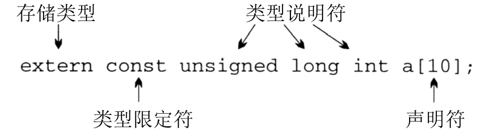
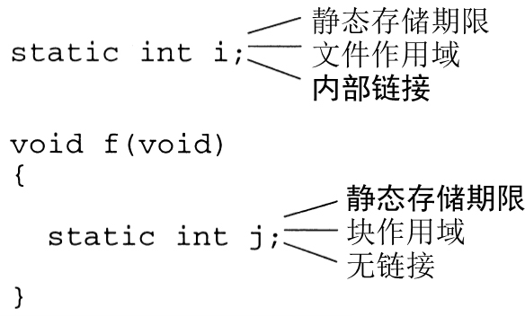

# Declarations


<!-- TOC -->

- [Declarations](#declarations)
    - [声明的语法](#声明的语法)
        - [声明说明符分为以下 4 大类](#声明说明符分为以下-4-大类)
            - [存储类型](#存储类型)
            - [类型限定符](#类型限定符)
            - [类型说明符](#类型说明符)
            - [函数说明符](#函数说明符)
        - [声明符](#声明符)
    - [存储类型](#存储类型-1)
        - [变量的性质](#变量的性质)
        - [`auto` 存储类型](#auto-存储类型)
        - [`static` 存储类型](#static-存储类型)
        - [`extern` 存储类型](#extern-存储类型)
        - [`register` 存储类型](#register-存储类型)
        - [函数的存储类型](#函数的存储类型)
        - [小结](#小结)
    - [类型限定符](#类型限定符-1)
    - [声明符](#声明符-1)
        - [解释复杂声明](#解释复杂声明)
        - [使用类型定义来简化声明](#使用类型定义来简化声明)
    - [References](#references)

<!-- /TOC -->


## 声明的语法
1. 一般地，声明具有下列形式：
    ```cpp
    声明说明符 声明符;
    ```
2. **声明说明符**（declaration specifier）描述声明的变量或函数的性质。**声明符**（declarator）给出了它们的名字，并且可以提供关于其性质的额外信息
    

### 声明说明符分为以下 4 大类
#### 存储类型
1. 存储类型一共有 4 种：`auto`、`static`、`extern` 和 `register`。
2. 在声明中最多可以出现一种存储类型。
3. 如果存储类型存在，则必须把它放置在最前面。

#### 类型限定符
1. C89 只有两种类型限定符：`const` 和 `volatile`。 C99 还有一个限定符 `restrict`。
2. 声明可以包含零个或多个限定符。

#### 类型说明符
1. 关键字 `void`、`char`、`short`、`int`、`long`、`float`、`double`、`signed` 和 `unsigned` 都是类型说明符，这些单词可以组合使用，并且出现的顺序并不重要（`int unsigned long` 和 `long unsigned int` 完全一样）。
2. 类型说明符也包括结构、联合和枚举的说明。例如，`struct point{int x, y;}`、`struct {int x, y;}` 或者 `struct point`。
3. 用 `typedef` 创建的类型名也是类型说明符。
4. 类型限定符和类型说明符必须跟随在存储类型的后边，但是两者的顺序没有限制。

#### 函数说明符
C99 还有第四种声明说明符，即函数说明符，它只用于函数声明。这一类说明符只有一个，即关键字 `inline`。

### 声明符
1. 声明符包括标识符（简单变量的名字）、后边跟随 `[]` 的标识符（数组名）、前边放置 `*` 的标识符（指针名）和后边跟随 `()` 的标识符（函数名）。
2. 声明符之间用逗号分隔。
3. 表示变量的声明符后边可以跟随初始化式。


## 存储类型
1. 存储类型可以用于变量以及较小范围的函数和形式参数的说明。现在集中讨论变量的存储类型。
2. 术语 **块**（block）表示函数体（花括号包含的部分）或者复合语句（可能包含声明）。 在 C99 中， 选择语句（`if` 和 `switch`）、循环语句（`while`、`do` 和 `for`）以及它们所控制的 “内部” 语句也被视为块，尽管本质上有一些差别。

### 变量的性质
1. C 程序中的每个变量都具有以下 3 个性质。
    * **存储期限**  
        1. 变量的存储期限决定了为变量预留和内存被释放的时间。 
        2. 具有 **自动存储期限** 的变量在所属块被执行时获得内存单元，并在块终止时释放内存单元，从而会导致变量失去值。
        3. 具有 **静态存储期限** 的变量在程序运行期间占有同一个的存储单元，也就允许变量无限期地保留它的值。
    * **作用域**
        1. 变量的作用域是指可以引用变量的那部分程序文本。
        2. 变量可以有 **块作用域**，变量从声明的地方一直到所在块的末尾都是可见的；
        3. 或者 **文件作用域**，变量从声明的地方一直到所在文件的末尾都是可见的。
    * **链接** 
        1. 变量的链接确定了程序的不同部分可以共享此变量的范围。
        2. 具有 **外部链接** 的变量可以被程序中的几个或许全部文件共享。TODO，块级作用域加外部链接，是怎么样的情况？
        3. 具有 **内部链接** 的变量只能属于单独一个文件，但是此文件中的函数可以共享这个变量。如果具有相同名字的变量出现在另一个文件中，那么系统会把它作为不同的变量来处理。TODO，和 “文件作用域” 什么关系？
        4. **无链接** 的变量属于单独一个函数，而且根本不能被共享。
        5. 看起来链接像是在定义文件外部的 “作用域”。
2. 变量的默认存储期限、作用域和链接都依赖于变量声明的位置
    * 在块（包括函数体）内部声明的变量具有自动存储期限、块作用域，并且无链接。
    * 在程序的最外层（任意块外部）声明的变量具有静态存储期限、文件作用域和外部链接。
3. 对许多变量而言，默认的存储期限、作用域和链接是符合要求的。当这些性质无法满足要求时，可以通过指定明确的存储类型（`auto`、`static`、`extern` 和 `register`）来改变变量的性质。

### `auto` 存储类型
1. `auto` 存储类型只对属于块的变量有效。
2. `auto` 变量具有自动存储期限、块作用域，并且无链接。
3. `auto` 存储类型几乎从来不用明确地指明，因为对于在块内部声明的变量，它是默认的。

### `static` 存储类型
1. `static` 存储类型可以用于全部变量，而无需考虑变量声明的位置。但是，作用于块外部声明的变量和块内部声明的变量时会有不同的效果。
2. 当用在块外部时，单词 `static` 说明变量具有内部链接。（把本来静态外部变为静态内部）
3. 当用在块内部时，`static` 把变量的存储期限从自动的变成了静态的
    
4. 在用于块外部的声明时，`static` 本质上使变量只在声明它的文件内可见。`static` 的此种用法可以用来实现一种称为信息隐藏的技术。
5. 块内声明的 `static` 变量在程序执行期间驻留在同一存储单元内。和每次程序离开所在块就会丢失值的自动变量不同，`static` 变量会无限期地保留值。
6. 块内 `static` 变量具有以下一些有趣的性质
    * `static` 变量只在程序执行前进行一次初始化，而 `auto` 变量则会在每次出现时进行初始化（假设它有初始化式）。
    * 每次函数被递归调用时，它都会获得一组新的 `auto` 变量。但是，如果函数含有 `static` 变量，那么此函数的全部调用都可以共享这个 `static` 变量。
    * 虽然函数不应该返回指向 `auto` 变量的指针，但是函数返回指向 `static` 变量的指针是没有错误的。
7. 声明函数中的一个变量为 `static`，这样做允许函数在 “隐藏” 区域内的调用之间保留信息。隐藏区域是程序其他部分无法访问到的地方。
8. 然而，更经常的用途是用 `static` 来使程序更加有效。思考下列函数：
    ```cpp
    char digit_to_hex_char(int digit)
    {
        const char hex_chars[16] = "0123456789ABCDEF";

        return hex_chars[digit];
    }
    ```
    每次调用 `digit_to_hex_char` 函数时，都会把字符 `0123456789ABCDEF` 复制给数组 `hex_chars` 来对其进行初始化。现在，把数组设为 `static` 的：
    ```cpp
    char digit_to_hex_char(int digit)
    {
        static const char hex_chars[16] = "0123456789ABCDEF";

        return hex_chars[digit];
    }
    ```
    由于 `static` 型变量只进行一次初始化，这样做就改进了 `digit_to_hex_char` 函数的速度。

### `extern` 存储类型
1. `extern` 存储类型使几个源文件可以共享同一个变量。
2. 下列声明给编译器提供的信息是，`i` 是 `int` 型变量：
    ```cpp
    extern int i;
    ```
    但是这样不会导致编译器为变量 `i` 分配存储单元。
3. 用 C 语言的术语来说，上述声明不是变量 `i` 的 **定义**，它只是提示编译器需要访问定义在别处的变量。可能稍后在同一文件中，更常见的是在另一个文件中。
4. 变量在程序中可以有多次 **声明**，但只能有一次 **定义**。
5. 变量的 `extern` 声明不是定义这一规则有一个例外。对变量进行初始化的 `extern` 声明是变量的定义。例如，声明
    ```cpp
    extern int i = 0;
    ```
    等效于
    ```
    int i = 0;
    ```
    这条规则可以防止多个 `extern` 声明用不同方法对变量进行初始化。
6. `extern` 声明中的变量始终具有静态存储期限。
7. 变量的作用域依赖于声明的位置：如果声明在块内部，那么变量具有块作用域；否则，变量具有文件作用域。
8. 确定 `extern` 型变量的链接有一定难度：如果变量在文件中较早的位置（任何函数定义的外部）声明为 `static`，那么它具有内部链接；否则（通常情况下），变量具有外部链接。不懂，之前声明为 `static`，现在又声明为 `extern`？

### `register` 存储类型
1. 声明变量具有 `register` 存储类型就要求编译器把变量存储在寄存器中，而不是像其他变量一样保留在内存中。
2. 寄存器是驻留在计算机 CPU 中的存储单元。存储在寄存器中的数据会比存储在普通内存中的数据访问和更新的速度更快。
3. 指明变量的存储类型是 `register` 是一种请求，而不是命令。编译器可以选择把 `register` 型变量存储在内存中。
4. `register` 存储类型只对声明在块内的变量有效。`register` 变量具有和 `auto` 变量一样的存储期限、作用域和链接。
5. 但是，`register` 变量缺乏 `auto` 变量所具有的一种性质：由于寄存器没有地址，所以对 `register` 变量使用取地址运算符 `&` 是非法的。即使编译器选择把变量存储在内存中，这一限制仍适用。
6. `register` 存储类型最好用于需要频繁进行访问或更新的变量。例如，在 `for` 语句中的循环控制变量就比较适合声明为 `register`：
    ```cpp
    int sum_array(int a[], int n)
    {
        register int i;
        int sum = 0;

        for (i = 0; i < n; i++)
            sum += a[i];
        return sum;
    }
    ```
7. 现在 `register` 存储类型已经不像以前那样在 C 程序员中流行了。当今的编译器比早期的 C 语言编译器复杂多了，许多编译器可以自动确定哪些变量保留在寄存器中可以获得最大的好处。
8. 不过，使用 `register` 仍然可以为编译器优化程序性能提供有用的信息。特别地，编译器知道不能对 `register` 变量取地址，因而不能用指针对其进行修改。在这一方面，`register` 关键字与 C99 的 `restrict` 关键字相关。

### 函数的存储类型
1. 和变量声明一样，函数声明（和定义）也可以包括存储类型，但是选项只有 `extern` 和 `static`。
2. 在函数声明开始处的单词 `extern` 说明函数具有外部链接，也就是允许其他文件调用此函数；`static` 说明是内部链接，也就是说只能在定义函数的文件内部调用此函数。
3. 如果不指明函数的存储类型，那么会假设函数具有外部链接。
4. 思考下面的函数声明：
    ```cpp
    extern int f(int i);
    static int g(int i);
    int h(int i);
    ```
    函数 `f` 具有外部链接，函数 `g` 具有内部链接，而函数 `h`（默认情况下）具有外部链接。由于 `g` 具有内部链接，所以在定义它的文件之外不能直接调用它。
5. 把函数声明为 `static` 不能完全阻止在别的文件中对它进行调用，通过函数指针进行间接调用仍然是可能的。
6. 声明函数是 `static` 是十分有用的。事实上，当声明不打算被其他文件调用的任意函数时，建议使用 `static` 存储类型。这样做的好处包括以下两点。
    * **更容易维护**
        1. 把函数 `f` 声明为 `static` 存储类型保证在函数定义出现的文件之外函数 `f` 都是不可见的。因此，以后修改程序的人可以知道对函数 `f` 的变化不会影响其他文件中的函数。
        2. 一个例外是：另一个文件中的函数如果传入了指向函数 `f` 的指针，它可能会受到函数 `f` 变化的影响。幸运的是，这种问题很容易通过检查定义函数f的文件来发现，因为传递 `f` 的函数一定也定义在此文件中。
    * **减少了“名字空间污染”**：由于声明为 `static` 的函数具有内部链接，所以可以在其他文件中重新使用这些函数的名字。
7. 函数的形式参数具有和 `auto` 变量相同的性质：自动存储期限、块作用域和无链接。唯一能用于形式参数的存储类型是 `register`。

### 小结
1. 下面的代码段说明了变量和形式参数声明中包含或者省略存储类型的所有可能的方法
    ```cpp
    int a;
    extern int b;
    static int c;

    void f(int d, register int e)
    {
        auto int g;
        int h;
        static int i;
        extern int j;
        register int k;
    }
    ```
2. 下表说明了上述例子中每个变量和形式参数的性质
    <table width="90%" border="1">
        <thead>
            <tr>
                <th><p>名字</p></th>
                <th><p>存储期限</p></th>
                <th><p>作用域</p></th>
                <th><p>链接</p></th>
            </tr>
        </thead>
        <tbody>
            <tr>
                <td>
                    <p><code>a</code></p>
                </td>
                <td><p>静态</p></td>
                <td><p>文件</p></td>
                <td><p>外部</p></td>
            </tr>
            <tr>
                <td>
                    <p><code>b</code></p>
                </td>
                <td><p>静态</p></td>
                <td><p>文件</p></td>
                <td>
                    <p><sup>*</sup></p>
                </td>
            </tr>
            <tr>
                <td>
                    <p><code>c</code></p>
                </td>
                <td><p>静态</p></td>
                <td><p>文件</p></td>
                <td><p>内部</p></td>
            </tr>
            <tr>
                <td>
                    <p><code>d</code></p>
                </td>
                <td><p>自动</p></td>
                <td><p>块</p></td>
                <td><p>无</p></td>
            </tr>
            <tr>
                <td>
                    <p><code>e</code></p>
                </td>
                <td><p>自动</p></td>
                <td><p>块</p></td>
                <td><p>无</p></td>
            </tr>
            <tr>
                <td>
                    <p><code>g</code></p>
                </td>
                <td><p>自动</p></td>
                <td><p>块</p></td>
                <td><p>无</p></td>
            </tr>
            <tr>
                <td>
                    <p><code>h</code></p>
                </td>
                <td><p>自动</p></td>
                <td><p>块</p></td>
                <td><p>无</p></td>
            </tr>
            <tr>
                <td>
                    <p><code>i</code></p>
                </td>
                <td><p>静态</p></td>
                <td><p>块</p></td>
                <td><p>无</p></td>
            </tr>
            <tr>
                <td>
                    <p><code>j</code></p>
                </td>
                <td><p>静态</p></td>
                <td><p>块</p></td>
                <td>
                    <p><sup>*</sup></p>
                </td>
            </tr>
            <tr>
                <td>
                    <p><code>k</code></p>
                </td>
                <td><p>自动</p></td>
                <td><p>块</p></td>
                <td><p>无</p></td>
            </tr>
        </tbody>
    </table>
    
    \* 由于这里没有显示出变量 `b` 和 `j` 的定义，所以不可能确定它们的链接。在大多数情况下，变量会定义在另一个文件中，并且具有外部链接。


## 类型限定符
1. C 语言中一共有两种类型限定符：`const` 和 `volatile`。C99 还有第三种类型限定符，即 `restrict`，它只用于指针。`volatile` 只用在底层编程中。
2. 把对象声明为 `const` 有以下几个好处。
    * `const` 是文档格式：声明对象是 `const` 类型可以提示任何阅读程序的人，该对象的值不会改变。
    * 编译器可以检查程序没有特意地试图改变该对象的值。
    * 当为特定类型的应用（特别是嵌入式系统）编写程序时，编译器可以用单词 `const` 来识别需要存储到 ROM（只读存储器）中的数据。
3. 一看，`const` 好像与 `#define` 指令一样。然而，实际上 `#define` 和 `const` 之间有明显的差异
    * 可以用 `#define` 指令为数值、字符或字符串常量创建名字。`const` 则可用于产生任何类型的只读对象，包括数组、指针、结构和联合。
    * `const` 对象遵循与变量相同的作用域规则，而用 `#define` 创建的常量不受这些规则的限制。特别是，不能用 `#define` 创建具有块作用域的常量。
    * 和宏的值不同，`const` 对象的值可以在调试器中看到。
    * 不同于宏， `const` 对象不可以用于常量表达式。例如，由于数组边界必须是常量表达式，所以不能写成下列形式：不懂
        ```cpp
        const int n = 10;
        int a[n];             /*** WRONG ***/
        ```
        在 C99 中，如果 `a` 具有自动存储期限，那么这个例子是合法的——它会被视为变长数组；但是如果 `a` 具有静态存储期限，那么这个例子是不合法的。
    * 对 `const` 对象应用取地址运算符（`&`）是合法的，因为它有地址。宏没有地址。
4. 没有绝对的原则说明何时使用 `#define` 以及何时使用 `const`。这里建议对表示数或字符的常量使用 `#define`。这样就可以把这些常量作为数组维数，并且在 `switch` 语句或其他要求常量表达式的地方使用它们。


## 声明符
### 解释复杂声明
1. 下面这个声明符是什么意思呢
    ```cpp
    int *(*x[10])(void);
    ```
2. 有下面两条简单的规则可以用来理解任何声明：
    * **始终从内往外读声明符**。换句话说，定位声明的标识符，并且从此处开始解释声明。
    * **在作选择时，始终使 `[]` 和 `()` 优先于 `*`**：
        * 如果 `*` 在标识符的前面，而标识符后边跟着 `[]`，那么标识符表示数组而不是指针。
        * 同样地，如果 `*` 在标识符的前面，而标识符后边跟着 `()`，那么标识符表示函数而不是指针。
        * 当然，可以使用圆括号来使 `[]` 和 `()` 相对于 `*` 的优先级无效。
3. 首先把这些规则应用于简单的示例。在声明
    ```cpp
    int *ap[10];
    ```
    中，`ap` 是标识符。由于 `*` 在 `ap` 的前面，且后边跟着 `[]`，而 `[]` 优先级高，所以 `ap` 是指针数组。
4. 在下列声明中，
    ```cpp
    float *fp(float);
    ```
    `fp` 是标识符。由于 `*` 在标识符的前面，且后边跟着 `()`，而 `()` 优先级高，所以 `fp` 是返回指针的函数。
5. 下列声明
    ```cpp
    void (*pf)(int);
    ```
    由于 `*pf` 包含在圆括号内，所以 `pf` 一定是指针。但是 `(*pf)` 后边跟着 `(int)`，所以 `pf` 必须指向函数，且此函数带有 `int` 型的实际参数。单词 `void` 表明了此函数的返回类型。
6. 再看看最开始的声明：
    ```cpp
    int *(*x[10])(void);
    ```
    首先，定位声明的标识符（`x`）。在 `x` 前有 `*`，而后边又跟着`[]`。因为 `[]` 优先级高于 `*`，所以 `x` 是数组。接下来，从左侧找到数组中元素的类型（指针）。再接下来，到右侧找到指针所指向的数据类型（不带实际参数的函数）。最后，回到左侧看 **每个** 函数返回的内容（指向 `int` 型的指针）。
7. 在 C 语言中有不能声明的特定内容
    * 函数不能返回数组：
        ```cpp
        int f(int)[];      /*** WRONG ***/
        ```
    * 函数不能返回函数：
        ```cpp
        int g(int)(int);   /*** WRONG ***/
        ```
    * 函数型的数组也是不可能的：
        ```cpp
        int a[10](int);    /*** WRONG ***/
        ```
8. 在上述情形中，我们可以用指针来获得所需的效果。函数不能返回数组，但可以返回指向数组的指针；函数不能返回函数，但可以返回指向函数的指针；函数型的数组不合法，但是数组可以包含指向函数的指针。

### 使用类型定义来简化声明
1. 一些程序员利用类型定义来简化复杂的声明。考虑一下前面检查过的 `x` 的声明：
    ```cpp
    int *(*x[10])(void);
    ```
2. 为了使 `x` 的类型更容易理解，可以使用下面一系列的类型定义：
    ```cpp
    typedef int *Fcn(void);
    typedef Fcn *Fcn_ptr;
    typedef Fcn_ptr Fcn_ptr_array[10];
    Fcn_ptr_array x;
    ```
3. 反向阅读可以发现，`x` 具有 `Fcn_ptr_array` 类型，`Fcn_ptr_array` 是 `Fcn_ptr` 值的数组，`Fcn_ptr` 是指向 `Fcn` 类型的指针，而 `Fcn` 是不带实际参数且返回指向 `int` 型值的指针的函数。


## References
* [C语言程序设计](https://book.douban.com/subject/4279678/)