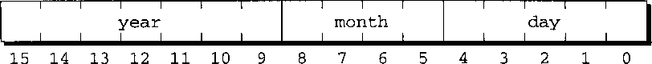

# Low-Level Programming


<!-- TOC -->

- [Low-Level Programming](#low-level-programming)
    - [Summary](#summary)
    - [位运算符](#位运算符)
        - [移位运算符](#移位运算符)
        - [按位求反运算符、按位与运算符、按位异或运算符和按位或运算符](#按位求反运算符按位与运算符按位异或运算符和按位或运算符)
        - [用位运算符访问位](#用位运算符访问位)
            - [位的设置](#位的设置)
            - [位的清除](#位的清除)
            - [位的测试](#位的测试)
            - [给被操作的位起名](#给被操作的位起名)
        - [用位运算符访问位域](#用位运算符访问位域)
            - [修改位域](#修改位域)
            - [获取位域](#获取位域)
        - [XOR 加密](#xor-加密)
    - [结构中的位域](#结构中的位域)
        - [位域是如何存储的](#位域是如何存储的)
    - [其他底层技术](#其他底层技术)
        - [定义依赖机器的类型](#定义依赖机器的类型)
        - [用联合提供数据的多个视角](#用联合提供数据的多个视角)
            - [大端和小端](#大端和小端)
        - [将指针作为地址使用](#将指针作为地址使用)
            - [程序示例——查看内存单元](#程序示例查看内存单元)
        - [`volatile` 类型限定符](#volatile-类型限定符)
    - [练习](#练习)
    - [References](#references)

<!-- /TOC -->


## Summary
1. 位操作和其他一些底层运算在编写系统程序（包括编译器和操作系统）、加密程序、图形程序以及其他一些需要高执行速度或高效地利用空间的程序时非常有用。
2. 本章中描述的一些技术需要用到数据在内存中如何存储的知识，这对不同的机器和编译器可能会不同。依赖于这些技术很可能会使程序丧失可移植性，因此除非必要，否则最好尽量避免使用它们。如果确实需要，尽量将使用限制在程序的特定模块中，不要分散在各处。同时，最重要的是确保使用文档记录所做的事！


## 位运算符
C 语言提供了 6 个位运算符。这些运算符可以用于对整数数据进行位运算。

### 移位运算符
1. 移位运算符可以通过将位向左或向右移动来变换整数的二进制表示。C 语言提供了两个移位运算符：`<<`（左移位）和 `>>`（右移位）。
2. 运算符 `<<` 和运算符 `>>` 的操作数可以是任意整数类型（包括 `char` 型）。对两个操作数都会进行整数提升，返回值的类型是左操作数提升后的类型。
3. `i << j` 的值是将 `i` 中的位左移 `j` 位后的结果。每次从 `i` 的最左端溢出一位，在 `i` 的最右端补一个 `0` 位。
4. `i >> j` 的值是将 `i` 中的位右移 `j` 位后的结果。如果 `i` 是无符号数或非负值，则需要在 `i` 的左端补 `0`；如果 `i` 是负值，其结果是由实现定义的：一些实现会在左端补 `0`，其他一些实现会保留符号位而补 `1`。
5. 为了可移植性，最好仅对无符号数进行移位运算。
6. 下面的例子展示了对数 13 应用移位运算符的效果
    ```cpp
    unsigned short i, j;

    i = 13;       /* i is now 13 (binary 0000000000001101) */
    j = i << 2;   /* j is now 52 (binary 0000000000110100) */
    j = i >> 2;   /* j is now  3 (binary 0000000000000011) */
    printf("%u", i); // 13
    ```
    两个运算符都不会改变它的操作数
7. 如果要通过移位改变变量，需要使用复合赋值运算符 `<<=` 和 `>>=`
    ```cpp
    unsigned short i;

    i = 13;       /* i is now 13 (binary 0000000000001101) */
    i <<= 2;      /* i is now 52 (binary 0000000000110100) */
    i >>= 4;      /* i is now  3 (binary 0000000000000011) */
    ```
8. 移位运算符的优先级比算术运算符的优先级低，因此可能产生意料之外的结果。例如，`i << 2 + 1` 等同于 `i << (2 + 1)`，而不是 `(i << 2) + 1`
    ```cpp
    unsigned short i;

    i = 13;       /* i is now 13 (binary 0000000000001101) */

    13 << 2 + 1;    // 104     (binary 0000000001101000)
    13 << (2 + 1);  // 104
    (13 << 2) + 1;  // 53
    ```

### 按位求反运算符、按位与运算符、按位异或运算符和按位或运算符
1. 按位求反运算符 `~` 是一元运算符，对其操作数会进行整数提升。其他运算符都是二元运算符，对其操作数进行常用的算术转换。
2. 运算符 `~`、`&`、`^` 和 `|` 对操作数的每一位执行布尔运算。`~` 运算符会产生对操作数求反的结果，即将每一个 0 替换成 1，将每一个 1 替换成 0。运算符 `&` 对两个操作数相应的位执行逻辑与运算。运算符 `^` 和 `|` 相似（都是对两个操作数执行逻辑或运算），不同的是当两个操作数的位都是 1 时，`^` 产生 0 而 `|` 产生 1。
3. 不要将位运算符 `&` 和 `|` 与逻辑运算符 `&&` 和 `||` 相混淆。 有时候位运算会得到与逻辑运算相同的结果，但它们绝不等同。
4. 下面的例子演示了运算符 `~`、`&`、`^`、`|` 的作用：
    ```cpp
    unsigned short i, j, k;

    i = 21;       /* i is now     21 (binary 0000000000010101) */
    j = 56;       /* j is now     56 (binary 0000000000111000) */
    k = ~i;       /* k is now  65514 (binary 1111111111101010) */
    printf("%u\n", k);
    k = i & j;    /* k is now     16 (binary 0000000000010000) */
    printf("%u\n", k);
    k = i ^ j;    /* k is now     45 (binary 0000000000101101) */
    printf("%u\n", k);
    k = i | j;    /* k is now     61 (binary 0000000000111101) */
    printf("%u\n", k);
    ```
    其中对 `~i` 所显示的值是基于 `unsigned short` 类型的值占有 16 位的假设。
5. 对运算符 `~` 需要特别注意，因为它可以帮助我们使底层程序的可移植性更好。假设我们需要一个整数，它的所有位都为 1。最好的方法是使用 `~0`，因为它不会依赖于整数所包含的位的个数。类似地，如果我们需要一个整数，除了最后 5 位其他的位全都为 1，我们可以写成 `~0x1f`。
6. 四个运算符优先级不同：`~` > `&` > `^` > `|`。因此，可以在表达式中组合使用这些运算符，而不必加括号。例如，可以写 `i & ~j|k` 而不需要写成 `(i & (~j))|k`；同样，可以写 `i ^ j & ~k` 而不需要写成 `i ^ (j & (~k))`。
7. 运算符 `&`、`^` 和 `|` 的优先级比关系运算符和判等运算符低。因此，下面的语句
    ```cpp
    if (status & 0x4000 != 0) ...
    ```
    会先计算 `0x4000 != 0`（结果是 1），接着判断 `status & 1` 是否非 0，而不是判断 `status & 0x4000` 是否非 0。
8. 复合赋值运算符 `&=`、`^=` 和 `|=` 分别对应于位运算符 `&`、`^` 和 `|`。

### 用位运算符访问位
1. 在进行底层编程时，经常会需要将信息存储为单个位或一组位。例如，在编写图形程序时，我们可能会需要将两个或更多的像素挤在一个字节中。使用位运算符，我们可以提取或修改存储在少数几个位中的数据。
2. 假设 `i` 是一个 16 位的 `unsigned short` 变量，我们来看看如何对 `i` 进行最常用的单位运算。

#### 位的设置
1. 假设我们需要设置 `i` 的第 4 位（我们假定最高有效位为第 15 位，最低有效位为第 0 位）。设置第 4 位的最简单方法是将 `i` 的值与常量 `0x0010`（一个在第 4 位上为 1 的 “掩码”）进行或运算：
    ```cpp
    i = 0x0000;          /* i is now 0000000000000000 */
    i |= 0x0010;         /* i is now 0000000000010000 */
    ```
2. 更通用的做法是，如果需要设置的位的位置存储在变量 `j` 中，可以使用移位运算符来构造掩码：
    ```cpp
    i |= 1 << j;        /* sets bit j */
    ```
3. 例如，如果 `j` 的值为 3，`1 << j` 是 `0x0008`。

#### 位的清除
1. 要清除 `i` 的第 4 位，可以使用第 4 位为 0、其他位为 1 的掩码：
    ```cpp
    unsigned short i, mask;

    i = 0x00ff;             /* i is now 0000000011111111 */
    mask = ~0x0010;         /* mask is  1111111111101111 */
    printf("%u\n", mask);   
    i &= mask;              /* i is now 0000000011101111 */
    printf("%u\n", i);      // 239
    ```
2. 同样可以使用左移的方法来获得掩码，只不过要多一步取反
    ```cpp
    unsigned short i, mask;

    i = 0x00ff;             /* i is now 0000000011111111 */
    mask = ~(1 << 4) ;      /* mask is  1111111111101111 */
    printf("%u\n", mask);   
    i &= mask;              /* i is now 0000000011101111 */
    printf("%u\n", i);      // 239
    ```

#### 位的测试
1. 下面的 `if` 语句测试 `i` 的第 4 位是否被设置：
    ```cpp
    if (i & 0x0010) ...              /* tests bit 4 */
    ```
2. 如果要测试第 `j` 位是否被设置，可以使用下面的语句：
    ```cpp
    if (i & 1 << j)...  /* tests bit j */
    ```

#### 给被操作的位起名
1. 为了使对于位的操作更容易，经常会给它们起名字。例如，如果我们想要使一个数的第 0、1 和 2 位对应于相应的颜色蓝、绿和红。首先，定义分别代表这三个位的位置的名字：
    ```cpp
    #define BLUE   0b1
    #define GREEN  0b10
    #define RED    0b100
    ```
2. 设置、清除或测试 `BLUE` 位可以如下进行：
    ```cpp
    unsigned short i = 0;   

    i |= BLUE;                 // sets BLUE bit
    printf("%u\n", i);         // 1
    printf("%d\n", i & BLUE);  // 1 (tests GREEN bit)

    i &= ~BLUE;                // clears BLUE bit
    printf("%u\n", i);         // 0
    printf("%d\n", i & BLUE);  // 0 (tests GREEN bit)
    ```
3. 设置、清除或测试 `GREEN` 位可以如下进行：
    ```cpp
    unsigned short i = 0;   

    i |= GREEN;                 // sets GREEN bit
    printf("%u\n", i);          // 2
    printf("%d\n", i & GREEN);  // 2 (tests GREEN bit)

    i &= ~GREEN;                // clears GREEN bit
    printf("%u\n", i);          // 0
    printf("%d\n", i & GREEN);  // 0 (tests GREEN bit)
    ```
4. 同时设置、清除或测试几个位也一样
    ```cpp
    unsigned short i = 0;   


    i |= BLUE | GREEN;                   // sets BLUE and GREEN bits
    printf("%u\n", i);                   // 3
    printf("%u\n", i & (BLUE | GREEN));  // 3 (tests BLUE and GREEN bits)

    i &= ~(BLUE | GREEN);                // clears BLUE and GREEN bits
    printf("%u\n", i);                   // 0
    printf("%u\n", i & (BLUE | GREEN));  // 0 (tests BLUE and GREEN bits)
    ```

### 用位运算符访问位域
处理一组连续的位（**位域**）比处理单个位要复杂一点。下面是两种最常见的位域操作的例子。

#### 修改位域
1. 修改位域需要使用按位与（用来清除位域），接着使用按位或（用来将新的位存入位域）。
2. 下面的语句显示了如何将二进制的值 101 存入变量 `i` 的第 4 位至第 6 位：
    ```cpp
    unsigned short i = 0;   

    i = 0b1111111;
    printf("%d\n", i); // 127
    // 0x70 是 1110000
    // 0x50 是 1010000
    i = i & ~0x0070 | 0x0050;       /* stores 101 in bits 4-6 */
    printf("%d\n", i); // 95
    ```
    运算符 `&` 清除了 `i` 的第 4 位至第 6 位，接着运算符 `|` 设置了第 6 位和第 4 位。
3. 为了使上面的例子更通用，我们假设变量 `j` 包含了需要存储到 `i` 的第 4 位至第 6 位的值。我们需要在执行按位或操作之前将 `j` 移位至相应的位置
    ```cpp
    unsigned short i = 0, j = 0b101;   

    i = 0b1111111;
    i = (i & ~0x0070) | (j << 4);
    printf("%d\n", i); // 95
    ``` 
4. 运算符 `|` 的优先级比运算符 `&` 和 `<<` 的优先级低，所以可以去掉圆括号：
    ```cpp
    i = i & ~0x0070 | j << 4;
    ```

#### 获取位域
1. 当位域处在数的右端（最低有效位）时，获得它的值非常方便。例如，下面的语句获取了变量 `i` 的第 0 位至第 2 位：
    ```cpp
    unsigned short i = 0, j = 0;   

    i = 0b0101;
    j = i & 0x0007;
    printf("%u", j); // 5
    ```
2. 如果位域不在 `i` 的右端，那首先需要将位域移位至右端，再使用运算符 `&` 提取位域。例如，要获取 `i` 的第 4 位至第 6 位，可以使用下面的语句
    ```cpp
    unsigned short i = 0, j = 0;   

    i = 0b01100101;
    j = (i >> 4) & 0x0007;
    printf("%u", j); // 6
    ```

### XOR 加密
1. 对数据加密的一种最简单的方法就是，将每一个字符与一个密钥进行异或（XOR）运算。假设密钥是一个 `&` 字符。如果将它与字符 `z` 异或，我们会得到字符 `\`（假定使用 ASCII 字符集）。具体计算如下：
    
2. 要将消息解密，只需采用相同的算法。换言之，只需将加密后的消息再次加密，即可得到原始的消息（TODO，为什么会是这样）。例如，如果将 `&` 字符与 `\` 字符异或，就可以得到原来的字符 `z`：
    
3. 下面的程序 `xor.c` 通过将每个字符与 `&` 字符进行异或来加密消息。原始消息可以由用户输入，或者使用输入重定向从文件读入。加密后的消息可以在屏幕上显示，也可以通过输出重定向存入文件中。例如，假设文件 `msg` 包含下面的内容：
    ```
    Trust not him with your secrets, who, when left
    alone in your room, turns over your papers.
                --Johann Kaspar Lavater (1741-1801)
    ```
4. 为了对文件 `msg` 加密，并将加密后的消息存储在文件 `newmsg` 中，需要使用下面的命令：
    ```cpp
    xor <msg >newmsg
    ```
5. 文件 `newmsg` 将包含下面的内容：
    ```
    rTSUR HIR NOK QORN _IST UCETCRU, QNI, QNCH JC@R
    GJIHC OH _IST TIIK, RSTHU IPCT _IST VGVCTU.
                --lINGHH mGUVGT jGPGRCT (1741-1801)
    ```
6. 要恢复原始消息，需要使用命令
    ```cpp
    xor <newmsg
    ```
    将原始消息显示在屏幕上。
7. 正如在例子中看到的，程序不会改变一些字符，包括数字。将这些字符与 `&` 异或会产生不可见的控制字符，这在一些操作系统中会引发问题。而这里，为了安全我们将使用 `isprint` 函数来确保原始字符和新字符（加密后的字符）都是可打印字符（即不是控制字符）。如果不满足，让程序写原始字符，而不用新字符。
8. 下面是完成的程序
    ```cpp
    /* Performs XOR encryption */


    #include <ctype.h>
    #include <stdio.h>

    #define KEY '&'

    int main(void)
    {
        int orig_char, new_char;

        while ((orig_char = getchar()) != EOF) {
            new_char = orig_char ^ KEY;
            if (isprint(orig_char) && isprint(new_char))
                putchar(new_char);
            else
                putchar(orig_char);
        }

        return 0;
    }
    ```


## 结构中的位域
1. 虽然上面的方法可以操作位域，但这些方法不易使用，而且可能会引起一些混淆。幸运的是，C 语言提供了另一种选择——声明其成员表示位域的结构。
2. 例如， 我们来看看 MS-DOS 操作系统是如何存储文件的创建和最后修改日期的。由于日期、月和年都是很小的数，将它们按整数存储会很浪费空间。DOS 只为日期分配了 16 位，其中 5 位用于日，4 位用于月，7 位用于年
    
3. 利用位域，我们可以定义相同形式的 C 结构：
    ```cpp
    struct file_date {
        unsigned int day: 5;
        unsigned int month: 4;
        unsigned int year: 7;
    };
    ```
4. 每个成员后面的数指定了它所占用位的长度。由于所有的成员的类型都一样，如果需要，我们可以简化声明：
    ```cpp
    struct file_date {
        unsigned int day: 5, month: 4, year: 7;
    };
    ```
5. 位域的类型必须是 `int`、`unsigned int` 或 `signed int`。使用 `int` 会引起二义性，因为一些编译器将位域的最高位作为符号位，而其他一些编译器则不会。TODO，有什么问题。考虑到可移植性，将所有的位域声明为 `unsigned int` 或 `signed int`。
6. 在 C99 中，位域也可以具有类型 `_Bool`。C99 编译器还允许额外的位域类型。
7. 们可以将位域像结构的其他成员一样使用，如下面的例子所示：
    ```cpp
    struct file_date fd;

    fd.day = 28;
    fd.month = 12;
    fd.year = 8;     // represents 1988
    ```
    注意，`year` 成员是相对于 1980 年（根据微软的描述，这是 DOS 出现的时间）存储的。
8. 在这些赋值语句之后，变量 `fd` 的形式如下所示：
    
9. 使用位运算符可以达到同样的效果，使用位运算符甚至可能使程序更快些。然而，使程序更易读通常比节省几微秒更重要一些。
10. 使用位域有一个限制，这个限制对结构的其他成员不适用。由于通常意义上讲位域没有地址，C 语言不允许将 `&` 运算符用于位域。由于这条规则，像 `scanf` 这样的函数无法直接向位域中存储数据：
    ```cpp
    scanf("%d", &fd.day);    /*** WRONG ***/
    ```
    当然，我们可以用 `scanf` 函数将输入读入到一个普通的变量中，然后再赋值给 `fd.day`。

### 位域是如何存储的
1. 我们来仔细看一下编译器是如何处理包含位域成员的结构的声明的。C 标准在如何存储位域方面给编译器保留了相当的自由度。
2. 有关编译器处理位域的规则与 “存储单元” 的概念有关。存储单元的大小是由实现定义的，通常为 8 位、16 位或 32 位。
3. 当编译器处理结构的声明时，会将位域逐个放入存储单元，位域之间没有间隙，直到剩下的空间不够用来放下一个位域了。这时，一些编译器会跳到下一个存储单元的开始，而另一些则会将位域拆开跨存储单元存放。具体哪种情况会发生是由实现定义的。
4. 位域存放的顺序（从左至右，还是从右至左）也是由实现定义的。
5. 前面的 `file_date` 例子假设存储单元是 16 位长的。8 位的存储单元也可以，编译器只要将 `month` 字段拆开跨两个存储单元存放。我们也可以假设位域是从右至左存储的（第一个位域会占据低序号的位）。
6. C 语言允许省略位域的名字。未命名的位域经常用来作为字段间的 “填充”，以保证其他位域存储在适当的位置。考虑与 DOS 文件关联的时间，存储方式如下：
    ```cpp
    struct file_time {
        unsigned int seconds: 5;
        unsigned int minutes: 6;
        unsigned int hours: 5;
    };
    ```
    如果我们并不关心 `seconds` 字段，可以不给它命名：
    ```cpp
    struct file_time {
        unsigned int : 5;                   /* not used */
        unsigned int minutes: 6;
        unsigned int hours: 5;
    };
    ```
    其他的位域仍会正常对齐，如同 `seconds` 字段存在时一样。（你可能会奇怪怎么可能将秒——0 至 59 之间的数——存储在一个 5 位的字段中呢。实际上，DOS 将秒数除以 2，因此 `seconds` 成员实际存储的是 0~29 的数。）
7. 另一个用来控制位域存储的技巧是指定未命名的字段长度为 0：
    ```cpp
    struct s {
        unsigned int a: 4;
        unsigned int : 0;              /* 0-length bit-field */
        unsigned int b: 8;
    };
    ```
    长度为 0 的位域是给编译器的一个信号，告诉编译器将下一个位域在一个存储单元的起始位置对齐。假设存储单元是 8 位长的，编译器会给成员 `a` 分配 4 位，接着跳过余下的 4 位到下一个存储单元，然后给成员 `b` 分配8位。如果存储单元是 16 位，编译器会给 `a` 分配 4 位，接着跳过 12 位，然后给成员 `b` 分配 8 位。


## 其他底层技术
### 定义依赖机器的类型
1. 依据定义，`char` 类型占据一个字节，所以我们有时将字符当作是字节，并用它们来存储一些并不一定是字符形式的数据。但这样做时，最好定义一个 `BYTE` 类型：
    ```cpp
    typedef unsigned char BYTE;
    ```
2. 对于不同的机器，我们还可能需要定义其他类型。x86 体系结构大量使用了 16 位的字，因此下面的定义会比较有用：
    ```cpp
    typedef unsigned short WORD;
    ```

### 用联合提供数据的多个视角
1. 之前已经介绍了有关联合的便捷的使用方式，但是在 C 语言中，联合经常被用于一个完全不同的目的：从两个或更多角度看待内存块。
2. 这里根据上面 `file_date` 结构给出一个简单的例子。由于一个 `file_date` 结构正好放入两个字节中，我们可以将任何两个字节的数据当作是一个 `file_date` 结构。特别是可以将一个 `unsigned short` 值看作是一个 `file_date` 结构（假设短整数是 16 位长）。下面定义的联合可以使我们方便地将一个短整数与文件日期相互转换：
    ```cpp
    union int_date {
        unsigned short i;
        struct file_date fd;
    };
    ```
3. 通过这个联合，我们可以以两个字节的形式获取磁盘中文件的日期，然后提取出其中的 `month`、`day` 和 `year` 字段的值。相反地，我们也可以以 `file_date` 结构构造一个日期，然后作为两个字节写入磁盘中。
4. 下面的例子说明了如何使用 `int_date` 联合。当传入 `unsigned short` 参数时，这个 `print_date` 函数将其以文件日期的形式显示出来
    ```cpp
    #include <stdio.h>


    struct file_date {
        unsigned int day: 5;
        unsigned int month: 4;
        unsigned int year: 7;
    };

    union int_date {
        unsigned short i;
        struct file_date fd;
    };

    void print_date(unsigned short n)
    {
        union int_date u;

        u.i = n;
        printf("%d-%d-%d\n", u.fd.year + 1980, u.fd.month+1, u.fd.day+1);
    }

    int main(void)
    {
        print_date(0);                  // 1980-1-1
        
        // 16756 二进制
        print_date(0b0100000101110100); // 2012-12-21

        print_date(65535);              // 2107-16-32
        
        
        union int_date u1;
        u1.fd.year = 32;
        u1.fd.month = 11;
        u1.fd.day = 20;

        printf("%d", u1.i); // 16756

        return 0;
    }
    ```
5. 在使用寄存器时，这种用联合提供数据的多个视角的方法会非常有用，因为寄存器通常划分为较小的单元。以 x86 处理器为例，它包含 16 位寄存器——AX、BX、CX 和 DX。每一个寄存器都可以看作是两个 8 位的寄存器。例如，AX 可以被划分为 AH 和 AL 两个寄存器。
6. 当针对基于 x86 的计算机编写底层程序时，可能会需要用到表示寄存器 AX、BX、CX 和 DX 中的值的变量。我们需要对 16 位寄存器和 8 位寄存器进行访问，同时要考虑它们之间的关系：改变 AX 的值会影响 AH 和 AL，改变 AH 或 AL 也会同时改变 AX。
7. 为了解决这一问题，可以构造两个结构，一个包含对应于 16 位寄存器的成员，另一个包含对应于 8 位寄存器的成员。然后构造一个包含这两个结构的联合：
    ```cpp
    union {
        struct {
            WORD ax, bx, cx,dx;
        } word;
        struct {
            BYTE al, ah, bl, bh, cl, ch, dl, dh;
        } byte;
    } regs;
    ```
    `word` 结构的成员会和 `byte` 结构的成员相互重叠。例如，`ax` 会使用与 `al` 和 `ah` 同样的内存空间。
8. 下面是一个使用 `regs` 联合的例子：
    ```cpp
    #include <stdio.h>

    typedef unsigned char BYTE;
    typedef unsigned short WORD;

    union {
        struct {
            WORD ax, bx, cx,dx;
        } word;
        struct {
            BYTE al, ah, bl, bh, cl, ch, dl, dh;
        } byte;
    } regs;


    int main(void)
    {

        regs.byte.ah = 0x12; // 00010010
        regs.byte.al = 0x34; // 00110100
        // 0001001000110100，当前实现从右至左存储，也就是 al 在最右边，它左边是 ah
        printf("AX: %hx\n", regs.word.ax); // 1234

        return 0;
    }
    ```

#### 大端和小端
1. 上面的例子中，尽管 AL 寄存器是 AX 的 “低位” 部分而 AH 是 “高位” 部分，但在 `byte` 结构中 `al` 在 `ah` 之前。
2. 原因是，当数据项多于一个字节时，在内存中有两种存储方式：“自然” 序（先存储最左边的字节）或者相反的顺序（最左边的字节最后存储）。 3. 第一种方式也称为 **大端**（big-endian），第二种方式称为 **小端**（little-endian）。
4. C 对存储的顺序没有要求，因为这取决于程序执行时所使用的 CPU。一些 CPU 使用大端方法，一些使用小端方法。
5. x86 处理器假设数据按小端方式存储，所以 `regs.word.ax` 的第一个字节是低位字节。
6. 通常我们不用担心字节存储的顺序。但是，在底层对内存进行操作的程序必须注意字节的存储顺序（`regs` 的例子就是如此）。处理含有非字符数据的文件时也需要当心字节的存储顺序。


### 将指针作为地址使用 
1. 之前说过，指针实际上就是一种内存地址。虽然我们通常不需要知道其细节内容，但是编写底层程序时，这些细节内容就很重要了。
2. 地址所包含的位的个数与整数（或长整数）一致。构造一个指针来表示某个特定的地址是十分方便的：只需要将整数强制转换成指针就行。例如，下面的例子将地址 1000（十六进制）存入一个指针变量：
    ```cpp
    BYTE *p;

    p = (BYTE *) 0x1000;           /* p contains address 0x1000 */
    ```

#### 程序示例——查看内存单元
1. 这个程序允许用户查看计算机内存段，这主要得益于 C 允许把整数用作指针。
2. 大多数 CPU 执行程序时都是处于 “保护模式”，这样就意味着程序只能访问那些分配给它的内存。这种方式还可以阻止对其他应用程序和操作系统本身所占用的内存的访问。因此我们只能看到程序本身分配到的内存，如果要对其他内存地址进行访问将导致程序崩溃。
3. 程序 `viewmemory.c` 先显示了该程序主函数的地址和主函数中一个变量的地址。这可以给用户一个线索去了解哪个内存区可以被探测。
4. 程序接下来提示用户输入地址（以 16 进制整数格式）和需要查看的字节数，然后从该指定地址开始显示指定字节数的内存块内容。
5. 字节按 10 个一组的方式显示（最后一组例外，有可能小于 10 个字节）。每组字节的地址显示在一行的开头，后面是该组中的字节（按十六进制数形式），再后面为该组字节的字符显示（以防字节恰好是表示字符的，有时候会出现这种情况）。只有打印字符（使用 `isprint` 函数判断）才会被显示，其他字符显示为点号。
6. 我们假设 `int` 类型的值使用 32 位存储，且地址也是 32 位长。地址按惯例用十六进制显示。
7. `viewmemory.c` 程序如下
    ```cpp
    /* Allows the user to view regions of computer memory */

    #include <ctype.h>
    #include <stdio.h>

    typedef unsigned char BYTE;

    int main(void)
    {
        unsigned int addr;
        int i, n;
        BYTE *ptr;

        printf("Address of main function: %x\n", (unsigned int) main);
        printf("Address of addr variable: %x\n", (unsigned int) &addr);
        printf("\nEnter a (hex) address: ");
        scanf("%x", &addr);
        printf("Enter number of bytes to view: ");
        scanf("%d", &n);

        printf("\n");
        printf(" Address              Bytes        Characters\n");
        printf(" -------  -----------------------  ----------\n");

        ptr = (BYTE *) addr;
        for (; n > 0; n -= 10) {
            // 转换说明符 %X 按大写显示十六进制数位 A、B、C、D、E 和 F
            printf("%8X  ", (unsigned int) ptr);
            
            for (i = 0; i < 10 && i < n; i++) {
                printf("%.2X ", *(ptr + i));
            }
            
            // 因为 n 的值有可能不是 10 的整数倍，所以最后一组可能不到 10 个字节。
            // 这个 for 处理最后一组中缺失的字节，为每个缺失的字节显示三个空格。
            // 这样，跟在最后一组字节后面的字符就可以与前面的各行对齐了。
            for (; i < 10; i++) {
                printf("   ");
            }
            
            printf("  ");

            for (i = 0; i < 10 && i < n; i++) {
                BYTE ch = *(ptr + i);
                if (!isprint(ch)) {
                    ch = '.';
                }
                printf("%c", ch);
            }

            printf("\n");

            ptr += 10;
        }

        return 0;
    }
    ```
8. 下面是用 GCC 编译这个程序并在运行 Linux 的 x86 系统下测试的结果：
    ```
    Address of main function: 804847c
    Address of addr variable: bff41154

    Enter a (hex) address: 8048000
    Enter number of bytes to view: 40

    Address               Bytes                 Characters
    -------    ----------------------------     -----------
    8048000    7F 45 4C 46 01 01 01 00 00 00    .ELF......
    804800A    00 00 00 00 00 00 02 00 03 00    ..........
    8048014    01 00 00 00 C0 83 04 08 34 00    ........4.
    804801E    00 00 C0 0A 00 00 00 00 00 00    ..........
    ```
9. 程序从地址 8048000 开始显示 40 个字节，这是 `main` 函数之前的地址。注意 7F 字节以及其后所跟的表示字母 E、L 和 F 的字节。这四个字节标识了可执行文件存储的格式（ELF）。ELF（Executable and Linking Format）广泛应用于 UNIX 系统，包括 Linux。8048000 是 x86 平台下 ELF 可执行文件的默认装载地址。
10. 我们再次运行该程序，这次显示从 `addr` 变量的地址开始的一些字节：
    ```
    Address of main function: 804847c
    Address of addr variable: bfec5484

    Enter a (hex) address: bfec5484
    Enter number of bytes to view: 64

    Address             Bytes                 Characters
    ---------  -----------------------------  ----------
    BFEC5484   84 54 EC BF B0 54 EC BF F4 6F  .T...T...O
    BFEC548E   68 00 34 55 EC BF C0 54 EC BF  h.4U...T..
    BFEC5498   08 55 EC BF E3 3D 57 00 00 00  .U...=W...
    BFEC54A2   00 00 A0 BC 55 00 08 55 EC BF  ....U..U..
    BFEC54AC   E3 3D 57 00 01 00 00 00 34 55  .=W.....4U
    BFEC54B6   EC BF 3C 55 EC BF 56 11 55 00  ..<U..V.U.
    BFEC54C0   F4 6F 68 00                    .oh.
    ```
11. 存储在这个内存区域的数据都不是字符格式，所以有点难以理解。但是，我们知道一点：`addr` 变量占了这个区域的前 4 个字节。如果对这 4 个字节进行反转，就得到了 BF EC 54 84，这就是用户输入的地址。为什么要反转呢？ 因为 x86 处理器按小端方式存储数据。

### `volatile` 类型限定符
1. 在一些计算机中，一部分内存空间是 “易变” 的，保存在这种内存空间的值可能会在程序运行期间发生改变，即使程序自身并未试图存放新值。例如，一些内存空间可能被用于保存直接来自输入设备的数据。
2. `volatile` 类型限定符使我们可以通知编译器，程序中的某些数据是 “易变” 的。`volatile` 限定符通常使用在用于指向易变内存空间的指针的声明中：
    ```cpp
    volatile BYTE *p;      /* p will point to a volatile byte */
    ```
3. 为了了解为什么要使用 `volatile`，我们假设指针 `p` 指向的内存空间用于存放用户通过键盘输入的最近一个字符。这个内存空间是易变的：每次用户输入一个新字符，这里的值都会发生改变。我们可能使用下面的循环获取键盘输入的字符，并将它们存入一个缓冲区数组中：
    ```cpp
    while (缓冲区未满) {
        等待输入;
        buffer[i] = *p;
        if (buffer[i++] == '\n')
            break;
    }
    ```
4. 比较好的编译器可能会注意到这个循环既没有改变 `p`，也没有改变 `*p`，因此编译器可能会对程序进行优化，使 `*p` 只被取一次：
    ```cpp
    在寄存器中存储*p;
        while (缓冲区未满) {
        等待输入;
        buffer[i] = 存储在寄存器中的值;
        if (buffer[i++] == '\n')
            break;
    }
    ```
    优化后的程序会不断复制同一个字符来填满缓冲区，这并不是我们想要的程序。
5. 将 `p` 声明成指向易变的数据的指针可以避免这一问题的发生，因为 `volatile` 限定符会通知编译器 `*p` 每一次都必须从内存中重新取。


## 练习
* 练习题 2
    ```cpp
    #include <stdio.h>


    unsigned int foo (unsigned int i, short pos) {
        if (i & 1 << pos) {
            unsigned int mask = ~(1 << pos);
            return i & mask;
        }
        else {
            return i | 1 << pos;
        }
    }

    int main(void)
    {
        unsigned int i, j, k;

        i = 255;
        int pos = 2;

        i = foo(i, pos);
        printf("%u\n", i); // 251

        i = foo(i, pos);
        printf("%u\n", i); // 255
        
        return 0;
    }
    ```
* 练习题 3  
    颠倒 `x` 和 `y`：1、2 步把 `x` 换到 `y`，2、3 步把 `y` 换到 `x`
    ```cpp
    #include <stdio.h>
    // #include<stdbool.h>

    #define M(x,y) ((x)^=(y),(y)^=(x),(x)^=(y))


    int main(void)
    {
        unsigned int i, j, k;

        i = 4;
        j = 9;

        // 00000100  00001101  00001101  00001001
        // 00001001  00001001  00000100  00000100
            

        M(i, j);
        printf("%u %u\n", i, j); // 9 4


        return 0;
    }
    ```
* 练习题 6
    ```cpp
    unsigned short swap_bytes(unsigned short i) {
        unsigned short j = (i & 0xff) << 8;
        return j += i >> 8;
        // return ((i & 0xff) << 8) + (i >> 8);
    }
    ```
* 练习 7
    ```cpp
    #include <stdio.h>

    #define UI_WIDTH (sizeof(unsigned int) * 8)
    unsigned int rotate_left(unsigned int i, int n);
    unsigned int rotate_right(unsigned int i, int n);


    int main(void)
    {    
        unsigned int r = rotate_left(0x12345678, 4);
        printf("%x\n", r);                     // 23456781
        printf("%x\n", rotate_right(r, 4));    // 12345678

        return 0;
    }


    unsigned int rotate_left(unsigned int i, int n){
        int offset = n % UI_WIDTH;
        unsigned int rotated = i >> (UI_WIDTH - offset);
        return (i << offset) + rotated;
    }
    unsigned int rotate_right(unsigned int i, int n){
        int offset = n % UI_WIDTH;
        unsigned int rotated = i << (UI_WIDTH - offset);
        return rotated + (i >> offset);
    }
    ```
* 练习 8  TODO
    ```cpp
    unsigned int f(unsigned int i, int m, int n)
    {
        // printf("%d", ~(~0 << n));
        return (i >> (m + 1 - n)) & ~(~0 << n);
        // i = 11111111 11111111 11111111 01111111   // 4294967167
        // m = 8  n = 4
        // l = 00011111 11111111 11111111 11111011
        // r = 00000000 00000000 00000000 00001111
        // f = 00000000 00000000 00000000 00001011
        // 右边是 2^n - 1，n 个 1，也就是左边有 32-n 个 0

        // i = 00000000 00000000 00000000 11011111   // 223
        // m = 8  n = 4
        // l = 00000000 00000000 00000000 00000110
        // r = 00000000 00000000 00000000 00001111
        // f = 00000000 00000000 00000000 00000110
    }
    ```
* 练习 9  TODO，不使用循环的方法
    ```cpp
    int count_ones(unsigned char ch) {
        int width = sizeof(unsigned char) * 8;
        int count = 0;
        int mask;

        for (int i=0; i<width; i++) {
            mask = 1 << i;
            if (mask & ch) {
                count++;
            }
        }

        return count;
    }
    ```


## References
* [C语言程序设计](https://book.douban.com/subject/4279678/)