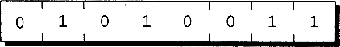
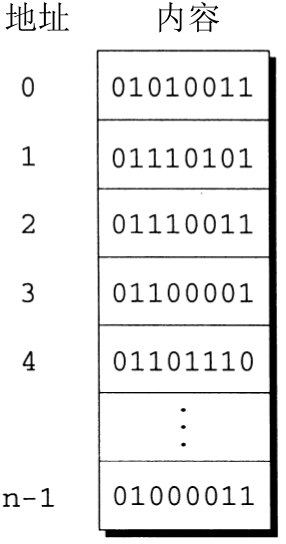
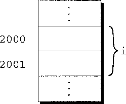

# Pointers


<!-- TOC -->

- [Pointers](#pointers)
    - [指针变量](#指针变量)
        - [指针变量的声明](#指针变量的声明)
    - [取地址运算符和间接寻址运算符](#取地址运算符和间接寻址运算符)
        - [取地址运算符](#取地址运算符)
        - [间接寻址运算符](#间接寻址运算符)
    - [指针赋值](#指针赋值)
    - [指针作为参数](#指针作为参数)
        - [例](#例)
        - [用` const` 保护参数](#用-const-保护参数)
    - [References](#references)

<!-- /TOC -->


## 指针变量
1. 大多数现代计算机都将内存分割为 **字节**（byte），每个字节可以存储 8 位的信息
    
2. 每个字节都有唯一的 **地址**（address），用来和内存中的其他字节相区别。如果内存中有 n 个字节，那么可以把地址看作 0～(n-1) 的数。
    
3. 可执行程序由代码（原始 C 程序中与语句对应的机器指令）和数据（原始程序中的变量）两部分构成。
4. 程序中的每个变量占有一个或多个字节内存，把第一个字节的地址称为是变量的地址。下图中，变量 `i` 占有地址为 2000 和 2001 的两个字节，所以变量 `i` 的地址是 2000：
    
5. 这就是指针的出处。虽然用数表示地址，但是地址的取值范围可能不同于整数的范围，所以一定不能用普通整型变量存储地址。但是，可以用特殊的 **指针变量**（pointer variable）存储地址。
6. 在用指针变量 `p` 存储变量 `i` 的地址时，我们说 `p` “指向” `i`。 换句话说，指针就是地址，而指针变量就是存储地址的变量。

### 指针变量的声明
1. 对指针变量的声明与对普通变量的声明基本一样，唯一的不同就是必须在指针变量名字前放置星号：
    ```cpp
    int *p;
    ```
2. 上述声明说明 `p` 是指向 `int` 类型 **对象**的指针变量。这里我们用术语对象来代替变量，是因为 `p` 可以指向不属于变量的内存区域。
3. 指针变量可以和其他变量一起出现在声明中：
    ```cpp
    int i, j, a[10], b[20], *p, *q;
    ```
4. C 语言要求每个指针变量只能指向一种特定类型（引用类型）的对象。至于引用类型是什么类型则没有限制。事实上，指针变量甚至可以指向另一个指针，即指向指针的指针。


## 取地址运算符和间接寻址运算符
1. 为了找到变量的地址，可以使用 `&`（**取地址**）运算符。如果 `x` 是变量，那么 `&x` 就是 `x` 在内存中的地址。
2. 为了获得对指针所指向对象的访问，可以使用 `*`（**间接寻址**）运算符。如果 `p` 是指针，那么 `*p` 表示 `p` 当前指向的对象。

### 取地址运算符
1. 声明指针变量是为指针留出空间，但是并没有把它指向对象：
    ```cpp
    int *p;    /* points nowhere in particular */
    ```
2. 一种初始化指针变量的方法是使用 `&` 运算符把某个变量的地址赋给它，或者更常采用左值：
    ```cpp
    int i, *p;
    ...
    p = &i;
    ```
    通过把 `i` 的地址赋值给变量 `p`，上述语句把 `p` 指向了 `i`。
3. 在声明指针变量的同时对它进行初始化是可行的：
    ```cpp
    int i;
    int *p = &i;
    ```
    甚至可以把 `i` 的声明和 `p` 的声明合并，但是需要首先声明 `i`：
    ```cpp
    int i, *p = &i;
    ```

### 间接寻址运算符
1. 一旦指针变量指向了对象，就可以使用 `*`（间接寻址）运算符访问存储在对象中的内容。
2. 例如，如果 `p` 指向 `i`，那么可以如下所示显示出i的值：
    ```cpp
    printf("%d\n", *p);
    ```
    `printf` 函数将会显示 `i` 的值，而不是 `i` 的地址。
3. 习惯于数学思维的读者可能希望把 `*` 想象成 `&` 的逆运算。对变量使用 `&` 运算符产生指向变量的指针，而对指针使用 `*` 运算符则可以返回到原始变量：
    ```cpp
    j = *&i;      /* same as j = i; */
    ```
4. 只要 `p` 指向 `i`，`*p` 就是 `i` 的别名。`*p` 不仅拥有和 `i` 相同的值，而且对 `*p` 的改变也会改变i的值。（`*p` 是左值，所以对它赋值是合法的。）下面的例子说明了 `*p` 和 `i` 的等价关系
    ```cpp
    int i, *p = &i; // 指针变量 p 保存了 i 的地址

    i = 1; // i 的值变为 1

    printf("%d\n", i);   // 打印 i 的值，值为 1
    printf("%d\n", *p);  // p 保存了 i 的地址，所以 *p 就是 i 引用的内存中的对象，值也是 1

    *p = 2;
    printf("%d\n", i);    // 2
    printf("%d\n", *p);   // 2
    ```
5. 不要把间接寻址运算符用于未初始化的指针变量。如果指针变量p没有初始化，那么试图使用p的值会导致未定义的行为：
    ```cpp
    int *p;
    printf("%d", *p);  /*** WRONG ***/
    ```
6. 给 `*p` 赋值尤其危险。如果p恰好具有有效的内存地址，下面的赋值会试图修改存储在该地址的数据：
    ```cpp
    int *p;
    *p = 1;  /*** WRONG ***/
    ```
    如果上述赋值改变的内存单元属于该程序，那么可能会导致不规律的行为；如果改变的内存单元属于操作系统，那么很可能会导致系统崩溃


## 指针赋值
1. C 语言允许使用赋值运算符进行指针的复制，前提是两个指针具有相同的类型。
2. 假设 `i`、`j`、`p` 和 `q` 声明如下：
    ```cpp
    int i, j, *p, *q;
    ```
3. 语句
    ```cpp
    p = &i;
    ```
    是指针赋值的示例，把 `i` 的地址复制给 `p`。
4. 下面是另一个指针赋值的示例：
    ```cpp
    q = p;
    ```
    这条语句是把 `p` 的内容（即 `i` 的地址）复制给 `q`，效果是把 `q` 指向了 `p` 所指向的地方。
5. 现在 `p` 和 `q` 都指向了 `i`，所以可以用对 `*p` 或 `*q` 赋新值的方法来改变 `i`。


## 指针作为参数
1. 因为 C 语言用值进行参数传递，所以在函数调用中用作实际参数的变量无法改变，也就是函数内部无法改变外部的实参。
2. 指针提供了此问题的解决方法：不再传递变量 `x` 作为函数的实际参数，而是提供 `&x`，即指向 `x` 的指针。
3. 声明相应的形式参数 `p` 为指针。调用函数时，`p` 的值为 `&x`，因此 `*p`（`p` 指向的对象）将是 `x` 的别名。函数体内 `*p` 的每次出现都将是对 `x` 的间接引用，而且允许函数既可以读取 `x` 也可以修改 `x`。
4. 传递指针是非值的好处之一是，如果变量需要大量的存储空间，那么传递变量的值会浪费时间和空间。
5. `scanf` 函数的参数实际上就是传递的指针，所以向下面这样的写法也可以
    ```cpp
    int i;
    int *p = &i;
    
    scanf("%d", p);
    // scanf("%d", &i); // 普通写法，两者都是传递 i 的指针
    ```

### 例
1. 为了用实例证明这种方法，下面通过把形式参数 `int_part` 和 `frac_part` 声明成指针的方法来定义 `decompose` 函数：
    ```cpp
    void decompose(double x, long *int_part, double *frac_part)
    {
    *int_part = (long) x;
    *fract_part = x - *int_part;
    }
    ```
2. `decompose` 函数的原型既可以是
    ```cpp
    void decompose(double x, long *int_part, double *frac_part);
    ```
    也可以是
    ```cpp
    void decompose(double, long *, double *);
    ```
3. 以下列方式调用 `decompose` 函数：
    ```cpp
    decompose(3.14159, &i, &d);
    ```
4. 因为 `i` 和 `d` 前有取地址运算符 `&`，所以 `decompose` 函数的实际参数是指向 `i` 和 `d` 的指针，而不是 `i` 和 `d` 的值。
5. 调用 `decompose` 函数时，把值 `3.14159` 复制到 `x` 中，把指向 `i` 的指针存储在 `int_part` 中，而把指向 `d` 的指针存储在 `frac_part` 中。
6. `decompose` 函数体内的第一个赋值把 `x` 的值转换为 `long` 类型，并且把此值存储在 `int_part` 指向的对象中。因为 `int_part` 指向 `i`，所以赋值把值 `3` 放到 `i` 中。
7. 第二个赋值把 `int_part` 指向的值（即 `i` 的值）取出，现在这个值是 `3`。把此值转换为 `double` 类型，并且用 `x` 减去它，得到 `0.14159`。然后把这个值存储在 `frac_part` 指向的对象中。
8. 当 `decompose` 函数返回时，`i` 和 `d` 将分别有值 `3` 和 `0.14159`。
9. 向函数传递需要的指针却失败了可能会产生严重的后果。假设我们在调用 `decompose` 函数时没有在 `i` 和 `d` 前面加上 `&` 运算符：
    ```cpp
    decompose (3.14159, i, d);
    ```
    `decompose` 函数期望第二个和第三个实际参数是指针，但传入的却是 `i` 和 `d` 的值。`decompose` 函数没有办法区分，所以它将会把 `i` 和 `d` 的值当成指针来使用。当 `decompose` 函数把值存储到 `*int_part` 和 `*frac_part` 中时，它会修改未知的内存地址，而不是修改 `i` 和 `d`。

### 用` const` 保护参数
1. 当调用函数并且把指向变量的指针作为参数传入时，通常会假设函数将修改变量。
2. 但如果函数真的只是使用指针来读取而不进行修改，那么可以使用单词 `const` 来表明函数不会改变指针参数所指向的对象。
3. `const` 应放置在形式参数的声明中，后面紧跟着形式参数的类型说明
    ```cpp
    void f(const int *p)
    {
        *p = 0;   /*** WRONG ***/
    }
    ```
4. 这一用法表明 `p` 是指向 “常整数” 的指针。试图改变 `*p` 时编译器会检查的一种错误。


## References
* [C语言程序设计](https://book.douban.com/subject/4279678/)